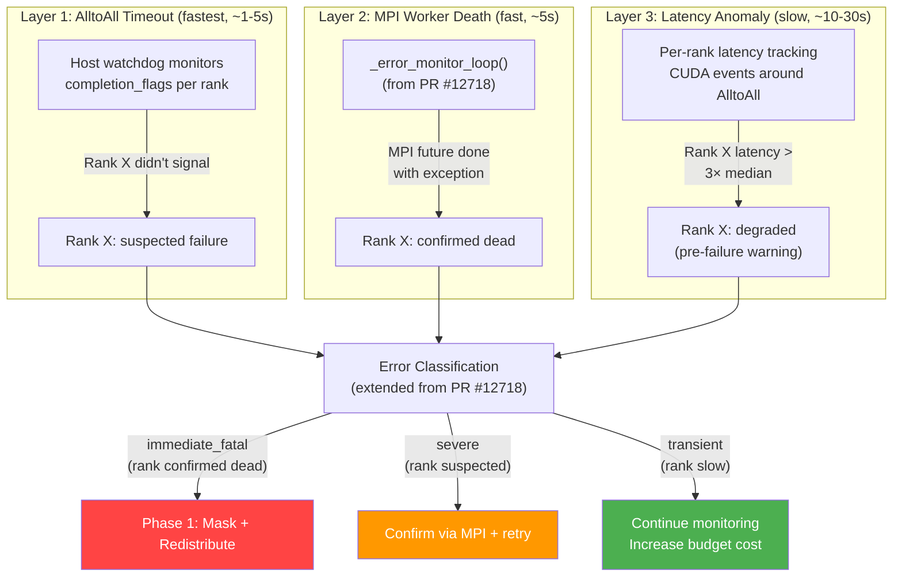
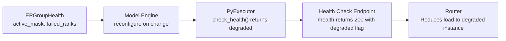

# 7. Design: Failure Detection and Classification

[< Back to Overview](README.md)

## Overview

Failure detection is the entry point for the entire fault tolerance system. The design extends [PR #12718](https://github.com/NVIDIA/TensorRT-LLM/pull/12718)'s error classification infrastructure from executor-level health (binary: healthy/fatal) to **per-EP-rank health** (each rank has independent health status).

## Detection Layers



## Layer 1: AlltoAll Timeout Detection

This is the primary and fastest detection mechanism. It works by monitoring the completion flags that AlltoAll kernels use for synchronization.

### Host-Side Watchdog

```python
class AlltoAllWatchdog:
    """Monitors AlltoAll completion flags from the host side.

    Runs on a dedicated thread. Checks completion_flags (host-visible memory)
    to identify which ranks have not signaled within the timeout.
    """

    def __init__(
        self,
        completion_flags: torch.Tensor,  # host-visible [ep_size, ep_size]
        ep_group_health: EPGroupHealth,
        timeout_sec: float = 5.0,
        poll_interval_sec: float = 0.1,
    ):
        self.completion_flags = completion_flags
        self.ep_group_health = ep_group_health
        self.timeout_sec = timeout_sec
        self.poll_interval_sec = poll_interval_sec

    def watch(self, expected_flag_val: int) -> set[int]:
        """Block until all active ranks signal, or timeout.

        Returns set of ranks that did not signal (suspected failures).
        """
        deadline = time.monotonic() + self.timeout_sec
        while time.monotonic() < deadline:
            pending = set()
            for rank in range(self.ep_group_health.ep_size):
                if not self.ep_group_health.is_active(rank):
                    continue  # skip already-masked ranks
                if self.completion_flags[self.my_rank][rank] != expected_flag_val:
                    pending.add(rank)
            if not pending:
                return set()  # all active ranks signaled
            time.sleep(self.poll_interval_sec)
        return pending  # these ranks timed out
```

**Timeout tuning:** The 5-second default balances false positive risk against detection speed. In production, this should be configurable per deployment:
- NVL72 (single rack, NVLink): 2-3s is safe (NVLink latency is microseconds)
- Multi-node (RDMA): 5-10s (RDMA can have transient delays)
- Aggressive (low tolerance): 1s (may cause false positives under heavy load)

### Alternative: Kernel-Side Timeout

For backends where completion flags are not host-visible, a kernel-side timeout can be used. Note that `clock64()` behavior varies across GPU architectures (clock frequency is not guaranteed stable under thermal throttling or power management), so timeout calibration against actual GPU clock characteristics is non-trivial:

```c
// In combine kernel: add cycle-based timeout
constexpr uint64_t TIMEOUT_CYCLES = 5000000000ULL;  // ~2.5s at 2GHz
uint64_t start = clock64();
for (int source_rank = 0; source_rank < ep_size; source_rank++) {
    if (!(active_rank_mask & (1ULL << source_rank))) continue;
    while (completion_flags[my_rank][source_rank] != expected_flag) {
        if (clock64() - start > TIMEOUT_CYCLES) {
            // Write failure indicator to host-visible memory
            rank_timeout_flags[source_rank] = 1;
            goto timeout_exit;
        }
    }
}
timeout_exit:
    // Host reads rank_timeout_flags after kernel completes
```

## Layer 2: MPI Worker Death Detection

[PR #12718](https://github.com/NVIDIA/TensorRT-LLM/pull/12718) introduces `_check_mpi_futures()` and `_error_monitor_loop()` in `GenerationExecutorProxy`. These detect when an MPI worker process dies (crash, SIGKILL, OOM, etc.).

### Extension for Per-Rank Tracking

Currently, `_check_mpi_futures()` iterates over all MPI futures and treats any failure as a system-level fatal error. For WideEP FT, we need per-rank tracking:

```python
class EPRankHealthTracker:
    """Extends PR #12718's error monitoring for per-EP-rank health."""

    def __init__(self, ep_size: int, ep_group_health: EPGroupHealth):
        self.ep_size = ep_size
        self.ep_group_health = ep_group_health
        # Per-rank error budgets (extend PR #12718's ErrorBudget)
        self.rank_budgets: dict[int, ErrorBudget] = {
            rank: ErrorBudget() for rank in range(ep_size)
        }

    def on_mpi_worker_death(self, rank: int, error: BaseException) -> None:
        """Called when MPI future for a specific rank completes with error."""
        classification = classify_error(str(error))
        if classification == "immediate_fatal":
            self.ep_group_health.mark_failed(rank)
            # Trigger Phase 1 for this rank
        elif classification == "severe":
            # Consume rank-specific budget
            if self.rank_budgets[rank].consume(cost=0.5):
                self.ep_group_health.mark_failed(rank)

    def on_alltoall_timeout(self, timed_out_ranks: set[int]) -> None:
        """Called when AlltoAll watchdog detects timeout."""
        for rank in timed_out_ranks:
            self.rank_budgets[rank].consume(cost=0.5)
            if self.rank_budgets[rank].exhausted():
                self.ep_group_health.mark_failed(rank)
```

### Integration with PR #12718's `charge_budget` Pattern

PR #12718 distinguishes between system-level errors (`charge_budget=True`) and request-scoped errors (`charge_budget=False`). For WideEP FT:

| Error Type | `charge_budget` | Rank-Specific? | Behavior |
|:-----------|:----------------|:---------------|:---------|
| AlltoAll timeout for rank X | True | **Yes** (rank X only) | Consume rank X's budget; if exhausted, mark rank X failed |
| MPI worker death for rank X | True | **Yes** (rank X only) | Immediate mark rank X failed |
| KV transfer timeout | False | No | Request-scoped, no rank impact |
| CUDA OOM on rank X | True | **Yes** (rank X only) | Consume rank X's budget |
| Input validation error | False | No | Request-scoped, no rank impact |
| NCCL timeout (AllGatherRS) | True | **Ambiguous** | May need to identify which rank caused it |

## Layer 3: Latency Anomaly Detection (Proactive)

This is a lower-priority enhancement (Phase 3) that detects **degrading** ranks before they fully fail. Inspired by vLLM RFC #27774's approach.

### Per-Rank Latency Monitoring

```python
class EPLatencyMonitor:
    """Tracks per-rank AlltoAll latency using CUDA events.

    Detects ranks that are consistently slow (hardware degradation,
    thermal throttling, memory errors) before they fully fail.
    """

    def __init__(self, ep_size: int, window_size: int = 100):
        self.ep_size = ep_size
        self.window_size = window_size
        # Circular buffer of per-rank AlltoAll durations
        self.rank_latencies: dict[int, deque[float]] = {
            rank: deque(maxlen=window_size) for rank in range(ep_size)
        }

    def record(self, rank: int, latency_ms: float) -> None:
        self.rank_latencies[rank].append(latency_ms)

    def check_anomalies(self, threshold_multiplier: float = 3.0) -> set[int]:
        """Returns ranks with latency > threshold_multiplier × median."""
        all_latencies = [l for lats in self.rank_latencies.values() for l in lats]
        if not all_latencies:
            return set()
        median = sorted(all_latencies)[len(all_latencies) // 2]

        anomalous = set()
        for rank, lats in self.rank_latencies.items():
            if lats and (sum(lats) / len(lats)) > threshold_multiplier * median:
                anomalous.add(rank)
        return anomalous
```

**Use case:** A GPU with ECC memory errors may run 5-10x slower before eventually crashing. Latency monitoring catches this and can trigger **preemptive expert migration** — moving experts off the degrading rank before it fails.

## Error Classification Extensions

PR #12718 defines three error tiers. For WideEP FT, we add EP-specific patterns:

```python
# Additions to error_classification.py

EP_IMMEDIATE_FATAL_PATTERNS = [
    "nccl communicator abort",
    "nvshmem peer unreachable",
    "mpi rank terminated",
    "cuda context destroyed",
]

EP_SEVERE_PATTERNS = [
    "alltoall timeout",
    "nccl timeout",
    "deep_ep buffer barrier hang",
    "symmetric memory access violation",
    "rdma timeout",
]

EP_TRANSIENT_PATTERNS = [
    "alltoall slow",  # rank responded but took longer than expected
    "nccl retry",
    "ecc correctable error",
]
```

## Failure Broadcast Protocol

When a rank failure is detected, all surviving ranks must learn about it before the next forward pass. This is a variant of the classic **failure detection problem in asynchronous distributed systems**: you cannot distinguish a slow process from a dead one, and the dead process cannot participate in the agreement protocol about its own death. The challenge is compounded by the fact that different ranks may discover the failure at different times (rank 0 may time out on rank 37's AlltoAll response while rank 50 hasn't timed out yet), and the communication infrastructure that would normally be used for consensus is itself degraded.

The broadcast mechanism depends on the communication infrastructure:

### Option A: Out-of-Band via MPI (Preferred)

Use MPI's error-handling mode (`MPI_ERRORS_RETURN`) with a dedicated health communicator:

```
Rank 0 detects rank 37 failed
  → MPI_Allgather on health communicator: "rank 37 dead"
  → All surviving ranks update ep_group_health.mark_failed(37)
  → All ranks agree on mask before next forward
```

### Option B: Piggyback on Existing Iteration Barrier (Elegant)

A key design insight: the PyExecutor already synchronizes between iterations (overlap scheduler's `previous_batch` pattern). Rather than building a separate consensus protocol, we can piggyback failure detection on this existing synchronization point — using the serving pipeline's natural iteration boundary as a consensus barrier. This avoids the need for a separate out-of-band protocol and leverages a synchronization point that all ranks already participate in:

```
Iteration N: AlltoAll times out for rank 37
  → Current batch fails (all requests get error responses)
  → Between iterations: all ranks exchange health status
  → Iteration N+1: new mask applied, EPLB reconfigured, serving resumes
```

### Consensus Requirement

All surviving ranks must agree on which ranks are dead. Split-brain scenarios (rank A thinks rank B is dead, but rank B is still running) could cause data corruption. The protocol must ensure:

1. **Unanimous agreement:** All surviving ranks agree on the mask before any uses it.
2. **Monotonic failure:** Once a rank is marked dead, it cannot be marked active again in Phase 1 (only in Phase 2 with a new process group).
3. **Idempotent:** Multiple ranks detecting the same failure converge to the same mask.

## Integration with Serving Layer

The EP rank health status must propagate to the serving layer:

1. **Model Engine** → **PyExecutor**: EP group health is checked at the start of each iteration. If health has changed, trigger reconfiguration before the forward pass.

2. **PyExecutor** → **Health Check** (`check_health()`): Return degraded status (not fatal) when EP group is running with masked ranks. This tells the serving layer "we're functional but at reduced capacity."

3. **Serving Layer** → **Router**: In disaggregated serving, the router can adjust load balancing to account for reduced capacity of degraded EP groups.


