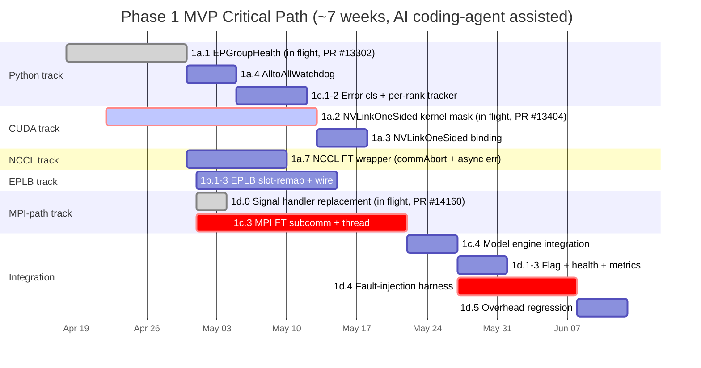

# 8. Implementation Plan

[< Back to Overview](README.md)

This section breaks the design into named PRs. Phase 1 PRs are detailed (they're the next-to-ship work); Phase 2 PRs are sized but contingent on the audit ([§9](09-risks-and-open-questions.md)); Phase 3 is sized at work-track level because scope will refine after Phase 2 informs what matters most.

## 8.1 Phase 1 PR breakdown

**Goal:** Single-failure survival on NVLinkOneSided in 6–7 weeks (MVP), full scope in +6–9 weeks (v1). Timelines assume AI coding-agent assistance; without it, apply ~1.3× per the prior estimates.

### How to read the tables

- **Size:** S (<300 LOC, 0.5–1 wk calendar), M (300–1000 LOC, 1–2 wk), L (>1000 LOC or deep design complexity, 2–4 wk). Calendar time includes review cycles.
- **Scope tag:** **MVP** (v0) = ships for single-failure NVLinkOneSided; **v1** = broadens coverage.
- **Deps:** `X.Y` means that PR must land (or at least be reviewable behind a flag) before this one can be reviewed for merge.

### 1a — Rank masking in communication kernels

**Scope:** Add timeout + rank masking to NVLink AlltoAll kernels. Mode B fix at the kernel layer.

| PR | Title | Scope | Target | Size | Deps |
|:---|:---|:---|:---|:---|:---|
| **1a.1** | `EPGroupHealth` class | MVP | `tensorrt_llm/_torch/modules/fused_moe/ep_group_health.py` (new) | S | — |
| **1a.2** | NVLinkOneSided kernel mask (CUDA) | MVP | `cpp/tensorrt_llm/kernels/communicationKernels/moeAlltoAllKernels.{cu,h}` | **L** | — |
| **1a.3** | NVLinkOneSided Python binding | MVP | `_torch/modules/fused_moe/communication/nvlink_one_sided.py`, `communication_factory.py` | S | 1a.1, 1a.2 |
| **1a.4** | `AlltoAllWatchdog` host thread | MVP | `_torch/modules/fused_moe/alltoall_watchdog.py` (new) | S | 1a.1 |
| **1a.5** | NVLinkTwoSided kernel mask | v1 | `cpp/tensorrt_llm/kernels/fusedMoeCommKernels.cu`, `thop/moeCommOp.cpp` | M | 1a.2 pattern |
| **1a.6** | NVLinkTwoSided Python binding | v1 | `_torch/modules/fused_moe/communication/nvlink_two_sided.py`, `nvlink_two_sided_flashinfer.py` | S | 1a.5 |
| **1a.7** | NCCL FT wrapper (`ncclCommAbort` + async error handling) | **MVP** | NCCL communicator wrapper in `cpp/tensorrt_llm/`, `_torch/modules/fused_moe/communication/allgather_reducescatter.py`, `NcclCommunicatorOp` | **M** | 1a.1 |
| **1a.8** | Tighten kernel `check_timeout` + replace `trap;` with host-visible flag | v1 | `moeAlltoAllKernels.cu` | M | 1a.2 |
| **1a.9** | NIXL-EP communication strategy + factory registration | v1 (conditional on Audit 3) | `_torch/modules/fused_moe/communication/nixl_ep.py` (new), `communication_factory.py` | M | 1a.1, Audit 3 positive |
| **1a.10** | NIXL-EP rank-masking + FT primitive integration | v1 (conditional on Audit 3) | `_torch/modules/fused_moe/communication/nixl_ep.py` | M | 1a.9 |

**Status (April 2026):**
- **1a.1 is in flight as PR #13302** — reviewed and refined based on reviewer feedback.
- **1a.2 is in flight as PR #13404** — NVLinkOneSided kernel mask.
- **1d.0 is in flight as PR #14160** — MPI signal handler replacement, gated on the `TLLM_FAULT_TOLERANCE_MODE` env var (proper `LLMArgs` field deferred to PR 1d.1).

**Per-PR notes:**

- **1a.2** is the critical-path kernel work. Three sub-tasks inside it: (a) `kMaxRanks` 64 → 128; (b) add `active_rank_mask_lo, active_rank_mask_hi` to both `DispatchKernelPointers` and `CombineKernelPointers`; (c) guard both release-write and polling loops in dispatch (~lines 537–584) and combine (~lines 1190–1217). Performance gate: < 0.1 % overhead when all ranks active.

- **1a.7 is MVP, not v1.** NCCL is in the WideEP data path even when MNNVL is the chosen AlltoAll backend (TP allreduces in non-MoE projections, PP send/recv via `NcclCommunicatorOp`, `AllGatherReduceScatter` if MNNVL+DeepEP unavailable). Without the wiring, a dead rank hangs the next NCCL collective — and per [Audit 1a Day 1](../wide-ep-fault-tolerance/audit-1a-findings.md), PT 2.11's default async-error-handling SIGABRTs *all* survivors at the watchdog timeout. So without 1a.7, the MVP exit criterion "throughput ≈ (N-1)/N of baseline" cannot be demonstrated end-to-end. Scope: wire `NCCL_ASYNC_ERROR_HANDLING=1` at every `ncclCommInitRank`, add a watchdog thread polling `ncclCommGetAsyncError`, expose a `abort_and_reinit(active_ranks)` API for survivors to build a fresh comm excluding the dead rank, propagate aborted-comm exceptions into PR #12718's classifier. **Pure TRT-LLM-side wiring of existing NCCL primitives — zero NCCL-side changes required.** The harder Phase 2 problem (rebuild that doesn't depend on PT 2.11's broken `dist.shrink_group`) is PR 2a.1, not 1a.7.

- **1a.8** is optional for MVP but valuable — tightens the 300s backstop and replaces `trap;` (which corrupts the CUDA context) with a host-visible flag write, letting the host recover rather than requiring process restart.

- **1a.9 / 1a.10 are conditional on Audit 3** ([§9.1](09-risks-and-open-questions.md#audit-3--nixl-ep-evaluation-as-data-plane-backend)). The NIXL team has built NIXL-EP, and vLLM PR #38534 already uses it as an FT-enabled backend. A bounded 2-week parallel evaluation track (E1–E5 in Audit 3) decides whether NIXL-EP slots into v1 as priority 3 between NVLinkTwoSided and AllGatherReduceScatter, or is declined. The evaluation runs in parallel with MVP and has no critical-path impact. If the outcome is positive, these two PRs ship in v1 and integrate NIXL-EP's `activeRanks`-style masking + abort with `EPGroupHealth` and the failure-broadcast path.

### 1b — EPLB topology adaptation

**Scope:** Add `reconfigure_mask_only` (MVP) and `reconfigure` with weight migration (v1) to the C++ MoeLoadBalancer.

| PR | Title | Scope | Target | Size | Deps |
|:---|:---|:---|:---|:---|:---|
| **1b.1** | `reconfigure_mask_only` C++ entry point | MVP | `cpp/tensorrt_llm/kernels/moeLoadBalance/moeLoadBalanceKernels.{cu,h}` | M | — |
| **1b.2** | Python wrapper for mask-only reconfigure | MVP | `_torch/modules/fused_moe/moe_load_balancer.py` | S | 1b.1 |
| **1b.3** | Iteration-boundary reconfigure integration | MVP | `_torch/modules/fused_moe/moe_load_balancer.py`, `_torch/pyexecutor/model_engine.py` | S | 1b.2 |
| **1b.4** | Mutable `MoeLoadBalanceMetaInfo` (epSize/epRank rewrite) | v1 | `moeLoadBalanceKernels.{cu,h}`, `moeLoadBalanceCommon.h` | **L** | 1b.1 |
| **1b.5** | Full `reconfigure(emergency_mode)` online | v1 | `moeLoadBalancer.cpp`, `moe_load_balancer.py` | M | 1b.4 |
| **1b.6** | Weight migration path (cudaMemcpy2D + gdrcopy) | v1 | `moeLoadBalancer.cpp`, `HostMoeTensorSharer` integration | **L** | 1b.5 |
| **1b.7** | Zero-replica expert handling | v1 | `moeLoadBalancer.cpp`, `moe_load_balancer.py` | M | 1b.5 |

**MVP simplification.** Under replication ≥ 2 (the DeepSeek production default), 1b.1–1b.3 is sufficient — every dead-rank expert has a surviving replica, so slot remap reaches steady state with no weight movement.

### 1c — Failure detection and broadcast

**Scope:** Per-EP-rank health tracking layered on PR #12718.

| PR | Title | Scope | Target | Size | Deps |
|:---|:---|:---|:---|:---|:---|
| **1c.1** | EP-specific error classification patterns | MVP | `_torch/pyexecutor/error_classification.py` | S | PR #12718 rebased |
| **1c.2** | `EPRankHealthTracker` per-rank budgets | MVP | `_torch/pyexecutor/ep_rank_health.py` (new) | S | 1c.1 |
| **1c.3** | MPI FT subcomm + broadcast thread | MVP | `_torch/pyexecutor/ep_failure_broadcast.py` (new), `_torch/distributed/communicator.py` | **L** | 1a.1 |
| **1c.4** | Model engine health-check hook | MVP | `_torch/pyexecutor/model_engine.py` | M | 1a.1, 1b.3, 1c.3 |
| **1c.5** | Iteration-barrier piggyback broadcast | v1 | `_torch/pyexecutor/ep_failure_broadcast.py` | M | 1c.3 |
| **1c.6** | Multi-failure consensus (two-phase suspect/confirm) | v1 | `_torch/pyexecutor/ep_failure_broadcast.py` | M | 1c.3 |

**1c.3 is the largest MVP risk.** Net-new component — no FT subcomm today. Scope: `MPI_Comm_split` at startup, `MPI_Errhandler_set(MPI_ERRORS_RETURN)`, non-blocking `Isend`/`Irecv`+`Test` on a dedicated CPU thread, opportunistic ULFM `MPI_Comm_revoke`. Single-failure consensus is trivial (any surviving rank's report is authoritative).

### 1d — Integration, productionization, end-to-end validation

**Scope:** Wire Phase 1 together, feature flag, telemetry, fault-injection harness.

| PR | Title | Scope | Target | Size | Deps |
|:---|:---|:---|:---|:---|:---|
| **1d.0** | MPI signal handler replacement | **MVP** | `cpp/tensorrt_llm/runtime/utils/mpiUtils.cpp` | S | — |
| **1d.1** | Feature flag + config gating | MVP | `tensorrt_llm/llmapi/llm_args.py`, `_torch/modules/fused_moe/interface.py` | S | 1c.4 |
| **1d.2** | `check_health()` degraded reporting | MVP | `_torch/pyexecutor/py_executor.py`, `trtllm-serve` health endpoint | S | 1c.4 |
| **1d.3** | Per-rank health telemetry / metrics | MVP | `_torch/modules/fused_moe/ep_metrics.py` (new), Prometheus hook | S | 1a.1 |
| **1d.4** | 4-GPU E2E fault-injection harness + test | MVP | `tests/integration/defs/fault_tolerance/test_wide_ep_ft.py` (new) + net-new fault-injection fixture | **L** | 1a–1c MVP items |
| **1d.5** | Steady-state overhead regression test | MVP | same test dir | S | 1a.3, 1a.4 |
| **1d.6** | Multi-failure stress + chaos suite | v1 | same test dir | M | 1c.6, 1b.4–1b.7 |
| **1d.7** | Cross-model matrix (DS-V3, DS-R1, others) | v1 | `tests/integration/test_lists/` | S | 1d.4 |

**1d.0 is the Mode A fix** — signal handler replacement in `mpiUtils.cpp`, guarded by the FT feature flag. Small but critical; without it, Mode A kills the cluster before any of the rest of Phase 1 can run.

**1d.4 harness** is net-new — TRT-LLM has no fault-injection infrastructure for kernel-level rank death today. Sub-tasks: (a) pytest fixture launching multi-rank MPI workers with tracked PIDs, (b) signal/CUDA-hook to abort rank N at controllable dispatch/combine points, (c) assertion helpers for end-to-end recovery + per-token correctness.

### Phase 1 MVP critical path

Three critical-path items: **1a.2** (kernel mask, in flight), **1c.3** (MPI FT subcomm, net-new), **1d.4** (harness, net-new). Each gates end-to-end demonstration of one capability; they can't be parallelized away.

**MVP de-risking via end-to-end prototype.** Running parallel with the production PR tracks is a bounded **3–5 day end-to-end prototype** on a 4 or 8-GPU node that validates the integration seams between tracks (kernel mask ↔ EPLB ↔ watchdog ↔ broadcast ↔ engine hook) ahead of the production PRs. The prototype reuses PR 1a.1 (`EPGroupHealth`, PR #13302) and PR 1d.0 (signal-handler replacement) as-is; everything else is stubbed down to the minimum that exercises the seam. See [MVP prototype plan](mvp-prototype-plan.md) for the vertical-slice component table, hardware options, IMEX setup (for GB200/GB300 trays), and kill-and-survive test recipe. The prototype produces a per-event timing baseline that PR 1d.4 reuses as the harness's reference; it does **not** replace any production PR or substitute for Audit 1b.

## 8.2 Phase 2 PR breakdown

**Scope:** Full N-rank restoration via process-group reconstruction + replacement rank (optionally accelerated by MX-GMS shadow + GMS zero-copy).

**Status:** **Sizes are provisional until the MNNVL/NVSHMEM teardown audit** ([§9](09-risks-and-open-questions.md) named risk) completes. Several estimates below carry the caveat "pending audit."

### 2a — Process group reconstruction

| PR | Title | Scope | Target | Size | Deps |
|:---|:---|:---|:---|:---|:---|
| **2a.0a** | MNNVL/NVSHMEM teardown audit — intra-node phase | Prereq (can start now) | ≥ 4-GPU node, prototype code, partial-validation report | **M** | — |
| **2a.0b** | MNNVL/NVSHMEM teardown audit — rack-fabric validation | Prereq | NVL72 (or equivalent) access, validation report | S | 2a.0a; NVL72 access |
| **2a.1** | Coordinated NCCL teardown (custom ops) | 2 | `_torch/distributed/*` | M | Phase 1 complete, 1a.7 |
| **2a.2** | MNNVL teardown + reallocate + handle re-exchange | 2 | `tensorrt_llm/_mnnvl_utils.py`, kernel launch path | **L** (audit-dependent) | 2a.0a (sizing); 2a.0b (final ship gate) |
| **2a.3** | NVSHMEM safe deallocation (if DeepEP in scope) | 2 (deferred) | NVSHMEM wrappers | M | 2a.0a |
| **2a.4** | DeepEP explicit `destroy()` sequencing | 2 (deferred) | `deep_ep.py`, `deep_ep_low_latency.py` | S | 2a.1 |
| **2a.5** | NVLink workspace deallocation | 2 | NVLink backend teardown | S | 2a.1 |
| **2a.6** | N-rank PG creation path | 2 | `CommunicationFactory` | M | 2a.1–2a.5 |
| **2a.7** | EPLB full rebalance after PG rebuild | 2 | `moe_load_balancer.py` (uses 1b.5) | S | 2a.6, 1b.5 |
| **2a.8** | Second-failure-during-rebuild handling | 2 | rebuild coordinator | M | 2a.6 |

**2a.0 is the audit, split by hardware dependency.**

- **2a.0a (intra-node, can start immediately).** ~1 week on any ≥ 4-GPU NVLink-connected node (DGX H100/A100/B200). Validates NCCL rebuild, MPI signal-handler replacement, `cuMemUnmap` semantics under owner death, DeepEP destructor mitigation, intra-node MNNVL teardown + rebuild prototype, NVSHMEM teardown semantics. **Output sizes Phase 2 PRs within ±20%** — Phase 2 v0 planning can proceed against this.
- **2a.0b (rack-fabric validation).** ~2–3 days of NVL72 (or equivalent) time. Confirms intra-node results extrapolate to rack scale; validates 72-rank scale-specific behavior; resolves the provisional-sizing caveat on PR 2a.2 definitively.

Sequencing benefit: running 2a.0a first means rack time is targeted validation, not from-scratch prototyping. See [§9.1 Audit 1](09-risks-and-open-questions.md#audit-1--mnnvl--nvshmem-teardown-capability) for the day-by-day plan and full deliverable list.

### 2b — MX-GMS Shadow EP Ranks

| PR | Title | Scope | Target | Size | Deps |
|:---|:---|:---|:---|:---|:---|
| **2b.1** | Shadow EP rank lifecycle — pre-load via GMS RO | 2 | Shadow worker spawn path; GMS client integration | M | MX-GMS Phase 2 |
| **2b.2** | Shadow health-check loop monitoring primary | 2 | `shadow_ep_rank.py` (new) | S | 2b.1 |
| **2b.3** | Activation path: GMS RO→RW upgrade → join PG → serve | 2 | `shadow_ep_rank.py` | M | 2b.1, 2a.6 |
| **2b.4** | MX P2P fallback for cross-node replacement | 2 | MX client integration; identity matching with `ep_rank` | M | MX-GMS Phase 1 |

**Soft dependencies:** MX-GMS Phase 2 (GMS) for 2b.1; MX-GMS Phase 1 (MX P2P) for 2b.4. Phase 2 works without MX-GMS at minutes-class latency ([§6.3](06-phase-2-full-restoration.md#63-shadow-rank--gms-roles)).

### 2c — Orchestrator integration

| PR | Title | Scope | Target | Size | Deps |
|:---|:---|:---|:---|:---|:---|
| **2c.1** | Replacement rank provisioning API | 2 | orchestrator hooks (K8s/Ray/Dynamo) | M | 2a.6 |
| **2c.2** | Join protocol for new rank entering EP group | 2 | handshake path, calls into 2b.3 | M | 2c.1, 2b.3 |
| **2c.3** | E2E test: Phase 1 + Phase 2 full lifecycle | 2 | `tests/integration/defs/fault_tolerance/test_phase2_restoration.py` | M | 2c.1, 2c.2 |

### Phase 1-DS — Disaggregated serving FT

**Goal:** Extend Phase 1 to disaggregated serving. Starts after Phase 1 MVP; parallelizable with Phase 1 v1.

**Scope:** Phase 1 primitives (EPGroupHealth, rank masking, `reconfigure_mask_only`) apply **unchanged within each disagg pool**. DS track adds cross-pool coordination in `trtllm-serve` proxy: KV transceiver failure correlation, cross-pool failure notification, retry/reroute policy.

| PR | Title | Scope | Target | Size | Deps |
|:---|:---|:---|:---|:---|:---|
| **DS.1** | Per-pool FT validation harness | DS | `tests/integration/defs/fault_tolerance/test_disagg_per_pool.py` (new) | S | 1d.4 |
| **DS.2** | KV transceiver failure surface audit + classification | DS | `_torch/pyexecutor/kv_cache_transceiver.py`, `error_classification.py` | M | 1c.1 |
| **DS.3** | Cross-pool failure notification | DS | `trtllm-serve` proxy | M | DS.2 |
| **DS.4** | Request retry/reroute policy on rank failure | DS | `trtllm-serve` proxy | M | DS.3 |
| **DS.5** | KV transfer cancellation on rank failure | DS | `_torch/pyexecutor/kv_cache_transceiver.py` | M | DS.2 |
| **DS.6** | Disagg E2E fault-injection test | DS | `tests/integration/defs/fault_tolerance/test_disagg_ft.py` (new) | M | DS.1–DS.5 |

**Caveat:** Ray + disagg + NIXL is unsupported today (per research pass report — `test_disaggregated.py:597`). If Phase 1-DS ships on Ray, this gap is a prerequisite. On MPI, no such gap.

### Phase 1-IB — Cross-IB transport coverage (NIXL-EP track)

**Status:** Conditional parallel track, similar in shape to Phase 1-DS but specifically scoped to deployments where the L3 transport is **DeepEP-family over InfiniBand** (because cross-node NVLink is not up, so MNNVL is unavailable; see [§1.1 Transport selection](01-user-journey-and-stack.md#transport-selection-what-trt-llm-actually-picks-today)). Gated on Audit 3 (NIXL-EP) outcome. **Not committed engineering capacity yet** — listed so the gap is visible.

**Why this is a separate track.** When the transport is `NVLinkOneSided`/`NVLinkTwoSided` (single-node NVL boxes through GB200/GB300 NVL72 rack), the MVP kernel mask (PR 1a.2) closes the gap. When the transport is `AllGatherReduceScatter` (NCCL fallback), PR 1a.7 closes the gap. **Neither covers the DeepEP-family transport** that gets selected on multi-node B200+IB and similar cross-IB deployments — TRT-LLM doesn't own the kernel there (NVSHMEM does, and DeepEP wraps it). Two viable mitigation paths:

- **NIXL-EP** (preferred). vLLM PR #35627 verified API surface: `connect_ranks` / `disconnect_ranks` for incremental topology mutation, with `torch.distributed.TCPStore` dependency. MNNVL substrate landed in ai-dynamo/nixl#1415 (merged 2026-04-05); production NVL72 maturity still in flight per ai-dynamo/nixl#1655 (open 2026-05-19). Today's sweet spot is exactly cross-IB transport.
- **DeepEP 100s static kernel-timeout interim** (fallback). vLLM PR #38534 pattern — kernel auto-masks the failed rank after 100s rather than aborting. Softer than `trap;`, doesn't require NVSHMEM `mask_buffer_ptr`, but doesn't bound recovery latency well.

For this transport, **Phase 1 and Phase 2 collapse into one path**: scale-down (drop dead rank from the buffer via `disconnect_ranks`, EPLB redistributes) and later scale-up (`connect_ranks(replacement)`). This is fundamentally different from the kernel-mask architecture used for MNNVL transports — see [§3.5](03-failure-modes-and-gaps.md#35-transport-determines-mechanism) for the per-transport mechanism table.

**Scope (conditional, ~4–6 PRs):** Phase 1 primitives (`EPGroupHealth`, watchdog, signal-handler fix, broadcast) apply **unchanged**. EPLB redistribute (DP/EP scale-down-style) replaces `reconfigure_mask_only` for this transport, because topology actually mutates.

| PR | Title | Scope | Target | Size | Deps |
|:---|:---|:---|:---|:---|:---|
| **IB.1** | DeepEP kernel-timeout interim (vLLM #38534 pattern, ~100 s static timeout) | IB (interim) | `_torch/modules/fused_moe/communication/deep_ep.py`, `deep_ep_low_latency.py` | M | Phase 1 MVP |
| **IB.2** | NIXL-EP backend integration — preferred path if Audit 3 positive | IB | covered by PRs 1a.9–1a.10 (see [§9.1 Audit 3](09-risks-and-open-questions.md#audit-3--nixl-ep-evaluation-as-data-plane-backend)) | M+M | Audit 3 positive; needs `torch.distributed.TCPStore` co-existence with MPI orchestrator OR Ray pivot for this deployment |
| **IB.3** | DeepEP `Buffer` lifecycle hardening (explicit `destroy()` ordering for FT) | IB | `_torch/modules/fused_moe/communication/deep_ep.py` | S | IB.1 |
| **IB.4** | B200 NVL8 + IB fault-injection harness | IB | `tests/integration/defs/fault_tolerance/test_b200_ib_ft.py` | M | IB.1 or IB.2 |
| **IB.5** | Phase 1-IB documentation + deployment guide | IB | `examples/wide_ep/README.md` extension | S | IB.4 |
| **IB.6** | Topology-aware EPLB integration (sync with Peiheng/Dongxu's roadmap) | IB | `moe_load_balancer.py` | M | IB.1 or IB.2; coordination |

**Calendar:** ~4 weeks for IB.1 path (interim); ~6 weeks for IB.2 path (includes Audit 3 + integration; possibly + TCPStore-alongside-MPI work or Ray pivot for this scenario). Runs after Phase 1 MVP and in parallel with v1 / Phase 1-DS. Not a blocker for either.

**NVL72 path explicitly stays on MVP architecture.** Even when NIXL-EP MNNVL substrate matures, NVL72 production keeps the kernel-mask + EPLB slot remap design — TRT-LLM owns the kernel for that primary backend (§2 differentiator), and the kernel-mask path has a tighter recovery bound (<10s vs vLLM's claimed 3s + topology mutation cost at 72-rank scale, which isn't yet measured). Convergence on topology mutation for NVL72 is a Phase 3+ open question, not a near-term decision.

## 8.3 Phase 3 rough plan

Phase 3 is sized at work-track granularity because scope will refine post-Phase-2.

| Track | Scope | Rough size | Prereq |
|:---|:---|:---|:---|
| **3a** Telemetry foundation + latency anomaly detection | Shared per-rank ring buffer (CUDA events + NVML signals + EPLB stats) consumed by 3a / 3e / 3f; 3×-median detector; alerting hook | 3–4 weeks | Phase 2 complete |
| **3b** Preemptive expert migration | Reuses Phase 1 v1 weight-migration path; adds drain-state + hot-expert prioritization | 2–3 weeks | 3a, 1b.6 |
| **3c** Elastic scaling up | Reuses Phase 2 rebuild for N → M > N; orchestrator API | 3–4 weeks | Phase 2, 2c.1 |
| **3d** Elastic scaling down | Combines 3b drain + Phase 1 mask; orchestrator API | 2–3 weeks | 3b |
| **3e** Predictive failure detection | Consumes 3a telemetry + historical NVML; rule-based predictor first, ML model later | 3–4 weeks + telemetry infra | 3a, telemetry infra |
| **3f** Straggler mitigation (forward-looking, [§7.5](07-phase-3-beyond-failover.md#75-straggler-mitigation-forward-looking)) | **Detailed design TBD.** Lightweight first cut = Option A (latency-aware routing) + Option D (tail-cutting timeout). Option C (shadow rank as performance hot-spare) lands "for free" once §6.3 is done. **Option B (speculative redundant compute) is research-grade — own design doc, ~10–14 weeks if pursued.** | A+D: ~6–7 weeks. A+D+C: ~10–13 weeks. With B: +10–14 weeks. | 3a (telemetry), §6.3 for C, settled open questions in §7.5 for B |

**Total Phase 3:** ~3 months engineering for 3a–3e (the Phase 3 originally scoped); ~5 months if Phase 3.5 lands the lightweight straggler track (3f's A + D); 7–9 months if Option B speculative compute is added. All gated on production experience from Phases 1 and 2 to prioritize correctly. Not on the MVP critical path.

## 8.4 Timeline summary

Phase totals account for parallelism: multiple PRs in the same sub-phase run concurrently across engineers. Calendar time per PR sums to more than the phase total because unblocked items overlap.

| Phase | PRs | Calendar time | Depends on | Deliverable |
|:---|:---|:---|:---|:---|
| **Phase 1 MVP (v0)** | 1a.1–1a.4 + 1a.7, 1b.1–1b.3, 1c.1–1c.4, 1d.0–1d.5 (14 PRs) | **~7 weeks** with 2–3 engineers + AI coding assistance | Kernel access; PR #12718 rebased | Single-failure survival on NVLinkOneSided; <10s recovery; no weight movement at recovery time; survivors don't die as collateral on TP/PP NCCL collectives |
| **Phase 1 v1** | 1a.5–1a.8 (+ 1a.9–1a.10 conditional on Audit 3), 1b.4–1b.7, 1c.5–1c.6, 1d.6–1d.7 (12 PRs, up to 14 with NIXL-EP) | **6–9 weeks after MVP** | MVP landed | All NVLink backends, full EPLB reconfigure with weight migration, multi-failure consensus, production polish; optional NIXL-EP backend integration |
| **Phase 1-DS** | DS.1–DS.6 (6 PRs) | **3–4 weeks, parallelizable with v1** | MVP landed | Disagg serving FT with cross-pool coordination |
| **Phase 2: Restoration** | 2a.0a/0b, 2a.1–2a.8, 2b.1–2b.4, 2c.1–2c.3 (17 items) | **10–14 weeks** | Phase 1 v1 complete; 2a.0a sizes the work, 2a.0b gates ship | Full N-rank restoration via PG rebuild + shadow EP ranks |
| **Phase 3: Beyond failover** | 3a–3e tracks (not per-PR sized) | **~3 months** | Phase 2 complete + telemetry infra | Prevention, elastic scale, predictive |

**Total PRs:** ~47 across Phases 1 + 2 (plus Phase 3 rough tracks). MVP alone is 14 PRs.

**Full program:** 7–10 months (with AI assistance), 10–14 months (without).

### Caveats & honest risk framing

- **PR #12718 sequencing** is the only external blocker on the MVP critical path. Mitigation: shim path if merge is delayed.
- **L-sized PRs in MVP** (1a.2 kernel mask, 1c.3 MPI FT subcomm, 1d.4 harness) carry the most schedule risk. 1a.2's confidence is raised since kernel source review confirmed tractability; 1c.3's uncertainty is driven by MPI build variance (ULFM availability); 1d.4's uncertainty is harness design (clean kernel-abort mid-collective without poisoning test runner).
- **Phase 2 estimates are provisional** pending 2a.0 audit. The audit is now split: **2a.0a (intra-node) can start immediately on a ≥ 4-GPU node and brings Phase 2 sizing to within ±20%**; 2a.0b (rack-fabric) needs NVL72 access to gate definitive ship sizing. If MNNVL teardown latency is worse than assumed, 2a.2 grows from L to L+ and the Phase 2 total stretches.
- **External blockers** (PR #12718 sequencing, DeepEP NVSHMEM API, MX-GMS Phase 2 availability) affect dependent items and are not improved by AI assistance.
