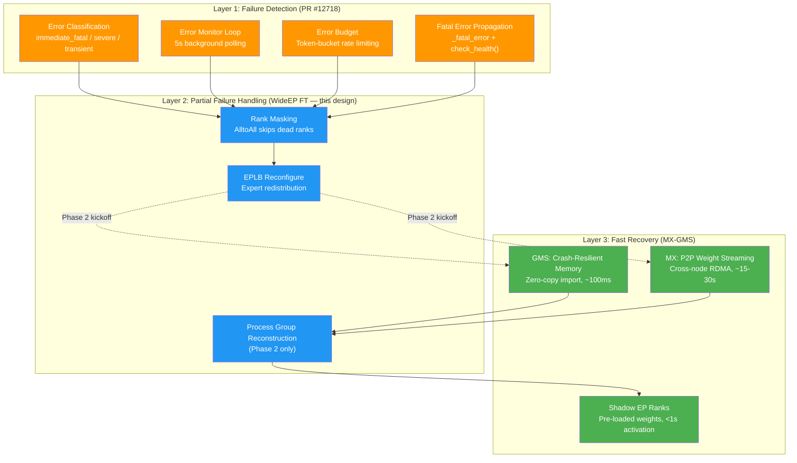
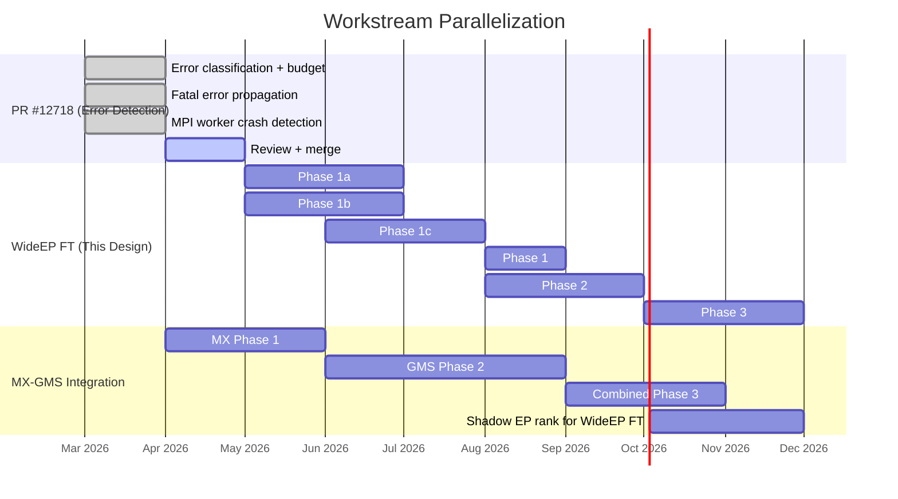
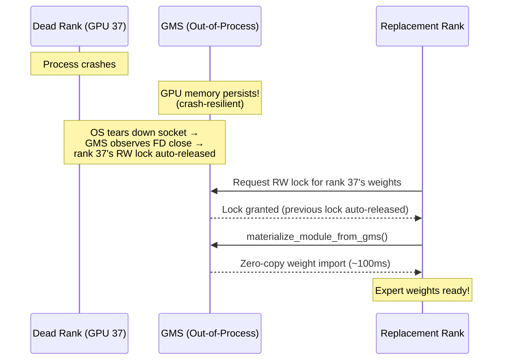

# 8. Integration with MX-GMS

[< Back to Overview](README.md)

## The Three Workstreams

This chapter maps how three concurrent workstreams — [PR #12718](https://github.com/NVIDIA/TensorRT-LLM/pull/12718) (error detection), WideEP FT (this design), and [MX+GMS+TRT-LLM integration](https://docs.google.com/document/d/14SZmmFcoakgIx2OC4dt8pWcHU14PDTN9KlAKqLoZ15s/edit?usp=sharing) (fast recovery) — form a layered reliability stack that is greater than the sum of its parts.

## Layered Architecture



## Dependency and Parallelization Map

The three workstreams have **limited hard dependencies** and can largely be developed in parallel:



### Hard Dependencies

| Step | Depends On | Reason |
|:-----|:-----------|:-------|
| WideEP FT Phase 1 | PR #12718 merged | Needs error classification + budget infrastructure |
| WideEP FT Phase 2 | WideEP FT Phase 1 | Can't restore if can't survive |
| Shadow EP ranks | GMS Phase 2 + WideEP FT Phase 2 | Needs both GMS zero-copy AND process group reconstruction |
| GMS Phase 2 | MX Phase 1 | MX-GMS design positions MX first |

### Soft Dependencies (Beneficial but Not Blocking)

| Step | Benefits From | How |
|:-----|:-------------|:----|
| WideEP FT Phase 1 | MX Phase 1 | Not needed, but MX identity matching includes `ep_rank` — validates EP rank concepts |
| WideEP FT Phase 2 | GMS Phase 2 | GMS makes recovery faster (<1s vs minutes), but Phase 2 works without GMS (disk loading) |
| MX-GMS Phase 3 | WideEP FT Phase 1 | MX-GMS can validate failover against WideEP FT's survival capability |

## How PR #12718 Enables WideEP FT

PR #12718 is the **foundation layer** of the three-workstream stack. It provides a small set of primitives that WideEP FT extends into per-rank variants. The detailed contract — pattern lists, `ErrorBudget` per-rank wiring, `EPRankHealthTracker`, the `charge_budget` table, the `_error_monitor_loop()` extension — is specified in [§07 Failure Detection](07-failure-detection.md). This chapter only states the *integration* relationship.

| PR #12718 primitive | WideEP FT extension | Canonical spec |
|:---|:---|:---|
| `classify_error()` returning `"immediate_fatal"` / `"severe"` / `"transient"` | EP-specific regex patterns appended to the existing lists (`"alltoall timeout"`, `"nvshmem peer unreachable"`, etc.) | [§07 Error Classification Extensions](07-failure-detection.md#error-classification-extensions) |
| `ErrorBudget` (token-bucket, system-wide) | Per-rank `ErrorBudget` instances, one per EP rank, consumed by rank-scoped errors | [§07 Layer 2: MPI Worker Death Detection](07-failure-detection.md#layer-2-mpi-worker-death-detection) |
| `charge_budget=False` for request-scoped errors | Extended to tokens that would have been routed to a just-failed rank | [§07 Integration with PR #12718's charge_budget Pattern](07-failure-detection.md#integration-with-pr-12718s-charge_budget-pattern) |
| `_error_monitor_loop()` (5s polling of MPI futures) | Extended with AlltoAll completion-flag monitoring and per-rank latency tracking | [§07 Detection Layers](07-failure-detection.md#detection-layers) |
| Fatal shutdown drain (all queues) | Partial drain: rank failure drains only the current batch, not the waiting queue | [§04 Serving During Degraded Mode](04-two-phase-recovery.md#serving-during-degraded-mode) |

**Key design point:** PR #12718's classification operates at the executor level (binary: entire system healthy/fatal). WideEP FT adds a **per-rank** dimension — the same error type can be fatal for one rank but not for the system — without changing the three string-literal classes PR #12718 defines. The enum vs. string-literal naming caveat that affects integration is documented once in [§07 status callout](07-failure-detection.md#overview).

## How MX-GMS Accelerates WideEP FT Phase 2

Without MX-GMS, Phase 2 recovery requires loading expert weights from disk — typically 1-3 minutes for a DeepSeek-V3 expert shard. MX-GMS provides two acceleration paths:

### GMS Zero-Copy Import (Fastest: <1s)

When GMS is available, the failed rank's expert weights may still be in GPU memory (GMS's out-of-process crash-resilient memory). The replacement rank can import them via GMS zero-copy:



**Key insight:** GMS's crash resilience means the dead process's GPU memory **persists**. The replacement rank doesn't need to reload from disk — it imports the existing GPU memory in ~100ms.

**Limitation:** This only works if the replacement rank is on the **same node** as the failed rank (GMS sharing is intra-node via CUDA VMM FD handles). For cross-node replacement, use MX P2P.

### MX P2P Streaming (Fast: ~15-30s for full model, less for expert shard)

When the replacement rank is on a different node, MX provides cross-node P2P via NIXL/RDMA:

- The replacement rank requests its expert shard from a peer (any surviving rank with the same EP topology)
- MX identity matching includes `ep_size` and `ep_rank`, ensuring the correct shard is transferred
- Only the expert shard is transferred (not the full model), so the transfer is proportionally smaller

For DeepSeek-V3 with EP=72: each rank holds ~9.5 GB of expert weights (681GB / 72). MX P2P at 20+ GB/s transfers this in <0.5s. Total Phase 2 recovery with MX: ~1-2s.

### Shadow EP Ranks (Sub-Second Activation)

The MX-GMS design (Section 6: Executor Integration and Failover) describes shadow workers that pre-load weights via GMS RO import. This concept extends naturally to WideEP:

| MX-GMS Shadow Worker (Original) | Shadow EP Rank (Extended for WideEP) |
|:-|:-|
| Shadows one entire executor | Shadows one EP rank's expert shard |
| Pre-loads full model weights | Pre-loads only the expert shard for one rank |
| Activates on executor death | Activates on EP rank death |
| KV cache allocation = 1-3s (bottleneck) | **No KV cache needed** (EP ranks don't own per-request KV) |
| Total activation: <5s | **Total activation: <1s** |

**Key architectural insight — Why shadow EP ranks are fundamentally faster than general shadow workers:**

The MX-GMS design identifies KV cache allocation (1-3s) as the activation bottleneck for shadow workers. But in WideEP with `enable_attention_dp=True`, individual EP ranks run data-parallel attention independently — each GPU processes its own requests' attention computation with its own KV cache. The EP ranks exchange *activations* (tokens routed to experts) via AlltoAll during MoE layers, not KV cache state. This means a shadow EP rank needs only expert weights and process group membership — not per-request KV cache state. The KV cache bottleneck simply doesn't apply.

This is not just an optimization — it's a **structural property of WideEP's architecture** that makes sub-second shadow activation architecturally possible in a way that is impossible for general-purpose shadow failover (where KV cache allocation is an irreducible cost). No competitor has exploited this insight because no competitor has both shadow workers (MX-GMS) and WideEP fault tolerance in the same system.

## Cross-Workstream Benefits

### WideEP FT Benefits MX-GMS

1. **Completes the failover story:** MX-GMS's shadow failover design handles whole-executor death but doesn't address partial EP failure. WideEP FT fills this gap, making the MX-GMS failover story complete for the most important production use case.

2. **Validates GMS crash resilience:** WideEP FT Phase 2 is a concrete, high-value use case for GMS's crash-resilient memory. It provides a clear justification for GMS Phase 2 investment.

3. **Defines EP-aware MX identity:** WideEP FT clarifies exactly how `ep_rank` and `ep_size` should be used in MX identity matching for expert shard transfers.

### MX-GMS Benefits WideEP FT

1. **Reduces Phase 2 from minutes to sub-second:** Without GMS, Phase 2 = disk loading (minutes). With GMS, Phase 2 = zero-copy import (<1s). This is the difference between "acceptable degraded mode" and "imperceptible recovery."

2. **Enables shadow EP ranks:** A capability no competitor has. SGLang's Elastic EP permanently runs degraded. This design with MX-GMS restores full capacity in sub-second.

3. **Startup profiling data:** The MX-GMS design includes startup profiling (already implemented) that provides real measurements for weight loading times, directly informing Phase 2 recovery time estimates.

### PR #12718 Benefits Both

1. **Error infrastructure:** Both WideEP FT and MX-GMS shadow failover need to detect failures. PR #12718 provides the classification, budgeting, and propagation infrastructure.

2. **Health check chain:** PR #12718 fixes the zombie worker bug, making health checks actually work. Both WideEP FT (degraded status reporting) and MX-GMS (shadow activation trigger) depend on accurate health reporting.

3. **Fatal shutdown mechanics:** PR #12718's queue drain on fatal shutdown is used by WideEP FT (partial drain for rank failure) and could be used by MX-GMS (full drain before shadow activation).

## Combined Architecture Vision

When all three workstreams are complete, the system handles the full failure lifecycle:

```mermaid
sequenceDiagram
    participant GPU37 as GPU 37
    participant Detect as Layer 1: Detection<br/>(PR #12718)
    participant Survive as Layer 2: Survival<br/>(WideEP FT Phase 1)
    participant Restore as Layer 3: Recovery<br/>(MX-GMS + WideEP FT Phase 2)

    Note over GPU37: ☠️ GPU failure

    GPU37->>Detect: AlltoAll timeout (1-5s)
    Detect->>Detect: classify_error() → EP severe
    Detect->>Detect: rank_budget[37].consume() → exhausted
    Detect->>Survive: mark_failed(rank=37)

    Survive->>Survive: Update active_rank_mask (< 1ms)
    Survive->>Survive: EPLB emergency reconfigure<br/>(MVP slot remap: <10ms; v1 with weight migration: <50ms)
    Survive->>Survive: Resume serving at N-1 capacity

    Note over Survive: Serving continues (degraded)
    Note over Survive: Total Phase 1: ~5-10s

    par Background: Phase 2
        alt Shadow EP rank pre-provisioned
            Note over Restore: No cold-start cost;<br/>replacement rank is already running
        else Cold provision
            Restore->>Restore: Orchestrator provisions replacement GPU<br/>(seconds-class; depends on operator)
        end
        alt GMS available (same-node)
            Restore->>Restore: GMS zero-copy import (~100ms)
        else MX available (cross-node)
            Restore->>Restore: MX P2P RDMA (~1-2s for expert shard)
        else Disk only
            Restore->>Restore: Load from checkpoint (~1-3 min)
        end
        Restore->>Restore: Reconstruct process group (~100ms)
        Restore->>Restore: EPLB full rebalance (~10ms)
        Restore->>Restore: Update active_rank_mask: all active
    end

    Note over Restore: Full capacity restored
    Note over Restore: Phase 2 budget — pre-provisioned shadow + GMS: <1s<br/>cold provision + MX: ~2-10s (provision-dominated)<br/>cold + disk: ~3 min
```

## What Each Workstream Must NOT Do

Clear boundaries prevent duplicate work:

| Workstream | Responsible For | NOT Responsible For |
|:-----------|:---------------|:-------------------|
| **PR #12718** | Error classification, budget, fatal propagation, health check fix | Per-EP-rank tracking, rank masking, expert redistribution |
| **WideEP FT** | Rank masking, EPLB reconfigure, AlltoAll timeout, failure broadcast, Phase 1+2 orchestration | Weight loading acceleration, crash-resilient memory, GMS/MX APIs |
| **MX-GMS** | Weight streaming (MX), zero-copy import (GMS), shadow workers, crash resilience | Failure detection, AlltoAll modification, expert redistribution logic |
