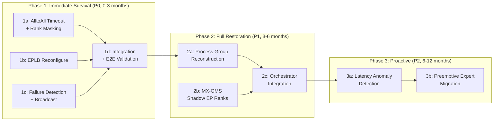

# 9. Implementation Plan

[< Back to Overview](README.md)

## Phase Overview

## Prerequisites

| Prerequisite | Status | Blocking? |
|:-------------|:-------|:----------|
| [PR #12718](https://github.com/NVIDIA/TensorRT-LLM/pull/12718) merged | In review | **Yes** for Phase 1c (error classification patterns) |
| EPLB correctness validated | In progress (Tier 1) | **Yes** for Phase 1b |
| NVLink AlltoAll kernel source access | Available | **Yes** for Phase 1a |
| DeepEP `mask_buffer_ptr` public API | Not available | **No** — NVLink is primary target; DeepEP is secondary |
| MX-GMS Phase 2 (GMS) | Design complete | **No** — Phase 2 works without GMS (slower recovery) |

## Phase 1: Immediate Survival (P0)

**Goal:** When a GPU fails in a WideEP group, continue serving at N-1 capacity within <10 seconds.

### 1a: AlltoAll Timeout and Rank Masking (4-6 weeks)

**Scope:** Add timeout and rank masking to NVLink AlltoAll communication backends.

**Technical challenge:** Requires modifying CUDA kernels that implement multi-GPU synchronization via symmetric memory completion flags. This is low-level GPU systems work: adding conditional rank skipping to spin-wait loops without introducing thread divergence, memory ordering violations, or races when a peer's symmetric memory region becomes inaccessible.

**Deliverables:**

1. `EPGroupHealth` class — bitmask-based rank health tracking
   - Location: `tensorrt_llm/_torch/modules/fused_moe/ep_group_health.py` (new file)
   - Thread-safe mask updates, `mark_failed()`, `mark_active()`, `is_active()`

2. NVLink one-sided rank masking — kernel modification
   - Location: `cpp/tensorrt_llm/kernels/communicationKernels/moeAlltoAllKernels.h`
   - Add `active_rank_mask` parameter to dispatch and combine kernels
   - Dispatch: skip writes to masked ranks
   - Combine: skip flag polling for masked ranks

3. NVLink two-sided rank masking — C++ op modification
   - Location: `cpp/tensorrt_llm/kernels/communicationKernels/` (corresponding two-sided ops)
   - Add `active_rank_mask` parameter to prepare, dispatch, combine ops

4. Python communication backend updates
   - Locations: `nvlink_one_sided.py`, `nvlink_two_sided.py`
   - Pass `active_rank_mask` from `EPGroupHealth` to kernel launches
   - Update `CommunicationFactory` to accept `EPGroupHealth`

5. Host-side AlltoAll watchdog
   - Location: `tensorrt_llm/_torch/modules/fused_moe/alltoall_watchdog.py` (new file)
   - Monitor completion flags, configurable timeout (default 5s)
   - Report timed-out ranks

**Success criteria:**
- Unit test: with one rank masked, AlltoAll completes successfully on N-1 ranks
- Integration test: simulate rank failure (SIGKILL one process), verify surviving ranks complete AlltoAll

### 1b: EPLB Topology Adaptation (4-6 weeks, parallel with 1a)

**Scope:** Add `reconfigure()` to the C++ MoeLoadBalancer for dynamic EP topology changes.

**Technical challenge:** EPLB was designed as a static-topology system with immutable `epSize`/`epRank`. Reconfiguration must safely pause concurrent worker and compute threads (which may be mid-weight-migration), rebuild all internal data structures, migrate expert weights across 58 MoE layers in <50ms, and resume — all while ensuring no layer's routing table references a dead rank's slot.

**Deliverables:**

1. `MoeLoadBalancer::reconfigure()` C++ method
   - Location: `cpp/tensorrt_llm/kernels/moeLoadBalance/moeLoadBalancer.cpp`
   - Pause worker/compute threads
   - Update `MoeLoadBalanceMetaInfo` (epSize, epRank)
   - Reallocate `MoePlacementCpuInfo.rankExpertIds`
   - Run `doReplication()` + `doPlacement()` for new topology
   - Migrate weights (host shared memory → GPU) for changed slots
   - Update GPU `MoePlacementInfo`
   - Resume threads

2. Emergency mode — minimal redistribution
   - Only assign experts with zero surviving replicas
   - Keep all other assignments unchanged
   - Target: <50ms total for all 58 layers

3. Python wrapper
   - Location: `tensorrt_llm/_torch/modules/fused_moe/moe_load_balancer.py`
   - `MoeLoadBalancer.reconfigure()` calls C++ `reconfigure()`
   - Coordinate with model engine iteration lifecycle

**Success criteria:**
- Unit test: reconfigure from EP=32 to EP=31, verify all 256 experts reachable
- Benchmark: emergency reconfigure completes in <50ms for DeepSeek-V3-like config

### 1c: Failure Detection and Broadcast (3-4 weeks, parallel with 1a/1b)

**Scope:** Extend PR #12718's error infrastructure for per-EP-rank health tracking.

**Technical challenge:** Requires solving a distributed consensus variant where one participant is dead and cannot acknowledge its own failure, and where different surviving ranks may discover the failure at different times. Must distinguish transient network delays from permanent GPU death to avoid false positives.

**Deliverables:**

1. `EPRankHealthTracker` — per-rank error budgets
   - Location: `tensorrt_llm/_torch/pyexecutor/ep_rank_health.py` (new file)
   - Per-rank `ErrorBudget` instances
   - EP-specific error patterns in `error_classification.py`

2. Failure broadcast protocol
   - Location: integrated into model engine iteration loop
   - MPI-based health exchange between iterations
   - Consensus on dead rank set before next forward

3. Model engine integration
   - Location: `tensorrt_llm/_torch/pyexecutor/model_engine.py`
   - Check `EPGroupHealth` at iteration start
   - Trigger EPLB reconfigure + mask update when health changes
   - Report degraded status to PyExecutor

**Success criteria:**
- Unit test: inject NCCL error for rank X, verify rank X is marked failed within 2 iterations
- Integration test: kill one MPI worker, verify detection and broadcast within 10s

### 1d: Integration and E2E Validation (3-4 weeks, after 1a/1b/1c)

**Scope:** Wire all Phase 1 components together and validate end-to-end.

**Deliverables:**

1. End-to-end fault tolerance flow
   - Failure detection → broadcast → mask update → EPLB reconfigure → resume serving
   - Integrated into PyExecutor main loop

2. Health check integration
   - `check_health()` returns degraded (not fatal) when running with masked ranks
   - Serving layer reports reduced capacity

3. E2E test suite
   - Multi-GPU test (minimum 4 GPUs): run WideEP serving, kill one rank, verify continued serving
   - Recovery time measurement: <10s from failure to resumed serving
   - Correctness test: verify all experts reachable after redistribution
   - Stress test: multiple sequential failures

**Success criteria:**
- DeepSeek-V3-like model on 4+ GPUs: kill one rank, verify serving continues in <10s
- No request data corruption after recovery
- Throughput after recovery is proportional to surviving ranks

## Phase 2: Full Restoration (P1)

**Goal:** Restore full N-rank capacity after Phase 1 survival, optionally accelerated by MX-GMS.

> **Why process group reconstruction lives here, not in Phase 1:** Phase 1 uses rank masking to avoid process group reconstruction entirely — the system serves at N-1 capacity without touching any NCCL/NVSHMEM/MPI groups. This is deliberate: process group reconstruction is the hardest distributed coordination problem in fault tolerance (requires all surviving ranks to agree, tear down collectively, and rebuild atomically — with deadlock risks from DeepEP barriers, NVSHMEM symmetric memory, and MPI collectives). By deferring it to Phase 2, we get two critical benefits: (1) Phase 1 ships faster and with lower risk, and (2) reconstruction happens in the background while the system is already serving, not while it's down. Process group reconstruction is not abandoned — it is the **core deliverable of Phase 2** and is required for restoring full N-rank capacity.

### 2a: Process Group Reconstruction (4-6 weeks)

**Scope:** Enable creating new NCCL/NVSHMEM/MPI process groups with N ranks (surviving + replacement).

**Technical challenge:** Process group reconstruction with a dead rank is the hardest distributed coordination problem in this design. NCCL abort, NVSHMEM symmetric memory deallocation, and MPI communicator creation all have collective semantics that assume all original participants are alive. Worse, cleanup paths can themselves deadlock — DeepEP's `Buffer.__del__` calls `intranode::barrier`, which hangs if peers are dead. This is a classic example of layered fault tolerance complexity: the cleanup path for one layer requires cooperation from the component that has failed.

**Deliverables:**

1. Coordinated process group teardown
   - Safely destroy old NCCL groups, NVSHMEM memory, MPI communicators
   - Handle DeepEP buffer cleanup (explicit `destroy()` to avoid deadlock)
   - Handle NVLink workspace deallocation

2. N-rank process group creation
   - New NCCL groups with all N ranks
   - New NVSHMEM symmetric memory allocation
   - New MPI communicators
   - New communication strategy via `CommunicationFactory`

3. EPLB full rebalance
   - `reconfigure(emergencyMode=false)` for optimal N-rank placement

### 2b: MX-GMS Shadow EP Ranks (4-6 weeks, parallel with 2a)

**Scope:** Extend MX-GMS shadow worker concept to per-EP-rank shadows.

**Deliverables:**

1. Shadow EP rank lifecycle
   - Pre-load expert shard via GMS RO import
   - Background health check loop monitoring primary rank
   - Activation: GMS lock upgrade → join process group → start serving

2. MX P2P fallback for cross-node replacement
   - Use MX identity matching with `ep_rank` for correct shard transfer

**Dependency:** MX-GMS Phase 2 (GMS integration) must be available.

### 2c: Orchestrator Integration (3-4 weeks, after 2a/2b)

**Scope:** Wire Phase 2 into Ray/K8s/Dynamo orchestration.

**Deliverables:**

1. Replacement rank provisioning API
2. Join protocol for new rank entering existing EP group
3. E2E test: failure → Phase 1 survival → Phase 2 restoration → full capacity

## Phase 3: Proactive Resilience (P2)

**Goal:** Detect degrading ranks before they fail and preemptively migrate experts.

### 3a: Latency Anomaly Detection (3-4 weeks)

- Per-rank AlltoAll latency tracking via CUDA events
- Anomaly detection: rank latency > 3× median → warning
- Alert integration with monitoring (trtllm-serve metrics)

### 3b: Preemptive Expert Migration (3-4 weeks)

- When a rank shows degradation patterns, proactively migrate its hot experts to other ranks
- Uses EPLB's existing online weight migration — just triggered by health signal instead of load signal
- Reduces Phase 1 impact when the rank eventually fails (fewer experts to redistribute)

## Timeline Summary

| Phase | Duration | Depends On | Deliverable |
|:------|:---------|:-----------|:------------|
| **1a: Rank Masking** | 4-6 weeks | Kernel source access | AlltoAll continues with N-1 ranks |
| **1b: EPLB Reconfigure** | 4-6 weeks | EPLB correctness | Expert redistribution on topology change |
| **1c: Failure Detection** | 3-4 weeks | PR #12718 merged | Per-EP-rank health tracking |
| **1d: Integration** | 3-4 weeks | 1a + 1b + 1c | End-to-end Phase 1 |
| **2a: PG Reconstruction** | 4-6 weeks | Phase 1 complete | Full restoration without MX-GMS |
| **2b: Shadow EP Ranks** | 4-6 weeks | MX-GMS Phase 2 | Sub-second restoration |
| **2c: Orchestrator** | 3-4 weeks | 2a + 2b | Production-ready Phase 2 |
| **3a: Latency Detection** | 3-4 weeks | Phase 2 complete | Proactive degradation detection |
| **3b: Preemptive Migration** | 3-4 weeks | 3a | Preemptive expert migration |

**Total estimated duration:** ~9-12 months for all phases, with Phase 1 delivering value in 3-4 months.

## Testing Strategy

| Test Type | Phase | Description |
|:----------|:------|:------------|
| Unit: rank masking kernel | 1a | AlltoAll with masked ranks produces correct results |
| Unit: EPLB reconfigure | 1b | All experts reachable after topology change |
| Unit: error classification | 1c | EP-specific errors classified correctly |
| Integration: single rank failure | 1d | Kill one rank, verify serving continues |
| Integration: multiple sequential failures | 1d | Kill ranks one at a time, verify degradation |
| Integration: process group reconstruction | 2a | Add replacement rank, verify full restoration |
| Integration: shadow EP rank activation | 2b | Shadow activates on primary failure |
| E2E: full lifecycle | 2c | Failure → survive → restore → full capacity |
| Benchmark: recovery time | 1d/2c | Measure Phase 1 and Phase 2 recovery times |
| Benchmark: steady-state overhead | 1d | Measure throughput with rank masking enabled but no failures |
| Stress: concurrent failures | 1d | Multiple ranks fail simultaneously |
| Chaos: random failure injection | 2c | Random failures during serving, verify correctness |
