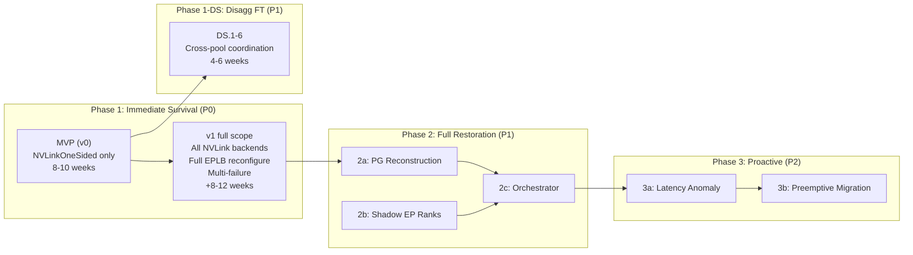

# 9. Implementation Plan

[< Back to Overview](README.md)

## Phase Overview



## Prerequisites

| Prerequisite | Status (verified 2026-04-21) | Blocking? |
|:-------------|:-------|:----------|
| [PR #12718](https://github.com/NVIDIA/TensorRT-LLM/pull/12718) merged | **Not on `docs-and-plans` HEAD.** Commits exist on other branches (`f32efd01e5`, `e3f84ceb02`, `1128c0ff54`, `4aab3c0afc`); `tensorrt_llm/_torch/pyexecutor/error_classification.py` does not exist yet on this tree. | **Yes** for PRs 1c.1–1c.4. Must land or be rebased into the implementation base branch before 1c work can begin. |
| EPLB correctness validated | In progress (Tier 1) | **Yes** for Phase 1b |
| NVLink AlltoAll kernel source access | Available — kernel verified at `cpp/tensorrt_llm/kernels/communicationKernels/moeAlltoAllKernels.cu` (1408 LOC) | **Yes** for Phase 1a |
| `kMaxRanks = 64` constexpr bumped to ≥ 80 (NVL72) | Not done | **Yes** for any production NVL72 use; sub-task of PR 1a.2 |
| NCCL fault-tolerant wiring (`NCCL_ASYNC_ERROR_HANDLING`, `ncclCommAbort`) | **Not wired in TRT-LLM today.** Zero matches outside test files. | **Yes** for PR 1a.7 (AllGather backend mask wiring) |
| MPI failure-tolerant subcomm with `MPI_ERRORS_RETURN` | **Net-new component.** No equivalent in current `MPIDist`. | **Yes** for PR 1c.3 |
| Fault-injection test harness (kernel-abort / rank-kill mid-collective) | **Not present in `tests/`.** Must be built from scratch. | **Yes** for PR 1d.4 |
| DeepEP `mask_buffer_ptr` public API | Not available | **No** — NVLink is primary target; DeepEP is secondary |
| MX-GMS Phase 2 (GMS) | Design complete | **No** — Phase 2 works without GMS (slower recovery) |

## How to Read This Plan

Each numbered item (e.g., **1a.2**) maps to one PR — a focused, reviewable unit of work. Every item row gives the PR title, target file(s), size, dependencies, and scope tag (MVP or v1).

**Size conventions:**

| Size | LOC | Engineer time | Calendar time |
|:---|:---|:---|:---|
| **S** | <300 | 1-3 days | 1-2 weeks |
| **M** | 300-1000 | 3-7 days | 2-3 weeks |
| **L** | 1000+ or deep complexity | 1-3 weeks | 3-6 weeks |

- **Engineer time** is focused work on the change itself.
- **Calendar time** includes design review, code review iterations, CI runs, pre-commit hook fixes, and serialization against other in-flight PRs in the same area. This is what affects the wall-clock delivery date.
- The ratio (calendar ≈ 2-3× engineer time) reflects typical TRT-LLM review cycles for non-trivial PRs.

**Dependency semantics:** `Deps: 1a.1` means this PR needs 1a.1 merged (or at least landed behind a feature flag) before it can be reviewed for merge. PRs without listed deps can be opened in parallel.

**Scope tags:** **(MVP)** = Phase 1 v0 ship; **(v1)** = Phase 1 full scope; **(DS)** = Phase 1-DS (disagg); **(2)** = Phase 2; **(3)** = Phase 3.

**Sum of parts ≠ wall-clock.** Calendar times below are per-PR; the phase totals in the Timeline Summary account for parallel work across multiple engineers and overlap between unblocked items.

## Phase 1: Immediate Survival (P0)

**Goal:** When a GPU fails in a WideEP group, continue serving at N-1 capacity within <10 seconds.

### Phase 1 MVP (v0) vs Full Scope

Phase 1 has a natural MVP that proves the rank-masking approach end-to-end on the primary backend with minimum risk, and a follow-up (v1) that broadens backend coverage and hardens EPLB reconfiguration. The MVP targets a **single-failure scenario on NVLinkOneSided** and is estimated at **8-10 weeks** (revised up from an initial 6-8 week estimate after the April 2026 source review surfaced three net-new components: `kMaxRanks` bump, NCCL FT wiring, and the MPI FT subcomm). The full Phase 1 scope (all NVLink backends, full EPLB reconfigure, multi-failure consensus) remains 3-4 months.

**In MVP scope (v0):**

- NVLinkOneSided kernel masking — primary production backend for NVL72. Includes `kMaxRanks` bump to 128.
- Host-side AlltoAll watchdog with 5s default timeout
- EPLB **emergency slot-remapping mode** (formerly "mask-only") — dead rank's slots become unreachable in `MoePlacementInfo`; requests route only to surviving replicas. No H2D weight movement at recovery time (all weights already mapped via `HostMoeTensorSharer`'s node-local POSIX shm).
- MPI **failure-tolerant subcomm + dedicated FT thread** for out-of-band broadcast (Option A from [§07](07-failure-detection.md), implemented in PR 1c.3 — net-new, not a simple `MPI_Allgather`)
- Single-failure semantics — tolerate 1 dead rank, require replacement before a 2nd failure
- EP-specific patterns added to PR #12718's `error_classification.py` (returns `"immediate_fatal"` / `"severe"` / `"transient"` string literals)
- Net-new fault-injection test harness (no prior art in `tests/`)

**Deferred to v1 (completes the 3-4 month full Phase 1):**

- NVLinkTwoSided kernel masking
- DeepEP / DeepEPLowLatency masking — pending NVSHMEM `mask_buffer_ptr` public API (see [§14 Q4 in mx-gms](../mx-gms-integration/14-open-questions.md) for the parallel open question)
- Full EPLB reconfigure with weight migration across 58 MoE layers in <50ms
- Kernel-side `clock64()` timeout alternative to host watchdog ([§10 Q1](10-risks.md))
- Multi-failure consensus ([§10 Q5](10-risks.md))
- PP interaction with EP fault tolerance ([§10 Q6](10-risks.md))

**MVP exit criteria:** On a 4+ GPU DeepSeek-V3-like test, kill one rank and verify (a) detection in <5s, (b) service continues at reduced capacity in <10s end-to-end, (c) no request data corruption, (d) throughput degradation proportional to capacity loss (≈1/N for single failure).

**Why the MVP is defensible as a standalone deliverable:** It eliminates the 7-8 minute downtime that is the dominant WideEP availability bug today, on the backend that production NVL72 deployments use. Broader backend coverage and EPLB sophistication are real improvements but not required for the primary goodput win.

Deliverable tags in the sub-phases below: **(MVP)** = required for v0 ship; **(v1)** = required for full Phase 1.

### 1a: AlltoAll Timeout and Rank Masking (4-6 weeks)

**Scope:** Add timeout and rank masking to NVLink AlltoAll communication backends.

**Technical challenge:** Requires modifying CUDA kernels that implement multi-GPU synchronization via symmetric memory completion flags. This is low-level GPU systems work: adding conditional rank skipping to spin-wait loops without introducing thread divergence, memory ordering violations, or races when a peer's symmetric memory region becomes inaccessible.

**PR breakdown:**

| PR | Title | Scope | Target file(s) | Size | Deps |
|:---|:---|:---|:---|:---|:---|
| **1a.1** | `EPGroupHealth` class | MVP | `tensorrt_llm/_torch/modules/fused_moe/ep_group_health.py` (new) | S | — |
| **1a.2** | NVLinkOneSided kernel mask (CUDA) | MVP | `cpp/tensorrt_llm/kernels/communicationKernels/moeAlltoAllKernels.{cu,h}` | **L** | — |
| **1a.3** | NVLinkOneSided Python binding update | MVP | `_torch/modules/fused_moe/communication/nvlink_one_sided.py`, `communication_factory.py` | S | 1a.1, 1a.2 |
| **1a.4** | `AlltoAllWatchdog` (host thread) | MVP | `_torch/modules/fused_moe/alltoall_watchdog.py` (new) | S | 1a.1 |
| **1a.5** | NVLinkTwoSided kernel mask (CUDA) | v1 | `cpp/tensorrt_llm/kernels/fusedMoeCommKernels.cu`, `cpp/tensorrt_llm/thop/moeCommOp.cpp` | M | 1a.2 (pattern) |
| **1a.6** | NVLinkTwoSided Python binding update | v1 | `_torch/modules/fused_moe/communication/nvlink_two_sided.py`, `nvlink_two_sided_flashinfer.py` | S | 1a.5 |
| **1a.7** | NCCL fault-tolerant wrapper + AllGatherReduceScatter mask wiring | v1 | NCCL communicator wrapper (`cpp/tensorrt_llm/`), `_torch/modules/fused_moe/communication/allgather_reducescatter.py` | **M** (was S — NCCL wiring is net-new) | 1a.1 |
| **1a.8** | Tighten kernel-side `check_timeout` + replace `trap;` with host-visible flag | v1 | `moeAlltoAllKernels.cu:156-161`, `:581`, `:1214` | M | 1a.2 |

**Per-PR detail:**

- **1a.1** — Bitmask-based rank health. Public API: `mark_failed(rank)`, `mark_active(rank)`, `is_active(rank)`, `get_mask()`. Internal: `uint64[2]` to support NVL72 (72 ranks) and future expansion. Thread-safe via `threading.Lock`. Unit tests cover single-threaded correctness + concurrent update races.
- **1a.2** — Anchored to `cpp/tensorrt_llm/kernels/communicationKernels/moeAlltoAllKernels.cu`. Three sub-tasks within this PR: **(a)** Bump `kMaxRanks` constexpr from 64 to 128 in `moeAlltoAllKernels.h:31` (single-line, but easy to forget — must be done first to support NVL72). **(b)** Add `active_rank_mask_lo, active_rank_mask_hi` (uint64) to `DispatchKernelPointers` and `CombineKernelPointers`. **(c)** Guard **both** the release-write loop *and* the polling loop in dispatch (`:546-555`, `:558-584`) and combine (`:1190-1217`) — masking only one side leaves the dead-rank flag spin in place. Routing pass extension: `compute_target_rank_id` emits `dst_idx = -1` for masked-rank tokens; combine's existing `acc[k].fill(0.0f)` (`:727`) handles them. Performance gate: <0.1% overhead with all-ranks-active. Correctness tests with mocked mask on single GPU.
- **1a.3** — Thread `EPGroupHealth` through `CommunicationFactory`; `NVLinkOneSided.forward()` pulls current mask and passes to kernel launch. Stateless — mask read per launch, not cached.
- **1a.4** — Python thread polling `completion_flags` at configurable interval (default 100ms); 5s default timeout. On timeout, call `EPGroupHealth.mark_failed(rank)` and notify model engine. Note: the kernel's pre-existing 300s `check_timeout` (`moeAlltoAllKernels.cu:156-161`) remains as a backstop — it's a `trap;`, not a recovery hook, so the host watchdog must fire well before it. Unit tests with mocked flags verifying detection latency.
- **1a.5–1a.8** deferred to v1; same pattern as MVP PRs. **1a.7 (AllGather mask wiring)** has an extra prerequisite: NCCL fault-tolerant wiring is not present in TRT-LLM today (no `ncclCommAbort` / `NCCL_ASYNC_ERROR_HANDLING` calls outside test files). 1a.7 must include adding this wiring to the NCCL communicator wrapper, growing it from S to M.

**Success criteria (per phase):**
- MVP: unit test with one rank masked, AlltoAll completes on N-1 ranks; integration test kills one process, surviving ranks complete AlltoAll.
- v1: all NVLink backends pass the same test; steady-state overhead benchmark <0.1% regression.

### 1b: EPLB Topology Adaptation (4-6 weeks, parallel with 1a)

**Scope:** Add `reconfigure()` to the C++ MoeLoadBalancer for dynamic EP topology changes.

**Technical challenge:** EPLB was designed as a static-topology system with immutable `epSize`/`epRank`. Reconfiguration must safely pause concurrent worker and compute threads (which may be mid-weight-migration), rebuild all internal data structures, migrate expert weights across 58 MoE layers in <50ms, and resume — all while ensuring no layer's routing table references a dead rank's slot.

**PR breakdown:**

| PR | Title | Scope | Target file(s) | Size | Deps |
|:---|:---|:---|:---|:---|:---|
| **1b.1** | `reconfigure_mask_only()` — emergency mask in GPU placement | MVP | `cpp/tensorrt_llm/kernels/moeLoadBalance/moeLoadBalanceKernels.{cu,h}` | M | — |
| **1b.2** | Python wrapper for mask-only reconfigure | MVP | `_torch/modules/fused_moe/moe_load_balancer.py` | S | 1b.1 |
| **1b.3** | Iteration-boundary reconfigure integration | MVP | `_torch/modules/fused_moe/moe_load_balancer.py`, `_torch/pyexecutor/model_engine.py` | S | 1b.2 |
| **1b.4** | Mutable `MoeLoadBalanceMetaInfo` (epSize/epRank rewrite) | v1 | `moeLoadBalanceKernels.{cu,h}`, `moeLoadBalanceCommon.h` | **L** | 1b.1 |
| **1b.5** | Full `reconfigure()` — online `doReplication()` + `doPlacement()` | v1 | `moeLoadBalanceKernels.cu`, `moe_load_balancer.py` | M | 1b.4 |
| **1b.6** | Weight migration path (cudaMemcpy2D + gdrcopy) | v1 | `moeLoadBalanceKernels.cu`, `HostMoeTensorSharer` integration | **L** | 1b.5 |
| **1b.7** | Zero-replica expert handling (single-replica redistribution) | v1 | `moeLoadBalanceKernels.cu`, `moe_load_balancer.py` | M | 1b.5 |

**Per-PR detail:**

- **1b.1** — Adds `reconfigure_mask_only(dead_ranks)` entry point that pauses EPLB worker/compute threads, marks dead rank's slot entries as unreachable in GPU `MoePlacementInfo`, resumes. No changes to `MoeLoadBalanceMetaInfo`, no weight moves. Designed to be a <10ms operation.
- **1b.2** — `MoeLoadBalancer.reconfigure_mask_only(dead_ranks: list[int])` Python entry point via existing pybind. Coordinates with model engine iteration lifecycle: requires iteration boundary.
- **1b.3** — Wire into `model_engine.py`'s iteration loop: on `EPGroupHealth` change, call `reconfigure_mask_only` before next forward.
- **1b.4** — Make `epSize`/`epRank` mutable in `MoeLoadBalanceMetaInfo`. Requires careful audit of every reader of these fields (most assume immutable). Atomic swap pattern.
- **1b.5** — `reconfigure(emergencyMode: bool)` full path. When `emergencyMode=true`, only placements for zero-replica experts change. When `false` (used in Phase 2), full `doReplication` + `doPlacement` for optimal N-rank placement.
- **1b.6** — Migrate expert shards among slots via `cudaMemcpy2D` + gdrcopy across 58 MoE layers. Target: <50ms total. Builds on `HostMoeTensorSharer` (host-side shard storage).
- **1b.7** — Handles the edge case where a dead rank held the only copy of some expert. Redistributes those experts across surviving ranks using existing placement policy.

**MVP simplification:** if deployments keep replication factor ≥2 (DeepSeek production does), 1b.1–1b.3 is sufficient — every dead-rank expert already has a surviving replica, so pure masking reaches steady state with no placement change.

**Success criteria:**
- MVP: 4-GPU test, rank killed → `reconfigure_mask_only` completes in <10ms at iteration boundary → next forward routes around dead rank.
- v1: reconfigure EP=32→31 with weight migration; all 256 experts reachable; <50ms total.

### 1c: Failure Detection and Broadcast (3-4 weeks, parallel with 1a/1b)

**Scope:** Extend PR #12718's error infrastructure for per-EP-rank health tracking.

**Technical challenge:** Requires solving a distributed consensus variant where one participant is dead and cannot acknowledge its own failure, and where different surviving ranks may discover the failure at different times. Must distinguish transient network delays from permanent GPU death to avoid false positives.

**PR breakdown:**

| PR | Title | Scope | Target file(s) | Size | Deps |
|:---|:---|:---|:---|:---|:---|
| **1c.1** | EP-specific error classification patterns | MVP | `_torch/pyexecutor/error_classification.py` | S | **PR #12718 commits rebased into base branch first** |
| **1c.2** | `EPRankHealthTracker` — per-rank error budgets | MVP | `_torch/pyexecutor/ep_rank_health.py` (new) | S | 1c.1 |
| **1c.3** | MPI failure-tolerant subcomm + out-of-band broadcast | MVP | `_torch/pyexecutor/ep_failure_broadcast.py` (new), `_torch/distributed/communicator.py` | **L** (was M — net-new component, not a simple broadcast) | 1a.1 |
| **1c.4** | Model engine health-check hook | MVP | `_torch/pyexecutor/model_engine.py` | M | 1a.1, 1b.3, 1c.3 |
| **1c.5** | Iteration-barrier piggyback broadcast (Option B) | v1 | `_torch/pyexecutor/ep_failure_broadcast.py` | M | 1c.3 |
| **1c.6** | Multi-failure consensus + two-phase suspect/confirm | v1 | `_torch/pyexecutor/ep_failure_broadcast.py` | M | 1c.3 |

**Per-PR detail:**

- **1c.1** — Adds EP-specific regex patterns to PR #12718's `IMMEDIATE_FATAL` / `SEVERE` / `TRANSIENT` lists in `error_classification.py`. The classifier still returns the same string literals (`"immediate_fatal"`, `"severe"`, `"transient"`) — we are extending pattern coverage, not introducing new classes. Example: NCCL `unhandled system error` on an EP rank → `"immediate_fatal"`; AlltoAll timeout with no MPI-worker death signal → `"severe"` (candidate for mask, pending confirmation). See [§07 Error Classification Extensions](07-failure-detection.md#error-classification-extensions) for the pattern lists.
- **1c.2** — Per-rank `ErrorBudget` (token-bucket, reusing PR #12718's `ErrorBudget` dataclass) with EP-specific thresholds. Methods: `record_error(rank, error_type)`, `should_mask(rank)`.
- **1c.3** — Builds the MPI failure-tolerant subcomm and the FT broadcast thread described in [§07 Option A](07-failure-detection.md#option-a-out-of-band-via-mpi-failure-tolerant-subcomm-preferred). Net-new component — TRT-LLM today has `MPIDist` for normal collectives but no fault-tolerant subcomm with `MPI_ERRORS_RETURN`, no `MPI_Comm_revoke` (ULFM) wiring, and no dedicated FT polling thread. PR scope: (a) build the FT subcomm at startup via `MPI_Comm_split` and `MPI_Errhandler_set`, (b) implement non-blocking `Isend`/`Irecv`-based broadcast, (c) start a dedicated thread that polls the subcomm independent of forward, (d) integrate with `EPGroupHealth` and the consensus protocol. Single-failure assumption → consensus is trivial (any rank reporting another as dead is authoritative).
- **1c.4** — In `model_engine.py` forward loop: at iteration start, drain `EPGroupHealth` updates; if mask changed, invoke `reconfigure_mask_only` (1b.3) before forward; set `degraded` status on PyExecutor.
- **1c.5** — Lower-overhead broadcast by piggybacking on the iteration barrier instead of a separate MPI exchange. Useful at high iteration rates.
- **1c.6** — Handles two+ ranks dying within one detection window; implements two-phase suspect → confirm protocol to avoid split-brain.

**Success criteria:**
- MVP: inject NCCL error for rank X, verify X marked failed within 2 iterations and broadcast consensus achieved.
- v1: 2 ranks die within 1s window, both detected and masked correctly; no false positives from slow rank.

### 1d: Integration, Productionization, and E2E Validation (3-4 weeks, after 1a/1b/1c)

**Scope:** Wire all Phase 1 components together, add production-readiness polish, and validate end-to-end.

**PR breakdown:**

| PR | Title | Scope | Target file(s) | Size | Deps |
|:---|:---|:---|:---|:---|:---|
| **1d.1** | Feature flag + config gating | MVP | `tensorrt_llm/llmapi/llm_args.py`, `_torch/modules/fused_moe/interface.py` | S | 1c.4 |
| **1d.2** | `check_health()` degraded reporting | MVP | `_torch/pyexecutor/py_executor.py`, `trtllm-serve` health endpoint | S | 1c.4 |
| **1d.3** | Per-rank health telemetry / metrics | MVP | `_torch/modules/fused_moe/ep_metrics.py` (new), Prometheus hook | S | 1a.1 |
| **1d.4** | 4-GPU E2E fault-injection test + harness | MVP | `tests/integration/defs/fault_tolerance/test_wide_ep_ft.py` (new) + new fault-injection fixture (zero prior art in `tests/`) | **L** (was M — harness is net-new) | 1a–1c MVP items |
| **1d.5** | Steady-state overhead regression test | MVP | same test dir | S | 1a.3, 1a.4 |
| **1d.6** | Multi-failure stress + chaos suite | v1 | same test dir | M | 1c.6, 1b.4–1b.7 |
| **1d.7** | Cross-model matrix (DS-V3, DS-R1, others) | v1 | `tests/integration/test_lists/` | S | 1d.4 |

**Per-PR detail:**

- **1d.1** — Add `enable_wide_ep_fault_tolerance: bool = False` to `TorchLlmArgs`. Gate all Phase 1 code paths behind this flag for rollout safety. Validate incompatible combinations (e.g., warn if replication factor <2 when FT enabled; fail if DeepEP backend selected).
- **1d.2** — `/health` endpoint reports `degraded` (not `unhealthy`) when running with masked ranks; includes surviving-rank count and dead-rank list.
- **1d.3** — Per-rank health gauge, AlltoAll timeout counter, mask transition counter. Exposed via `trtllm-serve` metrics.
- **1d.4** — 4+ GPU test: SIGKILL one rank, assert <10s recovery, no data corruption, throughput ≈ (N-1)/N of baseline. **Includes harness:** repo has zero existing fault-injection infrastructure for kernel-level rank death (`tests/` has subprocess-kill utilities only — none simulate a GPU dying mid-collective). Harness pieces: (a) pytest fixture that launches multi-rank MPI workers and tracks their PIDs, (b) signal/CUDA-hook to abort rank N at a controllable point in dispatch/combine, (c) assertion helpers for end-to-end recovery and per-token correctness.
- **1d.5** — Benchmark: enable FT flag with all ranks alive; measure throughput. Gate: <1% regression vs FT disabled.
- **1d.6** — v1 exit criterion: multiple sequential failures, random chaos injection during serving.

**Success criteria:**
- MVP exit: 1d.1–1d.5 green on 4+ GPU CI.
- v1 exit: 1d.6, 1d.7 green; no regressions across DS-V3/R1 matrix.

## Phase 1-DS: Disaggregated Serving FT (P1)

**Goal:** Extend Phase 1 FT to TRT-LLM's disaggregated serving configuration. Starts after Phase 1 MVP lands; can parallelize with Phase 1 v1.

**Scope:** The primary-track Phase 1 primitives (EPGroupHealth, rank masking, `reconfigure_mask_only`) apply **unchanged within each disagg pool**. Phase 1-DS adds the **cross-pool coordination layer** in the orchestrator (`trtllm-serve` proxy): failure correlation, request routing, KV transceiver failure handling. See [§10 Q7](10-risks.md#q7-how-does-wideep-ft-interact-with-disaggregated-serving) for the problem framing.

**Technical challenge:** A rank failure in the prefill pool or decode pool affects the other pool indirectly via KV cache transfer, not via the collective. Detection is pool-local, but recovery must coordinate across pools. The design problem is the orchestrator's retry/reroute policy and its interaction with the KV transceiver's own failure surface (NIXL/UCX/MPI), not another collective-level change.

**PR breakdown:**

| PR | Title | Scope | Target file(s) | Size | Deps |
|:---|:---|:---|:---|:---|:---|
| **DS.1** | Per-pool FT validation harness | DS | `tests/integration/defs/fault_tolerance/test_disagg_per_pool.py` (new) | S | 1d.4 |
| **DS.2** | KV transceiver failure surface audit + classification | DS | `_torch/pyexecutor/kv_cache_transceiver.py`, `error_classification.py` | M | 1c.1 |
| **DS.3** | Cross-pool failure notification | DS | `trtllm-serve` proxy layer; disagg router | M | DS.2 |
| **DS.4** | Request retry/reroute policy on rank failure | DS | `trtllm-serve` proxy layer | M | DS.3 |
| **DS.5** | KV transfer cancellation + cleanup on rank failure | DS | `_torch/pyexecutor/kv_cache_transceiver.py` | M | DS.2 |
| **DS.6** | Disagg E2E fault-injection test | DS | `tests/integration/defs/fault_tolerance/test_disagg_ft.py` (new) | M | DS.1–DS.5 |

**Per-PR detail:**

- **DS.1** — Validate (without code changes) that Phase 1 MVP FT works correctly within each disagg pool independently. If it does, the hard work is purely orchestrator-level.
- **DS.2** — Audit what the NIXL/UCX/MPI transceiver surfaces when a peer dies mid-transfer. Extend `error_classification.py` with `KV_TRANSCEIVER_PEER_DEAD` pattern.
- **DS.3** — When one pool detects a rank failure (via EP-level FT), notify the opposite pool + proxy to invalidate any in-flight requests whose state is on the dead rank.
- **DS.4** — Proxy reroutes in-flight requests to healthy pool members; re-submits prompt if prefill-side state was lost.
- **DS.5** — KV transceiver gracefully cancels in-flight transfers to/from the dead rank instead of hanging.

**Success criteria:**
- DS.6 passes: disagg deployment, kill one prefill rank, kill one decode rank (separately), verify proxy reroutes affected requests and healthy requests continue unaffected.

## Phase 2: Full Restoration (P1)

**Goal:** Restore full N-rank capacity after Phase 1 survival, optionally accelerated by MX-GMS.

> **Why process group reconstruction lives here, not in Phase 1:** Phase 1 uses rank masking to avoid process group reconstruction entirely — the system serves at N-1 capacity without touching any NCCL/NVSHMEM/MPI groups. This is deliberate: process group reconstruction is the hardest distributed coordination problem in fault tolerance (requires all surviving ranks to agree, tear down collectively, and rebuild atomically — with deadlock risks from DeepEP barriers, NVSHMEM symmetric memory, and MPI collectives). By deferring it to Phase 2, we get two critical benefits: (1) Phase 1 ships faster and with lower risk, and (2) reconstruction happens in the background while the system is already serving, not while it's down. Process group reconstruction is not abandoned — it is the **core deliverable of Phase 2** and is required for restoring full N-rank capacity.

### 2a: Process Group Reconstruction (4-6 weeks)

**Scope:** Enable creating new NCCL/NVSHMEM/MPI process groups with N ranks (surviving + replacement).

**Technical challenge:** Process group reconstruction with a dead rank is the hardest distributed coordination problem in this design. NCCL abort, NVSHMEM symmetric memory deallocation, and MPI communicator creation all have collective semantics that assume all original participants are alive. Worse, cleanup paths can themselves deadlock — DeepEP's `Buffer.__del__` calls `intranode::barrier`, which hangs if peers are dead. This is a classic example of layered fault tolerance complexity: the cleanup path for one layer requires cooperation from the component that has failed.

**PR breakdown:**

| PR | Title | Scope | Target file(s) | Size | Deps |
|:---|:---|:---|:---|:---|:---|
| **2a.1** | Coordinated NCCL teardown | 2 | `_torch/distributed/*` | M | Phase 1 complete |
| **2a.2** | NVSHMEM symmetric memory safe deallocation | 2 | NVSHMEM wrappers | M | 2a.1 |
| **2a.3** | MPI communicator rebuild with `MPI_ERRORS_RETURN` | 2 | MPI init wrappers | M | 2a.1 |
| **2a.4** | DeepEP buffer explicit `destroy()` sequencing | 2 | `deep_ep.py`, `deep_ep_low_latency.py` | S | 2a.1 |
| **2a.5** | NVLink workspace deallocation | 2 | NVLink backend teardown | S | 2a.1 |
| **2a.6** | N-rank process group creation path | 2 | `CommunicationFactory` | M | 2a.1–2a.5 |
| **2a.7** | EPLB full rebalance after PG rebuild | 2 | `moe_load_balancer.py` (uses 1b.5) | S | 2a.6, 1b.5 |

**Technical note:** 2a.1–2a.5 are the "coordinated teardown" piece flagged in [§10 Risk 3](10-risks.md#risk-3-process-group-reconstruction-deadlocks) — each comm backend has its own deadlock hazard that needs careful sequencing.

### 2b: MX-GMS Shadow EP Ranks (4-6 weeks, parallel with 2a)

**Scope:** Extend MX-GMS shadow worker concept to per-EP-rank shadows.

**PR breakdown:**

| PR | Title | Scope | Target file(s) | Size | Deps |
|:---|:---|:---|:---|:---|:---|
| **2b.1** | Shadow EP rank lifecycle — pre-load via GMS RO | 2 | Shadow worker spawn path; GMS client integration | M | MX-GMS Phase 2 |
| **2b.2** | Shadow health-check loop monitoring primary | 2 | `shadow_ep_rank.py` (new) | S | 2b.1 |
| **2b.3** | Activation path: GMS lock upgrade → join PG → serve | 2 | `shadow_ep_rank.py` | M | 2b.1, 2a.6 |
| **2b.4** | MX P2P fallback for cross-node replacement | 2 | MX client integration; identity matching with `ep_rank` | M | MX-GMS Phase 1 |

**Dependency:** MX-GMS Phase 2 (GMS integration) must be available for 2b.1.

### 2c: Orchestrator Integration (3-4 weeks, after 2a/2b)

**Scope:** Wire Phase 2 into Ray/K8s/Dynamo orchestration.

**PR breakdown:**

| PR | Title | Scope | Target file(s) | Size | Deps |
|:---|:---|:---|:---|:---|:---|
| **2c.1** | Replacement rank provisioning API | 2 | orchestrator hooks (K8s/Ray/Dynamo) | M | 2a.6 |
| **2c.2** | Join protocol for new rank entering EP group | 2 | handshake path; calls into 2b.3 | M | 2c.1, 2b.3 |
| **2c.3** | E2E test: Phase 1 + Phase 2 full lifecycle | 2 | `tests/integration/defs/fault_tolerance/test_phase2_restoration.py` | M | 2c.1, 2c.2 |

## Phase 3: Proactive Resilience (P2)

**Goal:** Detect degrading ranks before they fail and preemptively migrate experts.

### 3a: Latency Anomaly Detection (3-4 weeks)

**PR breakdown:**

| PR | Title | Scope | Target file(s) | Size | Deps |
|:---|:---|:---|:---|:---|:---|
| **3a.1** | Per-rank AlltoAll latency via CUDA events | 3 | `_torch/modules/fused_moe/ep_metrics.py` | S | Phase 2 complete |
| **3a.2** | Anomaly detector (3× median rule) | 3 | `ep_metrics.py` | S | 3a.1 |
| **3a.3** | Alerting integration with `trtllm-serve` metrics | 3 | metrics endpoint | S | 3a.2 |

### 3b: Preemptive Expert Migration (3-4 weeks)

**PR breakdown:**

| PR | Title | Scope | Target file(s) | Size | Deps |
|:---|:---|:---|:---|:---|:---|
| **3b.1** | Degradation-signal-triggered migration | 3 | `moe_load_balancer.py` (reuses 1b.6 weight migration path) | M | 3a.2, 1b.6 |
| **3b.2** | Hot-expert prioritization under degradation | 3 | `moe_load_balancer.py` | S | 3b.1 |

## Timeline Summary

Phase totals account for parallelism: multiple PRs in the same sub-phase (e.g., 1a.1, 1a.2, 1a.4) run concurrently on different files. Calendar time per PR (per the size table above) sums to more than the phase total because unblocked PRs overlap.

| Phase | PRs | Calendar time | Depends on | Deliverable |
|:------|:----|:-------------|:-----------|:------------|
| **Phase 1 MVP (v0)** | 1a.1–1a.4, 1b.1–1b.3, 1c.1–1c.4, 1d.1–1d.5 (12 PRs) | **8-10 weeks** with 2-3 engineers (was 6-8; +2 weeks for the 1c.3 MPI FT subcomm and 1d.4 fault-injection harness, both net-new) | Kernel source access; PR #12718 commits rebased into base branch | Single-failure survival on NVLinkOneSided; <10s recovery; no weight movement at recovery time |
| **Phase 1 v1** | 1a.5–1a.8, 1b.4–1b.7, 1c.5–1c.6, 1d.6–1d.7 (12 PRs) | **8-12 weeks after MVP** | MVP landed | All NVLink backends, full EPLB reconfigure + weight migration, multi-failure, production polish |
| **Phase 1-DS** | DS.1–DS.6 (6 PRs) | **4-6 weeks, parallelizable with v1** | MVP landed | Disagg serving FT with cross-pool coordination |
| **Phase 2: Restoration** | 2a.1–2a.7, 2b.1–2b.4, 2c.1–2c.3 (14 PRs) | **14-20 weeks** | Phase 1 v1 complete (2a); MX-GMS Phase 2 (2b) | Full N-rank capacity restoration via process group reconstruction + shadow EP ranks |
| **Phase 3: Proactive** | 3a.1–3a.3, 3b.1–3b.2 (5 PRs) | **6-8 weeks** | Phase 2 complete | Preemptive degradation detection + expert migration |

**Total PRs:** 49 across all phases. The MVP alone is 12 PRs.

**Total wall-clock estimates:**

- **Phase 1 MVP:** 8-10 weeks (revised from 6-8 after April 2026 source-discovery review surfaced two net-new components: MPI failure-tolerant subcomm and fault-injection harness)
- **Phase 1 complete (MVP + v1 + DS):** ~18-26 weeks ≈ 4-6 months
- **Phase 2 complete:** +14-20 weeks ≈ +3.5-5 months after Phase 1
- **Full program (Phase 1 + 2 + 3):** ~10-14 months

**Honest caveats:**

- These estimates assume 2-3 engineers with overlapping availability, not a single person.
- L-sized PRs in MVP (1a.2 NVLinkOneSided kernel, 1c.3 MPI FT subcomm, 1d.4 fault-injection harness) carry the most schedule risk. The April 2026 discovery review specifically called out:
  - **1a.2:** straightforward modification of an existing kernel structure (not a from-scratch kernel) — confidence raised after source review.
  - **1c.3:** more uncertain — `MPI_ERRORS_RETURN` + non-blocking poll patterns work in vanilla MPI but ULFM availability depends on the MPI build (OpenMPI ULFM is opt-in, MVAPICH support varies). Worst case: live with single-failure-only and skip ULFM in MVP.
  - **1d.4:** harness design risk — getting a clean kernel-abort-mid-collective without poisoning the test runner is the unsolved piece.
- v1 L-sized PRs (1b.4 mutable epSize/epRank, 1b.6 weight migration) reliably surface 2-4 weeks of unplanned edge cases beyond the initial design.
- Calendar time includes code review iteration. If review bandwidth is constrained, multiply by 1.5×.
- External blockers (PR #12718 sequencing, DeepEP NVSHMEM API, MX-GMS Phase 2 availability) affect their dependent items. PR #12718 sequencing is the only one on the MVP critical path.

### MVP Critical Path

```mermaid
gantt
    title Phase 1 MVP Critical Path (8-10 weeks)
    dateFormat X
    axisFormat %w

    section Python track
    1a.1 EPGroupHealth                   :a1, 0, 1w
    1a.4 AlltoAllWatchdog                :a2, after a1, 1w
    1c.1-2 Error cls + per-rank tracker  :a6, after a2, 2w

    section CUDA track
    1a.2 NVLinkOneSided kernel mask      :crit, a3, 0, 4w
    1a.3 NVLinkOneSided binding          :a4, after a3, 1w

    section EPLB track
    1b.1-3 EPLB slot-remap + wire        :a5, 1w, 3w

    section Distributed track
    1c.3 MPI FT subcomm + thread         :crit, ac3, 1w, 4w

    section Integration
    1c.4 Model engine integration        :a7, after ac3, 1w
    1d.1-3 Flag + health + metrics       :a8, 6w, 1w
    1d.4 Fault-injection harness         :crit, a9, 6w, 3w
    1d.5 Overhead regression             :a10, after a9, 1w
```

The MVP has **three critical-path items** (marked `crit`): 1a.2 (NVLinkOneSided kernel mask), 1c.3 (MPI FT subcomm), and 1d.4 (fault-injection harness). All three are net-new and have schedule risk that cannot be mitigated by parallelism — they each gate end-to-end demonstration of one capability. Everything else can parallelize.

## Testing Strategy

| Test Type | Phase | Description |
|:----------|:------|:------------|
| Unit: rank masking kernel | 1a | AlltoAll with masked ranks produces correct results |
| Unit: EPLB reconfigure | 1b | All experts reachable after topology change |
| Unit: error classification | 1c | EP-specific errors classified correctly |
| Integration: single rank failure | 1d | Kill one rank, verify serving continues |
| Integration: multiple sequential failures | 1d | Kill ranks one at a time, verify degradation |
| Integration: process group reconstruction | 2a | Add replacement rank, verify full restoration |
| Integration: shadow EP rank activation | 2b | Shadow activates on primary failure |
| E2E: full lifecycle | 2c | Failure → survive → restore → full capacity |
| Benchmark: recovery time | 1d/2c | Measure Phase 1 and Phase 2 recovery times |
| Benchmark: steady-state overhead | 1d | Measure throughput with rank masking enabled but no failures |
| Stress: concurrent failures | 1d | Multiple ranks fail simultaneously |
| Chaos: random failure injection | 2c | Random failures during serving, verify correctness |
