# WideEP Fault Tolerance for TensorRT-LLM — Combined Design Document

**Status:** Draft
**Created:** 2026-04-10
**Last Updated:** 2026-04-22

> This is a single-file combined view of the multi-file design set at
> `docs/design/wide-ep-fault-tolerance/` (README + §01–§10). Cross-references
> that originally pointed to sibling files have been rewritten as in-document
> anchors.

---

## Table of Contents

- [Executive Summary](#executive-summary)
- [Scope and Non-Goals](#scope-and-non-goals)
- [Terminology](#terminology)
- [Why This Is Technically Hard](#why-this-is-technically-hard)
- [Phase Priorities](#phase-priorities)
- [Related Work](#related-work)
- [1. Background and Motivation](#1-background-and-motivation)
- [2. Current State Analysis](#2-current-state-analysis)
- [3. Competitive Landscape](#3-competitive-landscape)
- [4. Design: Two-Phase Recovery](#4-design-two-phase-recovery)
- [5. Design: Rank Masking in Communication](#5-design-rank-masking-in-communication)
- [6. Design: EPLB Topology Adaptation](#6-design-eplb-topology-adaptation)
- [7. Design: Failure Detection and Classification](#7-design-failure-detection-and-classification)
- [8. Integration with MX-GMS](#8-integration-with-mx-gms)
- [9. Implementation Plan](#9-implementation-plan)
- [10. Risks and Open Questions](#10-risks-and-open-questions)

---

## Executive Summary

WideEP (Wide Expert Parallelism) distributes MoE experts across 32-72+ GPUs for models like DeepSeek-V3/R1 (256 experts, 681GB). At this scale, GPU failures are a daily reality — and today, a single GPU failure in a WideEP group takes down the entire serving instance (infinite hang in AlltoAll communication, no detection, no recovery).

This design proposes a **two-phase fault tolerance architecture** for WideEP:

- **Phase 1 — Immediate Survival:** Mask the failed rank in AlltoAll communication, redistribute experts to surviving ranks via EPLB, and continue serving at reduced capacity within seconds.
- **Phase 2 — Full Restoration:** Optionally bring up a replacement rank (accelerated by MX/GMS if available), reconstruct the process group, and restore full capacity.

The design builds on two concurrent workstreams:
- [PR #12718: Fatal Error Detection](https://github.com/NVIDIA/TensorRT-LLM/pull/12718) — Error classification and fatal error detection infrastructure
- [MX+GMS+TRT-LLM Integration](https://docs.google.com/document/d/14SZmmFcoakgIx2OC4dt8pWcHU14PDTN9KlAKqLoZ15s/edit?usp=sharing) — Fast weight loading and crash-resilient memory for accelerated recovery

Together, the three workstreams form a **layered reliability stack**: detect failures (PR #12718) → survive partial failures (this design) → recover quickly (MX-GMS).

**Competitive context:** SGLang shipped Elastic EP in March 2026 (~6.5s recovery, tolerates up to 16/32 rank failures). vLLM has an active RFC (#27774) for fault-tolerant EP. TRT-LLM currently has no EP-level fault tolerance — this is a critical gap for production WideEP deployments.

## Scope and Non-Goals

### In Scope (Primary Track — Phase 1 Priority)

- **Aggregated WideEP serving** — a single `trtllm-serve` instance runs prefill and decode on one EP group spanning 32-72+ GPUs (the DeepSeek-V3/R1 NVL72 configuration)
- **PyTorch backend** (the default backend that WideEP is built on)
- **NVLink communication backends** as the primary target: `NVLinkOneSided` (primary), `NVLinkTwoSided`, and `AllGatherReduceScatter` (NCCL fallback)
- **Intra-node and multi-node EP** where the collective paths are the ones listed above
- **Single GPU failure** in MVP; **multi-failure consensus** in full Phase 1

### In Scope (Deferred Track — After Phase 1 MVP)

- **Disaggregated serving fault tolerance.** Production TRT-LLM disagg separates prefill and decode into independent worker pools, each with its own EP group, connected by KV cache transfer (NIXL/UCX/MPI). A failure in one pool has different semantics from an aggregated failure:
  - Request state is split across pools — prefill-side context and decode-side KV cache are separate
  - KV cache transfers in flight at the time of failure have their own failure mode
  - The orchestration layer (`trtllm-serve` proxy) has to coordinate recovery across pools, not just within one

  This is scoped as a separate **Phase 1-DS** track that starts after Phase 1 MVP lands and can proceed in parallel with Phase 1 v1. The per-pool collective-level FT from the primary track applies unchanged within each pool; Phase 1-DS adds the cross-pool coordination layer. See [§9 Phase 1-DS](#phase-1-ds-disaggregated-serving-ft-p1) and [§10 Q7](#q7-how-does-wideep-ft-interact-with-disaggregated-serving).

### Out of Scope (Explicit Non-Goals)

- **DeepEP / DeepEPLowLatency backends** — masking requires a public NVSHMEM `mask_buffer_ptr` API that does not exist yet. In scope as a v1 target *if* the external API becomes available; otherwise deferred indefinitely. See [§10 Risk 2](#risk-2-deepep-backend-limitations).
- **TensorRT engine backend** — legacy backend per `AGENTS.md`; FT work targets PyTorch only.
- **Standard EP (≤8 GPUs)** — not the WideEP bottleneck. Today's infinite-hang failure mode is an issue specific to multi-node NVLink AlltoAll. Intra-node EP failures are handled adequately by process restart + PR #12718's error classification.
- **Inference request durability** — if a request is mid-flight when a rank fails, that specific request is lost. Recovering individual requests across failures is an orchestration-layer concern, not a collective-layer one.
- **Preemptive / predictive failure mitigation** — deferred to Phase 3.

## Terminology

This doc uses specific terms consistently. The same concept sometimes appears under different labels in prior drafts or in adjacent work (MX-GMS design, SGLang papers); the definitions below are what this doc means.

| Term | Definition |
|:---|:---|
| **WideEP** | Wide Expert Parallelism: MoE expert-parallel distribution across ≥32 GPUs (vs. standard EP within a single 8-GPU node). |
| **EP group** | The set of ranks participating in a single AlltoAll collective. For DeepSeek-V3 on NVL72, `ep=72`. |
| **EPLB** | **Expert-Parallel Load Balancer** — an *existing* TRT-LLM component (`cpp/tensorrt_llm/runtime/moeLoadBalancer/`, `tensorrt_llm/_torch/modules/fused_moe/moe_load_balancer.py`). Owns the (expert → rank, slot) placement table (`MoePlacementInfo`), updates it at iteration boundaries, and supports redundant expert replicas. **In scope:** extend EPLB with an out-of-band "emergency reconfigure" trigger and a mask-only fast path. **Out of scope:** rewriting EPLB's routing algorithm, changing its balancing heuristic, or replacing it. |
| **Rank masking** | *Kernel-level* behavior: the AlltoAll kernel reads a bitmask and skips dead peers in its send/poll loops. Implemented in §5. |
| **Slot remap** | *EPLB-level* operation: rewrite `MoePlacementInfo` so the dead rank's slots point to surviving replicas. No H2D weight copy. Implemented in §6. |
| **Emergency reconfigure** | The combined MVP recovery action = rank masking + slot remap. Triggered by failure detection; completes at the next iteration boundary. Target <10ms end-to-end. |
| **Weight migration** | *v1-only* operation: H2D copy of expert weights into a new slot. Required when an expert loses all replicas (replication=1 case). The MVP avoids this by requiring replication ≥ 2. |
| **MVP (v0)** | The first shipping milestone. Single failure, NVLinkOneSided backend only, slot-remap recovery (no weight move). 6-7 weeks with AI coding-agent assistance (8-10 weeks baseline). See [§9](#9-implementation-plan) for the assumption. |
| **v1** | Full Phase 1 scope: all NVLink backends, weight migration, multi-failure consensus. Ships after MVP. |
| **Phase 2** | Full restoration: bring up a replacement rank and rebuild the process group. Optional — Phase 1 is sufficient for continued serving. |
| **Work tracks 1a/1b/1c/1d** | Parallel engineering tracks inside Phase 1 (see §9). Not time-slices. |
| **Emergency mode / mask-only mode** | Older names for "emergency reconfigure." The API surface in code is `reconfigure_mask_only()`; the prose name is "emergency reconfigure." |

## Why This Is Technically Hard

This is not routine integration work. The design tackles several problems that are individually challenging and collectively require cross-layer systems expertise:

1. **GPU kernel-level synchronization modification.** TRT-LLM's NVLinkOneSided AlltoAll kernel spins on PTX-level completion-flag polling with no host-side abort hook. Adding rank masking requires modifying the CUDA kernel itself — a different class of work from SGLang's and vLLM's API-level integration against third-party libraries (Mooncake, DeepEP). See [§3 "Why kernel-level, and not API-level"](#why-kernel-level-and-not-api-level-like-sglang--vllm) for the full argument.

2. **Distributed consensus without the dead participant.** When a rank dies, the surviving N-1 ranks must agree on which rank is dead — but the dead rank cannot participate in the agreement protocol, and the communication infrastructure is itself degraded. This is a variant of the classic failure detection problem in asynchronous distributed systems, where a slow process is indistinguishable from a dead one.

3. **Runtime topology change in a static-topology system.** EPLB was designed with immutable `epSize` and `epRank` — the entire data structure (CPU placement arrays, GPU routing tables, shared memory layout) assumes a fixed number of ranks. Extending this for dynamic topology changes while the system is actively serving (concurrent worker threads, in-flight weight migrations, per-layer state machines) is a qualitatively different design problem than what EPLB was built for.

4. **Cross-layer design spanning 5 abstraction levels.** Changes must be consistent across GPU kernels → communication backends → load balancer → executor → serving layer. An error detected in a CUDA kernel must propagate through Python communication wrappers, trigger EPLB reconfiguration in C++, update the executor's health status, and surface in HTTP health check responses — all within seconds, all correctly ordered.

---

## Phase Priorities

| Phase | Priority | Timeline | Rationale |
|:------|:---------|:---------|:----------|
| **Phase 1 MVP (v0)** | **P0** | **6-7 weeks** (AI-assisted) | **Single-failure survival on NVLinkOneSided (primary NVL72 backend); eliminates 7-8 min downtime for the dominant failure mode. Scope cuts: no NVLinkTwoSided, no full EPLB reconfigure, no multi-failure. Estimate history: initial 6-8 weeks → post-April-review baseline 8-10 weeks (added scope: kMaxRanks bump, NCCL FT wiring, MPI FT subcomm, fault-injection harness) → AI coding-agent assistance absorbs the added scope back to 6-7 weeks. See [§9 Phase 1 MVP](#phase-1-mvp-v0-vs-full-scope).** |
| Phase 1 full (v1) | P0 | ~6-9 weeks after MVP (AI-assisted) | Broadens to all NVLink backends, adds full EPLB reconfigure with weight migration, multi-failure consensus |
| **Phase 1-DS: Disagg FT** | **P1** | **~3-4 weeks, parallelizable with Phase 1 v1** | **Extends FT to disaggregated serving. Starts after Phase 1 MVP; does not block v1.** |
| Phase 2: Full Restoration | P1 | 2.5-3.5 months (AI-assisted) | Process group reconstruction; restores full N-rank capacity; benefits from MX-GMS for fast recovery |
| Phase 3: Proactive Resilience | P2 | 4-6 months (AI-assisted) | Predictive failure detection, preemptive expert migration |

> **All timelines above assume engineers work with AI coding-agent assistance that reduces coding and review time by ~30-40% on S/M-size PRs and ~20-25% on design-heavy L-size PRs. Without that assistance, apply ~1.3× to every figure. See [§9 "How to Read This Plan"](#how-to-read-this-plan) for the rationale.

## Related Work

| Workstream | Status | Relationship |
|:-----------|:-------|:-------------|
| [PR #12718: Fatal Error Detection](https://github.com/NVIDIA/TensorRT-LLM/pull/12718) | Open (in review) | **Foundation** — Provides error classification, error budget, and fatal error propagation that this design extends |
| [MX+GMS+TRT-LLM Integration](https://docs.google.com/document/d/14SZmmFcoakgIx2OC4dt8pWcHU14PDTN9KlAKqLoZ15s/edit?usp=sharing) | Design complete | **Acceleration** — GMS crash-resilient memory and shadow workers reduce Phase 2 recovery from minutes to sub-second |
| Wide-EP + EPLB Hardening | Tier 1 priority | **Prerequisite** — EPLB correctness and reliability are assumed by this design |

---

## 1. Background and Motivation

### The WideEP Deployment Model

Standard Expert Parallelism (EP) shards MoE experts within a single node (typically 8 GPUs). **WideEP** extends this across multiple nodes — distributing experts over 32, 64, or even 72 GPUs (a full NVL72 rack). This is necessary for models like DeepSeek-V3/R1 with 256 routed experts and 681GB of weights.

**Typical WideEP configurations:**

| Model | Experts | EP Size | GPUs | Config |
|:------|:--------|:--------|:-----|:-------|
| DeepSeek-V3 | 256 | 32 | 32 (4 nodes) | `tp=32, ep=32, enable_attention_dp=True` |
| DeepSeek-R1 | 256 | 64 | 64 (8 nodes) | `tp=64, ep=64, enable_attention_dp=True` |
| DeepSeek-V3 on NVL72 | 256 | 72 | 72 (1 rack) | `tp=72, ep=72, enable_attention_dp=True` |

With `enable_attention_dp=True`, all GPUs in the WideEP group run **data-parallel attention** (each GPU processes independent requests) but **expert-parallel MoE** (tokens are routed across all GPUs via AlltoAll). This means every MoE layer requires a global AlltoAll collective across the entire EP group.

### The Failure Problem

#### Mean Time Between Failures at Scale

At WideEP scale, GPU failures become a statistical certainty:

- A single GPU has an annualized failure rate (AFR) of ~2-5% in datacenter environments
- A 72-GPU NVL72 rack has an expected MTBF of ~3-7 days for at least one GPU failure
- A 128-GPU deployment (2 racks) sees failures every ~1.5-3.5 days

#### The Blast Radius Today

When a GPU fails in a WideEP group, the impact is total:

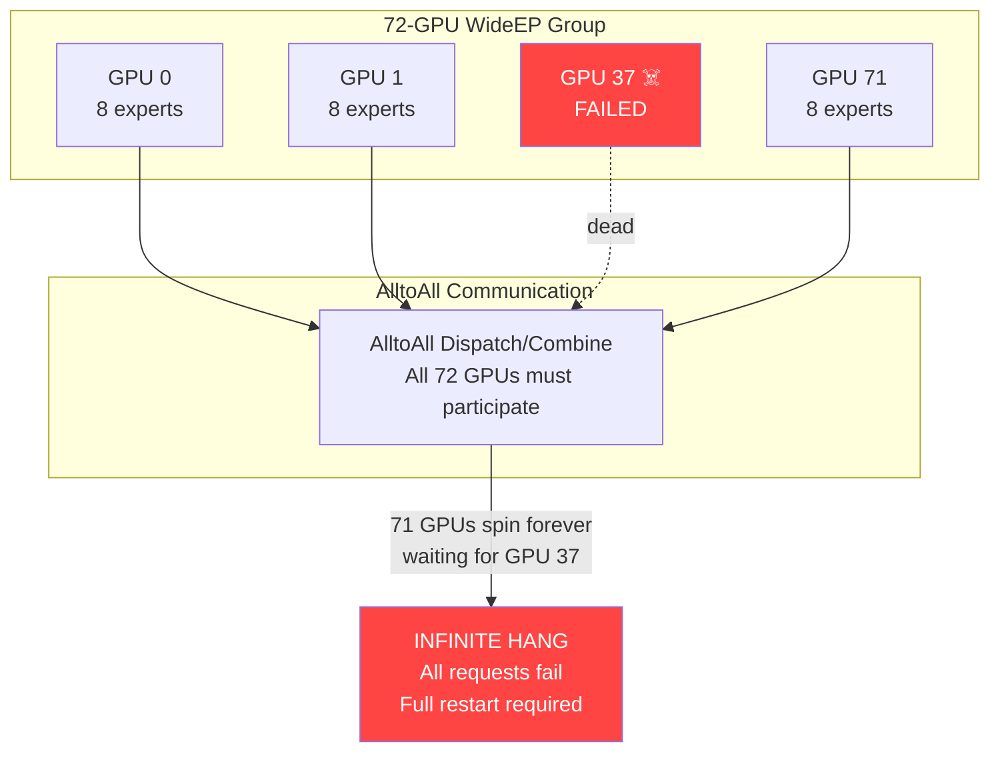
```mermaid
graph TD
    subgraph "72-GPU WideEP Group"
        GPU1["GPU 0<br/>8 experts"]
        GPU2["GPU 1<br/>8 experts"]
        GPU_X["GPU 37 ☠️<br/>FAILED"]
        GPU71["GPU 71<br/>8 experts"]
    end

    subgraph "AlltoAll Communication"
        A2A["AlltoAll Dispatch/Combine<br/>All 72 GPUs must participate"]
    end

    GPU1 --> A2A
    GPU2 --> A2A
    GPU_X -.->|"dead"| A2A
    GPU71 --> A2A

    A2A -->|"71 GPUs spin forever<br/>waiting for GPU 37"| HANG["INFINITE HANG<br/>All requests fail<br/>Full restart required"]

    style GPU_X fill:#ff4444,color:#fff
    style HANG fill:#ff4444,color:#fff
```

**Current behavior when one GPU dies:**

1. The dead GPU stops responding to AlltoAll dispatch/combine operations
2. NVLink AlltoAll kernels spin on `completion_flags` indefinitely — **no timeout exists**
3. DeepEP/NVSHMEM operations hang indefinitely — no timeout
4. The `HangDetector` fires after **300 seconds** (5 minutes!) and shuts down the entire executor
5. All 71 healthy GPUs are wasted during the 5-minute hang
6. All in-flight requests are lost
7. Full restart takes **2-3 minutes** (weight loading + warmup)
8. Total downtime: **7-8 minutes per GPU failure event**

**Why the hang is infinite:** The NVLink AlltoAll kernels implement synchronization via `completion_flags` — GPU threads spin-wait on flag values written by peer GPUs via symmetric memory P2P writes. Unlike host-side NCCL collectives which eventually time out, these GPU-side spin loops have no cycle counter, no watchdog, and no cooperative abort mechanism. A GPU kernel cannot be "interrupted" from the host once launched. Adding timeout or masking requires modifying the actual CUDA kernel code that coordinates multi-GPU data movement — a category of low-level systems work that very few engineers encounter, and that distinguishes this project from the API-level integration approach taken by competitors.

#### The Goodput Impact

For a 72-GPU deployment serving DeepSeek-V3 at ~3500 tokens/sec:

| Failure Frequency | Downtime per Event | Daily Goodput Loss |
|:-----------------|:-------------------|:-------------------|
| 1 failure / 3 days | 8 minutes | ~0.2% |
| 1 failure / day | 8 minutes | ~0.6% |
| 3 failures / day | 8 minutes each | ~1.7% |

These numbers assume independent failures. Correlated failures (e.g., power supply, cooling, NVLink domain) are significantly worse and can cascade.

### Why Now

Three converging trends make WideEP fault tolerance urgent in 2026:

1. **DeepSeek-scale MoE models are the default.** DeepSeek-V3/R1, Qwen3, and similar architectures with 256+ experts require WideEP. Every major inference deployment needs this.

2. **GB200 NVL72 racks amplify the failure domain.** The NVL72 rack is designed for rack-wide WideEP with NVLink interconnect. But a 72-GPU failure domain means the entire rack goes down when one GPU fails.

3. **Competitors have shipped solutions.** SGLang's Elastic EP (March 2026) demonstrates ~6.5s recovery with near-zero steady-state overhead. vLLM's RFC #27774 proposes kernel-level fault tolerance. TRT-LLM's lack of any EP-level fault tolerance is a growing competitive liability.

### The Opportunity

TRT-LLM has a unique advantage that competitors lack: **EPLB (Expert-Level Load Balancing)** with runtime expert replication and host-side weight sharing. EPLB already:

- Maintains redundant expert copies across ranks (hot experts are replicated to multiple slots)
- Stores all expert weights in host shared memory (any rank can load any expert in ~0.1-0.3ms)
- Performs live weight migration between GPU slots at runtime (proven online mechanism)
- Updates routing tables dynamically (GPU-side placement info updated every iteration)

These existing capabilities provide a strong foundation for fault tolerance — the core weight redistribution machinery already exists. What's missing is failure detection, communication-layer resilience, and the orchestration to tie them together.

---

## 2. Current State Analysis

### WideEP Architecture in TRT-LLM

#### Communication Backends

WideEP uses a pluggable communication architecture with five AlltoAll strategies, auto-selected based on hardware capabilities:

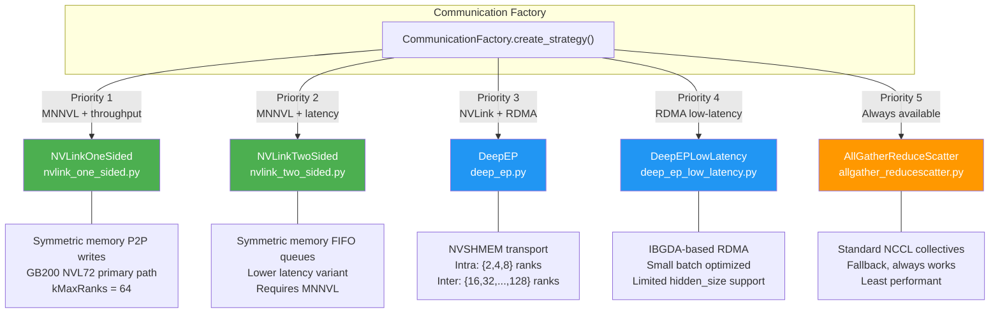
```mermaid
graph TD
    subgraph "Communication Factory"
        CF["CommunicationFactory.create_strategy()"]
    end

    CF -->|"Priority 1<br/>MNNVL + throughput"| NV1["NVLinkOneSided<br/>nvlink_one_sided.py"]
    CF -->|"Priority 2<br/>MNNVL + latency"| NV2["NVLinkTwoSided<br/>nvlink_two_sided.py"]
    CF -->|"Priority 3<br/>NVLink + RDMA"| DEP["DeepEP<br/>deep_ep.py"]
    CF -->|"Priority 4<br/>RDMA low-latency"| DEPL["DeepEPLowLatency<br/>deep_ep_low_latency.py"]
    CF -->|"Priority 5<br/>Always available"| AGRS["AllGatherReduceScatter<br/>allgather_reducescatter.py"]

    NV1 --- NV1D["Symmetric memory P2P writes<br/>GB200 NVL72 primary path<br/>kMaxRanks = 64"]
    NV2 --- NV2D["Symmetric memory FIFO queues<br/>Lower latency variant<br/>Requires MNNVL"]
    DEP --- DEPD["NVSHMEM transport<br/>Intra: {2,4,8} ranks<br/>Inter: {16,32,...,128} ranks"]
    DEPL --- DEPLD["IBGDA-based RDMA<br/>Small batch optimized<br/>Limited hidden_size support"]
    AGRS --- AGRSD["Standard NCCL collectives<br/>Fallback, always works<br/>Least performant"]

    style NV1 fill:#4CAF50,color:#fff
    style NV2 fill:#4CAF50,color:#fff
    style DEP fill:#2196F3,color:#fff
    style DEPL fill:#2196F3,color:#fff
    style AGRS fill:#FF9800,color:#fff
```

**Key files:**
- Communication factory: `tensorrt_llm/_torch/modules/fused_moe/communication/communication_factory.py`
- NVLink one-sided: `tensorrt_llm/_torch/modules/fused_moe/communication/nvlink_one_sided.py`
- NVLink two-sided: `tensorrt_llm/_torch/modules/fused_moe/communication/nvlink_two_sided.py`
- DeepEP: `tensorrt_llm/_torch/modules/fused_moe/communication/deep_ep.py`
- C++ AlltoAll kernels: `cpp/tensorrt_llm/kernels/communicationKernels/moeAlltoAllKernels.h`

#### EPLB Architecture

EPLB decouples logical experts from physical GPU slots, enabling hot expert replication and live weight migration:

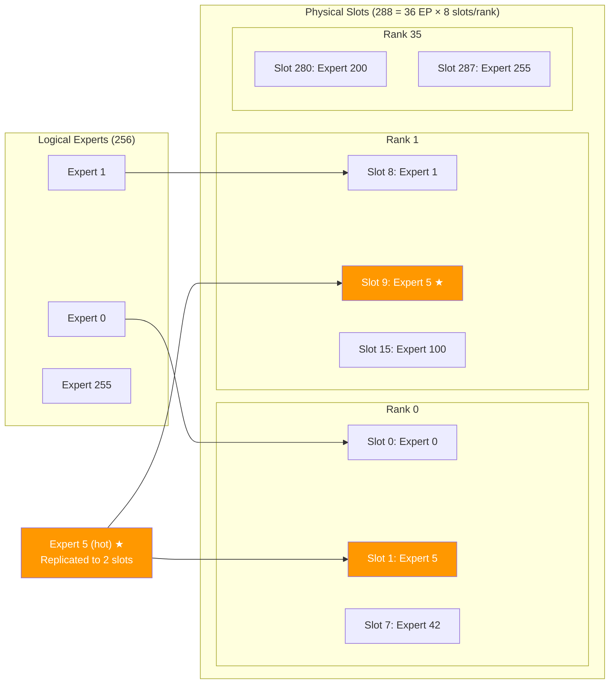
```mermaid
graph LR
    subgraph "Logical Experts (256)"
        E0["Expert 0"]
        E1["Expert 1"]
        E255["Expert 255"]
    end

    subgraph "Physical Slots (288 = 36 EP × 8 slots/rank)"
        subgraph "Rank 0"
            S0["Slot 0: Expert 0"]
            S1["Slot 1: Expert 5"]
            S7["Slot 7: Expert 42"]
        end
        subgraph "Rank 1"
            S8["Slot 8: Expert 1"]
            S9["Slot 9: Expert 5 ★"]
            S15["Slot 15: Expert 100"]
        end
        subgraph "Rank 35"
            S280["Slot 280: Expert 200"]
            S287["Slot 287: Expert 255"]
        end
    end

    E0 --> S0
    E1 --> S8
    E5_note["Expert 5 (hot) ★<br/>Replicated to 2 slots"] --> S1
    E5_note --> S9

    style E5_note fill:#FF9800,color:#fff
    style S1 fill:#FF9800,color:#fff
    style S9 fill:#FF9800,color:#fff
```

**Key components:**

| Component | File | Role |
|:----------|:-----|:-----|
| `MoeLoadBalancer` | `_torch/modules/fused_moe/moe_load_balancer.py:842` | Global load balancer, wraps C++ `_tbr.MoeLoadBalancer` |
| `SingleLayerMoeLoadBalancer` | `moe_load_balancer.py:374` | Per-layer routing and weight management |
| `HostMoeTensorSharer` | `moe_load_balancer.py:127` | POSIX shared memory for all expert weights on host |
| `MoeLoadBalancerConfig` | `llm_args.py:432` | Configuration: `num_slots`, `initial_global_assignments`, `layer_updates_per_iter` |
| `doReplication()` | C++ `moeLoadBalancer.cpp:57` | Greedy priority-queue algorithm for expert replication |
| `doPlacement()` | C++ `moeLoadBalancer.cpp:124` | Assigns replicated experts to physical slots across ranks |

**Online EPLB weight migration flow (per iteration):**

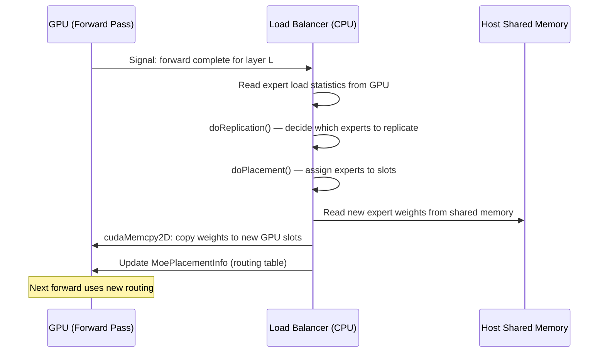
```mermaid
sequenceDiagram
    participant GPU as GPU (Forward Pass)
    participant LB as Load Balancer (CPU)
    participant Host as Host Shared Memory

    GPU->>LB: Signal: forward complete for layer L
    LB->>LB: Read expert load statistics from GPU
    LB->>LB: doReplication() — decide which experts to replicate
    LB->>LB: doPlacement() — assign experts to slots
    LB->>Host: Read new expert weights from shared memory
    LB->>GPU: cudaMemcpy2D: copy weights to new GPU slots
    LB->>GPU: Update MoePlacementInfo (routing table)
    Note over GPU: Next forward uses new routing
```

**Critical property for fault tolerance:** `HostMoeTensorSharer` loads ALL expert weights into POSIX shared memory at startup. Every rank on the same node can access any expert's weights. This means when a rank dies, its experts' weights are already available on host — surviving ranks can load them in ~0.1-0.3ms per expert via gdrcopy.

#### Failure Modes by Backend

| Backend | Failure Behavior | Timeout? | Recovery Path |
|:--------|:----------------|:---------|:-------------|
| NVLinkOneSided | Combine kernel spins on `completion_flags[dead_rank]` | **None** — infinite spin | Requires CUDA kernel modification to add rank masking to symmetric memory completion flag protocol |
| NVLinkTwoSided | FIFO queue polling hangs waiting for dead rank | **None** — infinite spin | Same — these are custom CUDA kernels using symmetric memory P2P writes; modifying their synchronization behavior requires understanding multi-GPU memory ordering and completion flag protocols |
| DeepEP | NVSHMEM operations hang indefinitely | **None** | `mask_buffer_ptr` planned but not public |
| DeepEPLowLatency | Same as DeepEP | **None** | Same; also only supports specific rank counts |
| AllGatherReduceScatter | NCCL timeout (~30min default) | **30 min** (unusable) | Requires process group reconstruction |

#### Current Fault Tolerance Infrastructure

**What exists (from [PR #12718](https://github.com/NVIDIA/TensorRT-LLM/pull/12718), currently in review).** The table below summarizes the primitives; the per-EP-rank extensions built on top of them are specified in [§7](#7-design-failure-detection-and-classification). Note that PR #12718's commits are not yet on the `docs-and-plans` branch HEAD — see [§7 status callout](#overview-7) for the sequencing implication.

| Mechanism | What It Does | Limitation for WideEP |
|:----------|:-------------|:---------------------|
| Three-tier error classification | `immediate_fatal` / `severe` / `transient` | No EP-specific error patterns |
| Token-bucket `ErrorBudget` | Rate-limits error impact; prevents single transient from killing server | All-or-nothing: entire executor is fatal or healthy |
| `charge_budget=False` for request-scoped errors | KV transfer timeouts don't poison server health | Could extend to EP routing failures |
| `_check_mpi_futures()` | Detects individual MPI worker death | Per-worker, not per-EP-rank granularity |
| `_error_monitor_loop()` | 5s background polling for worker crashes | Detects worker death, but triggers full shutdown |
| Fatal shutdown drain | Drains `active_requests`, `waiting_queue`, `executor_request_queue` | Drains everything, not just requests affected by dead rank |

**What does not exist (each representing a distinct design challenge):**

- **Per-EP-rank health tracking** — requires extending the executor's binary health model (healthy/fatal) to a per-rank vector, with independent error budgets per rank
- **Partial failure concept** — today, fatal = shut everything down; WideEP FT needs "fatal for rank 37, but ranks 0-36 and 38-71 are fine" — a fundamentally new failure semantics
- **AlltoAll timeout or abort mechanism** — the GPU kernels spin forever; adding timeout requires either kernel modification (hard, interacts with memory ordering) or host-side watchdog (new thread monitoring GPU-side completion flags)
- **Expert redistribution on topology change** — EPLB's C++ core assumes immutable topology; enabling dynamic reconfiguration requires pausing concurrent threads, reallocating arrays, and migrating weights across 58 MoE layers without corrupting routing state
- **Process group reconstruction** — NCCL/NVSHMEM/MPI all assume collective participation from all original ranks; rebuilding with a dead rank risks deadlocks at every layer of the communication stack
- **Failure broadcast consensus** — surviving ranks must agree on the dead set without the dead rank's participation, a variant of the failure detection problem in asynchronous distributed systems

---

## 3. Competitive Landscape

### Overview

WideEP fault tolerance is an active area of development across all major LLM inference frameworks. As of April 2026, SGLang has shipped a production solution, vLLM has an RFC in progress, and Ray provides orchestration-level group management. TRT-LLM has no EP-level fault tolerance.

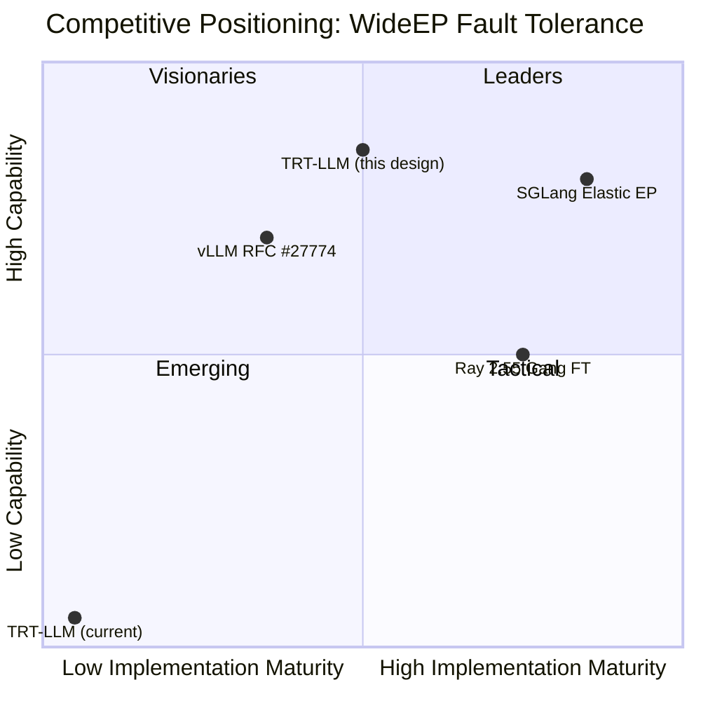
```mermaid
quadrantChart
    title Competitive Positioning: WideEP Fault Tolerance
    x-axis "Low Implementation Maturity" --> "High Implementation Maturity"
    y-axis "Low Capability" --> "High Capability"
    quadrant-1 "Leaders"
    quadrant-2 "Visionaries"
    quadrant-3 "Emerging"
    quadrant-4 "Tactical"
    "SGLang Elastic EP": [0.85, 0.80]
    "vLLM RFC #27774": [0.35, 0.70]
    "Ray 2.55 Gang FT": [0.75, 0.50]
    "TRT-LLM (current)": [0.05, 0.05]
    "TRT-LLM (this design)": [0.50, 0.85]
```

### SGLang: Elastic EP (Shipped, March 2026)

**Reference:** [LMSYS Blog: Elastic EP in SGLang](https://www.lmsys.org/blog/2026-03-25-eep-partial-failure-tolerance/)

SGLang's Elastic EP is the current state-of-the-art for WideEP fault tolerance in production. Key design decisions:

#### Architecture

- **Two-layer approach:** Scheduler layer filters out failed ranks (no new batches routed to them); EP layer handles expert redistribution.
- **No process group reconstruction:** Uses Mooncake EP backend with `activeRanks` masking — the AlltoAll dispatch/combine simply skips dead ranks. This avoids the hardest technical problem entirely.
- **Redundant experts:** Configured via `--ep-num-redundant-experts`. DeepSeek-V3.2 benchmarked with 256 redundant experts across 32 GPUs, tolerating up to 16 simultaneous rank failures.
- **RDMA timeout-based detection:** Mooncake EP detects unresponsive ranks via GPU Direct RDMA timeouts.

#### Performance

| Metric | Value |
|:-------|:------|
| Recovery time | ~6.5s (consistent regardless of # failed ranks) |
| Steady-state overhead | Near-zero (3560 vs 3626 tok/s, ~1.8% overhead) |
| Max tolerated failures | Up to 16/32 ranks (50% of cluster) |
| Process group rebuild | Not required (Mooncake masking) |

#### Key PRs
- `sgl-project/sglang#10423` — Mooncake Backend for EP
- `sgl-project/sglang#10606` — Core Elastic EP + EPLB with faulty rank handling
- `sgl-project/sglang#11657` — Scheduler-layer filtering of failed ranks

#### Strengths and Limitations

| Strengths | Limitations |
|:----------|:-----------|
| Production-ready, shipped | Requires Mooncake EP backend (not portable to other AlltoAll implementations) |
| Near-zero steady-state overhead | No full restoration path (permanently runs at N-k ranks) |
| Tolerates massive failures (50% cluster) | Tied to SGLang's scheduling model |
| Constant recovery time regardless of failure count | No proactive/predictive failure detection |

### vLLM: RFC #27774 — Fault-Tolerant EP (In Progress)

**Reference:** [vLLM RFC #27774](https://github.com/vllm-project/vllm/issues/27774)

vLLM takes a different philosophical approach: "Fault tolerance IS load balancing."

#### Architecture

- **Three-phase recovery:**
  1. **Detection:** Monitor per-expert latency via CUDA events. Flag unhealthy when latency exceeds 3x median (configurable `health_latency_threshold`).
  2. **Penalization:** Unhealthy experts receive 10x weight penalty in EPLB routing, naturally shifting traffic to healthy replicas.
  3. **Recovery:** Elastic scale-down (remove failed rank) then scale-up (add replacement), followed by EPLB rebalancing.

- **Kernel-level masking:** Requires communication backend support for rank masking:

| Backend | Masking Support |
|:--------|:---------------|
| Mooncake EP | `activeRanks` parameter — supported |
| DeepEP | `mask_buffer_ptr` — planned, not public |
| pplx-kernels | No support — will hang |

- **Detection window:** 100-1000 forward passes (`EPLBConfig.window_size`) for statistically reliable failure detection.

#### Status

| Milestone | Status |
|:----------|:-------|
| RFC | Published |
| Milestone 1 (elastic EP basic) | PR #20775 merged |
| Milestone 2 (rebalancing) | PR #26278 in progress |
| Fault-tolerant EP | Not started |

#### Strengths and Limitations

| Strengths | Limitations |
|:----------|:-----------|
| Elegant: FT naturally falls out of EPLB | RFC stage — no production validation |
| Latency-based detection catches degradation before full failure | Requires kernel-level masking (limited backend support) |
| Full restoration via elastic scale-up/down | 100-1000 forward pass detection window may be too slow for sudden failures |

### Ray 2.55: DP Group Fault Tolerance (Shipped)

**Reference:** [Ray 2.55 Fault Tolerance for WideEP](https://blockchain.news/news/ray-255-fault-tolerance-vllm-wideep-deployments)

Ray 2.55 provides orchestration-level fault tolerance that complements engine-level solutions:

- **Atomic DP group management:** Treats each DP (Data Parallel) group as a single unit. If any GPU fails, the entire group is torn down and rebuilt.
- **Gang scheduling:** All GPUs in a group are co-scheduled; partial failure triggers full group recovery.
- **Transparent to inference engine:** No code changes required in vLLM/SGLang/TRT-LLM.

#### Strengths and Limitations

| Strengths | Limitations |
|:----------|:-----------|
| Zero engine changes required | Coarse granularity: entire DP group restarts even for one GPU failure |
| Works with any inference framework | Does not help within a WideEP group (all GPUs in one group) |
| Production-proven (shipped default) | Full restart = minutes of downtime |

**Important limitation for WideEP:** Ray 2.55's DP group fault tolerance operates at the group level, not the rank level. In a WideEP deployment where all 32-72 GPUs form a single EP group, a single GPU failure still requires rebuilding the entire group. This is better than nothing (automated recovery vs. manual restart) but does not provide the sub-second partial-failure tolerance that SGLang's Elastic EP achieves.

### DeepSeek Production

**Reference:** [DeepSeek Open Source Week Day 6](https://github.com/deepseek-ai/open-infra-index/blob/main/202502OpenSourceWeek/day_6_one_more_thing_deepseekV3R1_inference_system_overview.md)

DeepSeek operates the largest known WideEP deployment:

- **Scale:** Peak 278 nodes (2,224 H800 GPUs), 608B input tokens/day
- **Prefill:** EP32 across 4 nodes, 32 redundant routed experts (9 experts per GPU + 1 shared)
- **Decode:** EP144 across 18 nodes, 32 redundant routed experts (2 experts per GPU + 1 shared)
- **Fault tolerance:** Details undisclosed, but the 32 redundant experts suggest a redistribution strategy similar to SGLang's approach

DeepSeek's open-source [DeepEP library](https://github.com/deepseek-ai/DeepEP) does not currently include fault-tolerance masking features in its public API. The `mask_buffer_ptr` parameter referenced in vLLM's RFC appears to be planned/unreleased functionality.

### Feature Comparison Matrix

| Feature | SGLang | vLLM (RFC) | Ray 2.55 | TRT-LLM (Current) | TRT-LLM (This Design) |
|:--------|:-------|:-----------|:---------|:-------------------|:-----------------------|
| Failure detection | RDMA timeout | CUDA event latency | Orchestrator health check | 300s HangDetector | Per-EP-rank health + AlltoAll timeout |
| Rank masking in AlltoAll | Mooncake `activeRanks` | Mooncake/DeepEP masking | N/A | None | NVLink kernel `rank_mask` + DeepEP masking |
| Expert redistribution | EPLB rerouting | EPLB penalization + rebalance | N/A | None | EPLB `reconfigure()` + host weight migration |
| Full restoration | No | Elastic scale-up/down | Full group rebuild | Full restart | Shadow EP rank activation (MX-GMS) |
| Recovery time | ~6.5s | TBD | Minutes | 7-8 min | Target: <10s (Phase 1), <1s (Phase 2 with GMS) |
| Steady-state overhead | ~1.8% | TBD | 0% | N/A | Target: <2% |
| Max tolerated failures | 50% of cluster | TBD | 0 (whole group) | 0 | Proportional to redundant experts |
| Backend dependency | Mooncake EP only | Mooncake/DeepEP | None | N/A | NVLink (primary) + DeepEP (secondary) |

### Technical Depth of Each Approach

The competitive landscape reveals a spectrum of technical depth in how each framework approaches rank masking:

| Framework | Approach | Technical Depth |
|:----------|:---------|:----------------|
| **SGLang** | Calls `activeRanks` parameter on Mooncake EP API | **Integration work** — Mooncake provides the masking primitive; SGLang wires it into its scheduler. The hard kernel-level work is in Mooncake. |
| **vLLM** | Plans to call `mask_buffer_ptr` on DeepEP API | **Integration work** — depends on DeepEP exposing the masking API (not yet public). The hard work is in DeepEP. |
| **TRT-LLM (this design)** | Modifies the actual CUDA AlltoAll kernels that spin on completion flags | **Kernel-level systems work** — we own the kernel code. This means modifying GPU synchronization primitives (completion flag protocols, symmetric memory access patterns) directly. Harder than API integration, but gives complete control on NVIDIA's primary hardware without third-party dependency. |

#### Why kernel-level, and not API-level like SGLang / vLLM?

The backend primitive dictates where the mask has to live.

**TRT-LLM's NVLinkOneSided AlltoAll** (the performance-critical backend for DeepSeek-V3 on GB200/NVL72) is a custom CUDA kernel that spins in SASS code on device memory, using raw PTX `ld.relaxed.sys.u32` / `st.relaxed.sys.u32` against a `completion_flags[kMaxRanks][kMaxRanks]` table in symmetric memory (see `cpp/tensorrt_llm/kernels/communicationKernels/moeAlltoAllKernels.cu:537-584` and `:1190-1217`). There is **no host-side abort hook**. When a peer dies, the peer's flag is never set; the kernel is stuck in a busy-wait with no cooperative yield the host can reach into:

- `cudaStreamDestroy` / `cudaDeviceReset` end the process — they are not in-place recoveries.
- The kernel's own 300s `check_timeout` at `moeAlltoAllKernels.cu:156-161` calls `asm volatile("trap;")`, which corrupts the CUDA context on the surviving rank — also not an in-place recovery.
- NCCL has `NCCL_ASYNC_ERROR_HANDLING` + `ncclCommAbort` for exactly this purpose, but NVLinkOneSided is not NCCL — and a repo-wide search also found **zero uses** of `ncclCommAbort` / `NCCL_ASYNC_ERROR_HANDLING` anywhere in TRT-LLM outside tests, so even the NCCL-based `AllGatherReduceScatter` fallback needs that plumbing built before it can mask failures at the Python layer (see §5 and PR 1a.7 in §9).

**Therefore** the skip decision — "don't poll peer N because N is dead" — must be evaluated *inside* the kernel, gated on a mask buffer the host can update between iteration boundaries. This is a kernel modification, not a Python wrapper change.

**SGLang and vLLM** don't have this problem because:
- **SGLang** uses Mooncake EP, which implements masking *inside* its own kernel but exposes it as an API parameter (`activeRanks`). From SGLang's perspective it's a one-line call. The hard work lives in Mooncake.
- **vLLM**'s in-flight RFC targets DeepEP's planned `mask_buffer_ptr` — again an API parameter, with the kernel-level work hidden inside DeepEP.

In both cases, the kernel-level systems work exists — it just happens in a third-party library the application framework consumes. **TRT-LLM does not have a third-party library to consume for NVLinkOneSided.** We own the kernel, and the masking has to be added there. The upside is full control (no external dependency, no API limitation, ability to evolve completion-flag protocol for future enhancements). The downside is that this is a deeper class of work — multi-GPU memory ordering, PTX memory-consistency guarantees, and race-free mask propagation across surviving ranks — than SGLang or vLLM's equivalent PRs look like.

**The question "why not just switch to NCCL?" has a straightforward answer:** NVLinkOneSided is the *performance* backend for GB200/NVL72. Falling back to NCCL AllGatherReduceScatter sacrifices the perf that motivated WideEP in the first place, and NCCL FT still needs wiring (same tool, different layer) before it is a viable fallback. NVLinkOneSided is the primary MVP target by design.

This distinction matters: SGLang's Elastic EP is the current leader in production readiness, but its fault-tolerance capability is fundamentally bounded by what the Mooncake EP API exposes. TRT-LLM, by owning the NVLink AlltoAll kernels, can implement masking, timeout, and future enhancements (e.g., partial AlltoAll completion, adaptive timeout) at the most fundamental level.

### TRT-LLM's Differentiation Opportunity

While SGLang's Elastic EP is the current leader, TRT-LLM has several architectural advantages for a potentially superior solution:

1. **EPLB maturity:** TRT-LLM's EPLB is more mature than SGLang's, with proven online weight migration, host-side shared memory for all experts, and C++ implementation for low overhead.

2. **NVLink-native rank masking (kernel-level, not API-level):** TRT-LLM's NVLink one-sided/two-sided backends are the primary paths for GB200/NVL72 — NVIDIA's target hardware. Unlike SGLang (which depends on Mooncake) or vLLM (which depends on DeepEP's unreleased `mask_buffer_ptr`), this design modifies the actual CUDA kernels that implement AlltoAll synchronization. This gives complete control over the masking behavior — no third-party dependency, no API limitation, and the ability to implement future optimizations (partial AlltoAll completion, adaptive per-rank timeouts) that external APIs cannot provide.

3. **Full restoration path — a capability no competitor has:** SGLang permanently runs degraded after a failure; vLLM's RFC proposes elastic scale-up/down but has no implementation. This design includes Phase 2 full restoration via MX-GMS shadow EP ranks with sub-second activation. The structural reason WideEP shadow *EP* ranks are architecturally faster than general-purpose shadow workers (the KV-cache allocation bottleneck that gates other failover mechanisms doesn't apply here) is detailed in [§8 Shadow EP Ranks](#shadow-ep-ranks-sub-second-activation).

4. **Error classification foundation:** [PR #12718](https://github.com/NVIDIA/TensorRT-LLM/pull/12718) provides a sophisticated error classification and budget system that enables nuanced failure handling (transient vs. permanent, request-scoped vs. system-scoped) — a granularity that no competitor's fault tolerance system matches.

### Related Research

| Work | Key Contribution | Relevance |
|:-----|:----------------|:----------|
| [AnchorTP](https://arxiv.org/abs/2511.11617) | Resilient Expert TP with unequal-width partitioning | Alternative approach: asymmetric partitioning for graceful degradation |
| [UCCL-EP](https://uccl-project.github.io/posts/uccl-ep/) | CPU-proxy EP communication (vendor-neutral) | Hardware-agnostic EP communication with better observability |
| [MoC-System](https://dl.acm.org/doi/abs/10.1145/3669940.3707418) (ASPLOS 2025) | Efficient fault tolerance for MoE training | Expert placement + recovery strategies (training-focused) |

---

## 4. Design: Two-Phase Recovery

### Design Philosophy

The industry has converged on "redistribute first, restart optionally later" (SGLang, vLLM, DeepSeek all follow this pattern). This design adopts the same principle but adds a deeper architectural insight: **Phase 1 solves the easier problem (rank masking) to buy time for Phase 2 to solve the harder problem (process group reconstruction) without time pressure.** This temporal decoupling — serving in degraded mode while reconstruction happens in the background — is what makes the two-phase approach more than just "do two things sequentially." It transforms process group reconstruction from a blocking, time-critical operation into a background optimization.

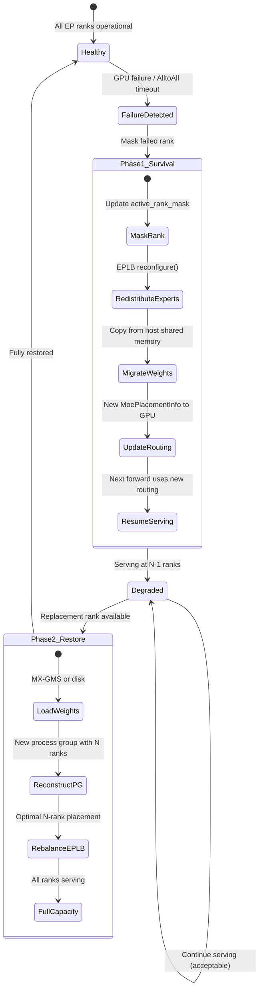
```mermaid
stateDiagram-v2
    [*] --> Healthy: All EP ranks operational

    Healthy --> FailureDetected: GPU failure / AlltoAll timeout
    FailureDetected --> Phase1_Survival: Mask failed rank

    state Phase1_Survival {
        [*] --> MaskRank: Update active_rank_mask
        MaskRank --> RedistributeExperts: EPLB reconfigure()
        RedistributeExperts --> MigrateWeights: Copy from host shared memory
        MigrateWeights --> UpdateRouting: New MoePlacementInfo to GPU
        UpdateRouting --> ResumeServing: Next forward uses new routing
    }

    Phase1_Survival --> Degraded: Serving at N-1 ranks

    Degraded --> Phase2_Restore: Replacement rank available
    Degraded --> Degraded: Continue serving (acceptable)

    state Phase2_Restore {
        [*] --> LoadWeights: MX-GMS or disk
        LoadWeights --> ReconstructPG: New process group with N ranks
        ReconstructPG --> RebalanceEPLB: Optimal N-rank placement
        RebalanceEPLB --> FullCapacity: All ranks serving
    }

    Phase2_Restore --> Healthy: Fully restored
```

> **Note on process group reconstruction:** Phase 1 deliberately avoids process group reconstruction — the hardest technical problem in distributed fault tolerance. Instead, rank masking allows AlltoAll to skip dead ranks within the existing process groups. This is not abandoning process group reconstruction; it is **deferring it to Phase 2**, where it enables full capacity restoration. The key insight is that Phase 1 buys time: the system is serving (degraded) while Phase 2 performs reconstruction in the background. Without Phase 1, reconstruction would have to happen under pressure while the system is completely down.

### Phase 1: Immediate Survival (P0, Target: <10s)

Phase 1 keeps the system serving after a GPU failure. No replacement rank is needed — the surviving N-1 ranks absorb the dead rank's workload.

#### Recovery Sequence

> **The diagram below depicts Phase 1 v1 behavior** — full reconfigure including weight migration (`doReplication()` + `doPlacement()` + `cudaMemcpy2D`). **MVP recovery is simpler:** slot remap only, no H2D copy, no `doReplication`/`doPlacement` re-run. MVP skips from "update active_rank_mask" straight to "update MoePlacementInfo on GPU" — the surviving replicas of every expert are already resident, and the remapped placement table points tokens to them. See §6 "Terminology — weight migration vs slot remapping for MVP" for why this is correct under the MVP precondition (replication factor ≥ 2).

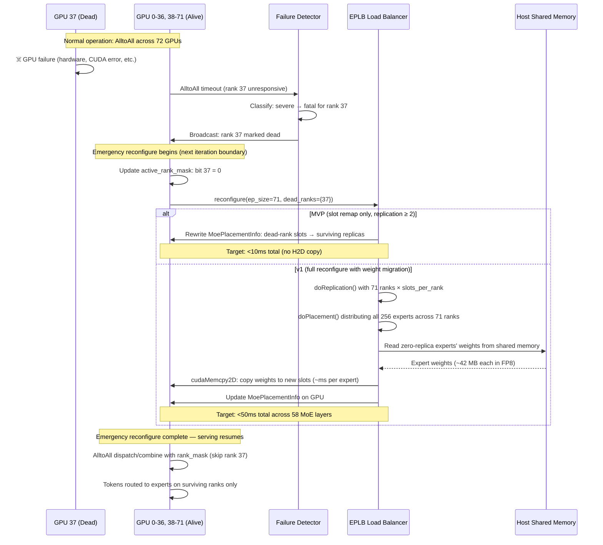
```mermaid
sequenceDiagram
    participant Dead as GPU 37 (Dead)
    participant Alive as GPU 0-36, 38-71 (Alive)
    participant Detector as Failure Detector
    participant EPLB as EPLB Load Balancer
    participant Host as Host Shared Memory

    Note over Dead,Alive: Normal operation: AlltoAll across 72 GPUs

    Dead->>Dead: ☠️ GPU failure (hardware, CUDA error, etc.)

    Alive->>Detector: AlltoAll timeout (rank 37 unresponsive)
    Detector->>Detector: Classify: severe → fatal for rank 37
    Detector->>Alive: Broadcast: rank 37 marked dead

    Note over Alive: Emergency reconfigure begins (next iteration boundary)

    Alive->>Alive: Update active_rank_mask: bit 37 = 0
    Alive->>EPLB: reconfigure(ep_size=71, dead_ranks={37})

    alt MVP (slot remap only, replication ≥ 2)
        EPLB->>Alive: Rewrite MoePlacementInfo: dead-rank slots → surviving replicas
        Note over EPLB,Alive: Target: <10ms total (no H2D copy)
    else v1 (full reconfigure with weight migration)
        EPLB->>EPLB: doReplication() with 71 ranks × slots_per_rank
        EPLB->>EPLB: doPlacement() distributing all 256 experts across 71 ranks
        EPLB->>Host: Read zero-replica experts' weights from shared memory
        Host-->>EPLB: Expert weights (~42 MB each in FP8)
        EPLB->>Alive: cudaMemcpy2D: copy weights to new slots (~ms per expert)
        EPLB->>Alive: Update MoePlacementInfo on GPU
        Note over EPLB,Alive: Target: <50ms total across 58 MoE layers
    end

    Note over Alive: Emergency reconfigure complete — serving resumes

    Alive->>Alive: AlltoAll dispatch/combine with rank_mask (skip rank 37)
    Alive->>Alive: Tokens routed to experts on surviving ranks only
```

#### What Each Surviving Rank Does

When rank 37 fails in a 72-rank EP group:

1. **Detect** (1-5s): AlltoAll timeout fires. The detection mechanism (see [§7](#7-design-failure-detection-and-classification)) classifies this as a rank-level failure, not a system-level failure.

2. **Mask** (<1ms): Set `active_rank_mask[37] = 0`. All communication backends check this mask before dispatching/combining.

3. **Emergency reconfigure** — two variants:
   - **MVP (<10ms, no H2D copy):** `MoeLoadBalancer.reconfigure_mask_only()` rewrites `MoePlacementInfo` so dead-rank slots are unreachable; routing falls through to the surviving replicas that already exist. No weight movement. Requires replication ≥ 2 (the DeepSeek-V3 production default).
   - **v1 (<50ms, includes H2D copy):** Full `MoeLoadBalancer.reconfigure()` — runs `doReplication()` + `doPlacement()` with the dead rank excluded, migrates weights for experts that now have zero replicas (reads from host shared memory, writes to GPU via `cudaMemcpy2D`), updates `MoePlacementInfo`.

4. **Update Routing** (<1ms): New `MoePlacementInfo` is copied to all surviving ranks as part of step 3.

5. **Resume** (next iteration): The next forward pass uses the new routing. AlltoAll dispatch sends tokens only to active ranks. Combine only waits for active ranks.

#### Memory Impact

For DeepSeek-V3 (256 experts, 58 MoE layers) losing 1 rank from EP=72:

| Metric | FP8 | BF16 |
|:-------|:----|:-----|
| Experts per rank (before) | ~3.6 (256/72) | ~3.6 |
| Experts per rank (after) | ~3.6 (256/71) | ~3.6 |
| Extra experts per rank | ~0.05 | ~0.05 |
| Extra memory per rank (all layers) | ~140 MB | ~280 MB |
| Feasibility on 80GB GPU | Comfortable | Comfortable |
| Feasibility on 192GB GB200 | Trivial | Trivial |

With EPLB replication (num_slots > num_experts), the memory impact is slightly higher because more slots need to be filled, but remains well within budget.

#### Serving During Degraded Mode

During degraded operation (N-1 ranks):

- **Throughput:** Reduced proportionally. With 71/72 ranks, expect ~1.4% throughput reduction (approximately linear in expert computation capacity).
- **Latency:** Slightly increased. The surviving ranks handle marginally more expert computation, and EPLB replication quality decreases slightly (fewer slots for hot expert copies).
- **Correctness:** Fully preserved. Every expert is available on at least one surviving rank. The routing table ensures all tokens reach their target experts.

#### Policy for In-Flight Requests at the Moment of Failure

**Requests that were mid-iteration when the rank died fail.** Specifically: the AlltoAll in progress at the moment of failure is abandoned (its kernel was either hung or completed partial work on the surviving ranks), and all requests whose tokens were being processed in that iteration receive an error response. PR #12718's `_handle_errors()` is invoked with `charge_budget=True` for these requests.

Requests waiting in the executor queue but not yet scheduled into the failing iteration are **not** affected — they are picked up in the next iteration with the updated mask and new routing. New requests arriving after the emergency reconfigure are served normally at the reduced capacity.

Recovering the *specific* in-flight requests that failed — for example, replaying them from the last emitted token — is an **orchestration-layer concern**, not a collective-layer one, and is out of scope for this design. In a disaggregated setup, the `trtllm-serve` router can retry a failed generation against a different pool; in an aggregated setup, the client is responsible for resubmission. See [§10 Q2](#q2-what-happens-to-in-flight-requests-during-phase-1-recovery) for the full discussion and alternatives.

### Phase 2: Full Restoration (P1, Target: <1s with GMS, <30s with MX, minutes with disk)

Phase 2 restores the system to full N-rank capacity by bringing up a replacement rank. This is optional — Phase 1 alone is sufficient for continued serving.

#### Recovery Sequence

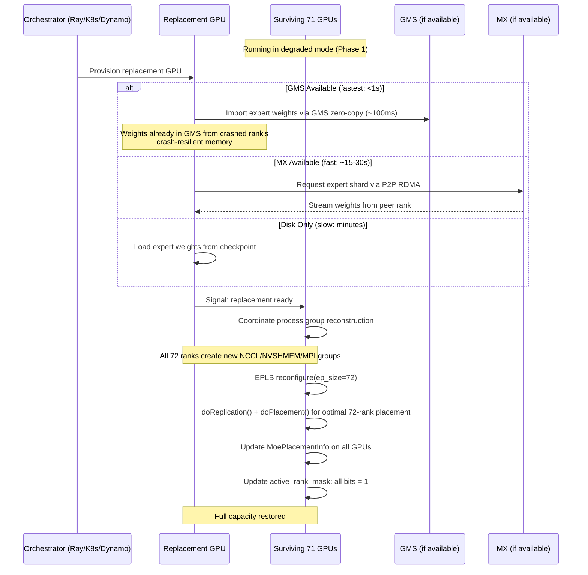
```mermaid
sequenceDiagram
    participant Orch as Orchestrator (Ray/K8s/Dynamo)
    participant New as Replacement GPU
    participant Alive as Surviving 71 GPUs
    participant GMS as GMS (if available)
    participant MX as MX (if available)

    Note over Alive: Running in degraded mode (Phase 1)

    Orch->>New: Provision replacement GPU

    alt GMS Available (fastest: <1s)
        New->>GMS: Import expert weights via GMS zero-copy (~100ms)
        Note over New: Weights already in GMS from crashed rank's<br/>crash-resilient memory
    else MX Available (fast: ~15-30s)
        New->>MX: Request expert shard via P2P RDMA
        MX-->>New: Stream weights from peer rank
    else Disk Only (slow: minutes)
        New->>New: Load expert weights from checkpoint
    end

    New->>Alive: Signal: replacement ready
    Alive->>Alive: Coordinate process group reconstruction
    Note over Alive,New: All 72 ranks create new NCCL/NVSHMEM/MPI groups

    Alive->>Alive: EPLB reconfigure(ep_size=72)
    Alive->>Alive: doReplication() + doPlacement() for optimal 72-rank placement
    Alive->>Alive: Update MoePlacementInfo on all GPUs
    Alive->>Alive: Update active_rank_mask: all bits = 1

    Note over Alive,New: Full capacity restored
```

#### Phase 2 Recovery Time by Weight Loading Method

| Method | Weight Load Time | Total Recovery | Dependency |
|:-------|:----------------|:---------------|:-----------|
| GMS zero-copy import | ~100ms | **<1s** | GMS integration (Phase 2 of MX-GMS design) |
| MX P2P RDMA | ~15-30s (for expert shard) | **~20-35s** | MX integration (Phase 1 of MX-GMS design) |
| Disk (checkpoint) | 1-3 minutes | **2-4 minutes** | No dependency (baseline) |

#### Process Group Reconstruction

This is the most complex part of Phase 2. All communication backends need new groups:

1. **NCCL:** `dist.destroy_process_group()` for old EP groups, then `dist.new_group()` with all N ranks.
2. **NVSHMEM/MnnvlMemory:** Deallocate old symmetric memory, reallocate with N-rank stride.
3. **MPI:** `MPI_Comm_create()` with new group (not `MPI_Comm_split()` which requires all old ranks).
4. **DeepEP buffers:** Destroy old buffers (explicit `destroy()` call), create new ones with N-rank communicator.
5. **NVLink workspaces:** Deallocate old workspace, reallocate for N-rank AlltoAll.

This process is a coordinated operation that requires all N ranks to participate. It's inherently a "stop-the-world" operation for the EP group, but can be made fast (~100ms) if weights are already loaded.

#### Shadow EP Ranks (Future Enhancement with MX-GMS)

With MX-GMS integration, Phase 2 can be pre-staged via a standby GPU that pre-loads expert weights via GMS read-only import and activates (RO → RW) in <1s on failure. The full architectural argument for why shadow *EP* ranks are fundamentally faster than general-purpose shadow workers (KV-cache allocation bottleneck does not apply with `enable_attention_dp=True`) is covered in [§8 Shadow EP Ranks](#shadow-ep-ranks-sub-second-activation). It is the capability that differentiates this design from SGLang's Elastic EP, which has no full restoration path.

### Phase Comparison

| Aspect | Phase 1 (Survive) | Phase 2 (Restore) |
|:-------|:-------------------|:-------------------|
| **Goal** | Keep serving at reduced capacity | Restore full capacity |
| **Trigger** | GPU failure detected | Replacement rank available |
| **Downtime** | <10s (target) | Transparent (Phase 1 covers while Phase 2 runs) |
| **Requires replacement GPU** | No | Yes |
| **Process group change** | No (rank masking) | Yes (reconstruction) |
| **Expert redistribution** | MVP: slot remap to surviving replicas. v1: full reconfigure + weight migration for zero-replica experts | Optimal: full EPLB rebalance for N ranks |
| **External dependency** | None | Orchestrator (Ray/K8s/Dynamo), optionally MX-GMS |
| **Competitive parity** | Matches SGLang Elastic EP | **Exceeds** all competitors (full restoration) |

---

## 5. Design: Rank Masking in Communication

### Overview

Rank masking is the mechanism that allows AlltoAll communication to skip dead ranks without reconstructing process groups. It is the **key enabler for Phase 1 survival** — the difference between "infinite hang" and "continue serving."

*Why this has to happen inside the kernel rather than at the Python/API level (as in SGLang's Mooncake `activeRanks` or vLLM's DeepEP `mask_buffer_ptr`) is covered in [§3 "Why kernel-level, and not API-level"](#why-kernel-level-and-not-api-level-like-sglang--vllm).* This chapter focuses on **what** the mask does and **how** it is wired into each backend's synchronization primitives.

The design adds an `active_rank_mask` (a 64-bit bitmask or equivalent) to each communication backend. Dispatch skips sending tokens to masked ranks; combine skips waiting for responses from masked ranks.

### Active Rank Mask Data Structure

```python
class EPGroupHealth:
    """Tracks health of EP group ranks. Shared across all communication backends."""

    def __init__(self, ep_size: int):
        # Bitmask: bit i = 1 means rank i is active
        # uint64 supports up to 64 ranks; use uint64[2] for NVL72+
        self.active_mask: int = (1 << ep_size) - 1  # all ranks active
        self.ep_size: int = ep_size
        self.active_count: int = ep_size
        self.failed_ranks: set[int] = set()
        self._lock = threading.Lock()  # for thread-safe mask updates

    def mark_failed(self, rank: int) -> None:
        with self._lock:
            self.active_mask &= ~(1 << rank)
            self.active_count -= 1
            self.failed_ranks.add(rank)

    def mark_active(self, rank: int) -> None:
        """Used during Phase 2 restoration."""
        with self._lock:
            self.active_mask |= (1 << rank)
            self.active_count += 1
            self.failed_ranks.discard(rank)

    def is_active(self, rank: int) -> bool:
        return bool(self.active_mask & (1 << rank))
```

This `EPGroupHealth` object is owned by the model engine and passed to all communication backends.

### Per-Backend Rank Masking Design

#### NVLink One-Sided (Primary Target)

**Kernel (CUDA):** `cpp/tensorrt_llm/kernels/communicationKernels/moeAlltoAllKernels.cu` and `.h`
**Host wrapper / TorchOp:** `cpp/tensorrt_llm/thop/moeAlltoAllOp.cpp`
**Python backend:** `tensorrt_llm/_torch/modules/fused_moe/communication/nvlink_one_sided.py`
**Symmetric memory allocator:** `tensorrt_llm/_mnnvl_utils.py` (`MnnvlMemory`, MNNVL fabric pages via `cuMemCreate(... CU_MEM_HANDLE_TYPE_FABRIC ...)`)

The NVLink one-sided backend uses symmetric memory for direct peer GPU writes. The dispatch kernel writes tokens into peer ranks' pre-allocated workspace; the combine kernel reads results from peer ranks' workspace by polling `completion_flags`.

**Current kernel behavior** (verified against actual source — dispatch `moeAlltoAllKernels.cu:537-584`, combine `:1190-1217`):

```cpp
// Dispatch release + wait — write to ALL ranks (including self)
asm volatile("fence.release.sys;");
for (int target_rank = lane_id; target_rank < ep_size; target_rank += warpSize) {
    uint32_t* flag_addr = &ptrs.completion_flags[target_rank][rank_id];
    asm volatile("st.relaxed.sys.u32 [%0], %1;" ::"l"(flag_addr), "r"(expected_value));
}
for (int peer_rank = lane_id; peer_rank < ep_size; peer_rank += warpSize) {
    auto s = clock64();
    do {
        uint32_t* flag_ptr = &ptrs.completion_flags[rank_id][peer_rank];
        uint32_t flag_value;
        asm volatile("ld.relaxed.sys.u32 %0, [%1];" : "=r"(flag_value) : "l"(flag_ptr));
        flag_set = flag_value == expected_value;
    } while (!flag_set && !check_timeout(s));   // 300s panic-trap; see below
    if (!flag_set) { asm volatile("trap;"); return; }
}
```

**Key facts established by source review:**
- Synchronization uses raw inline PTX `ld.relaxed.sys.u32` / `st.relaxed.sys.u32` bracketed by `fence.release.sys` / `fence.acquire.sys` — *not* `volatile`, *not* `cuda::atomic`.
- The completion-flag table is `uint32_t completion_flags[kMaxRanks][kMaxRanks]`, indexed by `(owner_rank, peer_rank)`. **`kMaxRanks = 64` is a `constexpr`** in `moeAlltoAllKernels.h:31`. **For NVL72 (72 GPUs) this MUST be bumped to 80 or 128 (compile-time).** Forgetting this is a silent overflow.
- A 300-second in-kernel timeout already exists (`moeAlltoAllKernels.cu:156-161`): `((clock64() - s) > 300ll * 2000ll * 1000ll * 1000ll)`. On expiry the kernel runs `asm volatile("trap;")`, which **aborts the kernel and corrupts the CUDA context** — process restart required, NOT recoverable in-place. PR #12718's `"immediate_fatal"` classification (regex match on `cudaErrorIllegalAddress` / `cudaErrorLaunchFailure`) is what surfaces upstream.
- Combine has matching loops at `:1190-1217`. The combine accumulator already handles a `dst_idx = -1` per-k-slot skip (`:725-729`, `acc[k].fill(0.0f)` at `:727`). **This is the natural template for masking — the routing pass can produce `dst_idx = -1` for masked ranks and combine handles it for free.**
- No "skip self" or any per-peer skip exists in the current loops — the routing logic (`compute_target_rank_id`) does flat modular partitioning without any rank-alive check.

**Proposed modification:**

Add `uint64_t active_rank_mask_lo, active_rank_mask_hi` to both `DispatchKernelPointers` and `CombineKernelPointers` (sized for up to 128 ranks). Guard **both** the release-write loop *and* the polling loop in dispatch (`:546-555` and `:558-584`) and the matching combine loops (`:1190-1217`):

```cpp
// Dispatch release: write only to ACTIVE peer flag slots
for (int target_rank = lane_id; target_rank < ep_size; target_rank += warpSize) {
    if (!(active_rank_mask & (1ULL << target_rank))) continue;   // skip dead
    uint32_t* flag_addr = &ptrs.completion_flags[target_rank][rank_id];
    asm volatile("st.relaxed.sys.u32 [%0], %1;" ::"l"(flag_addr), "r"(expected_value));
}
// Dispatch wait: poll only ACTIVE peer flag slots
for (int peer_rank = lane_id; peer_rank < ep_size; peer_rank += warpSize) {
    if (!(active_rank_mask & (1ULL << peer_rank))) continue;     // skip dead
    /* existing spin */
}
```

**Why both sides of the loop must be masked:** A dead peer's `completion_flags[Y][X]` slot will never be re-written. Surviving rank Y polling that slot with `ld.relaxed.sys.u32` will spin until the kernel-side 300s `trap;` fires — the same failure mode we are trying to avoid. The mask must short-circuit the *poll*, not just the *write*.

**Implementation notes:**
- `active_rank_mask` is passed as kernel struct fields (`uint64_t lo, hi`) sized for up to 128 ranks (covers NVL72 + headroom).
- The mask is set on the host side before kernel launch. It does not change mid-kernel.
- Symmetric memory for the dead rank's workspace remains allocated but unused. It can be reclaimed in Phase 2.
- `completion_flags` for the dead rank are never written/read, avoiding any race condition.
- Routing pass: extend `compute_target_rank_id` to emit `dst_idx = -1` for tokens that would land on a masked rank — combine's existing `acc[k].fill(0.0f)` (`:727`) skips them with no kernel change.

**Performance impact:** The conditional branch is a single bit-test per rank, executed in the outer loop. For 72 ranks, this adds 72 bit-test instructions — negligible compared to the memory operations.

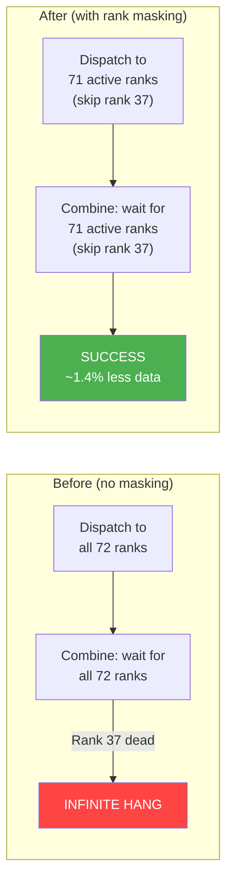
```mermaid
graph LR
    subgraph "Before (no masking)"
        D1["Dispatch to<br/>all 72 ranks"] --> C1["Combine: wait for<br/>all 72 ranks"]
        C1 -->|"Rank 37 dead"| HANG["INFINITE HANG"]
    end

    subgraph "After (with rank masking)"
        D2["Dispatch to<br/>71 active ranks<br/>(skip rank 37)"] --> C2["Combine: wait for<br/>71 active ranks<br/>(skip rank 37)"]
        C2 --> OK["SUCCESS<br/>~1.4% less data"]
    end

    style HANG fill:#ff4444,color:#fff
    style OK fill:#4CAF50,color:#fff
```

#### NVLink Two-Sided

**Kernel:** `cpp/tensorrt_llm/kernels/fusedMoeCommKernels.cu` (1525 lines)
**Host op:** `cpp/tensorrt_llm/thop/moeCommOp.cpp`
**Python:** `tensorrt_llm/_torch/modules/fused_moe/communication/nvlink_two_sided.py` (+ `nvlink_two_sided_flashinfer.py` variant that shells out to `flashinfer.comm.trtllm_alltoall.MnnvlMoe`)

**Sync primitive difference (relevant for masking):** Two-sided uses a FIFO handshake with `head` / `tail` fields in peer symmetric memory rather than per-peer completion flags. From `fusedMoeCommKernels.cu:769-792`, `waitEntryWritable()` spins on `mTail + kFifoDepth <= mHead`, with sender writing `head` and receiver writing `tail` back through `mSenderSideFifoInfo->tail`. Also unbounded — no `check_timeout` in this kernel today. A masked rank's FIFO never advances, so the same poll-side-must-skip rule applies.

Add `active_rank_mask` to each C++ op (`mnnvl_moe_alltoallv_prepare_without_allgather`, `mnnvl_moe_alltoallv`, `mnnvl_moe_alltoallv_combine`):

- `prepare`: Exclude dead ranks from metadata exchange and EPLB statistics gathering.
- `dispatch`: Skip FIFO queue writes to dead ranks.
- `combine`: Skip FIFO queue reads from dead ranks (the spin on `mSenderSideFifoInfo->tail` is the dangerous one).

#### DeepEP

**File:** `tensorrt_llm/_torch/modules/fused_moe/communication/deep_ep.py`

DeepEP is a third-party library from DeepSeek. Two approaches:

1. **Preferred:** Use `mask_buffer_ptr` when available in the public DeepEP API. vLLM's RFC #27774 references this parameter, indicating it's planned. Monitor DeepEP releases and enable rank masking via this API when available.

2. **Fallback:** If `mask_buffer_ptr` is not available, detect DeepEP timeout (if added) and fall back to the AllGatherReduceScatter backend with a reconstructed process group.

**Important constraint:** DeepEP only supports specific rank counts ({2,4,8} intranode, {16,32,...,128} internode). After losing a rank, EP=31 from EP=32 is not supported. Options:
- Fall back to NVLink backend (if available on the hardware)
- Fall back to AllGatherReduceScatter
- Treat the dead rank's slot as "permanently empty" in DeepEP (tokens destined for it are dropped, then handled by EPLB rerouting)

#### DeepEP Low-Latency

**File:** `tensorrt_llm/_torch/modules/fused_moe/communication/deep_ep_low_latency.py`

Same constraints and approach as DeepEP. Additionally restricted to specific hidden_size values. The low-latency path is most likely to require fallback to a different backend on rank failure.

#### AllGatherReduceScatter (Fallback)

**File:** `tensorrt_llm/_torch/modules/fused_moe/communication/allgather_reducescatter.py` — pure wrapper over `tensorrt_llm._torch.distributed.allgather` / `reducescatter`.

This backend uses standard NCCL collectives. NCCL does not support rank masking — all ranks in the process group must participate. Two options:

1. **Process group reconstruction:** Create a new NCCL group with N-1 ranks. This is the "hard path" but is unavoidable for this backend.
2. **Backend switch:** On rank failure, switch from AllGatherReduceScatter to a NVLink backend (if available) that supports rank masking. The `CommunicationFactory` already supports runtime backend selection.

Since AllGatherReduceScatter is the lowest-priority fallback backend, option 2 is preferred where possible.

> **Caveat — NCCL abort/timeout is NOT wired in TRT-LLM today.** A repo-wide search found **zero** uses of `ncclCommAbort`, `NCCL_ASYNC_ERROR_HANDLING`, `ncclCommFinalize`, or `ncclGetLastError` outside test files. The only NCCL integration is via `torch.classes.trtllm.NcclCommunicatorOp` (P2P send/recv with no error hook). A dead NCCL collective on this fallback path will hang on torch's default behavior — not on a TRT-LLM-configured timeout. **Implication:** before claiming "AllGatherReduceScatter has timeout protection", we must explicitly wire `NCCL_ASYNC_ERROR_HANDLING=1` + watchdog + `ncclCommAbort` in the TRT-LLM NCCL wrapper. This is a v1 prerequisite for backend-switch fallback (PR 1a.7 in [§9](#9-implementation-plan)).

### Communication Factory Changes

The `CommunicationFactory` needs a new capability: **runtime backend degradation.**

```python
class CommunicationFactory:
    @staticmethod
    def create_strategy(..., ep_group_health: EPGroupHealth) -> Communication:
        """Extended to accept EP group health for rank masking."""
        # Existing priority-based selection, but now also checks masking support
        ...

    @staticmethod
    def handle_rank_failure(
        current_strategy: Communication,
        ep_group_health: EPGroupHealth,
        failed_rank: int,
    ) -> Communication:
        """Called when a rank failure is detected.

        Returns either the same strategy (if it supports rank masking)
        or a fallback strategy that can operate with N-1 ranks.
        """
        if current_strategy.supports_rank_masking():
            current_strategy.update_rank_mask(ep_group_health)
            return current_strategy
        else:
            # Fall back to a strategy that supports masking
            return CommunicationFactory.create_fallback_strategy(
                ep_group_health, exclude_ranks={failed_rank}
            )
```

### Timeout / Detection Interaction with the Mask

Rank masking alone is not sufficient — we also need a way to **detect** that a rank has failed and then propagate the mask update. The detection mechanism (host-side watchdog over host-visible completion flags, per-rank latency monitoring, MPI worker-death notification) lives entirely in [§7 Failure Detection](#7-design-failure-detection-and-classification). This chapter only needs to state the contract the kernel requires.

**What the kernel requires from the detection layer:**

- The mask must be **set on the host before kernel launch**; it does not change mid-kernel. This is consistent with the NVLinkOneSided dispatch/combine ops being launched once per iteration, which gives the host a natural point to refresh the mask.
- When the host concludes a rank is dead, the mask update must be visible to *all* surviving ranks before any of them enters the next AlltoAll. That consistency requirement is discussed in the "Consistency Guarantees" section at the end of this chapter and resolved by the mask-propagation protocol in [§7](#failure-broadcast-protocol).

**What the kernel contributes back:**

- The existing `completion_flags` array is already allocated in host-visible symmetric memory, which means the host-side watchdog in §7 can poll it directly to detect which peers have or have not signaled. No additional kernel-side plumbing is required for Layer 1 detection.
- The kernel's existing 300s `check_timeout` → `asm volatile("trap;")` behavior at `moeAlltoAllKernels.cu:156-161` acts as a backstop. It **corrupts the CUDA context** on expiry and is not recovery — it is the outer failsafe that prevents an undetected hang from running indefinitely. PR 1a.8 in [§9](#9-implementation-plan) optionally tightens this value AND switches its action from `trap;` to writing a host-visible flag — a v1 enhancement that makes the kernel cooperate with the host watchdog instead of relying on process death.

The design goal is that in steady state the host watchdog fires long before the 300s `check_timeout`, so `trap;` is never reached under normal failure handling.

### Consistency Guarantees

When a rank is masked mid-serving, we must ensure consistency:

1. **All surviving ranks see the same mask at the same time.** The mask update is a coordinated operation: the failure detector broadcasts the mask update, and all ranks apply it before the next forward pass. This is enforced by the model engine's iteration barrier (all ranks synchronize between forward passes).

2. **In-flight AlltoAll is abandoned.** If a rank dies mid-AlltoAll, the current AlltoAll is lost. All requests in the current batch are failed (using PR #12718's `_handle_errors()` with `charge_budget=True`). The next iteration starts with the updated mask.

3. **No partial results.** A token either successfully completes its full dispatch-compute-combine cycle, or it fails entirely. There is no "partial expert computation" state.

4. **EPLB routing table and rank mask are updated atomically.** The EPLB reconfiguration and mask update happen together between iterations, so the routing table never references a masked rank.

---

## 6. Design: EPLB Topology Adaptation

### Overview

When a rank fails, EPLB must redistribute that rank's experts across the surviving ranks. This chapter describes the changes needed in the C++ `MoeLoadBalancer` and the Python `MoeLoadBalancer` wrapper to support dynamic topology changes.

The good news: EPLB already performs live expert weight migration at runtime (online EPLB). The new capability is handling a **topology change** (rank count changes) rather than a **load balance change** (expert assignment changes within fixed topology). This distinction matters: EPLB was designed as a static-topology system — `MoeLoadBalanceMetaInfo` stores `epSize` and `epRank` as **immutable by convention** (plain `int` members in `cpp/tensorrt_llm/runtime/moeLoadBalancer/moeLoadBalancer.h:331-332`; not `const`, not enforced — but every reader assumes they don't change), and the entire data structure hierarchy (CPU placement arrays, GPU routing tables, shared memory layout, per-layer state machines) assumes the rank count never changes. Extending it for dynamic topology changes while the system is actively serving — with concurrent worker and compute threads performing weight migrations, per-layer statistics collection, and routing table updates — is a qualitatively different design problem from what EPLB was built for.

> **Source-verified facts shaping this design:**
>
> - `MoeLoadBalanceMetaInfo` (`cpp/tensorrt_llm/kernels/moeLoadBalance/moeLoadBalanceCommon.h:40-52`) has fields `expertCount, topK, epRank, epSize, slotCountPerRank` — no enable/disable bit, no rank-mask field. Mask plumbing is net-new.
> - CPU placement: `MoePlacementCpuInfo` (`moeLoadBalancer.h:56-70`) stores `rankExpertIds` as `std::vector<std::vector<int>>` (`[epSize][slotCountPerRank]`) plus `oldRankExpertIds` for single-step rollback (no longer history).
> - GPU placement (`moeLoadBalanceCommon.h:76-90`): three flat int arrays — `expertReplicaCount[expertCount]`, `expertReplicaStartOffset[expertCount]`, `globalSlotIds[epSize * slotCountPerRank]`.
> - Propagation CPU→GPU (`moeLoadBalancer.cpp:523-542`): in-place `cudaMemcpyAsync` on a background stream — **no double buffer**, no epoch counter. Per-layer synchronization uses `MoeLoadBalanceSingleLayerSignal::stepAndOwner` (a 64-bit step+owner word at `moeLoadBalanceCommon.h:25-37`), but that's a producer/consumer ownership token, not a placement version.
>
> Implication for `reconfigure_mask_only`: there's no built-in "stage and atomically swap" primitive. Either the mask change must be small enough to land within one in-place memcpy at iteration boundary (MVP plan), or we add an explicit double-buffer (deferred to v1, PR 1b.4–1b.5).

### Current EPLB Data Flow

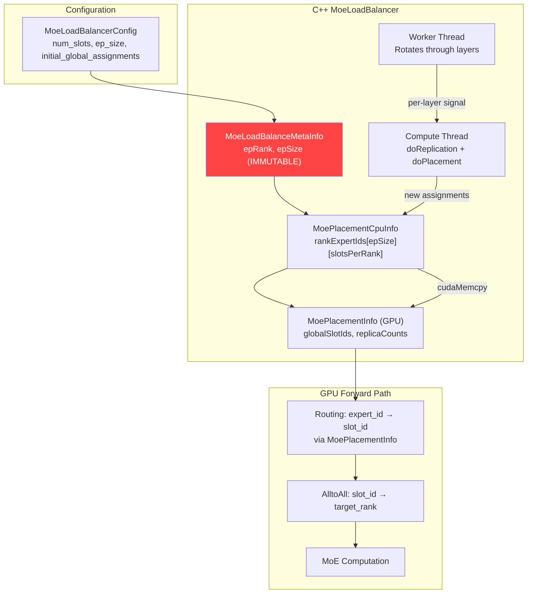
```mermaid
graph TD
    subgraph "Configuration"
        Config["MoeLoadBalancerConfig<br/>num_slots, ep_size, initial_global_assignments"]
    end

    subgraph "C++ MoeLoadBalancer"
        Meta["MoeLoadBalanceMetaInfo<br/>epRank, epSize (IMMUTABLE)"]
        CPU["MoePlacementCpuInfo<br/>rankExpertIds[epSize][slotsPerRank]"]
        GPU_PI["MoePlacementInfo (GPU)<br/>globalSlotIds, replicaCounts"]
        Worker["Worker Thread<br/>Rotates through layers"]
        Compute["Compute Thread<br/>doReplication + doPlacement"]
    end

    subgraph "GPU Forward Path"
        Route["Routing: expert_id → slot_id<br/>via MoePlacementInfo"]
        A2A["AlltoAll: slot_id → target_rank"]
        MoE["MoE Computation"]
    end

    Config --> Meta
    Meta --> CPU
    CPU --> GPU_PI
    Worker -->|"per-layer signal"| Compute
    Compute -->|"new assignments"| CPU
    CPU -->|"cudaMemcpy"| GPU_PI
    GPU_PI --> Route
    Route --> A2A
    A2A --> MoE

    style Meta fill:#ff4444,color:#fff
```

**The problem:** `MoeLoadBalanceMetaInfo` stores `epRank` and `epSize` as immutable constructor arguments. `MoePlacementCpuInfo.rankExpertIds` is sized `[epSize][slotsPerRank]` at creation. When a rank dies, these data structures cannot represent the new topology.

### Proposed: `MoeLoadBalancer.reconfigure()`

#### New C++ API

```cpp
class MoeLoadBalancer {
public:
    // Existing constructor
    MoeLoadBalancer(MoeLoadBalanceMetaInfo const& metaInfo, ...);

    // NEW: Reconfigure for topology change
    void reconfigure(ReconfigureParams const& params);

    struct ReconfigureParams {
        int newEpSize;                    // N-1 after rank failure
        int newEpRank;                    // may change if dead rank < my rank
        std::set<int> deadRanks;          // ranks to exclude
        int newSlotsPerRank;              // may increase to absorb dead rank's slots
        bool emergencyMode;               // true = minimal redistribution, false = full optimize
    };
};
```

#### Reconfiguration Flow

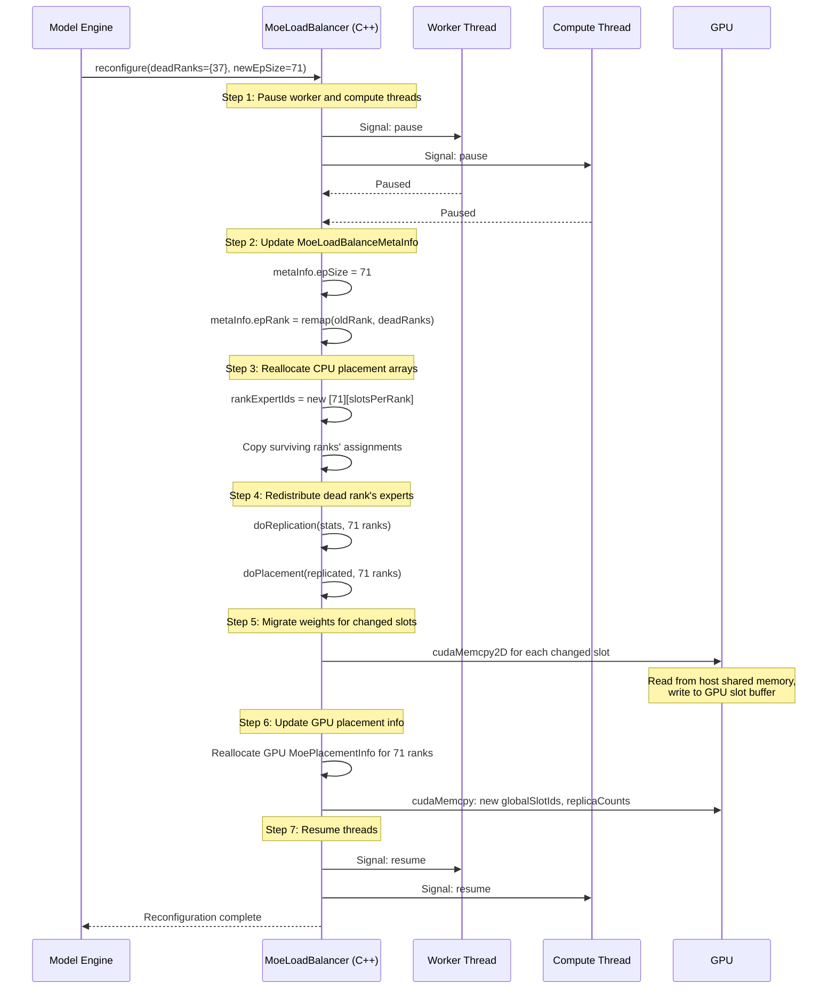
```mermaid
sequenceDiagram
    participant ME as Model Engine
    participant LB as MoeLoadBalancer (C++)
    participant WT as Worker Thread
    participant CT as Compute Thread
    participant GPU as GPU

    ME->>LB: reconfigure(deadRanks={37}, newEpSize=71)

    Note over LB: Step 1: Pause worker and compute threads
    LB->>WT: Signal: pause
    LB->>CT: Signal: pause
    WT-->>LB: Paused
    CT-->>LB: Paused

    Note over LB: Step 2: Update MoeLoadBalanceMetaInfo
    LB->>LB: metaInfo.epSize = 71
    LB->>LB: metaInfo.epRank = remap(oldRank, deadRanks)

    Note over LB: Step 3: Reallocate CPU placement arrays
    LB->>LB: rankExpertIds = new [71][slotsPerRank]
    LB->>LB: Copy surviving ranks' assignments

    Note over LB: Step 4: Redistribute dead rank's experts
    LB->>LB: doReplication(stats, 71 ranks)
    LB->>LB: doPlacement(replicated, 71 ranks)

    Note over LB: Step 5: Migrate weights for changed slots
    LB->>GPU: cudaMemcpy2D for each changed slot
    Note over GPU: Read from host shared memory,<br/>write to GPU slot buffer

    Note over LB: Step 6: Update GPU placement info
    LB->>LB: Reallocate GPU MoePlacementInfo for 71 ranks
    LB->>GPU: cudaMemcpy: new globalSlotIds, replicaCounts

    Note over LB: Step 7: Resume threads
    LB->>WT: Signal: resume
    LB->>CT: Signal: resume

    LB-->>ME: Reconfiguration complete
```

#### Emergency vs. Full Reconfiguration

| Mode | When Used | Behavior |
|:-----|:----------|:---------|
| **Emergency** (`emergencyMode=true`) | Phase 1: immediate survival | Minimal redistribution: only reassign experts that were exclusively on the dead rank. Keep all other assignments unchanged. Fastest possible recovery. |
| **Full** (`emergencyMode=false`) | Phase 2: restoration or periodic rebalance | Full `doReplication()` + `doPlacement()` for optimal distribution across all ranks. May move experts between surviving ranks for better balance. |

Emergency mode is critical for minimizing Phase 1 recovery time. Only experts that have **zero remaining replicas** after the rank failure need immediate placement. Experts with at least one surviving replica continue to work — tokens are routed to the surviving replica.

#### Expert Redistribution Logic

When rank R dies with `slotsPerRank` slots:

```
For each layer L:
    dead_experts = set of expert IDs assigned to rank R's slots in layer L
    For each expert E in dead_experts:
        surviving_replicas = count of E's replicas on ranks != R
        if surviving_replicas == 0:
            # CRITICAL: E has no surviving replica — must place immediately
            target_rank = rank with most free slots (or least loaded)
            Assign E to a slot on target_rank
            Copy E's weights from host shared memory to target_rank's GPU
        else:
            # E still has replicas elsewhere — routing will find them
            # In emergency mode: do nothing (rely on existing replicas)
            # In full mode: may re-replicate for better balance
```

#### Slot Count Adjustment

When a rank dies, its `slotsPerRank` slots are lost. The total slot count decreases from `ep_size * slotsPerRank` to `(ep_size - 1) * slotsPerRank`. Options:

1. **Keep per-rank slot count unchanged (recommended for Phase 1):** Each surviving rank keeps its original `slotsPerRank`. Total slots decrease. Some experts may lose replicas but all experts remain reachable via at least one slot.

2. **Increase per-rank slot count (for Phase 2 full rebalance):** Allocate additional GPU memory for extra slots on surviving ranks to maintain the same total slot count. Requires dynamic GPU memory allocation.

Option 1 is simpler and sufficient for Phase 1. The slight reduction in replication capacity is acceptable for degraded-mode operation.

### GPU-Side Routing Table Update

The routing table (`MoePlacementInfo`) maps `(expert_id, replica_index)` → `global_slot_id` → `(rank, local_slot)`. After reconfiguration:

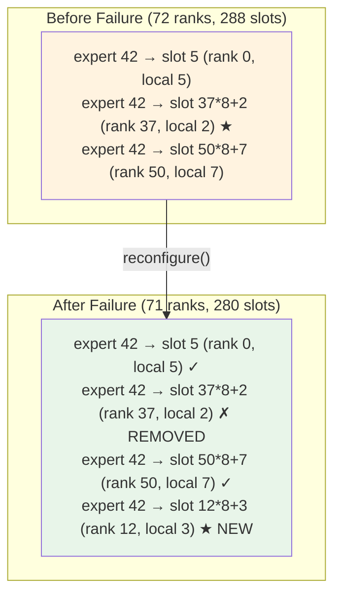
```mermaid
graph TD
    subgraph "Before Failure (72 ranks, 288 slots)"
        R_before["expert 42 → slot 5 (rank 0, local 5)<br/>expert 42 → slot 37*8+2 (rank 37, local 2) ★<br/>expert 42 → slot 50*8+7 (rank 50, local 7)"]
    end

    subgraph "After Failure (71 ranks, 280 slots)"
        R_after["expert 42 → slot 5 (rank 0, local 5) ✓<br/>expert 42 → slot 37*8+2 (rank 37, local 2) ✗ REMOVED<br/>expert 42 → slot 50*8+7 (rank 50, local 7) ✓<br/>expert 42 → slot 12*8+3 (rank 12, local 3) ★ NEW"]
    end

    R_before -->|"reconfigure()"| R_after

    style R_before fill:#fff3e0
    style R_after fill:#e8f5e9
```

The routing kernel (`torch.ops.trtllm.moe_load_balance_routing`) uses the `globalSlotIds` array from `MoePlacementInfo`. After reconfiguration, this array is updated to exclude any slots on the dead rank and include newly assigned slots on surviving ranks. The kernel itself needs no modification — it simply reads the updated table.

### Host Shared Memory Interaction

`HostMoeTensorSharer` (`tensorrt_llm/_torch/modules/fused_moe/moe_load_balancer.py:127-340`) stores expert weights in POSIX shared memory. The relevant detail for FT is **how** it is shared: each local rank publishes one shm segment named `f"{base}_l{layer_id}_lr{local_rank}_all"` containing **all of its assigned experts' weights**, packed sequentially per weight name. All ranks on the **same node** then attach to all peer segments via `multiprocessing.shared_memory.SharedMemory(name=...)`. The shared subcomm is built via `global_mpi_comm.Split_type(MPI.COMM_TYPE_SHARED)` (`moe_load_balancer.py:894-902`), so the sharing scope is **node-local only**.

After a rank failure:

- **Same node, dead rank:** Its `_lr{local_rank}_all` segment survives (POSIX shm persists until explicit unlink). Other local-node ranks already have it attached and can keep reading.
- **Different node, dead rank:** Irrelevant — each node has a full replica of all 256 experts' weights distributed across its local ranks. No cross-node transfer is needed for a within-node reassignment.
- **Cross-node concern:** A failure that takes down a *whole node* loses all its unique expert replicas. With replication factor ≥ 2 (DeepSeek production), every other node still has the full set, so degraded-mode survival is unaffected. With replication factor = 1, a node-loss event is unrecoverable in Phase 1.

**Terminology — "weight migration" vs "slot remapping" for MVP:** When a single rank dies and replication factor ≥ 2, MVP recovery is **not** weight migration in the classic sense. There is no H2D copy required at the moment of failure: every surviving rank already has every expert's weights mapped on host. The MVP `reconfigure_mask_only` operation is **expert-slot remapping** — mark the dead rank's slots as unreachable in `MoePlacementInfo` and let routing pick the surviving replica's slot. The next H2D `cudaMemcpyAsync` only happens on the routine EPLB cycle when load actually rebalances. This is why MVP can target <10ms reconfigure: it's a placement-pointer rewrite, not a weight move. Full-blown weight migration across 58 layers (PR 1b.6 in [§9](#9-implementation-plan)) is the v1 path that handles the "zero surviving replica" case.

### Multi-Layer Coordination

DeepSeek-V3 has 58 MoE layers. Reconfiguration must update all layers:

- **MVP slot remap (`reconfigure_mask_only`, no weight migration):** Rewrite `MoePlacementInfo` for all 58 layers in a single pass. The worker thread and compute thread are paused; the main thread issues in-place `cudaMemcpyAsync` of the updated `globalSlotIds` array per layer. Target: **<10ms end-to-end** for all 58 layers.

- **v1 full reconfigure (zero-replica case, with weight migration):** Runs `doReplication` + `doPlacement` + `cudaMemcpy2D` for experts that now have zero surviving replicas. With ~0.1-0.3ms per expert weight copy and at most ~1-2 experts per layer that need new placement, total: **<50ms end-to-end** for all 58 layers.

- **Background periodic rebalance (existing online EPLB):** Can be spread across iterations with `layer_updates_per_iter` layers updated per forward pass. This avoids a latency spike and is unrelated to failure recovery.

### Changes Summary

| Component | Change | Complexity |
|:----------|:-------|:-----------|
| `MoeLoadBalanceMetaInfo` (C++) | Add `rankMask` field for MVP (no epSize/epRank change). Make `epSize`/`epRank` mutable for v1; full audit of every reader. | MVP: Low / v1: Medium |
| `MoePlacementCpuInfo` (C++) | MVP: mark dead-rank slots as unreachable. v1: dynamic reallocation of `rankExpertIds`. | MVP: Low / v1: Medium |
| `MoePlacementInfo` (GPU) | MVP: in-place memcpy of updated `globalSlotIds`. v1: reallocate for new ep_size. | MVP: Low / v1: Low |
| `doReplication()` / `doPlacement()` (C++) | MVP: skipped (use existing assignments minus dead-rank slots). v1: already parameterized by `metaInfo` — no change needed. | None |
| `MoeLoadBalancer.reconfigure_mask_only()` (C++) | **NEW (MVP)**: pause threads, mask dead-rank slots in GPU placement, resume. Target <10ms. | Medium |
| `MoeLoadBalancer.reconfigure()` (C++) | **NEW (v1)**: full topology change, pause threads, redistribute, resume. | High |
| `MoeLoadBalancer` (Python) | New mask-only + full reconfigure wrappers; coordinate with model engine | Medium |
| `HostMoeTensorSharer` | No change — node-local POSIX shm already has all in-node experts' weights | None |
| Weight migration (H2D) | MVP: not needed for masked-rank survival (slot remap suffices when replication ≥ 2). v1: reuse existing `HostMemoryMoeWeightUpdater::updateWeights` path for zero-replica experts. | MVP: None / v1: Medium |

---

## 7. Design: Failure Detection and Classification

<a id="overview-7"></a>
### Overview

Failure detection is the entry point for the entire fault tolerance system. The design extends [PR #12718](https://github.com/NVIDIA/TensorRT-LLM/pull/12718)'s error classification infrastructure from executor-level health (binary: healthy/fatal) to **per-EP-rank health** (each rank has independent health status).

> **Status of PR #12718 (verified 2026-04-21):** Not yet on the `docs-and-plans` working tree HEAD. The relevant commits exist on other branches (`f32efd01e5`, `e3f84ceb02`, `1128c0ff54`, `4aab3c0afc`) and introduce `tensorrt_llm/_torch/pyexecutor/error_classification.py` (`ErrorBudget` dataclass + `classify_error()` returning string literals). **Sequencing:** PRs 1c.1–1c.4 in [§9](#9-implementation-plan) require these commits to land or be rebased into the implementation base branch first.
>
> **Naming alignment:** PR #12718 uses **string literals** (`"immediate_fatal"`, `"severe"`, `"transient"`) returned by `classify_error()` — not an `enum.Enum` class. This design doc previously used C-style identifiers (`EP_IMMEDIATE_FATAL`, etc.); those should be read as the **EP-extension regex pattern lists** added to PR #12718's classifier, with the classifier itself still returning the same three string literals. If a typed enum is preferred, a separate up-front PR can promote PR #12718's strings to a `IntEnum`; that is a coordination decision with the PR #12718 author and not blocking for this design.

### Detection Layers

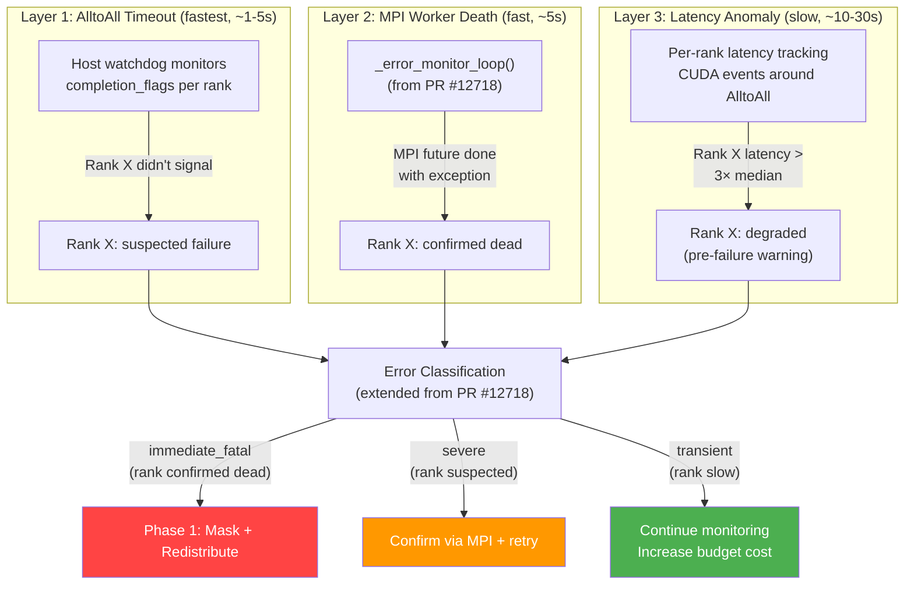
```mermaid
graph TD
    subgraph "Layer 1: AlltoAll Timeout (fastest, ~1-5s)"
        AT["Host watchdog monitors<br/>completion_flags per rank"]
        AT -->|"Rank X didn't signal"| D1["Rank X: suspected failure"]
    end

    subgraph "Layer 2: MPI Worker Death (fast, ~5s)"
        MW["_error_monitor_loop()<br/>(from PR #12718)"]
        MW -->|"MPI future done<br/>with exception"| D2["Rank X: confirmed dead"]
    end

    subgraph "Layer 3: Latency Anomaly (slow, ~10-30s)"
        LA["Per-rank latency tracking<br/>CUDA events around AlltoAll"]
        LA -->|"Rank X latency ><br/>3× median"| D3["Rank X: degraded<br/>(pre-failure warning)"]
    end

    D1 --> Classify["Error Classification<br/>(extended from PR #12718)"]
    D2 --> Classify
    D3 --> Classify

    Classify -->|"immediate_fatal<br/>(rank confirmed dead)"| Phase1["Phase 1: Mask + Redistribute"]
    Classify -->|"severe<br/>(rank suspected)"| Confirm["Confirm via MPI + retry"]
    Classify -->|"transient<br/>(rank slow)"| Monitor["Continue monitoring<br/>Increase budget cost"]

    style Phase1 fill:#ff4444,color:#fff
    style Confirm fill:#FF9800,color:#fff
    style Monitor fill:#4CAF50,color:#fff
```

### Layer 1: AlltoAll Timeout Detection

This is the primary and fastest detection mechanism. It works by monitoring the completion flags that AlltoAll kernels use for synchronization.

#### Host-Side Watchdog

```python
class AlltoAllWatchdog:
    """Monitors AlltoAll completion flags from the host side.

    Runs on a dedicated thread. Checks completion_flags (host-visible memory)
    to identify which ranks have not signaled within the timeout.
    """

    def __init__(
        self,
        completion_flags: torch.Tensor,  # host-visible [ep_size, ep_size]
        ep_group_health: EPGroupHealth,
        timeout_sec: float = 5.0,
        poll_interval_sec: float = 0.1,
    ):
        self.completion_flags = completion_flags
        self.ep_group_health = ep_group_health
        self.timeout_sec = timeout_sec
        self.poll_interval_sec = poll_interval_sec

    def watch(self, expected_flag_val: int) -> set[int]:
        """Block until all active ranks signal, or timeout.

        Returns set of ranks that did not signal (suspected failures).
        """
        deadline = time.monotonic() + self.timeout_sec
        while time.monotonic() < deadline:
            pending = set()
            for rank in range(self.ep_group_health.ep_size):
                if not self.ep_group_health.is_active(rank):
                    continue  # skip already-masked ranks
                if self.completion_flags[self.my_rank][rank] != expected_flag_val:
                    pending.add(rank)
            if not pending:
                return set()  # all active ranks signaled
            time.sleep(self.poll_interval_sec)
        return pending  # these ranks timed out
```

**Timeout tuning:** The 5-second default balances false positive risk against detection speed. In production, this should be configurable per deployment:
- NVL72 (single rack, NVLink): 2-3s is safe (NVLink latency is microseconds)
- Multi-node (RDMA): 5-10s (RDMA can have transient delays)
- Aggressive (low tolerance): 1s (may cause false positives under heavy load)

#### Alternative: Kernel-Side Timeout

For backends where completion flags are not host-visible, a kernel-side timeout can be used. Note that `clock64()` behavior varies across GPU architectures (clock frequency is not guaranteed stable under thermal throttling or power management), so timeout calibration against actual GPU clock characteristics is non-trivial:

```c
// In combine kernel: add cycle-based timeout
constexpr uint64_t TIMEOUT_CYCLES = 5000000000ULL;  // ~2.5s at 2GHz
uint64_t start = clock64();
for (int source_rank = 0; source_rank < ep_size; source_rank++) {
    if (!(active_rank_mask & (1ULL << source_rank))) continue;
    while (completion_flags[my_rank][source_rank] != expected_flag) {
        if (clock64() - start > TIMEOUT_CYCLES) {
            // Write failure indicator to host-visible memory
            rank_timeout_flags[source_rank] = 1;
            goto timeout_exit;
        }
    }
}
timeout_exit:
    // Host reads rank_timeout_flags after kernel completes
```

### Layer 2: MPI Worker Death Detection

[PR #12718](https://github.com/NVIDIA/TensorRT-LLM/pull/12718) introduces `_check_mpi_futures()` and `_error_monitor_loop()` in `GenerationExecutorProxy`. These detect when an MPI worker process dies (crash, SIGKILL, OOM, etc.).

#### Extension for Per-Rank Tracking

Currently, `_check_mpi_futures()` iterates over all MPI futures and treats any failure as a system-level fatal error. For WideEP FT, we need per-rank tracking:

```python
class EPRankHealthTracker:
    """Extends PR #12718's error monitoring for per-EP-rank health."""

    def __init__(self, ep_size: int, ep_group_health: EPGroupHealth):
        self.ep_size = ep_size
        self.ep_group_health = ep_group_health
        # Per-rank error budgets (extend PR #12718's ErrorBudget)
        self.rank_budgets: dict[int, ErrorBudget] = {
            rank: ErrorBudget() for rank in range(ep_size)
        }

    def on_mpi_worker_death(self, rank: int, error: BaseException) -> None:
        """Called when MPI future for a specific rank completes with error."""
        classification = classify_error(str(error))
        if classification == "immediate_fatal":
            self.ep_group_health.mark_failed(rank)
            # Trigger Phase 1 for this rank
        elif classification == "severe":
            # Consume rank-specific budget
            if self.rank_budgets[rank].consume(cost=0.5):
                self.ep_group_health.mark_failed(rank)

    def on_alltoall_timeout(self, timed_out_ranks: set[int]) -> None:
        """Called when AlltoAll watchdog detects timeout."""
        for rank in timed_out_ranks:
            self.rank_budgets[rank].consume(cost=0.5)
            if self.rank_budgets[rank].exhausted():
                self.ep_group_health.mark_failed(rank)
```

<a id="integration-with-pr-12718s-charge_budget-pattern"></a>
#### Integration with PR #12718's `charge_budget` Pattern

PR #12718 distinguishes between system-level errors (`charge_budget=True`) and request-scoped errors (`charge_budget=False`). For WideEP FT:

| Error Type | `charge_budget` | Rank-Specific? | Behavior |
|:-----------|:----------------|:---------------|:---------|
| AlltoAll timeout for rank X | True | **Yes** (rank X only) | Consume rank X's budget; if exhausted, mark rank X failed |
| MPI worker death for rank X | True | **Yes** (rank X only) | Immediate mark rank X failed |
| KV transfer timeout | False | No | Request-scoped, no rank impact |
| CUDA OOM on rank X | True | **Yes** (rank X only) | Consume rank X's budget |
| Input validation error | False | No | Request-scoped, no rank impact |
| NCCL timeout (AllGatherRS) | True | **Ambiguous** | May need to identify which rank caused it |

### Layer 3: Latency Anomaly Detection (Proactive)

This is a lower-priority enhancement (Phase 3) that detects **degrading** ranks before they fully fail. Inspired by vLLM RFC #27774's approach.

#### Per-Rank Latency Monitoring

```python
class EPLatencyMonitor:
    """Tracks per-rank AlltoAll latency using CUDA events.

    Detects ranks that are consistently slow (hardware degradation,
    thermal throttling, memory errors) before they fully fail.
    """

    def __init__(self, ep_size: int, window_size: int = 100):
        self.ep_size = ep_size
        self.window_size = window_size
        # Circular buffer of per-rank AlltoAll durations
        self.rank_latencies: dict[int, deque[float]] = {
            rank: deque(maxlen=window_size) for rank in range(ep_size)
        }

    def record(self, rank: int, latency_ms: float) -> None:
        self.rank_latencies[rank].append(latency_ms)

    def check_anomalies(self, threshold_multiplier: float = 3.0) -> set[int]:
        """Returns ranks with latency > threshold_multiplier × median."""
        all_latencies = [l for lats in self.rank_latencies.values() for l in lats]
        if not all_latencies:
            return set()
        median = sorted(all_latencies)[len(all_latencies) // 2]

        anomalous = set()
        for rank, lats in self.rank_latencies.items():
            if lats and (sum(lats) / len(lats)) > threshold_multiplier * median:
                anomalous.add(rank)
        return anomalous
```

**Use case:** A GPU with ECC memory errors may run 5-10x slower before eventually crashing. Latency monitoring catches this and can trigger **preemptive expert migration** — moving experts off the degrading rank before it fails.

<a id="error-classification-extensions"></a>
### Error Classification Extensions

PR #12718 defines three error tiers as **string literals** returned by `classify_error()` (`"immediate_fatal"` / `"severe"` / `"transient"`), driven by regex match against the lowercased error message. PR #12718's MVP patterns:

- `"immediate_fatal"`: `cudaerrorillegaladdress`, `cudaerrorlaunchfailure`, `illegal memory access`, `device-side assert`, `unrecoverable`
- `"severe"`: `cuda out of memory`, `cuda error`, `nccl error`
- `"transient"`: fallthrough

For WideEP FT, we extend these regex pattern lists in `error_classification.py`. The classifier still returns the same three string-literal classes — we are adding patterns, not introducing new classes:

```python
# Additions to error_classification.py — extra regexes appended to the
# existing IMMEDIATE_FATAL / SEVERE / TRANSIENT pattern lists.
# (The return values stay "immediate_fatal" / "severe" / "transient".)

EP_IMMEDIATE_FATAL_EXTRA = [
    "nccl communicator abort",
    "nvshmem peer unreachable",
    "mpi rank terminated",
    "cuda context destroyed",
]

EP_SEVERE_EXTRA = [
    "alltoall timeout",
    "nccl timeout",
    "deep_ep buffer barrier hang",
    "symmetric memory access violation",
    "rdma timeout",
]

EP_TRANSIENT_EXTRA = [
    "alltoall slow",         # rank responded but took longer than expected
    "nccl retry",
    "ecc correctable error",
]
```

The earlier `EP_IMMEDIATE_FATAL` / `EP_SEVERE` / `EP_TRANSIENT` identifiers in this doc refer to these extended pattern groups, not separate enum members.

<a id="failure-broadcast-protocol"></a>
### Failure Broadcast Protocol

When a rank failure is detected, all surviving ranks must learn about it before the next forward pass. This is a variant of the classic **failure detection problem in asynchronous distributed systems**: you cannot distinguish a slow process from a dead one, and the dead process cannot participate in the agreement protocol about its own death. The challenge is compounded by the fact that different ranks may discover the failure at different times (rank 0 may time out on rank 37's AlltoAll response while rank 50 hasn't timed out yet), and the communication infrastructure that would normally be used for consensus is itself degraded.

The broadcast mechanism depends on the communication infrastructure:

<a id="option-a-out-of-band-via-mpi-failure-tolerant-subcomm-preferred"></a>
#### Option A: Out-of-Band via MPI Failure-Tolerant Subcomm (Preferred)

> **Verified state of TRT-LLM's distributed channels (April 2026):**
> - Primary: `MPIDist` (`tensorrt_llm/_torch/distributed/communicator.py:612`) over `mpi_comm()` from `tensorrt_llm._utils` → mpi4py `MPI.COMM_WORLD`. **A running MPI world exists in default WideEP launches** — this is what we'll use.
> - `torch.distributed` is only initialized in Ray-orchestrated paths; not present in the typical WideEP MPI launch.
> - PP uses `torch.classes.trtllm.NcclCommunicatorOp` — same NCCL failure mode as the AllGather backend.
> - `Mapping` (`mapping.py:396`) holds *topology* only, not comm primitives. Cross-rank broadcasts must go through the `MPIDist` instance, not through `Mapping`.
>
> **Critical caveat:** plain `MPI_COMM_WORLD` is **not** failure-transparent. With a dead rank, subsequent collectives on `COMM_WORLD` will fail (or hang) on most common MPI implementations — the same way the NVLink AlltoAll hangs, just at a different layer. Naive "use MPI for out-of-band" without further engineering will break.

The Phase 1 MVP "out-of-band" channel is therefore **not just an MPI broadcast**, but a small new component:

1. **A dedicated MPI sub-communicator** (`MPI_Comm_split` from `COMM_WORLD` at startup) used **only** for FT signaling — never for collectives that gate the forward path.
2. **`MPI_Errhandler_set(comm, MPI_ERRORS_RETURN)`** on this subcomm so a dead peer surfaces an error code instead of aborting the process.
3. **Point-to-point `Isend` / `Irecv` with periodic `Test`** rather than blocking collectives — a blocking collective on a poisoned communicator deadlocks even with `MPI_ERRORS_RETURN` set.
4. **A dedicated CPU thread** (separate from PyExecutor's forward thread, modeled after `HangDetector`'s asyncio loop) that polls the FT subcomm. It is unaffected by GPU-side hangs.
5. **`MPI_Comm_revoke` / ULFM (User-Level Failure Mitigation)** if the linked MPI build supports it; otherwise we live with the subcomm becoming unusable after first failure (acceptable for single-failure MVP).

Failure path:

```
Rank 0 detects rank 37 hung (via AlltoAllWatchdog)
  → Rank 0's FT thread Isends "rank 37 dead" to all surviving peers on FT-subcomm
  → Each peer's FT thread Irecvs and updates ep_group_health.mark_failed(37)
  → Each peer signals its model engine: "next iteration boundary, reconfigure_mask_only"
  → Iteration N+1 starts with masked rank 37, EPLB pre-reconfigured
```

This component is **net-new** — no equivalent exists in TRT-LLM today. PR 1c.3 in [§9](#9-implementation-plan) is sized accordingly (L, not S).

#### Option B: Piggyback on Existing Iteration Barrier (Elegant)

A key design insight: the PyExecutor already synchronizes between iterations (overlap scheduler's `previous_batch` pattern). Rather than building a separate consensus protocol, we can piggyback failure detection on this existing synchronization point — using the serving pipeline's natural iteration boundary as a consensus barrier. This avoids the need for a separate out-of-band protocol and leverages a synchronization point that all ranks already participate in:

```
Iteration N: AlltoAll times out for rank 37
  → Current batch fails (all requests get error responses)
  → Between iterations: all ranks exchange health status
  → Iteration N+1: new mask applied, EPLB reconfigured, serving resumes
```

#### Option A vs Option B: Relationship, Not Alternatives

Option B is **not an independent alternative** to Option A. The dominant WideEP failure mode (see [§2 Failure Modes by Backend](#failure-modes-by-backend)) is a GPU combine kernel spinning on `completion_flags[dead_rank]` with no in-kernel timeout. While that spin persists, the forward pass never completes, so the iteration boundary Option B depends on is never reached.

Consequently:

- **Option A is required** for the primary failure mode. Its dedicated host-side thread runs independently of GPU state and can both *detect* the hang (via the Layer 1 watchdog polling host-visible completion flags) and *signal* peers over the FT subcomm while the forward thread is still stuck.
- **Option B is only useful as a simplification on top of Option A.** Once Option A's signal causes the mask to be installed and the hung kernel to exit, the iteration barrier becomes reachable again and can serve as a zero-cost consensus carrier for the final "everyone has the same mask" step.
- **Option B alone** is sufficient only for the narrower failure modes where the rank completes the iteration and then fails (clean exception, CUDA error surfaced via `classify_error()`, rank death between iterations). These are not the modes driving this design.

**Decision for the MVP:** Ship Option A. It carries both signaling and consensus in Phase 1. Option B is not a separate PR — it is already implicit in the existing iteration boundary and can be wired in as an optional consensus carrier in a later phase once the Option A detection layer is stable.

#### Consensus Requirement

All surviving ranks must agree on which ranks are dead. Split-brain scenarios (rank A thinks rank B is dead, but rank B is still running) could cause data corruption. The protocol must ensure:

1. **Unanimous agreement:** All surviving ranks agree on the mask before any uses it.
2. **Monotonic failure:** Once a rank is marked dead, it cannot be marked active again in Phase 1 (only in Phase 2 with a new process group).
3. **Idempotent:** Multiple ranks detecting the same failure converge to the same mask.

### Integration with Serving Layer

The EP rank health status must propagate to the serving layer:

1. **Model Engine** → **PyExecutor**: EP group health is checked at the start of each iteration. If health has changed, trigger reconfiguration before the forward pass.

2. **PyExecutor** → **Health Check** (`check_health()`): Return degraded status (not fatal) when EP group is running with masked ranks. This tells the serving layer "we're functional but at reduced capacity."

3. **Serving Layer** → **Router**: In disaggregated serving, the router can adjust load balancing to account for reduced capacity of degraded EP groups.

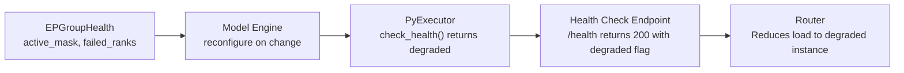
```mermaid
graph LR
    EPH["EPGroupHealth<br/>active_mask, failed_ranks"]
    ME["Model Engine<br/>reconfigure on change"]
    PE["PyExecutor<br/>check_health() returns degraded"]
    HC["Health Check Endpoint<br/>/health returns 200 with degraded flag"]
    Router["Router<br/>Reduces load to degraded instance"]

    EPH --> ME
    ME --> PE
    PE --> HC
    HC --> Router
```

---

## 8. Integration with MX-GMS

### The Three Workstreams

This chapter maps how three concurrent workstreams — [PR #12718](https://github.com/NVIDIA/TensorRT-LLM/pull/12718) (error detection), WideEP FT (this design), and [MX+GMS+TRT-LLM integration](https://docs.google.com/document/d/14SZmmFcoakgIx2OC4dt8pWcHU14PDTN9KlAKqLoZ15s/edit?usp=sharing) (fast recovery) — form a layered reliability stack that is greater than the sum of its parts.

### Layered Architecture

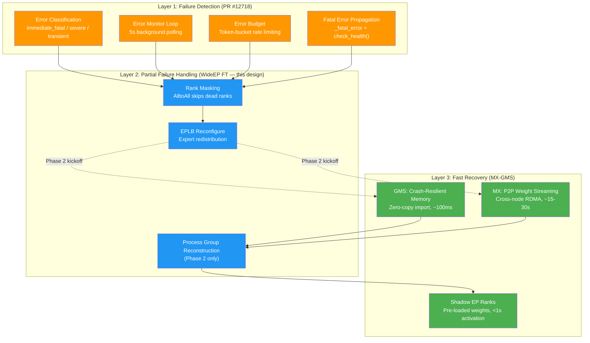
```mermaid
graph TB
    subgraph "Layer 3: Fast Recovery (MX-GMS)"
        MX["MX: P2P Weight Streaming<br/>Cross-node RDMA, ~15-30s"]
        GMS["GMS: Crash-Resilient Memory<br/>Zero-copy import, ~100ms"]
        Shadow["Shadow EP Ranks<br/>Pre-loaded weights, <1s activation"]
    end

    subgraph "Layer 2: Partial Failure Handling (WideEP FT — this design)"
        Mask["Rank Masking<br/>AlltoAll skips dead ranks"]
        EPLB_R["EPLB Reconfigure<br/>Expert redistribution"]
        PG["Process Group Reconstruction<br/>(Phase 2 only)"]
    end

    subgraph "Layer 1: Failure Detection (PR #12718)"
        EC["Error Classification<br/>immediate_fatal / severe / transient"]
        EB["Error Budget<br/>Token-bucket rate limiting"]
        FE["Fatal Error Propagation<br/>_fatal_error + check_health()"]
        EM["Error Monitor Loop<br/>5s background polling"]
    end

    %% Layer 1 → Layer 2: detection primitives all drive the per-rank mask.
    EC --> Mask
    EM --> Mask
    EB --> Mask
    FE --> Mask

    %% Within Layer 2 (Phase 1 survival path): mask change drives EPLB reconfigure.
    Mask --> EPLB_R

    %% Layer 2 → Layer 3 (Phase 2 recovery path, triggered once Phase 1 is stable
    %% and the orchestrator provisions a replacement rank). Weights are imported
    %% via GMS or MX first, then the process group is reconstructed, then the
    %% shadow / replacement EP rank activates.
    EPLB_R -.->|Phase 2 kickoff| GMS
    EPLB_R -.->|Phase 2 kickoff| MX
    GMS --> PG
    MX --> PG
    PG --> Shadow

    style MX fill:#4CAF50,color:#fff
    style GMS fill:#4CAF50,color:#fff
    style Shadow fill:#4CAF50,color:#fff
    style Mask fill:#2196F3,color:#fff
    style EPLB_R fill:#2196F3,color:#fff
    style PG fill:#2196F3,color:#fff
    style EC fill:#FF9800,color:#fff
    style EB fill:#FF9800,color:#fff
    style FE fill:#FF9800,color:#fff
    style EM fill:#FF9800,color:#fff
```

### Dependency and Parallelization Map

The three workstreams have **limited hard dependencies** and can largely be developed in parallel:

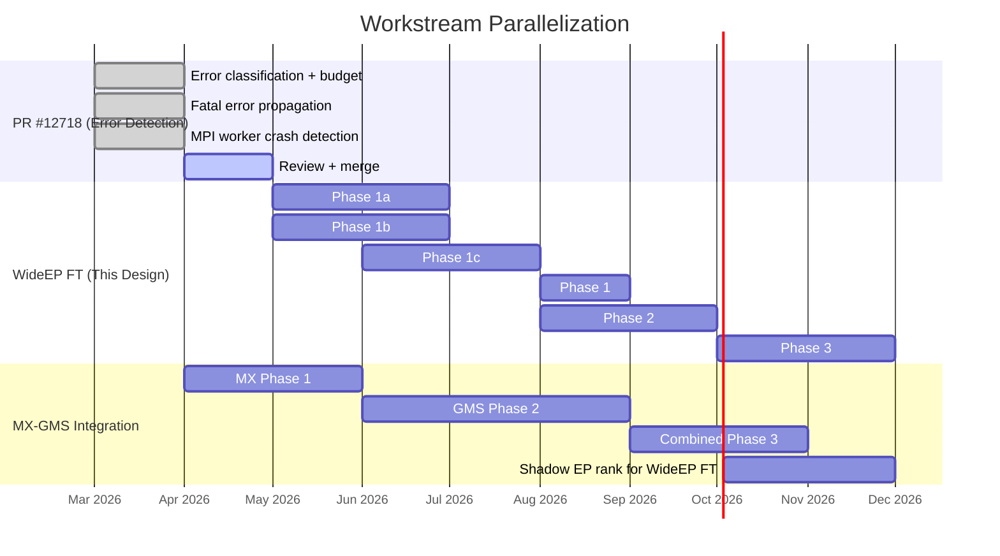
```mermaid
gantt
    title Workstream Parallelization
    dateFormat YYYY-MM
    axisFormat %b %Y

    section PR #12718 (Error Detection)
    Error classification + budget     :done, pr1, 2026-03, 2026-04
    Fatal error propagation           :done, pr2, 2026-03, 2026-04
    MPI worker crash detection        :done, pr3, 2026-03, 2026-04
    Review + merge                    :active, pr4, 2026-04, 2026-05

    section WideEP FT (This Design)
    Phase 1a: AlltoAll timeout + rank masking  :ft1, 2026-05, 2026-07
    Phase 1b: EPLB reconfigure()               :ft2, 2026-05, 2026-07
    Phase 1c: Failure broadcast + integration  :ft3, 2026-06, 2026-08
    Phase 1: End-to-end validation             :ft4, 2026-08, 2026-09
    Phase 2: Process group reconstruction      :ft5, 2026-08, 2026-10
    Phase 3: Proactive latency monitoring      :ft6, 2026-10, 2026-12

    section MX-GMS Integration
    MX Phase 1: P2P weight streaming   :mx1, 2026-04, 2026-06
    GMS Phase 2: Zero-copy + shadow    :mx2, 2026-06, 2026-09
    Combined Phase 3: MX+GMS unified   :mx3, 2026-09, 2026-11
    Shadow EP rank for WideEP FT       :mx4, after ft5, 2026-12
```

#### Hard Dependencies

| Step | Depends On | Reason |
|:-----|:-----------|:-------|
| WideEP FT Phase 1 | PR #12718 merged | Needs error classification + budget infrastructure |
| WideEP FT Phase 2 | WideEP FT Phase 1 | Can't restore if can't survive |
| Shadow EP ranks | GMS Phase 2 + WideEP FT Phase 2 | Needs both GMS zero-copy AND process group reconstruction |
| GMS Phase 2 | MX Phase 1 | MX-GMS design positions MX first |

#### Soft Dependencies (Beneficial but Not Blocking)

| Step | Benefits From | How |
|:-----|:-------------|:----|
| WideEP FT Phase 1 | MX Phase 1 | Not needed, but MX identity matching includes `ep_rank` — validates EP rank concepts |
| WideEP FT Phase 2 | GMS Phase 2 | GMS makes recovery faster (<1s vs minutes), but Phase 2 works without GMS (disk loading) |
| MX-GMS Phase 3 | WideEP FT Phase 1 | MX-GMS can validate failover against WideEP FT's survival capability |

### How PR #12718 Enables WideEP FT

PR #12718 is the **foundation layer** of the three-workstream stack. It provides a small set of primitives that WideEP FT extends into per-rank variants. The detailed contract — pattern lists, `ErrorBudget` per-rank wiring, `EPRankHealthTracker`, the `charge_budget` table, the `_error_monitor_loop()` extension — is specified in [§7 Failure Detection](#7-design-failure-detection-and-classification). This chapter only states the *integration* relationship.

| PR #12718 primitive | WideEP FT extension | Canonical spec |
|:---|:---|:---|
| `classify_error()` returning `"immediate_fatal"` / `"severe"` / `"transient"` | EP-specific regex patterns appended to the existing lists (`"alltoall timeout"`, `"nvshmem peer unreachable"`, etc.) | [§7 Error Classification Extensions](#error-classification-extensions) |
| `ErrorBudget` (token-bucket, system-wide) | Per-rank `ErrorBudget` instances, one per EP rank, consumed by rank-scoped errors | [§7 Layer 2: MPI Worker Death Detection](#layer-2-mpi-worker-death-detection) |
| `charge_budget=False` for request-scoped errors | Extended to tokens that would have been routed to a just-failed rank | [§7 Integration with PR #12718's charge_budget Pattern](#integration-with-pr-12718s-charge_budget-pattern) |
| `_error_monitor_loop()` (5s polling of MPI futures) | Extended with AlltoAll completion-flag monitoring and per-rank latency tracking | [§7 Detection Layers](#detection-layers) |
| Fatal shutdown drain (all queues) | Partial drain: rank failure drains only the current batch, not the waiting queue | [§4 Serving During Degraded Mode](#serving-during-degraded-mode) |

**Key design point:** PR #12718's classification operates at the executor level (binary: entire system healthy/fatal). WideEP FT adds a **per-rank** dimension — the same error type can be fatal for one rank but not for the system — without changing the three string-literal classes PR #12718 defines. The enum vs. string-literal naming caveat that affects integration is documented once in [§7 status callout](#overview-7).

### How MX-GMS Accelerates WideEP FT Phase 2

Without MX-GMS, Phase 2 recovery requires loading expert weights from disk — typically 1-3 minutes for a DeepSeek-V3 expert shard. MX-GMS provides two acceleration paths:

#### GMS Zero-Copy Import (Fastest: <1s)

When GMS is available, the failed rank's expert weights may still be in GPU memory (GMS's out-of-process crash-resilient memory). The replacement rank can import them via GMS zero-copy:

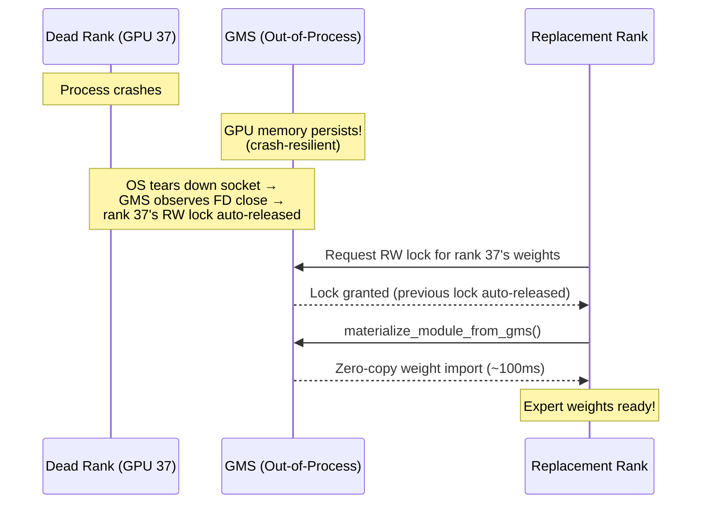
```mermaid
sequenceDiagram
    participant Dead as Dead Rank (GPU 37)
    participant GMS as GMS (Out-of-Process)
    participant New as Replacement Rank

    Note over Dead: Process crashes
    Note over GMS: GPU memory persists!<br/>(crash-resilient)
    Note over Dead,GMS: OS tears down socket →<br/>GMS observes FD close →<br/>rank 37's RW lock auto-released

    New->>GMS: Request RW lock for rank 37's weights
    GMS-->>New: Lock granted (previous lock auto-released)
    New->>GMS: materialize_module_from_gms()
    GMS-->>New: Zero-copy weight import (~100ms)
    Note over New: Expert weights ready!
```

**Key insight:** GMS's crash resilience means the dead process's GPU memory **persists**. The replacement rank doesn't need to reload from disk — it imports the existing GPU memory in ~100ms.

**Limitation:** This only works if the replacement rank is on the **same node** as the failed rank (GMS sharing is intra-node via CUDA VMM FD handles). For cross-node replacement, use MX P2P.

#### MX P2P Streaming (Fast: ~15-30s for full model, less for expert shard)

When the replacement rank is on a different node, MX provides cross-node P2P via NIXL/RDMA:

- The replacement rank requests its expert shard from a peer (any surviving rank with the same EP topology)
- MX identity matching includes `ep_size` and `ep_rank`, ensuring the correct shard is transferred
- Only the expert shard is transferred (not the full model), so the transfer is proportionally smaller

For DeepSeek-V3 with EP=72: each rank holds ~9.5 GB of expert weights (681GB / 72). MX P2P at 20+ GB/s transfers this in <0.5s. Total Phase 2 recovery with MX: ~1-2s.

<a id="shadow-ep-ranks-sub-second-activation"></a>
#### Shadow EP Ranks (Sub-Second Activation)

The MX-GMS design (Section 6: Executor Integration and Failover) describes shadow workers that pre-load weights via GMS RO import. This concept extends naturally to WideEP:

| MX-GMS Shadow Worker (Original) | Shadow EP Rank (Extended for WideEP) |
|:-|:-|
| Shadows one entire executor | Shadows one EP rank's expert shard |
| Pre-loads full model weights | Pre-loads only the expert shard for one rank |
| Activates on executor death | Activates on EP rank death |
| KV cache allocation = 1-3s (bottleneck) | **No KV cache needed** (EP ranks don't own per-request KV) |
| Total activation: <5s | **Total activation: <1s** |

**Key architectural insight — Why shadow EP ranks are fundamentally faster than general shadow workers:**

The MX-GMS design identifies KV cache allocation (1-3s) as the activation bottleneck for shadow workers. But in WideEP with `enable_attention_dp=True`, individual EP ranks run data-parallel attention independently — each GPU processes its own requests' attention computation with its own KV cache. The EP ranks exchange *activations* (tokens routed to experts) via AlltoAll during MoE layers, not KV cache state. This means a shadow EP rank needs only expert weights and process group membership — not per-request KV cache state. The KV cache bottleneck simply doesn't apply.

This is not just an optimization — it's a **structural property of WideEP's architecture** that makes sub-second shadow activation architecturally possible in a way that is impossible for general-purpose shadow failover (where KV cache allocation is an irreducible cost). No competitor has exploited this insight because no competitor has both shadow workers (MX-GMS) and WideEP fault tolerance in the same system.

### Cross-Workstream Benefits

#### WideEP FT Benefits MX-GMS

1. **Completes the failover story:** MX-GMS's shadow failover design handles whole-executor death but doesn't address partial EP failure. WideEP FT fills this gap, making the MX-GMS failover story complete for the most important production use case.

2. **Validates GMS crash resilience:** WideEP FT Phase 2 is a concrete, high-value use case for GMS's crash-resilient memory. It provides a clear justification for GMS Phase 2 investment.

3. **Defines EP-aware MX identity:** WideEP FT clarifies exactly how `ep_rank` and `ep_size` should be used in MX identity matching for expert shard transfers.

#### MX-GMS Benefits WideEP FT

1. **Reduces Phase 2 from minutes to sub-second:** Without GMS, Phase 2 = disk loading (minutes). With GMS, Phase 2 = zero-copy import (<1s). This is the difference between "acceptable degraded mode" and "imperceptible recovery."

2. **Enables shadow EP ranks:** A capability no competitor has. SGLang's Elastic EP permanently runs degraded. This design with MX-GMS restores full capacity in sub-second.

3. **Startup profiling data:** The MX-GMS design includes startup profiling (already implemented) that provides real measurements for weight loading times, directly informing Phase 2 recovery time estimates.

#### PR #12718 Benefits Both

1. **Error infrastructure:** Both WideEP FT and MX-GMS shadow failover need to detect failures. PR #12718 provides the classification, budgeting, and propagation infrastructure.

2. **Health check chain:** PR #12718 fixes the zombie worker bug, making health checks actually work. Both WideEP FT (degraded status reporting) and MX-GMS (shadow activation trigger) depend on accurate health reporting.

3. **Fatal shutdown mechanics:** PR #12718's queue drain on fatal shutdown is used by WideEP FT (partial drain for rank failure) and could be used by MX-GMS (full drain before shadow activation).

### Combined Architecture Vision

When all three workstreams are complete, the system handles the full failure lifecycle:

```mermaid
sequenceDiagram
    participant GPU37 as GPU 37
    participant Detect as Layer 1: Detection<br/>(PR #12718)
    participant Survive as Layer 2: Survival<br/>(WideEP FT Phase 1)
    participant Restore as Layer 3: Recovery<br/>(MX-GMS + WideEP FT Phase 2)

    Note over GPU37: ☠️ GPU failure

    GPU37->>Detect: AlltoAll timeout (1-5s)
    Detect->>Detect: classify_error() → EP severe
    Detect->>Detect: rank_budget[37].consume() → exhausted
    Detect->>Survive: mark_failed(rank=37)

    Survive->>Survive: Update active_rank_mask (< 1ms)
    Survive->>Survive: EPLB emergency reconfigure<br/>(MVP slot remap: <10ms; v1 with weight migration: <50ms)
    Survive->>Survive: Resume serving at N-1 capacity

    Note over Survive: Serving continues (degraded)
    Note over Survive: Total Phase 1: ~5-10s

    par Background: Phase 2
        alt Shadow EP rank pre-provisioned
            Note over Restore: No cold-start cost;<br/>replacement rank is already running
        else Cold provision
            Restore->>Restore: Orchestrator provisions replacement GPU<br/>(seconds-class; depends on operator)
        end
        alt GMS available (same-node)
            Restore->>Restore: GMS zero-copy import (~100ms)
        else MX available (cross-node)
            Restore->>Restore: MX P2P RDMA (~1-2s for expert shard)
        else Disk only
            Restore->>Restore: Load from checkpoint (~1-3 min)
        end
        Restore->>Restore: Reconstruct process group (~100ms)
        Restore->>Restore: EPLB full rebalance (~10ms)
        Restore->>Restore: Update active_rank_mask: all active
    end

    Note over Restore: Full capacity restored
    Note over Restore: Phase 2 budget — pre-provisioned shadow + GMS: <1s<br/>cold provision + MX: ~2-10s (provision-dominated)<br/>cold + disk: ~3 min
```

### What Each Workstream Must NOT Do

Clear boundaries prevent duplicate work:

| Workstream | Responsible For | NOT Responsible For |
|:-----------|:---------------|:-------------------|
| **PR #12718** | Error classification, budget, fatal propagation, health check fix | Per-EP-rank tracking, rank masking, expert redistribution |
| **WideEP FT** | Rank masking, EPLB reconfigure, AlltoAll timeout, failure broadcast, Phase 1+2 orchestration | Weight loading acceleration, crash-resilient memory, GMS/MX APIs |
| **MX-GMS** | Weight streaming (MX), zero-copy import (GMS), shadow workers, crash resilience | Failure detection, AlltoAll modification, expert redistribution logic |

---

## 9. Implementation Plan

### Phase Overview

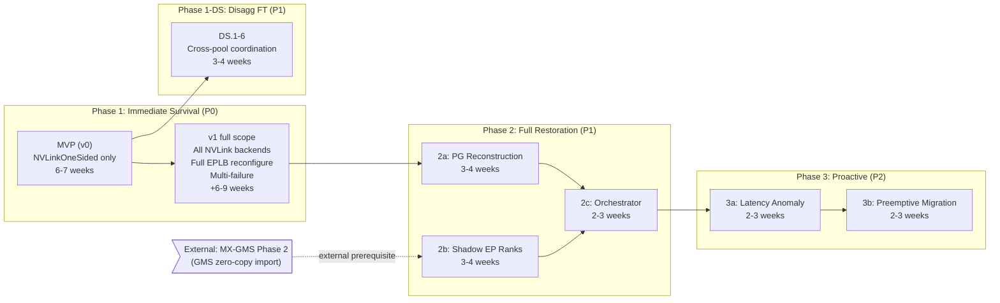
```mermaid
graph LR
    MXGMS>"External: MX-GMS Phase 2<br/>(GMS zero-copy import)"]

    subgraph "Phase 1: Immediate Survival (P0)"
        MVP["MVP (v0)<br/>NVLinkOneSided only<br/>6-7 weeks"]
        P1V1["v1 full scope<br/>All NVLink backends<br/>Full EPLB reconfigure<br/>Multi-failure<br/>+6-9 weeks"]
        MVP --> P1V1
    end

    subgraph "Phase 1-DS: Disagg FT (P1)"
        DS["DS.1-6<br/>Cross-pool coordination<br/>3-4 weeks"]
    end

    subgraph "Phase 2: Full Restoration (P1)"
        P2A["2a: PG Reconstruction<br/>3-4 weeks"]
        P2B["2b: Shadow EP Ranks<br/>3-4 weeks"]
        P2C["2c: Orchestrator<br/>2-3 weeks"]
        P2A --> P2C
        P2B --> P2C
    end

    subgraph "Phase 3: Proactive (P2)"
        P3A["3a: Latency Anomaly<br/>2-3 weeks"]
        P3B["3b: Preemptive Migration<br/>2-3 weeks"]
        P3A --> P3B
    end

    MVP --> DS
    P1V1 --> P2A
    MXGMS -.->|external prerequisite| P2B
    P2C --> P3A
```

> **All calendar estimates below assume engineers are working with AI coding-agent assistance that reduces coding and review-iteration time by roughly 30-40% on straightforward S/M-size PRs and ~20-25% on L-size PRs where distributed-systems design (not coding bandwidth) is the gating factor. Without that assistance, add ~30% to every figure in this chapter.

<a id="prerequisites"></a>
### Prerequisites

| Prerequisite | Status (verified 2026-04-21) | Blocking? |
|:-------------|:-------|:----------|
| [PR #12718](https://github.com/NVIDIA/TensorRT-LLM/pull/12718) merged | **Not on `docs-and-plans` HEAD.** Commits exist on other branches (`f32efd01e5`, `e3f84ceb02`, `1128c0ff54`, `4aab3c0afc`); `tensorrt_llm/_torch/pyexecutor/error_classification.py` does not exist yet on this tree. | **Yes** for PRs 1c.1–1c.4. Must land or be rebased into the implementation base branch before 1c work can begin. |
| EPLB correctness validated | In progress (Tier 1) | **Yes** for Phase 1b |
| NVLink AlltoAll kernel source access | Available — kernel verified at `cpp/tensorrt_llm/kernels/communicationKernels/moeAlltoAllKernels.cu` (1408 LOC) | **Yes** for Phase 1a |
| `kMaxRanks = 64` constexpr bumped to ≥ 80 (NVL72) | Not done | **Yes** for any production NVL72 use; sub-task of PR 1a.2 |
| NCCL fault-tolerant wiring (`NCCL_ASYNC_ERROR_HANDLING`, `ncclCommAbort`) | **Not wired in TRT-LLM today.** Zero matches outside test files. | **Yes** for PR 1a.7 (AllGather backend mask wiring) |
| MPI failure-tolerant subcomm with `MPI_ERRORS_RETURN` | **Net-new component.** No equivalent in current `MPIDist`. | **Yes** for PR 1c.3 |
| Fault-injection test harness (kernel-abort / rank-kill mid-collective) | **Not present in `tests/`.** Must be built from scratch. | **Yes** for PR 1d.4 |
| DeepEP `mask_buffer_ptr` public API | Not available | **No** — NVLink is primary target; DeepEP is secondary |
| MX-GMS Phase 2 (GMS) | Design complete | **No** — Phase 2 works without GMS (slower recovery) |

<a id="how-to-read-this-plan"></a>
### How to Read This Plan

Each numbered item (e.g., **1a.2**) maps to one PR — a focused, reviewable unit of work. Every item row gives the PR title, target file(s), size, dependencies, and scope tag (MVP or v1).

**Size conventions:**

| Size | LOC | Engineer time | Calendar time |
|:---|:---|:---|:---|
| **S** | <300 | 0.5-2 days | 0.5-1 weeks |
| **M** | 300-1000 | 2-5 days | 1-2 weeks |
| **L** | 1000+ or deep complexity | 0.5-2 weeks | 2-4 weeks |

- **Engineer time** is focused work on the change itself.
- **Calendar time** includes design review, code review iterations, CI runs, pre-commit hook fixes, and serialization against other in-flight PRs in the same area. This is what affects the wall-clock delivery date.
- **AI coding-agent assumption:** figures above already factor in roughly a 30-40% reduction on S/M PRs (AI drafts + tests + addresses review comments in fewer human iterations) and ~20-25% on L PRs (design-heavy items — kernel work, distributed consensus, harness design — are gated by design uncertainty more than coding speed, so AI helps less). Without AI assistance, multiply each row by ~1.3×.
- The ratio (calendar ≈ 2-3× engineer time) reflects typical TRT-LLM review cycles for non-trivial PRs, already adjusted for AI-assisted review.

**Dependency semantics:** `Deps: 1a.1` means this PR needs 1a.1 merged (or at least landed behind a feature flag) before it can be reviewed for merge. PRs without listed deps can be opened in parallel.

**Scope tags:** **(MVP)** = Phase 1 v0 ship; **(v1)** = Phase 1 full scope; **(DS)** = Phase 1-DS (disagg); **(2)** = Phase 2; **(3)** = Phase 3.

**Sum of parts ≠ wall-clock.** Calendar times below are per-PR; the phase totals in the Timeline Summary account for parallel work across multiple engineers and overlap between unblocked items.

### Phase 1: Immediate Survival (P0)

**Goal:** When a GPU fails in a WideEP group, continue serving at N-1 capacity within <10 seconds.

<a id="phase-1-mvp-v0-vs-full-scope"></a>
#### Phase 1 MVP (v0) vs Full Scope

Phase 1 has a natural MVP that proves the rank-masking approach end-to-end on the primary backend with minimum risk, and a follow-up (v1) that broadens backend coverage and hardens EPLB reconfiguration. The MVP targets a **single-failure scenario on NVLinkOneSided** and is estimated at **6-7 weeks** with AI coding-agent assistance. The estimate has evolved twice: (1) the initial pre-review estimate was 6-8 weeks; (2) the April 2026 source review surfaced four net-new components (`kMaxRanks` bump, NCCL FT wiring, MPI FT subcomm, fault-injection harness) that pushed a *baseline* (unassisted) estimate to 8-10 weeks; (3) the AI-assisted estimate absorbs that added scope, bringing the current figure back to 6-7 weeks. The full Phase 1 scope (all NVLink backends, full EPLB reconfigure, multi-failure consensus) is 2.5-3 months with AI assistance (vs. 3-4 months unassisted).

**In MVP scope (v0):**

- NVLinkOneSided kernel masking — primary production backend for NVL72. Includes `kMaxRanks` bump to 128.
- Host-side AlltoAll watchdog with 5s default timeout
- EPLB **emergency slot-remapping mode** (formerly "mask-only") — dead rank's slots become unreachable in `MoePlacementInfo`; requests route only to surviving replicas. No H2D weight movement at recovery time (all weights already mapped via `HostMoeTensorSharer`'s node-local POSIX shm).
- MPI **failure-tolerant subcomm + dedicated FT thread** for out-of-band broadcast (Option A from [§7](#7-design-failure-detection-and-classification), implemented in PR 1c.3 — net-new, not a simple `MPI_Allgather`)
- Single-failure semantics — tolerate 1 dead rank, require replacement before a 2nd failure
- EP-specific patterns added to PR #12718's `error_classification.py` (returns `"immediate_fatal"` / `"severe"` / `"transient"` string literals)
- Net-new fault-injection test harness (no prior art in `tests/`)

**Deferred to v1 (completes the 3-4 month full Phase 1):**

- NVLinkTwoSided kernel masking
- DeepEP / DeepEPLowLatency masking — pending NVSHMEM `mask_buffer_ptr` public API
- Full EPLB reconfigure with weight migration across 58 MoE layers in <50ms
- Kernel-side `clock64()` timeout alternative to host watchdog ([§10 Q1](#q1-should-phase-1-use-kernel-side-or-host-side-timeout))
- Multi-failure consensus ([§10 Q5](#q5-what-is-the-maximum-number-of-simultaneous-rank-failures-we-should-support))
- PP interaction with EP fault tolerance ([§10 Q6](#q6-how-does-wideep-ft-interact-with-pipeline-parallelism))

**MVP exit criteria:** On a 4+ GPU DeepSeek-V3-like test, kill one rank and verify (a) detection in <5s, (b) service continues at reduced capacity in <10s end-to-end, (c) no request data corruption, (d) throughput degradation proportional to capacity loss (≈1/N for single failure).

**Why the MVP is defensible as a standalone deliverable:** It eliminates the 7-8 minute downtime that is the dominant WideEP availability bug today, on the backend that production NVL72 deployments use. Broader backend coverage and EPLB sophistication are real improvements but not required for the primary goodput win.

Deliverable tags in the sub-phases below: **(MVP)** = required for v0 ship; **(v1)** = required for full Phase 1.

#### 1a: AlltoAll Timeout and Rank Masking (3-4 weeks)

**Scope:** Add timeout and rank masking to NVLink AlltoAll communication backends.

**Technical challenge:** Requires modifying CUDA kernels that implement multi-GPU synchronization via symmetric memory completion flags. This is low-level GPU systems work: adding conditional rank skipping to spin-wait loops without introducing thread divergence, memory ordering violations, or races when a peer's symmetric memory region becomes inaccessible.

**PR breakdown:**

| PR | Title | Scope | Target file(s) | Size | Deps |
|:---|:---|:---|:---|:---|:---|
| **1a.1** | `EPGroupHealth` class | MVP | `tensorrt_llm/_torch/modules/fused_moe/ep_group_health.py` (new) | S | — |
| **1a.2** | NVLinkOneSided kernel mask (CUDA) | MVP | `cpp/tensorrt_llm/kernels/communicationKernels/moeAlltoAllKernels.{cu,h}` | **L** | — |
| **1a.3** | NVLinkOneSided Python binding update | MVP | `_torch/modules/fused_moe/communication/nvlink_one_sided.py`, `communication_factory.py` | S | 1a.1, 1a.2 |
| **1a.4** | `AlltoAllWatchdog` (host thread) | MVP | `_torch/modules/fused_moe/alltoall_watchdog.py` (new) | S | 1a.1 |
| **1a.5** | NVLinkTwoSided kernel mask (CUDA) | v1 | `cpp/tensorrt_llm/kernels/fusedMoeCommKernels.cu`, `cpp/tensorrt_llm/thop/moeCommOp.cpp` | M | 1a.2 (pattern) |
| **1a.6** | NVLinkTwoSided Python binding update | v1 | `_torch/modules/fused_moe/communication/nvlink_two_sided.py`, `nvlink_two_sided_flashinfer.py` | S | 1a.5 |
| **1a.7** | NCCL fault-tolerant wrapper + AllGatherReduceScatter mask wiring | v1 | NCCL communicator wrapper (`cpp/tensorrt_llm/`), `_torch/modules/fused_moe/communication/allgather_reducescatter.py` | **M** (was S — NCCL wiring is net-new) | 1a.1 |
| **1a.8** | Tighten kernel-side `check_timeout` + replace `trap;` with host-visible flag | v1 | `moeAlltoAllKernels.cu:156-161`, `:581`, `:1214` | M | 1a.2 |

**Per-PR detail:**

- **1a.1** — Bitmask-based rank health. Public API: `mark_failed(rank)`, `mark_active(rank)`, `is_active(rank)`, `get_mask()`. Internal: `uint64[2]` to support NVL72 (72 ranks) and future expansion. Thread-safe via `threading.Lock`. Unit tests cover single-threaded correctness + concurrent update races.
- **1a.2** — Anchored to `cpp/tensorrt_llm/kernels/communicationKernels/moeAlltoAllKernels.cu`. Three sub-tasks within this PR: **(a)** Bump `kMaxRanks` constexpr from 64 to 128 in `moeAlltoAllKernels.h:31` (single-line, but easy to forget — must be done first to support NVL72). **(b)** Add `active_rank_mask_lo, active_rank_mask_hi` (uint64) to `DispatchKernelPointers` and `CombineKernelPointers`. **(c)** Guard **both** the release-write loop *and* the polling loop in dispatch (`:546-555`, `:558-584`) and combine (`:1190-1217`) — masking only one side leaves the dead-rank flag spin in place. Routing pass extension: `compute_target_rank_id` emits `dst_idx = -1` for masked-rank tokens; combine's existing `acc[k].fill(0.0f)` (`:727`) handles them. Performance gate: <0.1% overhead with all-ranks-active. Correctness tests with mocked mask on single GPU.
- **1a.3** — Thread `EPGroupHealth` through `CommunicationFactory`; `NVLinkOneSided.forward()` pulls current mask and passes to kernel launch. Stateless — mask read per launch, not cached.
- **1a.4** — Python thread polling `completion_flags` at configurable interval (default 100ms); 5s default timeout. On timeout, call `EPGroupHealth.mark_failed(rank)` and notify model engine. Note: the kernel's pre-existing 300s `check_timeout` (`moeAlltoAllKernels.cu:156-161`) remains as a backstop — it's a `trap;`, not a recovery hook, so the host watchdog must fire well before it. Unit tests with mocked flags verifying detection latency.
- **1a.5–1a.8** deferred to v1; same pattern as MVP PRs. **1a.7 (AllGather mask wiring)** has an extra prerequisite: NCCL fault-tolerant wiring is not present in TRT-LLM today (no `ncclCommAbort` / `NCCL_ASYNC_ERROR_HANDLING` calls outside test files). 1a.7 must include adding this wiring to the NCCL communicator wrapper, growing it from S to M.

**Success criteria (per phase):**
- MVP: unit test with one rank masked, AlltoAll completes on N-1 ranks; integration test kills one process, surviving ranks complete AlltoAll.
- v1: all NVLink backends pass the same test; steady-state overhead benchmark <0.1% regression.

#### 1b: EPLB Topology Adaptation (3-4 weeks, parallel with 1a)

**Scope:** Add `reconfigure()` to the C++ MoeLoadBalancer for dynamic EP topology changes.

**Technical challenge:** EPLB was designed as a static-topology system with immutable `epSize`/`epRank`. Reconfiguration must safely pause concurrent worker and compute threads (which may be mid-weight-migration), rebuild all internal data structures, migrate expert weights across 58 MoE layers in <50ms, and resume — all while ensuring no layer's routing table references a dead rank's slot.

**PR breakdown:**

| PR | Title | Scope | Target file(s) | Size | Deps |
|:---|:---|:---|:---|:---|:---|
| **1b.1** | `reconfigure_mask_only()` — emergency mask in GPU placement | MVP | `cpp/tensorrt_llm/kernels/moeLoadBalance/moeLoadBalanceKernels.{cu,h}` | M | — |
| **1b.2** | Python wrapper for mask-only reconfigure | MVP | `_torch/modules/fused_moe/moe_load_balancer.py` | S | 1b.1 |
| **1b.3** | Iteration-boundary reconfigure integration | MVP | `_torch/modules/fused_moe/moe_load_balancer.py`, `_torch/pyexecutor/model_engine.py` | S | 1b.2 |
| **1b.4** | Mutable `MoeLoadBalanceMetaInfo` (epSize/epRank rewrite) | v1 | `moeLoadBalanceKernels.{cu,h}`, `moeLoadBalanceCommon.h` | **L** | 1b.1 |
| **1b.5** | Full `reconfigure()` — online `doReplication()` + `doPlacement()` | v1 | `moeLoadBalanceKernels.cu`, `moe_load_balancer.py` | M | 1b.4 |
| **1b.6** | Weight migration path (cudaMemcpy2D + gdrcopy) | v1 | `moeLoadBalanceKernels.cu`, `HostMoeTensorSharer` integration | **L** | 1b.5 |
| **1b.7** | Zero-replica expert handling (single-replica redistribution) | v1 | `moeLoadBalanceKernels.cu`, `moe_load_balancer.py` | M | 1b.5 |

**Per-PR detail:**

- **1b.1** — Adds `reconfigure_mask_only(dead_ranks)` entry point that pauses EPLB worker/compute threads, marks dead rank's slot entries as unreachable in GPU `MoePlacementInfo`, resumes. No changes to `MoeLoadBalanceMetaInfo`, no weight moves. Designed to be a <10ms operation.
- **1b.2** — `MoeLoadBalancer.reconfigure_mask_only(dead_ranks: list[int])` Python entry point via existing pybind. Coordinates with model engine iteration lifecycle: requires iteration boundary.
- **1b.3** — Wire into `model_engine.py`'s iteration loop: on `EPGroupHealth` change, call `reconfigure_mask_only` before next forward.
- **1b.4** — Make `epSize`/`epRank` mutable in `MoeLoadBalanceMetaInfo`. Requires careful audit of every reader of these fields (most assume immutable). Atomic swap pattern.
- **1b.5** — `reconfigure(emergencyMode: bool)` full path. When `emergencyMode=true`, only placements for zero-replica experts change. When `false` (used in Phase 2), full `doReplication` + `doPlacement` for optimal N-rank placement.
- **1b.6** — Migrate expert shards among slots via `cudaMemcpy2D` + gdrcopy across 58 MoE layers. Target: <50ms total. Builds on `HostMoeTensorSharer` (host-side shard storage).
- **1b.7** — Handles the edge case where a dead rank held the only copy of some expert. Redistributes those experts across surviving ranks using existing placement policy.

**MVP simplification:** if deployments keep replication factor ≥2 (DeepSeek production does), 1b.1–1b.3 is sufficient — every dead-rank expert already has a surviving replica, so pure masking reaches steady state with no placement change.

**Success criteria:**
- MVP: 4-GPU test, rank killed → `reconfigure_mask_only` completes in <10ms at iteration boundary → next forward routes around dead rank.
- v1: reconfigure EP=32→31 with weight migration; all 256 experts reachable; <50ms total.

#### 1c: Failure Detection and Broadcast (2-3 weeks, parallel with 1a/1b)

**Scope:** Extend PR #12718's error infrastructure for per-EP-rank health tracking.

**Technical challenge:** Requires solving a distributed consensus variant where one participant is dead and cannot acknowledge its own failure, and where different surviving ranks may discover the failure at different times. Must distinguish transient network delays from permanent GPU death to avoid false positives.

**PR breakdown:**

| PR | Title | Scope | Target file(s) | Size | Deps |
|:---|:---|:---|:---|:---|:---|
| **1c.1** | EP-specific error classification patterns | MVP | `_torch/pyexecutor/error_classification.py` | S | **PR #12718 commits rebased into base branch first** |
| **1c.2** | `EPRankHealthTracker` — per-rank error budgets | MVP | `_torch/pyexecutor/ep_rank_health.py` (new) | S | 1c.1 |
| **1c.3** | MPI failure-tolerant subcomm + out-of-band broadcast | MVP | `_torch/pyexecutor/ep_failure_broadcast.py` (new), `_torch/distributed/communicator.py` | **L** (was M — net-new component, not a simple broadcast) | 1a.1 |
| **1c.4** | Model engine health-check hook | MVP | `_torch/pyexecutor/model_engine.py` | M | 1a.1, 1b.3, 1c.3 |
| **1c.5** | Iteration-barrier piggyback broadcast (Option B) | v1 | `_torch/pyexecutor/ep_failure_broadcast.py` | M | 1c.3 |
| **1c.6** | Multi-failure consensus + two-phase suspect/confirm | v1 | `_torch/pyexecutor/ep_failure_broadcast.py` | M | 1c.3 |

**Per-PR detail:**

- **1c.1** — Adds EP-specific regex patterns to PR #12718's `IMMEDIATE_FATAL` / `SEVERE` / `TRANSIENT` lists in `error_classification.py`. The classifier still returns the same string literals (`"immediate_fatal"`, `"severe"`, `"transient"`) — we are extending pattern coverage, not introducing new classes. Example: NCCL `unhandled system error` on an EP rank → `"immediate_fatal"`; AlltoAll timeout with no MPI-worker death signal → `"severe"` (candidate for mask, pending confirmation). See [§7 Error Classification Extensions](#error-classification-extensions) for the pattern lists.
- **1c.2** — Per-rank `ErrorBudget` (token-bucket, reusing PR #12718's `ErrorBudget` dataclass) with EP-specific thresholds. Methods: `record_error(rank, error_type)`, `should_mask(rank)`.
- **1c.3** — Builds the MPI failure-tolerant subcomm and the FT broadcast thread described in [§7 Option A](#option-a-out-of-band-via-mpi-failure-tolerant-subcomm-preferred). Net-new component — TRT-LLM today has `MPIDist` for normal collectives but no fault-tolerant subcomm with `MPI_ERRORS_RETURN`, no `MPI_Comm_revoke` (ULFM) wiring, and no dedicated FT polling thread. PR scope: (a) build the FT subcomm at startup via `MPI_Comm_split` and `MPI_Errhandler_set`, (b) implement non-blocking `Isend`/`Irecv`-based broadcast, (c) start a dedicated thread that polls the subcomm independent of forward, (d) integrate with `EPGroupHealth` and the consensus protocol. Single-failure assumption → consensus is trivial (any rank reporting another as dead is authoritative).
- **1c.4** — In `model_engine.py` forward loop: at iteration start, drain `EPGroupHealth` updates; if mask changed, invoke `reconfigure_mask_only` (1b.3) before forward; set `degraded` status on PyExecutor.
- **1c.5** — Lower-overhead broadcast by piggybacking on the iteration barrier instead of a separate MPI exchange. Useful at high iteration rates.
- **1c.6** — Handles two+ ranks dying within one detection window; implements two-phase suspect → confirm protocol to avoid split-brain.

**Success criteria:**
- MVP: inject NCCL error for rank X, verify X marked failed within 2 iterations and broadcast consensus achieved.
- v1: 2 ranks die within 1s window, both detected and masked correctly; no false positives from slow rank.

#### 1d: Integration, Productionization, and E2E Validation (2-3 weeks, after 1a/1b/1c)

**Scope:** Wire all Phase 1 components together, add production-readiness polish, and validate end-to-end.

**PR breakdown:**

| PR | Title | Scope | Target file(s) | Size | Deps |
|:---|:---|:---|:---|:---|:---|
| **1d.1** | Feature flag + config gating | MVP | `tensorrt_llm/llmapi/llm_args.py`, `_torch/modules/fused_moe/interface.py` | S | 1c.4 |
| **1d.2** | `check_health()` degraded reporting | MVP | `_torch/pyexecutor/py_executor.py`, `trtllm-serve` health endpoint | S | 1c.4 |
| **1d.3** | Per-rank health telemetry / metrics | MVP | `_torch/modules/fused_moe/ep_metrics.py` (new), Prometheus hook | S | 1a.1 |
| **1d.4** | 4-GPU E2E fault-injection test + harness | MVP | `tests/integration/defs/fault_tolerance/test_wide_ep_ft.py` (new) + new fault-injection fixture (zero prior art in `tests/`) | **L** (was M — harness is net-new) | 1a–1c MVP items |
| **1d.5** | Steady-state overhead regression test | MVP | same test dir | S | 1a.3, 1a.4 |
| **1d.6** | Multi-failure stress + chaos suite | v1 | same test dir | M | 1c.6, 1b.4–1b.7 |
| **1d.7** | Cross-model matrix (DS-V3, DS-R1, others) | v1 | `tests/integration/test_lists/` | S | 1d.4 |

**Per-PR detail:**

- **1d.1** — Add `enable_wide_ep_fault_tolerance: bool = False` to `TorchLlmArgs`. Gate all Phase 1 code paths behind this flag for rollout safety. Validate incompatible combinations (e.g., warn if replication factor <2 when FT enabled; fail if DeepEP backend selected).
- **1d.2** — `/health` endpoint reports `degraded` (not `unhealthy`) when running with masked ranks; includes surviving-rank count and dead-rank list.
- **1d.3** — Per-rank health gauge, AlltoAll timeout counter, mask transition counter. Exposed via `trtllm-serve` metrics.
- **1d.4** — 4+ GPU test: SIGKILL one rank, assert <10s recovery, no data corruption, throughput ≈ (N-1)/N of baseline. **Includes harness:** repo has zero existing fault-injection infrastructure for kernel-level rank death (`tests/` has subprocess-kill utilities only — none simulate a GPU dying mid-collective). Harness pieces: (a) pytest fixture that launches multi-rank MPI workers and tracks their PIDs, (b) signal/CUDA-hook to abort rank N at a controllable point in dispatch/combine, (c) assertion helpers for end-to-end recovery and per-token correctness.
- **1d.5** — Benchmark: enable FT flag with all ranks alive; measure throughput. Gate: <1% regression vs FT disabled.
- **1d.6** — v1 exit criterion: multiple sequential failures, random chaos injection during serving.

**Success criteria:**
- MVP exit: 1d.1–1d.5 green on 4+ GPU CI.
- v1 exit: 1d.6, 1d.7 green; no regressions across DS-V3/R1 matrix.

<a id="phase-1-ds-disaggregated-serving-ft-p1"></a>
### Phase 1-DS: Disaggregated Serving FT (P1)

**Goal:** Extend Phase 1 FT to TRT-LLM's disaggregated serving configuration. Starts after Phase 1 MVP lands; can parallelize with Phase 1 v1.

**Scope:** The primary-track Phase 1 primitives (EPGroupHealth, rank masking, `reconfigure_mask_only`) apply **unchanged within each disagg pool**. Phase 1-DS adds the **cross-pool coordination layer** in the orchestrator (`trtllm-serve` proxy): failure correlation, request routing, KV transceiver failure handling. See [§10 Q7](#q7-how-does-wideep-ft-interact-with-disaggregated-serving) for the problem framing.

**Technical challenge:** A rank failure in the prefill pool or decode pool affects the other pool indirectly via KV cache transfer, not via the collective. Detection is pool-local, but recovery must coordinate across pools. The design problem is the orchestrator's retry/reroute policy and its interaction with the KV transceiver's own failure surface (NIXL/UCX/MPI), not another collective-level change.

**PR breakdown:**

| PR | Title | Scope | Target file(s) | Size | Deps |
|:---|:---|:---|:---|:---|:---|
| **DS.1** | Per-pool FT validation harness | DS | `tests/integration/defs/fault_tolerance/test_disagg_per_pool.py` (new) | S | 1d.4 |
| **DS.2** | KV transceiver failure surface audit + classification | DS | `_torch/pyexecutor/kv_cache_transceiver.py`, `error_classification.py` | M | 1c.1 |
| **DS.3** | Cross-pool failure notification | DS | `trtllm-serve` proxy layer; disagg router | M | DS.2 |
| **DS.4** | Request retry/reroute policy on rank failure | DS | `trtllm-serve` proxy layer | M | DS.3 |
| **DS.5** | KV transfer cancellation + cleanup on rank failure | DS | `_torch/pyexecutor/kv_cache_transceiver.py` | M | DS.2 |
| **DS.6** | Disagg E2E fault-injection test | DS | `tests/integration/defs/fault_tolerance/test_disagg_ft.py` (new) | M | DS.1–DS.5 |

**Per-PR detail:**

- **DS.1** — Validate (without code changes) that Phase 1 MVP FT works correctly within each disagg pool independently. If it does, the hard work is purely orchestrator-level.
- **DS.2** — Audit what the NIXL/UCX/MPI transceiver surfaces when a peer dies mid-transfer. Extend `error_classification.py` with `KV_TRANSCEIVER_PEER_DEAD` pattern.
- **DS.3** — When one pool detects a rank failure (via EP-level FT), notify the opposite pool + proxy to invalidate any in-flight requests whose state is on the dead rank.
- **DS.4** — Proxy reroutes in-flight requests to healthy pool members; re-submits prompt if prefill-side state was lost.
- **DS.5** — KV transceiver gracefully cancels in-flight transfers to/from the dead rank instead of hanging.

**Success criteria:**
- DS.6 passes: disagg deployment, kill one prefill rank, kill one decode rank (separately), verify proxy reroutes affected requests and healthy requests continue unaffected.

### Phase 2: Full Restoration (P1)

**Goal:** Restore full N-rank capacity after Phase 1 survival, optionally accelerated by MX-GMS.

> **Why process group reconstruction lives here, not in Phase 1:** Phase 1 uses rank masking to avoid process group reconstruction entirely — the system serves at N-1 capacity without touching any NCCL/NVSHMEM/MPI groups. This is deliberate: process group reconstruction is the hardest distributed coordination problem in fault tolerance (requires all surviving ranks to agree, tear down collectively, and rebuild atomically — with deadlock risks from DeepEP barriers, NVSHMEM symmetric memory, and MPI collectives). By deferring it to Phase 2, we get two critical benefits: (1) Phase 1 ships faster and with lower risk, and (2) reconstruction happens in the background while the system is already serving, not while it's down. Process group reconstruction is not abandoned — it is the **core deliverable of Phase 2** and is required for restoring full N-rank capacity.

#### 2a: Process Group Reconstruction (3-4 weeks)

**Scope:** Enable creating new NCCL/NVSHMEM/MPI process groups with N ranks (surviving + replacement).

**Technical challenge:** Process group reconstruction with a dead rank is the hardest distributed coordination problem in this design. NCCL abort, NVSHMEM symmetric memory deallocation, and MPI communicator creation all have collective semantics that assume all original participants are alive. Worse, cleanup paths can themselves deadlock — DeepEP's `Buffer.__del__` calls `intranode::barrier`, which hangs if peers are dead. This is a classic example of layered fault tolerance complexity: the cleanup path for one layer requires cooperation from the component that has failed.

**PR breakdown:**

| PR | Title | Scope | Target file(s) | Size | Deps |
|:---|:---|:---|:---|:---|:---|
| **2a.1** | Coordinated NCCL teardown | 2 | `_torch/distributed/*` | M | Phase 1 complete |
| **2a.2** | NVSHMEM symmetric memory safe deallocation | 2 | NVSHMEM wrappers | M | 2a.1 |
| **2a.3** | MPI communicator rebuild with `MPI_ERRORS_RETURN` | 2 | MPI init wrappers | M | 2a.1 |
| **2a.4** | DeepEP buffer explicit `destroy()` sequencing | 2 | `deep_ep.py`, `deep_ep_low_latency.py` | S | 2a.1 |
| **2a.5** | NVLink workspace deallocation | 2 | NVLink backend teardown | S | 2a.1 |
| **2a.6** | N-rank process group creation path | 2 | `CommunicationFactory` | M | 2a.1–2a.5 |
| **2a.7** | EPLB full rebalance after PG rebuild | 2 | `moe_load_balancer.py` (uses 1b.5) | S | 2a.6, 1b.5 |

**Technical note:** 2a.1–2a.5 are the "coordinated teardown" piece flagged in [§10 Risk 3](#risk-3-process-group-reconstruction-deadlocks) — each comm backend has its own deadlock hazard that needs careful sequencing.

#### 2b: MX-GMS Shadow EP Ranks (3-4 weeks, parallel with 2a)

**Scope:** Extend MX-GMS shadow worker concept to per-EP-rank shadows.

**PR breakdown:**

| PR | Title | Scope | Target file(s) | Size | Deps |
|:---|:---|:---|:---|:---|:---|
| **2b.1** | Shadow EP rank lifecycle — pre-load via GMS RO | 2 | Shadow worker spawn path; GMS client integration | M | MX-GMS Phase 2 |
| **2b.2** | Shadow health-check loop monitoring primary | 2 | `shadow_ep_rank.py` (new) | S | 2b.1 |
| **2b.3** | Activation path: GMS lock upgrade → join PG → serve | 2 | `shadow_ep_rank.py` | M | 2b.1, 2a.6 |
| **2b.4** | MX P2P fallback for cross-node replacement | 2 | MX client integration; identity matching with `ep_rank` | M | MX-GMS Phase 1 |

**Dependency:** MX-GMS Phase 2 (GMS integration) must be available for 2b.1.

#### 2c: Orchestrator Integration (2-3 weeks, after 2a/2b)

**Scope:** Wire Phase 2 into Ray/K8s/Dynamo orchestration.

**PR breakdown:**

| PR | Title | Scope | Target file(s) | Size | Deps |
|:---|:---|:---|:---|:---|:---|
| **2c.1** | Replacement rank provisioning API | 2 | orchestrator hooks (K8s/Ray/Dynamo) | M | 2a.6 |
| **2c.2** | Join protocol for new rank entering EP group | 2 | handshake path; calls into 2b.3 | M | 2c.1, 2b.3 |
| **2c.3** | E2E test: Phase 1 + Phase 2 full lifecycle | 2 | `tests/integration/defs/fault_tolerance/test_phase2_restoration.py` | M | 2c.1, 2c.2 |

### Phase 3: Proactive Resilience (P2)

**Goal:** Detect degrading ranks before they fail and preemptively migrate experts.

#### 3a: Latency Anomaly Detection (2-3 weeks)

**PR breakdown:**

| PR | Title | Scope | Target file(s) | Size | Deps |
|:---|:---|:---|:---|:---|:---|
| **3a.1** | Per-rank AlltoAll latency via CUDA events | 3 | `_torch/modules/fused_moe/ep_metrics.py` | S | Phase 2 complete |
| **3a.2** | Anomaly detector (3× median rule) | 3 | `ep_metrics.py` | S | 3a.1 |
| **3a.3** | Alerting integration with `trtllm-serve` metrics | 3 | metrics endpoint | S | 3a.2 |

#### 3b: Preemptive Expert Migration (2-3 weeks)

**PR breakdown:**

| PR | Title | Scope | Target file(s) | Size | Deps |
|:---|:---|:---|:---|:---|:---|
| **3b.1** | Degradation-signal-triggered migration | 3 | `moe_load_balancer.py` (reuses 1b.6 weight migration path) | M | 3a.2, 1b.6 |
| **3b.2** | Hot-expert prioritization under degradation | 3 | `moe_load_balancer.py` | S | 3b.1 |

### Timeline Summary

Phase totals account for parallelism: multiple PRs in the same sub-phase (e.g., 1a.1, 1a.2, 1a.4) run concurrently on different files. Calendar time per PR (per the size table above) sums to more than the phase total because unblocked PRs overlap.

| Phase | PRs | Calendar time | Depends on | Deliverable |
|:------|:----|:-------------|:-----------|:------------|
| **Phase 1 MVP (v0)** | 1a.1–1a.4, 1b.1–1b.3, 1c.1–1c.4, 1d.1–1d.5 (12 PRs) | **6-7 weeks** with 2-3 engineers + AI coding-agent assistance (see "How to Read This Plan" for the multiplier rationale; absorbs the 4 net-new components surfaced in the April 2026 source review) | Kernel source access; PR #12718 commits rebased into base branch | Single-failure survival on NVLinkOneSided; <10s recovery; no weight movement at recovery time |
| **Phase 1 v1** | 1a.5–1a.8, 1b.4–1b.7, 1c.5–1c.6, 1d.6–1d.7 (12 PRs) | **6-9 weeks after MVP** | MVP landed | All NVLink backends, full EPLB reconfigure + weight migration, multi-failure, production polish |
| **Phase 1-DS** | DS.1–DS.6 (6 PRs) | **3-4 weeks, parallelizable with v1** | MVP landed | Disagg serving FT with cross-pool coordination |
| **Phase 2: Restoration** | 2a.1–2a.7, 2b.1–2b.4, 2c.1–2c.3 (14 PRs) | **10-14 weeks** | Phase 1 v1 complete (2a); MX-GMS Phase 2 (2b) | Full N-rank capacity restoration via process group reconstruction + shadow EP ranks |
| **Phase 3: Proactive** | 3a.1–3a.3, 3b.1–3b.2 (5 PRs) | **4-6 weeks** | Phase 2 complete | Preemptive degradation detection + expert migration |

**Total PRs:** 49 across all phases. The MVP alone is 12 PRs.

**Total wall-clock estimates (with AI coding-agent assistance):**

- **Phase 1 MVP:** 6-7 weeks. History: initial pre-review 6-8 weeks → post-April-review baseline 8-10 weeks (added scope: `kMaxRanks` bump, NCCL FT wiring, MPI FT subcomm, fault-injection harness) → AI-assisted 6-7 weeks (the assistance absorbs the added scope, not the original scope).
- **Phase 1 complete (MVP + v1 + DS):** ~13-20 weeks ≈ 3-5 months
- **Phase 2 complete:** +10-14 weeks ≈ +2.5-3.5 months after Phase 1
- **Full program (Phase 1 + 2 + 3):** ~7-10 months

**Without AI assistance**, apply the ~1.3× multiplier per the size table: Phase 1 MVP reverts to 8-10 weeks; full program to ~10-14 months.

**Honest caveats:**

- These estimates assume 2-3 engineers with overlapping availability (not a single person) *and* AI coding-agent assistance on both implementation and review. Without AI assistance, apply ~1.3× to every figure (see "How to Read This Plan").
- L-sized PRs in MVP (1a.2 NVLinkOneSided kernel, 1c.3 MPI FT subcomm, 1d.4 fault-injection harness) carry the most schedule risk. The April 2026 discovery review specifically called out:
  - **1a.2:** straightforward modification of an existing kernel structure (not a from-scratch kernel) — confidence raised after source review. AI assistance helps with kernel-side boilerplate, mask-threading, and CI iteration, but the memory-ordering reasoning is still human-gated.
  - **1c.3:** more uncertain — `MPI_ERRORS_RETURN` + non-blocking poll patterns work in vanilla MPI but ULFM availability depends on the MPI build (OpenMPI ULFM is opt-in, MVAPICH support varies). Worst case: live with single-failure-only and skip ULFM in MVP. AI assistance does not reduce this risk because the unknowns are external (MPI build configuration).
  - **1d.4:** harness design risk — getting a clean kernel-abort-mid-collective without poisoning the test runner is the unsolved piece. AI assistance helps with the test-scaffolding/fixture plumbing once the design is settled, less with the design itself.
- v1 L-sized PRs (1b.4 mutable epSize/epRank, 1b.6 weight migration) reliably surface 1.5-3 weeks of unplanned edge cases beyond the initial design (down from 2-4 weeks unassisted — AI agents help catch edge cases earlier in review).
- Calendar time includes code review iteration. If review bandwidth is constrained and AI-assisted review is *not* available, multiply by 1.5×.
- External blockers (PR #12718 sequencing, DeepEP NVSHMEM API, MX-GMS Phase 2 availability) affect their dependent items and are **not** improved by AI assistance. PR #12718 sequencing is the only external blocker on the MVP critical path.

#### MVP Critical Path

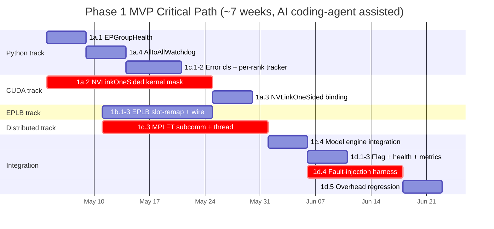
```mermaid
gantt
    title Phase 1 MVP Critical Path (~7 weeks, AI coding-agent assisted)
    dateFormat YYYY-MM-DD
    axisFormat %b %d

    section Python track
    1a.1 EPGroupHealth                   :a1, 2026-05-04, 5d
    1a.4 AlltoAllWatchdog                :a2, after a1, 5d
    1c.1-2 Error cls + per-rank tracker  :a6, after a2, 7d

    section CUDA track
    1a.2 NVLinkOneSided kernel mask      :crit, a3, 2026-05-04, 21d
    1a.3 NVLinkOneSided binding          :a4, after a3, 5d

    section EPLB track
    1b.1-3 EPLB slot-remap + wire        :a5, 2026-05-11, 14d

    section Distributed track
    1c.3 MPI FT subcomm + thread         :crit, ac3, 2026-05-11, 21d

    section Integration
    1c.4 Model engine integration        :a7, after ac3, 5d
    1d.1-3 Flag + health + metrics       :a8, after a7, 5d
    1d.4 Fault-injection harness         :crit, a9, after a7, 12d
    1d.5 Overhead regression             :a10, after a9, 5d
```

> The synthetic start date `2026-05-04` is illustrative — used only so GitHub's Mermaid renderer has valid `YYYY-MM-DD` anchors. Replace with the actual project kickoff date when scheduling.

The MVP has **three critical-path items** (marked `crit`): 1a.2 (NVLinkOneSided kernel mask), 1c.3 (MPI FT subcomm), and 1d.4 (fault-injection harness). All three are net-new and have schedule risk that cannot be mitigated by parallelism — they each gate end-to-end demonstration of one capability. Everything else can parallelize.

### Testing Strategy

| Test Type | Phase | Description |
|:----------|:------|:------------|
| Unit: rank masking kernel | 1a | AlltoAll with masked ranks produces correct results |
| Unit: EPLB reconfigure | 1b | All experts reachable after topology change |
| Unit: error classification | 1c | EP-specific errors classified correctly |
| Integration: single rank failure | 1d | Kill one rank, verify serving continues |
| Integration: multiple sequential failures | 1d | Kill ranks one at a time, verify degradation |
| Integration: process group reconstruction | 2a | Add replacement rank, verify full restoration |
| Integration: shadow EP rank activation | 2b | Shadow activates on primary failure |
| E2E: full lifecycle | 2c | Failure → survive → restore → full capacity |
| Benchmark: recovery time | 1d/2c | Measure Phase 1 and Phase 2 recovery times |
| Benchmark: steady-state overhead | 1d | Measure throughput with rank masking enabled but no failures |
| Stress: concurrent failures | 1d | Multiple ranks fail simultaneously |
| Chaos: random failure injection | 2c | Random failures during serving, verify correctness |

---

## 10. Risks and Open Questions

### Technical Risks

#### Risk 1: NVLink Kernel Modification Complexity

**Severity:** High | **Probability:** Medium

The NVLink AlltoAll kernels (`moeAlltoAllKernels.h`) are performance-critical CUDA code. Adding rank masking (a conditional branch per rank in the inner loop) could:
- Introduce thread divergence in the dispatch/combine kernels
- Interact unexpectedly with symmetric memory access patterns
- Cause correctness issues if completion flag management has race conditions with masking

**Mitigation:**
- The conditional is a single bit-test (virtually free compared to memory operations)
- Add comprehensive correctness tests before performance testing
- Benchmark rank masking overhead with all ranks active (should be <0.1% overhead)
- Keep the kernel modification minimal — don't restructure the kernel logic

<a id="risk-2-deepep-backend-limitations"></a>
#### Risk 2: DeepEP Backend Limitations

**Severity:** Medium | **Probability:** High

DeepEP only supports specific EP sizes ({2,4,8} intranode, {16,32,...,128} internode). After losing a rank, EP sizes like 31 or 71 are not supported. The `mask_buffer_ptr` API is referenced in vLLM's RFC but not in DeepEP's public API.

**Mitigation:**
- Primary target is NVLink backends (GB200/NVL72 primary production path)
- For DeepEP: fall back to NVLink or AllGatherReduceScatter backend on rank failure
- Monitor DeepEP releases for `mask_buffer_ptr` availability
- Engage with DeepSeek team if needed (they have an interest in this capability for their own production)

<a id="risk-3-process-group-reconstruction-deadlocks"></a>
#### Risk 3: Process Group Reconstruction Deadlocks

**Severity:** High | **Probability:** Medium

Destroying and recreating NCCL/NVSHMEM/MPI process groups with a dead rank is inherently risky. This is a classic example of how fault tolerance in layered systems creates recursive complexity: the cleanup path for one layer (DeepEP buffer destruction) requires coordination from the very component that has failed (the dead rank's barrier participation). Specifically:
- `MPI_Comm_split` is collective — requires all ranks in parent comm (including the dead one)
- NCCL abort may not clean up all internal state (NCCL's internal error recovery is best-effort)
- NVSHMEM symmetric memory deallocation requires all peers to release their mappings
- DeepEP `Buffer.__del__` calls `intranode::barrier` which deadlocks if peers are dead — a documented issue that requires explicit `destroy()` calls with careful ordering

**Mitigation:**
- Use MPI error handlers (`MPI_ERRORS_RETURN`) instead of default abort behavior
- Consider ULFM (User-Level Failure Mitigation) MPI extensions for fault-tolerant comm operations
- Implement coordinated teardown: all surviving ranks agree to tear down before any starts
- Phase 2 process group reconstruction only happens **after** Phase 1 has stabilized the system
- Explicit `destroy()` for all DeepEP buffers before process group teardown

#### Risk 4: Failure Broadcast Consensus

**Severity:** Medium | **Probability:** Medium

All surviving ranks must agree on which ranks are dead before applying the mask. Split-brain scenarios could cause data corruption (some ranks route to a "dead" rank that's actually just slow).

**Mitigation:**
- Use conservative detection: require both AlltoAll timeout AND MPI worker death confirmation before marking failed
- Implement two-phase failure protocol: (1) suspect → (2) confirmed
- Monotonic failure: once marked dead, cannot be marked active (until Phase 2 with new process group)
- Timeout tuning: prefer longer timeouts over false positives in Phase 1

#### Risk 5: EPLB Reconfiguration During Active Serving

**Severity:** Medium | **Probability:** Low

The `reconfigure()` method pauses the EPLB worker and compute threads. If the pause happens at the wrong time (e.g., mid-weight-migration for a different layer), GPU memory could be in an inconsistent state.

**Mitigation:**
- Reconfiguration only happens between forward iterations (model engine iteration boundary)
- EPLB worker thread checks for reconfigure signal at safe points (after completing current layer)
- Emergency reconfigure is designed to be fast — MVP slot remap <10ms, v1 with weight migration <50ms (see §6, §9) — to minimize serving interruption

#### Risk 6: MPI `COMM_WORLD` Failure-Poisoning

**Severity:** High | **Probability:** High (default MPI) | **Phase:** 1c

When a rank in `MPI_COMM_WORLD` dies, subsequent collectives on that communicator fail (or hang) on most common MPI implementations. TRT-LLM's `MPIDist` runs over `MPI.COMM_WORLD` (`tensorrt_llm/_torch/distributed/communicator.py:612`) — naive "use MPI for out-of-band failure broadcast" without further engineering hits exactly the failure mode we are trying to escape, just at a different layer. The April 2026 source review confirmed there is **no failure-tolerant communicator infrastructure in TRT-LLM today** (no `MPI_ERRORS_RETURN` handler, no `MPI_Comm_revoke`, no ULFM wiring, no dedicated FT subcomm).

**Mitigation:** Addressed by PR 1c.3 (dedicated MPI FT subcomm with `MPI_ERRORS_RETURN`, non-blocking `Isend`/`Irecv`+`Test` on a dedicated CPU thread, opportunistic ULFM `MPI_Comm_revoke`). See [§7 Option A](#option-a-out-of-band-via-mpi-failure-tolerant-subcomm-preferred) for the protocol and [§9 PR 1c.3](#9-implementation-plan) for the implementation contract.

#### Risk 7: NCCL Fault-Tolerance Not Wired

**Severity:** Medium | **Probability:** High | **Phase:** 1a (v1)

The April 2026 source review found **zero uses** of `ncclCommAbort`, `NCCL_ASYNC_ERROR_HANDLING`, `ncclCommFinalize`, or `ncclGetLastError` outside test files in TRT-LLM. The only NCCL integration is via `torch.classes.trtllm.NcclCommunicatorOp` (P2P send/recv with no error hook). The original assumption that the AllGatherReduceScatter fallback "eventually times out via NCCL" is **false** for TRT-LLM as-shipped.

**Mitigation:** Addressed by PR 1a.7 (wires `NCCL_ASYNC_ERROR_HANDLING=1` + `ncclCommAbort` + watchdog into the NCCL wrapper *before* enabling AllGatherReduceScatter as a mask-capable fallback). Until 1a.7 lands, backend-switch on rank failure routes to a different NVLink backend rather than NCCL. PR 1d.1 adds a feature-flag validator that warns if `enable_wide_ep_fault_tolerance=True` is configured against AllGatherReduceScatter as primary.

#### Risk 8: PR #12718 Sequencing Dependency

**Severity:** Medium | **Probability:** High | **Phase:** 1c

PR #12718's commits (`f32efd01e5`, `e3f84ceb02`, `1128c0ff54`, `4aab3c0afc`) introduce `tensorrt_llm/_torch/pyexecutor/error_classification.py` (`ErrorBudget` dataclass, `classify_error()` function returning string literals). These commits are **not on the `docs-and-plans` branch HEAD** as of 2026-04-21. PRs 1c.1–1c.4 import from `error_classification.py` and assume `ErrorBudget` exists.

**Mitigation:** Addressed in [§9 Prerequisites](#prerequisites) — the MVP implementation base branch must have PR #12718 merged or rebased in; otherwise a drop-in `ErrorBudget` + `classify_error()` shim is built under `_torch/pyexecutor/` and reconciled when #12718 lands. Status is tracked weekly during MVP execution.

#### Risk 9: Memory Pressure During Degraded Mode

**Severity:** Low | **Probability:** Low

Surviving ranks absorb extra experts, consuming additional GPU memory. In memory-tight deployments, this could cause OOM.

**Mitigation:**
- Memory impact is small (~140 MB per rank in FP8 for DeepSeek-V3 losing 1/72 ranks)
- For memory-constrained deployments: reduce EPLB replication factor during degraded mode
- Monitor GPU memory utilization and alert if approaching limits
- GB200 (192 GB HBM) has ample headroom

### Open Design Questions

<a id="q1-should-phase-1-use-kernel-side-or-host-side-timeout"></a>
#### Q1: Should Phase 1 use kernel-side or host-side timeout?

**Kernel-side timeout:**
- Pros: Self-contained, no additional thread, precise per-rank detection
- Cons: Requires kernel modification, less flexible, harder to debug

**Host-side watchdog:**
- Pros: No kernel change, configurable at runtime, easier to debug
- Cons: Additional thread, polling overhead, detection latency depends on poll interval

**Current recommendation:** Start with host-side watchdog for Phase 1 (simpler, lower risk). Add kernel-side timeout as an optimization in Phase 2/3 if needed.

<a id="q2-what-happens-to-in-flight-requests-during-phase-1-recovery"></a>
#### Q2: What happens to in-flight requests during Phase 1 recovery?

**Option A: Fail the current batch, retry on next iteration**
- Pros: Simplest, guaranteed consistency
- Cons: All requests in the current batch fail, even those not routed to the dead rank

**Option B: Partial batch completion — only fail requests routed to dead rank**
- Pros: Minimizes impact on unaffected requests
- Cons: Complex to implement (need to track per-token routing), may have consistency issues

**Current recommendation:** Option A for Phase 1. The current batch is already in an inconsistent state (AlltoAll didn't complete). Failing it and starting fresh with the new mask is simpler and safer. The latency impact is one batch worth of requests (~10-50 requests depending on batch size).

#### Q3: How should the failure timeout be tuned?

| Deployment | Recommended Timeout | Rationale |
|:-----------|:-------------------|:----------|
| NVL72 (single rack) | 2-3s | NVLink latency is microseconds; any timeout beyond 1s indicates real failure |
| Multi-node NVLink + RDMA | 5-10s | RDMA has occasional transient delays; need to avoid false positives |
| Development/testing | 1s | Fast detection for iteration speed |

The timeout should be configurable via environment variable (`TRTLLM_EP_FT_TIMEOUT_SEC`) and/or `MoeConfig` field.

#### Q4: Should we support DeepEP rank masking or only NVLink?

**NVLink-only (Phase 1):**
- Covers GB200/NVL72 (NVIDIA's primary production hardware)
- We own the kernel code — full control over modifications
- Unblocked by external dependencies

**DeepEP when available (Phase 2+):**
- Wait for `mask_buffer_ptr` in public API
- Multi-node deployments beyond NVL72 may use DeepEP
- Engage with DeepSeek team for timeline

<a id="q5-what-is-the-maximum-number-of-simultaneous-rank-failures-we-should-support"></a>
#### Q5: What is the maximum number of simultaneous rank failures we should support?

This depends on the redundant expert count:
- With 0 redundant experts: **0 failures** (every expert is unique to one rank)
- With 32 redundant experts (DeepSeek production): **up to ~4 failures** (depends on expert distribution)
- With 256 redundant experts (SGLang benchmark): **up to 16 failures** (50% of cluster)

**Recommendation:** Design for arbitrary number of failures (bitmask supports up to 64/128). The actual tolerance is determined by EPLB replication configuration at deployment time. Document the relationship between `num_redundant_experts` and failure tolerance.

<a id="q6-how-does-wideep-ft-interact-with-pipeline-parallelism"></a>
#### Q6: How does WideEP FT interact with pipeline parallelism?

With WideEP + PP (e.g., `tp=32, pp=2, ep=16`), each PP stage has its own EP group. A rank failure affects one PP stage's EP group but not the other's.

**Challenge:** PP requires lockstep batch processing across stages. If one EP group enters degraded mode (reduced expert computation capacity) but the other doesn't, the batch must still flow through both stages. This creates a **cross-stage capacity coupling problem**: the degraded stage becomes the bottleneck, and the healthy stage must throttle to match — effectively propagating a single EP rank's failure into a system-wide throughput reduction that exceeds the proportional loss. The interaction between PP's lockstep requirement and EP's partial-failure tolerance is a non-trivial distributed systems design challenge.

**Current recommendation:** Treat each PP stage's EP group independently. If one stage loses a rank, that stage enters degraded mode. The batch size may need to be reduced to match the degraded stage's capacity. This is an advanced configuration that can be addressed in Phase 2.

<a id="q7-how-does-wideep-ft-interact-with-disaggregated-serving"></a>
#### Q7: How does WideEP FT interact with disaggregated serving?

Production TRT-LLM disaggregated serving separates **prefill** and **decode** into independent worker pools, each with its own EP group, connected via a KV cache transceiver (NIXL / UCX / MPI). The current design implicitly assumes aggregated serving — a single EP group handling both phases — and does not address the disagg case.

**Why disagg needs its own design:**

- **Independent EP groups.** A prefill pool running `ep=32` and a decode pool running `ep=16` are two separate collectives. Rank masking and EPLB adaptation apply *within* each pool, but a failure in one pool does not propagate to the other through any shared collective. Detection and recovery must be pool-local.
- **Request state is split across pools.** At the moment of failure:
  - **Prefill rank dies mid-prompt processing:** the request's prompt context (tokenized input, early KV cache being generated) is on the dead rank. The decode pool has no KV cache for this request yet — nothing to recover; the request is lost and must be resubmitted.
  - **Decode rank dies mid-generation:** the request's in-progress generation state (partial output tokens, KV cache for both prompt and generated tokens) is on the dead rank. The prefill pool has already completed its work and moved on. Recovery requires either dropping the request, restarting from the prompt (if the prompt is still available upstream), or partial-output recovery if the orchestrator streamed tokens out.
- **In-flight KV cache transfers fail separately.** If the transceiver is mid-transfer when a rank dies, the transfer protocol (NIXL/UCX) surfaces its own failure — not an EP-level failure. The orchestration layer must correlate transfer failures with the underlying rank failure.
- **Orchestration layer must coordinate.** `trtllm-serve`'s disagg router is the only component that sees both pools. It is the natural site for cross-pool failure handling — retry policy, request rerouting to a healthy decode pool, KV cache invalidation. This is a separate codepath from the collective-level recovery in this design.

**What this design does cover in a disagg context:**

- Within each pool (prefill *or* decode), the Phase 1 MVP + Phase 1 full scope apply unchanged — the pool's EP group detects the failure, masks the dead rank, and continues serving at reduced capacity. From each pool's point of view, the design works identically to aggregated.

**What this design does not cover:**

- Cross-pool failure propagation
- In-flight request recovery when state is split across a failing pool boundary
- KV cache transfer failure handling correlated with EP-level failure
- Orchestration-layer retry / rerouting policy

**Recommendation (updated):** Disagg FT is **in scope** but on a deferred track. The primary Phase 1 track (MVP → v1) covers aggregated serving first to keep the critical path focused. Disagg FT lands as **Phase 1-DS** (see [§9](#phase-1-ds-disaggregated-serving-ft-p1)), which:

- Starts **after** Phase 1 MVP delivers per-pool survival on NVLinkOneSided
- Runs **in parallel** with Phase 1 v1 and does not block it
- Reuses the same Phase 1 primitives (EPGroupHealth, rank masking, EPLB emergency-mask) per-pool, unchanged
- Adds the cross-pool coordination layer in the orchestrator (`trtllm-serve` proxy): KV transceiver failure correlation, cross-pool failure notification, retry/reroute policy

This keeps the basic WideEP FT critical path clean while ensuring disagg is not orphaned.

### Risk Summary Matrix

The **Residual** column reports the risk level expected to remain *after* the mitigation lands, accounting for execution risk, external dependencies, and items consciously accepted as out-of-scope. Readers should prioritize rows where Residual is Medium or higher.

| Risk | Severity | Probability | Phase | Mitigation Status | Residual |
|:-----|:---------|:------------|:------|:------------------|:---------|
| NVLink kernel complexity (kMaxRanks=64, kernel 300s `trap;`) | High | Medium | 1a | Bump kMaxRanks to 128; gate `check_timeout`; comprehensive testing | **Low** — absorbed by PR 1a.2; in-repo kernel, fully in our control |
| DeepEP limitations | Medium | High | 1a | NVLink primary; DeepEP secondary | **High (accepted)** — deferred indefinitely pending public `mask_buffer_ptr` |
| PG reconstruction deadlocks | High | Medium | 2a | Coordinated teardown; ULFM MPI | **Medium** — novel work; execution risk realizes in Phase 2, not MVP |
| Failure broadcast consensus | Medium | Medium | 1c | Conservative detection; two-phase protocol | **Low** — monotonic-failure invariant + suspect/confirm protocol |
| EPLB reconfigure timing | Medium | Low | 1b | Iteration boundary only; safe points | **Low** — design constraint enforced by model-engine hook |
| **MPI `COMM_WORLD` failure-poisoning** | High | High | 1c | Dedicated FT subcomm, `MPI_ERRORS_RETURN`, non-blocking Isend/Irecv+Test on dedicated thread; opportunistic ULFM | **Low–Medium** — ULFM availability depends on linked MPI build; single-failure MVP survives without ULFM |
| **NCCL fault-tolerance not wired** | Medium | High | 1a (v1) | PR 1a.7 resized S→M; wire `ncclCommAbort` + `NCCL_ASYNC_ERROR_HANDLING` before AllGatherReduceScatter mask path | **Low** — fully in our control; v1 scope |
| **PR #12718 sequencing dependency** | Medium | High | 1c | Rebase onto #12718 or build drop-in `ErrorBudget` shim; track weekly | **Medium** — external dependency on #12718 merge cadence; shim is a workaround, not a substitute |
| Memory pressure | Low | Low | 1d | Small impact; monitor + alert | **Low** — headroom is ample on GB200 |
| False positive failure detection | Medium | Medium | 1c | Conservative timeouts; confirmation step | **Low–Medium** — tuning reduces but does not eliminate; monotonic-failure means a false positive permanently masks a live rank until Phase 2 |
| PP + WideEP interaction | Medium | Low | 2+ | Defer to Phase 2 | **Medium (deferred)** — cross-stage capacity coupling is a real design problem, unaddressed in Phase 1 |
| Disagg + WideEP FT interaction | Medium | Medium | Separate track (Phase 1-DS) | Per-pool coverage works unchanged; cross-pool coordination added in Phase 1-DS | **Low** once Phase 1-DS lands; **Medium** in the interval between MVP and DS completion |
