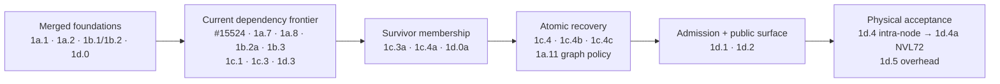

# 8. Implementation Plan

[< Back to Overview](../README.md)

This section breaks the design into named PRs. Phase 1 PRs are detailed (they're the next-to-ship work); Phase 2 PRs are sized but contingent on the audit ([§9](../09-risks-and-open-questions.md)); Phase 3 is sized at work-track level because scope will refine after Phase 2 informs what matters most.

## 8.1 Phase 1 PR breakdown

**Goal:** Correct, continued serving after one admitted non-rank-0 EP worker dies, using real NVLinkOneSided, MPI, NCCL, EPLB, PyExecutor, model, workload, and physical hardware. The failed execution epoch emits no output. Survivors resume only after a common placement, control/data-plane membership, active mask, and generation are atomically committed.

The earlier seven-week estimate predated the running-kernel, placement-admission, survivor-control, attention-DP, atomic-coordination, request-disposition, poisoned-shutdown, and rack-fabric work identified on 2026-06-30. It is retired. Rebaseline only after 1a.8, 1c.3a, and 1c.4b have reviewed implementation estimates; do not infer a fixed PR count because coherent work items may share a merge unit.

### How to read the tables

- **Size:** S (<300 LOC), M (300–1000 LOC), L (>1000 LOC or deep design/validation complexity). These are review-size signals, not a revised calendar forecast.
- **Scope tag:** **MVP** is required for the single-failure production exit gate; **v1** broadens backends, failure count, or migration behavior.
- **Deps:** every listed hard dependency must merge before the target is dependency-ready. Live readiness is proved by the [MVP dependency graph](mvp-dependency-graph.md).
- **State ownership:** detection/suspicion and committed membership are different states. Only 1c.4b commits the new mask, immutable `ActiveRankMap`, and generation after all recovery participants are ready.

### 1a — Rank masking in communication kernels

**Scope:** Provide launch-time rank masking, a running-kernel escape, coordinator-driven NCCL recovery, and a CUDA-graph policy. A mask copied into launch parameters cannot observe a failure that occurs after launch.

| PR | Title | Scope | Target | Size | Deps |
|:---|:---|:---|:---|:---|:---|
| **1a.1** | `EPGroupHealth` class | MVP | `tensorrt_llm/_torch/modules/fused_moe/ep_group_health.py` (new) | S | — |
| **1a.2** | Launch-time NVLinkOneSided kernel mask (CUDA) | MVP | `cpp/tensorrt_llm/kernels/communicationKernels/moeAlltoAllKernels.{cu,h}` | **L** | — |
| **1a.3** | Committed-mask NVLinkOneSided Python binding | MVP | `_torch/modules/fused_moe/communication/nvlink_one_sided.py`, `communication_factory.py` | S | 1a.1, 1a.2 |
| **1a.4** | Detection-only `AlltoAllWatchdog` host thread | MVP | `_torch/alltoall_watchdog.py`, `_torch/distributed/moe_alltoall.py` | S | 1a.1, 1a.2 |
| **1a.5** | NVLinkTwoSided kernel mask | v1 | `cpp/tensorrt_llm/kernels/fusedMoeCommKernels.cu`, `thop/moeCommOp.cpp` | M | 1a.2 pattern |
| **1a.6** | NVLinkTwoSided Python binding | v1 | `_torch/modules/fused_moe/communication/nvlink_two_sided.py`, `nvlink_two_sided_flashinfer.py` | S | 1a.5 |
| **1a.7** | Coordinator-driven NCCL abort/rebuild primitive | **MVP** | raw communicators, PP communicator, CP/TP paths, `AllGatherReduceScatter` | **L** | 1a.1 |
| **1a.8** | Running-kernel abort + mask-generation primitive | **MVP (promoted)** | `moeAlltoAllKernels.{cu,h}`, launch/workspace status, host integration | **L** | 1a.2 |
| **1a.9** | NIXL-EP communication strategy + factory registration | v1 (conditional on Audit 3) | `_torch/modules/fused_moe/communication/nixl_ep.py` (new), `communication_factory.py` | M | 1a.1, Audit 3 positive |
| **1a.10** | NIXL-EP topology-mutation + FT coordinator integration | v1 (conditional on Audit 3) | `_torch/modules/fused_moe/communication/nixl_ep.py` | M | 1a.9 |
| **1a.11** | Eager fallback + generation-scoped graph invalidation/recapture | **MVP (promoted)** | `_torch/pyexecutor/py_executor.py`, `_torch/pyexecutor/model_engine.py`, CUDA graph cache | M | 1a.7, 1a.8 |

**Status (June 30, 2026):**
- **1a.1 is merged as PR #13302** — `EPGroupHealth` thread-safe rank mask landed on 2026-06-17 PDT.
- **1d.0 is merged as PR #14160** — MPI signal handler replacement landed on 2026-06-22 PDT.
- **1b.1 + 1b.2 are merged as PR #15525** — C++ and Python mask-only reconfigure APIs landed on 2026-06-29 PDT.
- **1a.2 is merged as PR #13404** — NVLinkOneSided kernel mask landed on 2026-06-30 PDT.
- **1a.3 + 1a.4 are draft PR #15524** — Python rank-mask wiring plus a detection-only `AlltoAllWatchdog`; corrected head `d19aadea` is rebased on merged #13404, binds dispatch/combine to one committed generation, has green DCO/pre-commit, and has `blossom-ci` pending.
- **1c.1 is open as PR #15677** — EP-specific error classification patterns; review required and `blossom-ci` pending.
- **1a.7 is draft PR #15789** — NCCL fault-tolerance wrapper; dependency-ready with `blossom-ci` pending.
- **1c.3 is draft PR #15785** — detection-only MPI FT subcommunicator and broadcast thread; corrected head `ee9aa0a4` uses a distinct monotonic `DetectedRankState`, is dependency-ready, has green DCO/pre-commit, and has `blossom-ci` pending.
- **1d.3 is draft PR #15788** — passive committed-membership telemetry; corrected head `94274a3f` is dependency-ready, has green DCO/pre-commit, and has `blossom-ci` pending.

**Why two work items share one PR:**

- **#15524 carries 1a.3 + 1a.4** because the watchdog consumes the exact completion-flag layout and lifecycle exposed by the Python `MoeAlltoAll`/NVLinkOneSided binding. Splitting them would create a temporary binding with no production consumer or a watchdog coupled to an unstable private workspace contract, and would duplicate the same integration tests. The PR still preserves two reviewable concepts and two JIRA identities. Correction head `d19aadea` removes the unsafe detected-to-committed state coupling and binds each dispatch/combine pair to one atomic committed mask/generation snapshot.
- **#15525 carries 1b.1 + 1b.2** because the nanobind/Python wrapper is the callable surface and validation contract for the C++ `reconfigure_mask_only` entry point. Landing either half alone would be unusable or untestable in the production Python path and would expose an ABI without its error handling. The merged PR preserves both item IDs and their separate JIRA tracking.

These are coherent API-boundary consolidations, not a rule that unrelated work should share a PR. New survivor membership, coordination, and request-lifecycle items remain independently reviewable unless a similarly inseparable boundary is documented.

**Corrected contracts:**

- **1a.2 / #13404 is necessary but not sufficient.** It copies `active_rank_mask` into the dispatch/combine launch structures. It safely skips ranks already absent at launch; it cannot release a kernel already polling a peer that dies after launch. Its masked-token `-1`/zero-fill behavior is an internal abort artifact, never valid model output.
- **1a.3 reads only coordinator-committed membership.** Dispatch and combine for one execution epoch use one mask/generation snapshot; an asynchronous mismatch aborts the epoch.
- **1a.4 emits failure evidence through a callback.** It may read committed membership to know which peers are expected, but it never calls `mark_failed()` on the committed `EPGroupHealth` object.
- **1a.7 is a manual transport primitive.** It aborts and rebuilds raw NCCL communicators for a coordinator-supplied survivor map and generation. It does not detect failures, reconfigure EPLB, rebuild ordinary MPI/attention-DP membership, dispose requests, or publish a mask.
- **1a.8 is an MVP correctness gate.** A stable device-visible abort/generation must be observable inside the running polling loops, produce a bounded recoverable return, and avoid `trap;`/CUDA-context poisoning.

- **1a.9 / 1a.10 are conditional on Audit 3** ([§9.1](../09-risks-and-open-questions.md#audit-3--nixl-ep-evaluation-as-cross-ib-data-plane-backend)). The NIXL team has built NIXL-EP, and vLLM uses it as an FT-enabled backend. A bounded 2-week parallel evaluation track (E1–E5 in Audit 3) decides whether NIXL-EP becomes the Phase 1-IB cross-IB transport or is declined. If positive, these PRs integrate its verified `disconnect_ranks` / `connect_ranks` topology lifecycle—not `activeRanks` masking—with the coordinator, EPLB, and failure-notification path. The evaluation does not gate the NVL72 MVP.

- **1a.11 is an MVP correctness and availability gate.** Graphs captured against an old communicator or membership generation are invalid. Recovery resumes in eager mode, then recaptures compatible graphs; the prototype initially forces eager mode. No stale graph may execute after the generation commit.

### 1b — EPLB topology adaptation

**Scope:** Add mask-only reconfiguration, prove the single-failure placement invariant before admission, and prepare/commit placement only under the recovery coordinator. Full online weight migration remains v1.

| PR | Title | Scope | Target | Size | Deps |
|:---|:---|:---|:---|:---|:---|
| **1b.1** | `reconfigure_mask_only` C++ entry point | MVP | `cpp/tensorrt_llm/kernels/moeLoadBalance/moeLoadBalanceKernels.{cu,h}` | M | — |
| **1b.2** | Python wrapper for mask-only reconfigure | MVP | `_torch/modules/fused_moe/moe_load_balancer.py` | S | 1b.1 |
| **1b.2a** | FT placement invariant + startup/recovery admission | **MVP (new)** | EPLB placement metadata, config validation, failure-domain map | M | 1b.1, 1b.2 |
| **1b.3** | Iteration-boundary EPLB prepare/commit integration | MVP | `_torch/modules/fused_moe/moe_load_balancer.py`, `_torch/pyexecutor/model_engine.py` | M | 1b.1, 1b.2 |
| **1b.4** | Mutable `MoeLoadBalanceMetaInfo` (epSize/epRank rewrite) | v1 | `moeLoadBalanceKernels.{cu,h}`, `moeLoadBalanceCommon.h` | **L** | 1b.1 |
| **1b.5** | Full `reconfigure(emergency_mode)` online | v1 | `moeLoadBalancer.cpp`, `moe_load_balancer.py` | M | 1b.4 |
| **1b.6** | Weight migration path (cudaMemcpy2D + gdrcopy) | v1 | `moeLoadBalancer.cpp`, `HostMoeTensorSharer` integration | **L** | 1b.5 |
| **1b.7** | Zero-replica expert handling | v1 | `moeLoadBalancer.cpp`, `moe_load_balancer.py` | M | 1b.5 |

**Admission invariant, not replication shorthand.** A 72-rank configuration with four slots per rank has 288 slots for 256 experts: only 32 copies beyond the first copy, so at least 224 experts can be singletons. Even a larger aggregate slot count does not prove anti-affinity. Item 1b.2a must check every layer and expert against the declared single-rank failure scope and verify that a surviving copy exists on a distinct failure domain. The FT mode fails closed if that proof is absent. PR #15525 already fails closed when reconfiguration finds no survivor; it does not establish the startup invariant by itself.

### 1c — Detection, survivor membership, and recovery coordination

**Scope:** Keep failure evidence separate from committed membership, rebuild survivor-only management collectives, coordinate an atomic recovery generation, and define failed-request behavior.

| PR | Title | Scope | Target | Size | Deps |
|:---|:---|:---|:---|:---|:---|
| **1c.1** | EP-specific error classification patterns | MVP | `_torch/pyexecutor/error_classification.py` | S | PR #12718 merged |
| **1c.2** | `EPRankHealthTracker` per-rank budgets | MVP | `_torch/pyexecutor/ep_rank_health.py` (new) | S | 1c.1 |
| **1c.3** | Failure-notification MPI subcomm + broadcast thread | MVP | `_torch/pyexecutor/ep_failure_broadcast.py`, `_torch/distributed/communicator.py` | **L** | 1a.1, 1d.0 |
| **1c.3a** | Survivor control communicator + immutable `ActiveRankMap` | **MVP (new)** | `_torch/distributed/communicator.py`, MPI control abstractions | **L** | 1c.3 |
| **1c.4** | Model-engine recovery hook | MVP | `_torch/pyexecutor/model_engine.py` | M | 1a.3, 1a.4, 1b.3, 1c.2, 1c.3 |
| **1c.4a** | Survivor-aware attention-DP/PyExecutor membership | **MVP (new)** | `py_executor.py`, `model_engine.py`, ADP rank-state/request/input gathers | **L** | 1c.3a |
| **1c.4b** | Atomic recovery coordinator | **MVP (new)** | recovery state machine across model engine, EPLB, MPI, NCCL, mask, graphs | **L** | 1a.7, 1a.8, 1a.11, 1b.2a, 1c.4, 1c.4a |
| **1c.4c** | Failed epoch + request disposition | **MVP (new)** | PyExecutor request lifecycle, error propagation, retry/reroute boundary | M | 1c.4b, PR #12718, PR #13119 |
| **1c.5** | Iteration-barrier piggyback broadcast | v1 | `_torch/pyexecutor/ep_failure_broadcast.py` | M | 1c.3 |
| **1c.6** | Multi-failure consensus (two-phase suspect/confirm) | v1 | `_torch/pyexecutor/ep_failure_broadcast.py` | M | 1c.3 |

**Control-plane boundary.** PR #15785 / 1c.3 disseminates and reconciles failure evidence in a dedicated thread. Its detected-health object is not the committed `EPGroupHealth`, and “detection reconciled” does not authorize resume. Item 1c.3a builds the survivor-only communicator and rank map used by ordinary management collectives. Item 1c.4a then removes the failed rank from the blocking rank-state, new-request, batch-size, token-count, and model-input gathers used by attention-DP/PyExecutor.

**Atomic state machine.** Item 1c.4b is the only writer of committed membership:

`detect → abort failed epoch → reconcile evidence → validate admission → quiesce → prepare EPLB → rebuild survivor control/NCCL → apply graph policy → commit mask + ActiveRankMap + generation → apply request disposition → resume`.

Item 1c.4c guarantees that no partial or zero-filled logits from the failed epoch reach a client. It preserves queued work when safe, and applies explicit retry, reroute, or request-error semantics to in-flight work.

### 1d — Integration, productionization, end-to-end validation

**Scope:** Gate supported deployments, make poisoned-world shutdown deterministic, expose passive health, and prove the complete path on real hardware.

| PR | Title | Scope | Target | Size | Deps |
|:---|:---|:---|:---|:---|:---|
| **1d.0** | MPI signal handler replacement | **MVP** | `cpp/tensorrt_llm/runtime/utils/mpiUtils.cpp` | S | — |
| **1d.0a** | Poisoned-MPI lifecycle + shutdown | **MVP (new)** | MPI wrappers, launcher/worker teardown, `mpi4py` finalization policy | M | 1d.0, 1c.3 |
| **1d.1** | Unified feature + deployment admission gate | MVP | `llm_args.py`, launcher, backend selection, MNNVL/EPLB validation | M | 1b.2a, 1c.4b, 1d.0a |
| **1d.2** | `check_health()` degraded reporting | MVP | `_torch/pyexecutor/py_executor.py`, `trtllm-serve` health endpoint | S | 1c.4b |
| **1d.3** | Passive committed-membership telemetry / metrics | MVP | `_torch/ep_metrics.py`, rank-0 RPC, Prometheus hook | M | 1a.1 |
| **1d.4** | Real-component 4+ GPU fault-injection E2E | **MVP (expanded)** | integration fixture, real model/workload/server, process death, correctness assertions | **L** | 1c.4c, 1d.0a–1d.3 |
| **1d.4a** | NVL72 FABRIC/IMEX process-death + peer-memory-containment acceptance | **MVP (new ship gate)** | NVL72/equivalent rack, IMEX setup, real process death plus an approved peer-memory-invalidation/device-loss injection and event trace | **L / hardware-gated** | 1d.4, NVL72 resource, approved destructive-fault method |
| **1d.5** | Steady-state overhead regression | MVP | same test area | M | 1a.3, 1a.4, 1a.8, 1a.11, 1d.1 |
| **1d.6** | Multi-failure stress + chaos suite | v1 | same test dir | M | 1c.6, 1b.4–1b.7 |
| **1d.7** | Cross-model matrix (DS-V3, DS-R1, others) | v1 | `tests/integration/test_lists/` | S | 1d.4 |

**Lifecycle and admission.** Merged 1d.0 removes the old handler's explicit `MPI_Abort`/parent-kill path, but Audit 1a proved that the tested default `mpirun` can still terminate survivors on abnormal exit. It also does not make `MPI_Finalize` or world collectives safe; 1d.0a owns that lifecycle. Item 1d.1 standardizes on `TLLM_FAULT_TOLERANCE_MODE` and fails closed unless MPI provides the required thread level, the launcher/runtime mode is proven to preserve survivors, the selected MoE backend is supported, placement admission passes, HBM/fabric prerequisites are present, graph policy is configured, and the victim/front-end policy is satisfied. MVP testing kills a non-rank-0 worker unless an external front end provides rank-0 failover. Unsupported MegaMoE/DeepEP routes must be rejected or diverted to their explicit track.

**E2E proof.** Item 1d.4 uses real worker processes, a real model and representative requests, real CUDA/MNNVL/NCCL/MPI/EPLB code, and physical GPU fault injection. It asserts no output from the failed epoch, explicit request disposition, correct post-recovery tokens, continued HTTP-visible service, common generation, and recovery timing. Item 1d.4a repeats process-death acceptance on the production FABRIC/IMEX path and separately uses a lab-approved IMEX-grant revocation, GPU reset/isolation, or equivalent injection that makes peer memory inaccessible. If that injection cannot be run safely or survivor CUDA-context containment fails, Q3 remains an explicit fail-closed/restart case; process death alone cannot prove it. Mocks remain useful for unit tests but cannot satisfy either exit gate.

### Phase 1 MVP critical path

The exact action frontier, edge state, and live PR qualifiers are maintained in the [MVP dependency graph](mvp-dependency-graph.md). As of this snapshot, #13404 is merged and makes 1a.8 and #15524 dependency-ready. The remaining schedule is driven by the running-kernel escape, survivor control/ADP membership, the recovery coordinator, and two physical-hardware acceptance gates—not by #13404 alone.

### No-mock end-to-end prototype

The integration branch `WideEP-FT/e2e-mvp-prototype` starts from current upstream `main` (which contains merged #13404 and #15525) and stacks the published heads of #15524, #15677, #15785, #15789, and #15788. It is a reference implementation and hardware test vehicle, not a merge unit. Corrections land in their owning PRs first and are then restacked into this branch.

Unlike historical draft [#14198](https://github.com/NVIDIA/TensorRT-LLM/pull/14198), the new prototype must use real worker processes, real communication and load-balancing components, a realistic model/workload, and physical GPU fault injection. Its first runnable policy may force eager mode. Missing 1a.8, 1b.2a, 1c.3a, 1c.4a–1c.4c, and 1d.0a are implemented as production-shaped slices that guide their owning PRs, not replaced by mocks. See the [prototype plan](../mvp-prototype-plan.md).

The prototype can expose integration defects and provide timing evidence, but only merged production items plus 1d.4/1d.4a acceptance satisfy MVP completion.

## 8.2 Phase 2 PR breakdown

**Scope:** Full N-rank restoration via process-group reconstruction + replacement rank (optionally accelerated by MX-GMS shadow + GMS zero-copy).

**Status:** **Baseline sizes are provisional until the MNNVL teardown audits** ([§9](../09-risks-and-open-questions.md) named risk) complete. DeepEP/NVSHMEM teardown is a separate conditional audit if that backend is selected.

### 2a — Process group reconstruction

| PR | Title | Scope | Target | Size | Deps |
|:---|:---|:---|:---|:---|:---|
| **2a.0a** | MNNVL teardown audit — x86_64 intra-node POSIX-FD phase | Prereq (can start now) | ≥ 4-GPU node, production-component prototype, provisional sizing report | **M** | — |
| **2a.0b** | MNNVL teardown audit — Grace/aarch64 rack FABRIC/IMEX validation | Prereq | NVL72 (or equivalent) access, final ship/sizing report | S | 2a.0a; NVL72 access |
| **2a.1** | Coordinated NCCL teardown for replacement lifecycle | 2 | `_torch/distributed/*` | M | corrected MVP, 1a.7, 1a.11 |
| **2a.2** | MNNVL teardown + reallocate + handle re-exchange | 2 | `tensorrt_llm/_mnnvl_utils.py`, kernel launch path | **L** (audit-dependent) | 2a.0a (sizing); 2a.0b (final ship gate) |
| **2a.3** | NVSHMEM safe deallocation (if DeepEP in scope) | 2 (deferred) | NVSHMEM wrappers | M | 2a.0a |
| **2a.4** | DeepEP explicit `destroy()` sequencing | 2 (deferred) | `deep_ep.py`, `deep_ep_low_latency.py` | S | 2a.1 |
| **2a.5** | NVLink workspace deallocation | 2 | NVLink backend teardown | S | 2a.1 |
| **2a.6** | Full-N process-group creation + replacement join | 2 | `CommunicationFactory` | M | Baseline: 2a.1, 2a.2, 2a.5, 1c.3a, 1c.4b; add 2a.3/2a.4 only if DeepEP remains in scope |
| **2a.7** | EPLB full rebalance after PG rebuild | 2 | `moe_load_balancer.py` (uses 1b.5) | S | 2a.6, 1b.5 |
| **2a.8** | Second-failure-during-rebuild handling | 2 | rebuild coordinator | M | 2a.6 |

**2a.0 is the audit, split by hardware dependency.**

- **2a.0a (intra-node, can start immediately).** ~1 week on any ≥ 4-GPU NVLink-connected node (DGX H100/A100/B200). Validates NCCL rebuild, MPI signal-handler replacement, `cuMemUnmap` semantics under owner death, DeepEP destructor mitigation, intra-node MNNVL teardown + rebuild prototype, NVSHMEM teardown semantics. **Output sizes Phase 2 PRs within ±20%** — Phase 2 v0 planning can proceed against this.
- **2a.0b (rack-fabric validation).** ~2–3 days of NVL72 (or equivalent) time. Confirms intra-node results extrapolate to rack scale; validates 72-rank scale-specific behavior; resolves the provisional-sizing caveat on PR 2a.2 definitively.

Sequencing benefit: running 2a.0a first means rack time is targeted validation, not from-scratch prototyping. See [§9.1 Audit 1](../09-risks-and-open-questions.md#audit-1--baseline-mnnvl-teardown-and-rack-containment-capability) for the day-by-day plan and full deliverable list.

### 2b — MX-GMS Shadow EP Ranks

| PR | Title | Scope | Target | Size | Deps |
|:---|:---|:---|:---|:---|:---|
| **2b.1** | Shadow EP rank lifecycle — pre-load via GMS RO | 2 | Shadow worker spawn path; GMS client integration | M | MX-GMS Phase 2 |
| **2b.2** | Shadow health-check loop monitoring primary | 2 | `shadow_ep_rank.py` (new) | S | 2b.1 |
| **2b.3** | Activation path: GMS RO→RW upgrade → join PG → serve | 2 | `shadow_ep_rank.py` | M | 2b.1, 2a.6 |
| **2b.4** | MX P2P fallback for cross-node replacement | 2 | MX client integration; identity matching with `ep_rank` | M | MX-GMS Phase 1 |

**Soft dependencies:** MX-GMS Phase 2 (GMS) for 2b.1; MX-GMS Phase 1 (MX P2P) for 2b.4. Phase 2 works without MX-GMS at minutes-class latency ([§6.3](../06-phase-2-full-restoration.md#63-shadow-rank--gms-roles)).

### 2c — Orchestrator integration

| PR | Title | Scope | Target | Size | Deps |
|:---|:---|:---|:---|:---|:---|
| **2c.1** | Replacement rank provisioning API | 2 | orchestrator hooks (K8s/Ray/Dynamo) | M | 2a.6 |
| **2c.2** | Baseline join protocol for a disk- or GMS-loaded replacement | 2 | replacement handshake + 2a.6 join path | M | 2c.1, 2a.6; 2b.3 optional acceleration |
| **2c.3** | E2E test: Phase 1 + Phase 2 full lifecycle | 2 | `tests/integration/defs/fault_tolerance/test_phase2_restoration.py` | M | 2c.2, 2a.7 |

### Phase 1-DS — Disaggregated serving FT

**Goal:** Extend Phase 1 to disaggregated serving. Starts after Phase 1 MVP; parallelizable with Phase 1 v1.

**Scope:** Corrected Phase 1 primitives apply within each disaggregated pool, including detected-versus-committed state, survivor membership, atomic generation commit, and failed-epoch disposition. The DS track adds cross-pool coordination in `trtllm-serve`: KV-transceiver failure correlation, notification, and retry/reroute policy.

| PR | Title | Scope | Target | Size | Deps |
|:---|:---|:---|:---|:---|:---|
| **DS.1** | Per-pool FT validation harness | DS | `tests/integration/defs/fault_tolerance/test_disagg_per_pool.py` (new) | S | 1d.4 |
| **DS.2** | KV transceiver failure surface audit + classification | DS | `_torch/pyexecutor/kv_cache_transceiver.py`, `error_classification.py` | M | 1c.1 |
| **DS.3** | Cross-pool failure notification | DS | `trtllm-serve` proxy | M | DS.2 |
| **DS.4** | Request retry/reroute policy on rank failure | DS | `trtllm-serve` proxy | M | DS.3 |
| **DS.5** | KV transfer cancellation on rank failure | DS | `_torch/pyexecutor/kv_cache_transceiver.py` | M | DS.2 |
| **DS.6** | Disagg E2E fault-injection test | DS | `tests/integration/defs/fault_tolerance/test_disagg_ft.py` (new) | M | DS.1–DS.5 |

**Caveat:** Ray + disagg + NIXL is unsupported today (per research pass report — `test_disaggregated.py:597`). If Phase 1-DS ships on Ray, this gap is a prerequisite. On MPI, no such gap.

### Phase 1-IB — Cross-IB transport coverage (NIXL-EP track)

**Status:** Conditional parallel track, similar in shape to Phase 1-DS but specifically scoped to deployments where the L3 transport is **DeepEP-family over InfiniBand** (because cross-node NVLink is not up, so MNNVL is unavailable; see [§1.1 Transport selection](../01-user-journey-and-stack.md#transport-selection-what-trt-llm-actually-picks-today)). Gated on Audit 3 (NIXL-EP) outcome. **Not committed engineering capacity yet** — listed so the gap is visible.

**Why this is a separate track.** On `NVLinkOneSided`/`NVLinkTwoSided`, PR 1a.2 supplies one transport primitive inside the full corrected recovery transaction; on `AllGatherReduceScatter`, PR 1a.7 supplies the NCCL primitive. Neither alone closes failed-epoch, placement, survivor-control, graph, coordination, disposition, or lifecycle gaps. Neither primitive covers the DeepEP-family transport selected on multi-node B200+IB and similar cross-IB deployments—TRT-LLM does not own that kernel. Two viable mitigation paths:

- **NIXL-EP** (preferred). vLLM PR #35627 verified API surface: `connect_ranks` / `disconnect_ranks` for incremental topology mutation, with `torch.distributed.TCPStore` dependency. MNNVL substrate landed in ai-dynamo/nixl#1415 (merged 2026-04-05); production NVL72 maturity still in flight per ai-dynamo/nixl#1655 (open 2026-05-19). Today's sweet spot is exactly cross-IB transport.
- **DeepEP 100s static kernel-timeout interim** (fallback). vLLM PR #38534 pattern — the backend timeout avoids an unbounded spin and surfaces a recoverable failure path. It is softer than `trap;` and does not require a public NVSHMEM `mask_buffer_ptr`, but it does not provide a tight recovery bound.

For this transport, **the data-plane topology lifecycle can collapse into one scale-down/scale-up API**: after coordinator quiescence, `disconnect_ranks` removes the dead rank and later `connect_ranks` adds a replacement. The full system still needs evidence reconciliation, admission/EPLB policy, control membership, graph policy, request disposition, and lifecycle handling. This differs from the MNNVL kernel-mask transport; see [§3.5](../03-failure-modes-and-gaps.md#35-transport-determines-mechanism).

**Scope (conditional, ~4–6 PRs):** the detected-versus-committed state boundary, 1c.4b coordinator contract, signal-handler foundation, and notification plane carry across. The MNNVL completion-flag watchdog does **not** apply unchanged: NIXL-EP needs backend error/topology signaling, while IB.1 relies on the DeepEP timeout path. EPLB redistribute (DP/EP scale-down style) replaces `reconfigure_mask_only` because topology actually mutates.

| PR | Title | Scope | Target | Size | Deps |
|:---|:---|:---|:---|:---|:---|
| **IB.1** | DeepEP kernel-timeout interim (vLLM #38534 pattern, ~100 s static timeout) | IB (interim) | `_torch/modules/fused_moe/communication/deep_ep.py`, `deep_ep_low_latency.py` | M | Phase 1 MVP |
| **IB.2** | NIXL-EP backend integration — preferred path if Audit 3 positive | IB | covered by PRs 1a.9–1a.10 (see [§9.1 Audit 3](../09-risks-and-open-questions.md#audit-3--nixl-ep-evaluation-as-cross-ib-data-plane-backend)) | M+M | Audit 3 positive; needs `torch.distributed.TCPStore` co-existence with MPI orchestrator OR Ray pivot for this deployment |
| **IB.3** | DeepEP `Buffer` lifecycle hardening (explicit `destroy()` ordering for FT) | IB | `_torch/modules/fused_moe/communication/deep_ep.py` | S | IB.1 |
| **IB.4** | B200 NVL8 + IB fault-injection harness | IB | `tests/integration/defs/fault_tolerance/test_b200_ib_ft.py` | M | IB.1 or IB.2 |
| **IB.5** | Phase 1-IB documentation + deployment guide | IB | `examples/wide_ep/README.md` extension | S | IB.4 |
| **IB.6** | Topology-aware EPLB integration (sync with Peiheng/Dongxu's roadmap) | IB | `moe_load_balancer.py` | M | IB.1 or IB.2; coordination |

**Calendar:** ~4 weeks for IB.1 path (interim); ~6 weeks for IB.2 path (includes Audit 3 + integration; possibly + TCPStore-alongside-MPI work or Ray pivot for this scenario). Runs after Phase 1 MVP and in parallel with v1 / Phase 1-DS. Not a blocker for either.

**NVL72 path stays on the corrected MVP architecture.** Even if NIXL-EP matures, NVL72 production retains the owned NVLinkOneSided path: running-kernel escape, admitted EPLB placement, survivor control/NCCL membership, and atomic generation commit. No sub-10-second bound is claimed until 1d.4a measures the FABRIC/IMEX path at rack scale.

## 8.3 Phase 3 rough plan

Phase 3 is sized at work-track granularity because scope will refine post-Phase-2.

| Track | Scope | Rough size | Prereq |
|:---|:---|:---|:---|
| **3a** Telemetry foundation + latency anomaly detection | Shared per-rank ring buffer (CUDA events + NVML signals + EPLB stats) consumed by 3a / 3e / 3f; 3×-median detector; alerting hook | 3–4 weeks | Phase 2 complete |
| **3b** Preemptive expert migration | Reuses Phase 1 v1 weight-migration path; adds drain-state + hot-expert prioritization | 2–3 weeks | 3a, 1b.6 |
| **3c** Elastic scaling up | Reuses Phase 2 rebuild for N → M > N; orchestrator API | 3–4 weeks | Phase 2, 2c.1 |
| **3d** Elastic scaling down | Combines 3b drain + Phase 1 mask; orchestrator API | 2–3 weeks | 3b |
| **3e** Predictive failure detection | Consumes 3a telemetry + historical NVML; rule-based predictor first, ML model later | 3–4 weeks + telemetry infra | 3a, telemetry infra |
| **3f** Straggler mitigation (forward-looking, [§7.5](../07-phase-3-beyond-failover.md#75-straggler-mitigation-forward-looking)) | **Detailed design TBD.** Lightweight first cut = Option A (latency-aware routing) + Option D (tail-cutting timeout). Option C (shadow rank as performance hot-spare) lands "for free" once §6.3 is done. **Option B (speculative redundant compute) is research-grade — own design doc, ~10–14 weeks if pursued.** | A+D: ~6–7 weeks. A+D+C: ~10–13 weeks. With B: +10–14 weeks. | 3a (telemetry), §6.3 for C, settled open questions in §7.5 for B |

**Total Phase 3:** ~3 months engineering for 3a–3e (the Phase 3 originally scoped); ~5 months if Phase 3.5 lands the lightweight straggler track (3f's A + D); 7–9 months if Option B speculative compute is added. All gated on production experience from Phases 1 and 2 to prioritize correctly. Not on the MVP critical path.

## 8.4 Timeline summary

The 2026-06-30 correction invalidated the old MVP item count and calendar estimate. Parallel work is still expected, but calendar totals must be re-estimated from reviewed scopes for the new critical items. Work-item count is not PR count: #15524 and #15525 already demonstrate that a coherent merge unit can carry two separately tracked items.

| Phase | PRs | Calendar time | Depends on | Deliverable |
|:---|:---|:---|:---|:---|
| **Phase 1 MVP (v0)** | **27 work-item IDs**: 1a.1–1a.4, 1a.7–1a.8, 1a.11; 1b.1–1b.3 including 1b.2a; 1c.1–1c.4c; 1d.0–1d.5 including 1d.0a/1d.4a | **Rebaseline required** after 1a.8, 1c.3a, and 1c.4b sizing | Current merged foundations plus physical GPU/NVL72 access | Admitted single-rank failure; failed epoch suppressed; survivor MPI/NCCL/ADP and placement committed atomically; real-model intra-node and FABRIC/IMEX proof |
| **Phase 1 v1** | **10 unconditional items:** 1a.5–1a.6, 1b.4–1b.7, 1c.5–1c.6, 1d.6–1d.7; **2 conditional:** 1a.9–1a.10 | Rebaseline after corrected MVP | Corrected MVP exit gate | Two-sided backend, online weight migration/zero-replica recovery, multi-failure consensus and chaos/cross-model coverage; optional NIXL-EP |
| **Phase 1-DS** | DS.1–DS.6 (6 PRs) | **3–4 weeks, parallelizable with v1** | MVP landed | Disagg serving FT with cross-pool coordination |
| **Phase 2: Restoration** | 2a.0a/0b, 2a.1–2a.8, 2b.1–2b.4, 2c.1–2c.3 (17 items) | **10–14 weeks** | Phase 1 v1 complete; 2a.0a sizes the work, 2a.0b gates ship | Full N-rank restoration via PG rebuild + shadow EP ranks |
| **Phase 3: Beyond failover** | 3a–3e tracks (not per-PR sized) | **~3 months** | Phase 2 complete + telemetry infra | Prevention, elastic scale, predictive |

**PR-count rule:** publish work-item counts and live merge units separately. Do not restore the obsolete “14 MVP PRs” or full-program PR total until every new work item has an agreed merge boundary.

### Caveats & honest risk framing

- **PR #12718 is merged.** It is no longer an external blocker; it remains a semantic dependency for classification and request disposition.
- **Largest remaining MVP risks** are 1a.8 running-kernel escape, 1c.3a/1c.4a survivor collectives, 1c.4b atomic coordination, 1d.0a poisoned shutdown, and the 1d.4/1d.4a physical tests. PR #13404 reduces but does not close the kernel risk.
- **Phase 2 estimates are provisional** pending 2a.0 audit. The audit is now split: **2a.0a (intra-node) can start immediately on a ≥ 4-GPU node and brings Phase 2 sizing to within ±20%**; 2a.0b (rack-fabric) needs NVL72 access to gate definitive ship sizing. If MNNVL teardown latency is worse than assumed, 2a.2 grows from L to L+ and the Phase 2 total stretches.
- **External/resource blockers** include DeepEP/NVSHMEM support for the separate IB track, NVL72/IMEX access for 1d.4a and 2a.0b, and MX-GMS availability for optional accelerated restoration.
