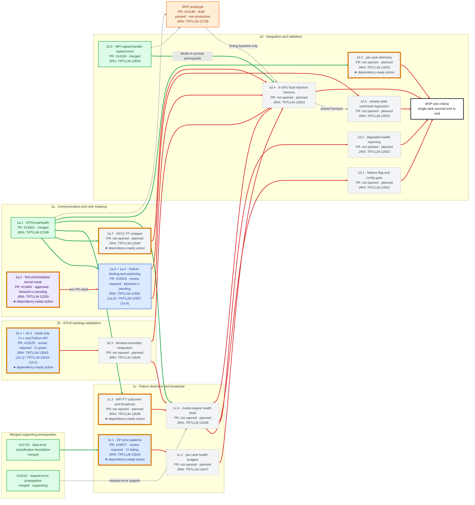

# MVP PR Dependency Graph

[< Back to WideEP Fault Tolerance](../README.md) · [Implementation plan](08-implementation-plan.md)

**Status snapshot:** 2026-06-29 12:58 PDT

**Scope:** Phase 1 MVP (v0), using the per-PR rows in [§8.1](08-implementation-plan.md#81-phase-1-pr-breakdown) as the source of truth.

This graph tracks merge units, prerequisite state, and the current action frontier. A solid arrow is a hard merge dependency. A dashed gray arrow is soft, supporting, or non-production context and does not affect dependency readiness.

**JIRA mapping snapshot:** user-provided 2026-06-29. JIRA workflow state is planning metadata; PR status colors and dependency readiness continue to come from GitHub and the declared dependency graph.

## Status colors

| Color | Status | Rule |
|:---|:---|:---|
| Green (`#dcfce7`) | **Merged** | The upstream PR has a non-null `mergedAt`. |
| Orange (`#ffedd5`) | **Draft** | A draft or preview PR that has not been opened for official review. |
| Blue (`#dbeafe`) | **Inflight — review required** | The PR is open and non-draft, but GitHub still reports `REVIEW_REQUIRED`. CI state is shown in the node when useful. |
| Purple (`#ede9fe`) | **Inflight — approved / merge-ready or CI-blocked** | GitHub reports `APPROVED`; the node states whether CI is ready or blocking. |
| Gray (`#f3f4f6`) | **Planned** | The roadmap has a named PR unit, but there is no upstream implementation PR for that unit yet. |

## Dependency-state colors

| Edge or marker | Meaning |
|:---|:---|
| Green solid edge (`#16a34a`) | The source prerequisite is merged; this edge no longer blocks the target. |
| Red solid edge (`#dc2626`) | The source prerequisite is not merged; this edge currently blocks the target. |
| Gray dashed edge (`#6b7280`) | Soft, informational, or non-production relationship; excluded from readiness. |
| Gold outline + `★` | **Candidate action:** a non-merged production node whose hard parents are all merged. Root production nodes qualify; paused/non-production nodes do not. |

The gold outline is orthogonal to PR status: the original status fill remains visible, and the node label retains review/CI details. “Candidate action” means dependency-unblocked, not necessarily merge-ready.

## Production merge graph

## Candidate actions now

| Node | JIRA tracking | PR delivery | Why dependency-unblocked | Immediate action |
|:---|:---|:---|:---|:---|
| **1a.2 / #13404** | [TRTLLM-12200](https://jirasw.nvidia.com/browse/TRTLLM-12200) · In Review · [Chien-Chun Hung](https://jirasw.nvidia.com/secure/ViewProfile.jspa?name=chienchunh) | Approved; `blossom-ci` pending | Root merge unit; no parent PR | Clear `blossom-ci`, then merge. |
| **1a.7** | [TRTLLM-12560](https://jirasw.nvidia.com/browse/TRTLLM-12560) · To Do · Unassigned | No PR; planned | Its only parent, 1a.1 / #13302, is merged | Open and implement the NCCL FT wrapper PR. |
| **1b.1 + 1b.2 / #15525** | [TRTLLM-13543](https://jirasw.nvidia.com/browse/TRTLLM-13543) · In Progress · [Chien-Chun Hung](https://jirasw.nvidia.com/secure/ViewProfile.jspa?name=chienchunh) [TRTLLM-13544](https://jirasw.nvidia.com/browse/TRTLLM-13544) · To Do · Unassigned | Review required; CI green | Standalone on `main`; no parent PR | Satisfy the remaining required reviews. |
| **1c.1 / #15677** | [TRTLLM-13546](https://jirasw.nvidia.com/browse/TRTLLM-13546) · In Progress · Unassigned | Review required; `blossom-ci` failing | Its only parent, #12718, is merged | Resolve review feedback and the failing CI run. |
| **1c.3** | [TRTLLM-13548](https://jirasw.nvidia.com/browse/TRTLLM-13548) · To Do · Unassigned | No PR; planned | Its only parent, 1a.1 / #13302, is merged | Open and implement the FT subcommunicator/broadcast PR. |
| **1d.3** | [TRTLLM-13553](https://jirasw.nvidia.com/browse/TRTLLM-13553) · To Do · Unassigned | No PR; planned | Its only parent, 1a.1 / #13302, is merged | Open and implement per-rank telemetry. |

## Live PR snapshot

| Plan ID | JIRA | Upstream PR | PR status at snapshot | Dependency role |
|:---|:---|:---|:---|:---|
| Foundation | — | [#12718](https://github.com/NVIDIA/TensorRT-LLM/pull/12718) | Merged 2026-04-27 | Provides `classify_error()` and `ErrorBudget`; the 1c.1 blocker is satisfied. |
| Supporting | — | [#13119](https://github.com/NVIDIA/TensorRT-LLM/pull/13119) | Merged 2026-04-24 | Makes request-scoped errors observable; supporting input to 1c and Phase 1-DS. |
| 1a.1 | [TRTLLM-12199](https://jirasw.nvidia.com/browse/TRTLLM-12199) | [#13302](https://github.com/NVIDIA/TensorRT-LLM/pull/13302) | Merged 2026-06-17 PDT | Shared rank-health primitive for communication, detection, and telemetry. |
| 1d.0 | [TRTLLM-13550](https://jirasw.nvidia.com/browse/TRTLLM-13550) | [#14160](https://github.com/NVIDIA/TensorRT-LLM/pull/14160) | Merged 2026-06-22 PDT | Prevents a failed rank from aborting the whole MPI world. |
| 1a.2 | [TRTLLM-12200](https://jirasw.nvidia.com/browse/TRTLLM-12200) | [#13404](https://github.com/NVIDIA/TensorRT-LLM/pull/13404) | Approved; merge state blocked while `blossom-ci` is pending | Kernel-mask critical path; also the live stack base for #15524. |
| 1a.3 + 1a.4 | [TRTLLM-12556](https://jirasw.nvidia.com/browse/TRTLLM-12556), [TRTLLM-12557](https://jirasw.nvidia.com/browse/TRTLLM-12557) | [#15524](https://github.com/NVIDIA/TensorRT-LLM/pull/15524) | Review required; `blossom-ci` pending | Combines Python/factory wiring with the watchdog and is explicitly stacked on #13404. |
| 1b.1 + 1b.2 | [TRTLLM-13543](https://jirasw.nvidia.com/browse/TRTLLM-13543), [TRTLLM-13544](https://jirasw.nvidia.com/browse/TRTLLM-13544) | [#15525](https://github.com/NVIDIA/TensorRT-LLM/pull/15525) | Review required; CI green | Combines the C++/nanobind entry point with the Python wrapper; standalone on `main`. |
| 1c.1 | [TRTLLM-13546](https://jirasw.nvidia.com/browse/TRTLLM-13546) | [#15677](https://github.com/NVIDIA/TensorRT-LLM/pull/15677) | Review required; `blossom-ci` failing | Newly opened since the June 26 roadmap status block. |
| Prototype | [TRTLLM-12728](https://jirasw.nvidia.com/browse/TRTLLM-12728) | [#14198](https://github.com/NVIDIA/TensorRT-LLM/pull/14198) | Draft, paused, `DO NOT SUBMIT` | Reference sidecar only; it does not replace any production merge unit. |

## JIRA work-item mapping

See the canonical [JIRA work-item ledger](jira-work-item-ledger.md) for all 22 supplied tickets, workflow status, assignee, milestone, and delivery-node/PR mapping.

## Tracking decisions

- The graph follows the formal `Deps` rows, with one live override: #15524 says it is stacked on #13404, so `1a.2 → #15524` is a hard edge.
- #15525 is standalone on `main`. Closed fork-only staging PRs are superseded and are not production dependencies.
- #15524 explicitly absorbs the 1a.3 Python/factory binding slice into 1a.4, and #15525 absorbs the 1b.2 Python wrapper into 1b.1. Each pair is therefore one live merge node.
- The per-PR tables enumerate 18 MVP IDs even though the timeline summary says “14 PRs.” The two live consolidations reduce the current maximum to 16 merge units; later integrations may consolidate further.
- #14198 is deliberately outside the production merge path. Its remaining resume triggers are #13404, #15524, planned 1c.3, and NVL72 access; its useful output is a timing baseline for 1d.4.

## Updating this graph

1. Refresh the timestamp and the live PR table from upstream GitHub.
2. Apply status in this order: merged → draft → approved → review required → planned.
3. Keep CI as a qualifier. A failing CI run does not make a review-required PR “approved,” and individual approvals do not override GitHub's `REVIEW_REQUIRED` decision.
4. Recompute edge state: green when the source prerequisite is merged, red when it is not, and gray dashed for non-blocking context.
5. Recompute the gold action frontier after every merge. Keep the base PR-status class as well as the `candidate` class so the gold outline does not erase status fill.
6. Mermaid `linkStyle` indices are zero-based and order-sensitive; update the index groups whenever edges are inserted or reordered.
