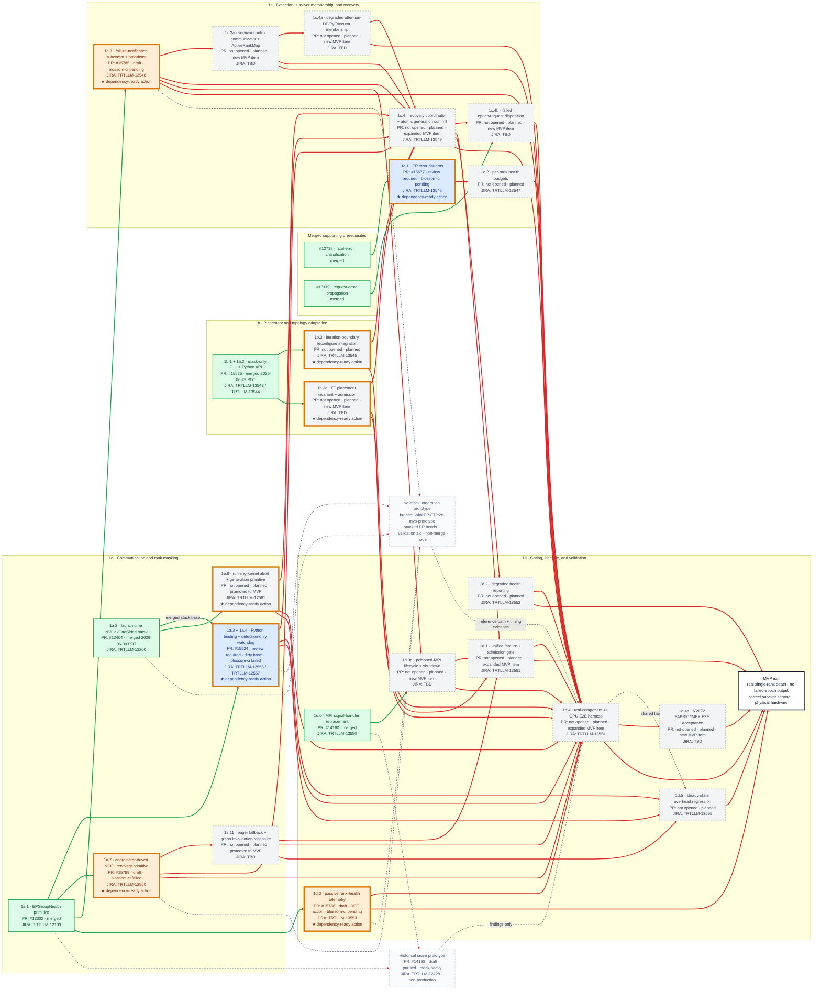

# MVP PR Dependency Graph

[< Back to WideEP Fault Tolerance](../README.md) · [Implementation plan](08-implementation-plan.md) · [Correction checklist](source-of-truth-correction-checklist.md)

**Status snapshot:** 2026-06-30 12:15 PDT

**Scope:** corrected Phase 1 MVP merge units and acceptance gates.

The implementation plan is the item-definition source of truth; this graph is the proof that those definitions, live PR states, and hard dependencies agree. A solid arrow is a hard merge dependency. A dashed gray arrow is supporting or historical context and does not affect readiness.

JIRA workflow is planning metadata from the user-provided 2026-06-29 snapshot. PR fill colors and edge state come from live GitHub state and the declared dependency model, not from JIRA status.

## Status colors

| Color | Status | Rule |
|:---|:---|:---|
| Green (`#dcfce7`) | **Merged** | The upstream PR is merged. |
| Orange (`#ffedd5`) | **Draft** | A draft PR has not been opened for official review. |
| Blue (`#dbeafe`) | **Inflight — review required** | The PR is open and non-draft, but GitHub reports `REVIEW_REQUIRED`. CI/base state is shown in the node. |
| Purple (`#ede9fe`) | **Inflight — approved** | GitHub reports `APPROVED`; the node states whether CI still blocks merge. |
| Gray (`#f3f4f6`) | **Planned** | The roadmap has a named production item, but no upstream PR is open for it. |

## Dependency-state colors

| Edge or marker | Meaning |
|:---|:---|
| Green solid edge (`#16a34a`) | The source prerequisite is merged; this edge is satisfied. |
| Red solid edge (`#dc2626`) | The source prerequisite is not merged; this edge blocks the target. |
| Gray dashed edge (`#6b7280`) | Supporting, prototype, or historical relationship; excluded from readiness. |
| Gold outline + `★` | **Candidate action:** a non-merged production item whose hard parents are all merged. Root production items qualify; prototype nodes do not. |

The gold outline is orthogonal to PR status. It means dependency-unblocked, not review-ready or CI-green.

## Production merge graph

## Candidate actions now

| Node | Delivery state | Why dependency-unblocked | Immediate action |
|:---|:---|:---|:---|
| **1a.3 + 1a.4 / #15524** | Review required; dirty base; `blossom-ci` failed | 1a.1 / #13302 and 1a.2 / #13404 are merged | Rebase onto current `main`, enforce detection-only watchdog publication, diagnose CI, then request review. |
| **1a.7 / #15789** | Draft; `blossom-ci` failed | 1a.1 / #13302 is merged | Diagnose CI, align the coordinator/generation contract, finish validation, then mark ready. |
| **1a.8** | Planned; promoted to MVP | 1a.2 / #13404 is merged | Implement a running-kernel-observable abort/generation primitive and recoverable return path. |
| **1b.3** | Planned | 1b.1 + 1b.2 / #15525 is merged | Implement iteration-boundary placement reconfiguration, but publish only through the coordinator commit. |
| **1b.3a** | Planned; new MVP item | 1b.1 + 1b.2 / #15525 is merged | Implement per-layer/per-expert survivor admission and distinct-failure-domain validation. |
| **1c.1 / #15677** | Review required; `blossom-ci` pending | #12718 is merged | Complete review and CI; keep scope limited to classification patterns. |
| **1c.3 / #15785** | Draft; `blossom-ci` pending | 1a.1 / #13302 is merged | Finish failure-notification validation and document the boundary to 1c.3a. |
| **1d.3 / #15788** | Draft; DCO action; `blossom-ci` pending | 1a.1 / #13302 is merged | Repair sign-off and keep telemetry passive; then finish draft validation. |

An action can be dependency-ready while still blocked by code correctness, review, CI, DCO, or hardware. Items downstream of any red edge must not receive the gold marker.

## Live PR snapshot

| Plan ID | Upstream PR | Live state at snapshot | Corrected delivery role |
|:---|:---|:---|:---|
| Foundation | [#12718](https://github.com/NVIDIA/TensorRT-LLM/pull/12718) | Merged 2026-04-27 | Classification foundation for 1c.1 and failed-request handling. |
| Supporting | [#13119](https://github.com/NVIDIA/TensorRT-LLM/pull/13119) | Merged 2026-04-24 | Request-error propagation used by 1c.4b. |
| 1a.1 | [#13302](https://github.com/NVIDIA/TensorRT-LLM/pull/13302) | Merged 2026-06-17 PDT | Committed-mask primitive; detection state must be separate. |
| 1a.2 | [#13404](https://github.com/NVIDIA/TensorRT-LLM/pull/13404) | **Merged 2026-06-30 PDT** | Launch-time/next-launch rank mask. A running kernel still requires 1a.8. |
| 1a.3 + 1a.4 | [#15524](https://github.com/NVIDIA/TensorRT-LLM/pull/15524) | Review required; dirty base; `blossom-ci` failed | Python mask wiring plus watchdog; must report suspicion without directly committing the data-plane mask. |
| 1b.1 + 1b.2 | [#15525](https://github.com/NVIDIA/TensorRT-LLM/pull/15525) | Merged 2026-06-29 PDT | Mask-only reconfigure APIs; they fail closed on a zero-survivor expert but do not prove admission. |
| 1c.1 | [#15677](https://github.com/NVIDIA/TensorRT-LLM/pull/15677) | Review required; `blossom-ci` pending | Pattern-only classifier slice. |
| 1c.3 | [#15785](https://github.com/NVIDIA/TensorRT-LLM/pull/15785) | Draft; `blossom-ci` pending | Failure evidence/broadcast; does not replace normal MPI/ADP collectives. |
| 1a.7 | [#15789](https://github.com/NVIDIA/TensorRT-LLM/pull/15789) | Draft; `blossom-ci` failed | Manual NCCL abort/rebuild primitive; coordinator and graph recovery remain separate items. |
| 1d.3 | [#15788](https://github.com/NVIDIA/TensorRT-LLM/pull/15788) | Draft; DCO action; `blossom-ci` pending | Passive telemetry; it must not drive recovery. |
| Historical prototype | [#14198](https://github.com/NVIDIA/TensorRT-LLM/pull/14198) | Draft, paused, `DO NOT SUBMIT` | Mock-heavy seam-finding evidence only. It is not an MVP implementation dependency. |

## Tracking decisions

- Existing JIRA-backed IDs are unchanged. New suffix items are `JIRA: TBD` until tickets are assigned.
- #15524 and #15525 each remain one merge node containing two coherent work items. Their individual item identities and JIRA tickets remain visible.
- Detection state and committed communication state are separate. Only 1c.4 may atomically publish a common mask and generation after placement and communicator readiness.
- 1a.8 and 1a.11 are MVP ship gates, not V1 polish. They are removed from the V1 delivery set.
- 1c.3 is notification/consensus; 1c.3a and 1c.4a own survivor-only control and attention-DP/PyExecutor collectives.
- 1d.4 is an intra-node real-component E2E gate. 1d.4a is the rack-fabric/IMEX acceptance gate. Neither the old nor new prototype node can satisfy those production gates by itself.

## Updating this graph

1. Refresh live PR state from upstream GitHub and timestamp the snapshot.
2. Apply node fill in this order: merged → draft → approved → review required → planned.
3. Keep CI, DCO, and base state as qualifiers; they do not change review-status color.
4. Recompute every hard edge from the source node: green only when the source PR is merged, red otherwise.
5. Recompute the gold frontier after every merge or dependency edit.
6. Recount zero-based `linkStyle` indices whenever an edge is inserted, removed, or reordered.
