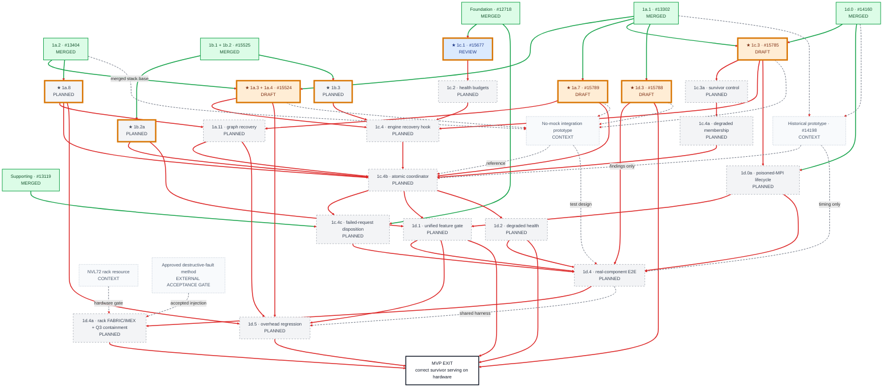
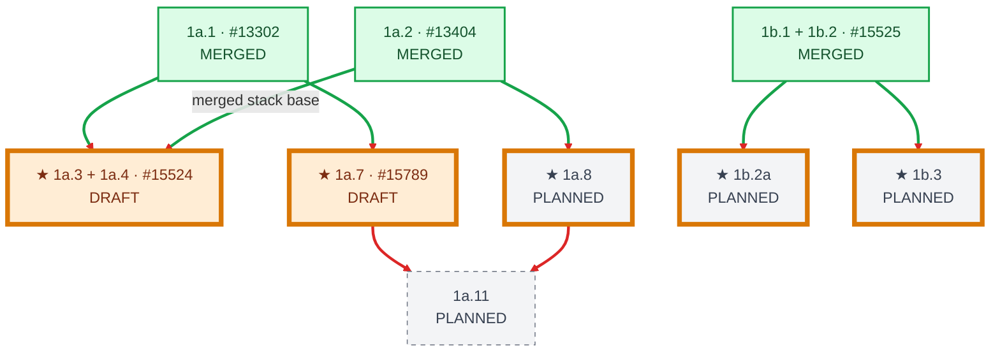
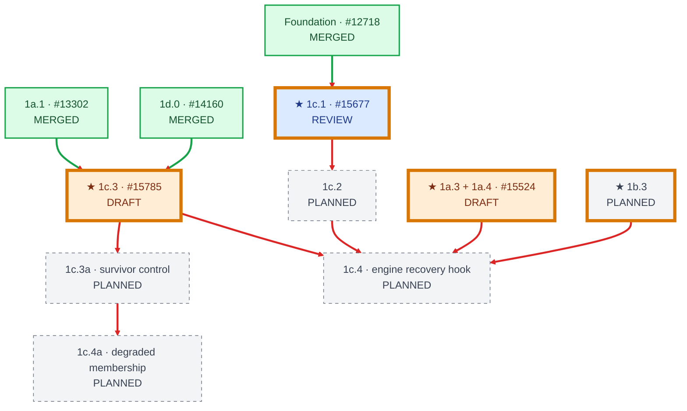
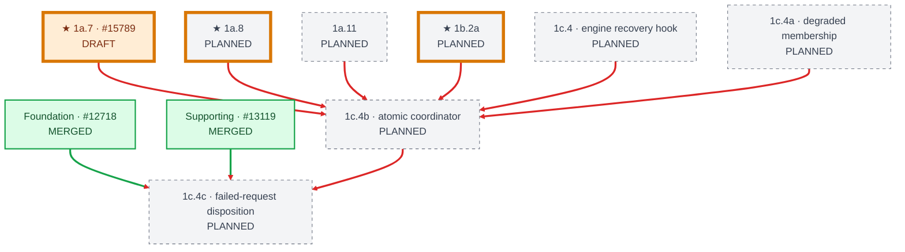
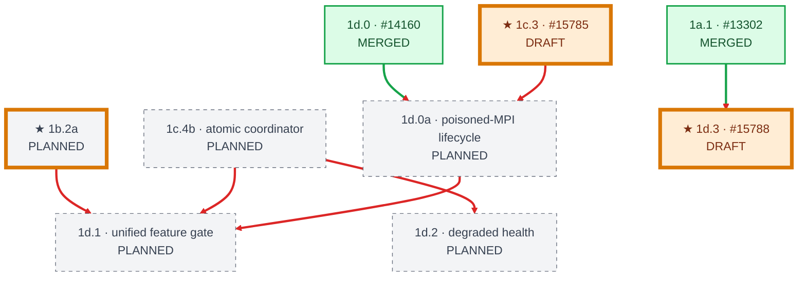
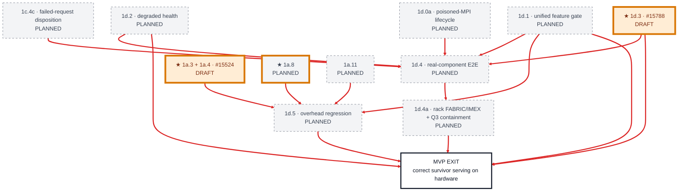
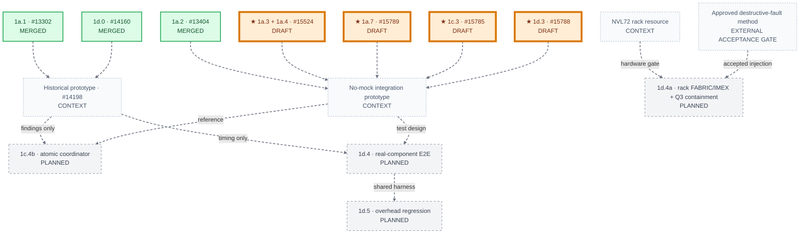

# MVP PR Dependency Graph

[< Back to WideEP Fault Tolerance](../README.md) · [Implementation plan](08-implementation-plan.md) · [Correction checklist](source-of-truth-correction-checklist.md)

**Status snapshot:** 2026-06-30 14:23 PDT

**Scope:** corrected Phase 1 MVP merge units and acceptance gates.

[Action frontier](#action-frontier) · [Holistic graph](#holistic-mvp-dependency-graph) · [Item mapping](#mvp-item-mapping-and-parent-proof) · [Detailed panels](#detailed-execution-graph) · [Candidate actions](#candidate-actions-now)

The implementation plan is the item-definition source of truth; this graph is the proof that those definitions, live PR states, and hard dependencies agree. A solid arrow is a hard merge-unit dependency. A dashed gray arrow is supporting, historical, resource, or external-acceptance context and does not affect PR dependency readiness. Same-merge-unit work-item ordering remains explicit in the item table even though it cannot be drawn as an edge between two combined nodes.

JIRA workflow is planning metadata from the user-provided 2026-06-29 snapshot. PR fill colors and edge state come from live GitHub state and this dependency model, not from JIRA status.

## Status colors

| Color | Status | Rule |
|:---|:---|:---|
| Green (`#dcfce7`) | **Merged** | The upstream PR is merged. |
| Orange (`#ffedd5`) | **Draft** | A draft PR has not been opened for official review. |
| Blue (`#dbeafe`) | **Inflight — review required** | The PR is open and non-draft, but GitHub reports `REVIEW_REQUIRED`. CI/base state is shown in the node. |
| Purple (`#ede9fe`) | **Inflight — approved** | GitHub reports `APPROVED`; the node states whether CI still blocks merge. |
| Gray (`#f3f4f6`) | **Planned** | A named production item has no upstream implementation PR yet. |

## Dependency-state colors

| Edge or marker | Meaning |
|:---|:---|
| Green solid edge (`#16a34a`) | The source prerequisite is merged; this edge is satisfied. |
| Red solid edge (`#dc2626`) | The source prerequisite is not merged; this edge blocks the target. |
| Gray dashed edge (`#6b7280`) | Supporting, prototype, historical, or resource relationship; excluded from readiness. |
| Gold outline + `★` | **Candidate action:** a non-merged production item whose hard parents are all merged. Root production items qualify; prototype/resource nodes do not. |

The gold outline is orthogonal to PR status. It means dependency-unblocked, not review-ready or CI-green.

## Action frontier

This compact view answers “what can move now?” Read each lane top to bottom. Merged prerequisites are repeated between independent lanes to eliminate crossing lines; repeated labels refer to the same merge unit. Every edge in this view is green because every shown prerequisite is merged.

```mermaid
flowchart TB
    subgraph ACTION_COMM["1a · Communication"]
        direction TB
        A11_C["1a.1 · #13302<br/>MERGED"]
        A12_C["1a.2 · #13404<br/>MERGED"]
        A134["★ 1a.3 + 1a.4 · #15524<br/>DRAFT"]
        A17["★ 1a.7 · #15789<br/>DRAFT"]
        A18["★ 1a.8<br/>PLANNED"]
        A11_C --> A134
        A12_C --> A134
        A11_C --> A17
        A12_C --> A18
    end

    subgraph ACTION_PLACE["1b · Placement"]
        direction TB
        B112_P["1b.1 + 1b.2 · #15525<br/>MERGED"]
        B12A["★ 1b.2a<br/>PLANNED"]
        B13["★ 1b.3<br/>PLANNED"]
        B112_P --> B12A
        B112_P --> B13
    end

    subgraph ACTION_CONTROL["1c · Detection and membership"]
        direction TB
        P12718_C["Foundation · #12718<br/>MERGED"]
        A11_C2["1a.1 · #13302<br/>MERGED"]
        D10_C["1d.0 · #14160<br/>MERGED"]
        C11["★ 1c.1 · #15677<br/>REVIEW"]
        C13["★ 1c.3 · #15785<br/>DRAFT"]
        P12718_C --> C11
        A11_C2 --> C13
        D10_C --> C13
    end

    subgraph ACTION_LIFECYCLE["1d · Observability"]
        direction TB
        A11_D["1a.1 · #13302<br/>MERGED"]
        D13["★ 1d.3 · #15788<br/>DRAFT"]
        A11_D --> D13
    end

    linkStyle default stroke:#16a34a,stroke-width:3px;

    classDef merged fill:#dcfce7,stroke:#16a34a,color:#14532d,stroke-width:2px;
    classDef draft fill:#ffedd5,stroke:#f97316,color:#7c2d12,stroke-width:2px;
    classDef reviewing fill:#dbeafe,stroke:#2563eb,color:#1e3a8a,stroke-width:2px;
    classDef planned fill:#f3f4f6,stroke:#6b7280,color:#374151,stroke-dasharray:5 5;
    classDef candidate stroke:#d97706,stroke-width:5px,stroke-dasharray:0;

    class A11_C,A12_C,B112_P,P12718_C,A11_C2,D10_C,A11_D merged;
    class A134,A17,C13,D13 draft;
    class C11 reviewing;
    class A18,B12A,B13 planned;
    class A134,A17,A18,B12A,B13,C11,C13,D13 candidate;
```

## Holistic MVP dependency graph

This single-canvas view shows the complete MVP relationship model. Read from top to bottom. It contains the same 49 hard dependencies shown across the five detailed panels plus all 14 dashed context/external-acceptance relationships. Dependency depth does not imply schedule or ownership; labels are abbreviated here so the whole graph remains usable.

## MVP item mapping and parent proof

This table expands the combined merge nodes so all 27 MVP work-item identities remain independently traceable. JIRA workflow and assignee remain canonical in the [JIRA work-item ledger](jira-work-item-ledger.md); delivery state comes from the upstream PR snapshot below. “None” means a root production merge unit, not that the work is optional. Entries labeled “same merge unit” are real work-item ordering constraints collapsed into one Mermaid node. External acceptance prerequisites are shown here and as dashed context because they can block ship evidence but cannot become merged PR parents or change the gold PR action frontier.

| Plan ID | Action item | JIRA | Delivery node / upstream PR | Delivery state | Hard parent(s) |
|:---|:---|:---|:---|:---|:---|
| **1a.1** | `EPGroupHealth` thread-safe committed-rank-mask primitive | [TRTLLM-12199](https://jirasw.nvidia.com/browse/TRTLLM-12199) | `A1_1`; [#13302](https://github.com/NVIDIA/TensorRT-LLM/pull/13302) | Merged | None |
| **1a.2** | Launch-time NVLinkOneSided kernel mask | [TRTLLM-12200](https://jirasw.nvidia.com/browse/TRTLLM-12200) | `A1_2`; [#13404](https://github.com/NVIDIA/TensorRT-LLM/pull/13404) | Merged | None |
| **1a.3** | Committed-mask NVLinkOneSided Python binding | [TRTLLM-12556](https://jirasw.nvidia.com/browse/TRTLLM-12556) | `A1_34`; [#15524](https://github.com/NVIDIA/TensorRT-LLM/pull/15524), shared with 1a.4 | Draft | 1a.1, 1a.2 |
| **1a.4** | Detection-only `AlltoAllWatchdog` host thread | [TRTLLM-12557](https://jirasw.nvidia.com/browse/TRTLLM-12557) | `A1_34`; [#15524](https://github.com/NVIDIA/TensorRT-LLM/pull/15524), shared with 1a.3 | Draft | 1a.1, 1a.2 |
| **1a.7** | Coordinator-driven NCCL abort/rebuild + AllGatherReduceScatter wiring | [TRTLLM-12560](https://jirasw.nvidia.com/browse/TRTLLM-12560) | `A1_7`; [#15789](https://github.com/NVIDIA/TensorRT-LLM/pull/15789) | Draft | 1a.1 |
| **1a.8** | Running-kernel abort + mask-generation primitive | [TRTLLM-12561](https://jirasw.nvidia.com/browse/TRTLLM-12561) | `A1_8`; PR TBD | Planned | 1a.2 |
| **1a.11** | Eager fallback + generation-scoped CUDA-graph invalidation/recapture | JIRA: TBD | `A1_11`; PR TBD | Planned | 1a.7, 1a.8 |
| **1b.1** | `reconfigure_mask_only` C++ entry point | [TRTLLM-13543](https://jirasw.nvidia.com/browse/TRTLLM-13543) | `B1_12`; [#15525](https://github.com/NVIDIA/TensorRT-LLM/pull/15525), shared with 1b.2 | Merged | None |
| **1b.2** | Python wrapper for mask-only reconfigure | [TRTLLM-13544](https://jirasw.nvidia.com/browse/TRTLLM-13544) | `B1_12`; [#15525](https://github.com/NVIDIA/TensorRT-LLM/pull/15525), shared with 1b.1 | Merged | 1b.1 (same `B1_12` merge unit; no external merge parent) |
| **1b.2a** | Per-layer/per-expert FT placement invariant + admission | JIRA: TBD | `B1_2A`; PR TBD | Planned | 1b.1 + 1b.2 |
| **1b.3** | Iteration-boundary EPLB prepare/commit integration | [TRTLLM-13545](https://jirasw.nvidia.com/browse/TRTLLM-13545) | `B1_3`; PR TBD | Planned | 1b.1 + 1b.2 |
| **1c.1** | EP-specific error classification patterns | [TRTLLM-13546](https://jirasw.nvidia.com/browse/TRTLLM-13546) | `C1_1`; [#15677](https://github.com/NVIDIA/TensorRT-LLM/pull/15677) | Inflight — review required | Foundation [#12718](https://github.com/NVIDIA/TensorRT-LLM/pull/12718) |
| **1c.2** | `EPRankHealthTracker` per-rank budgets | [TRTLLM-13547](https://jirasw.nvidia.com/browse/TRTLLM-13547) | `C1_2`; PR TBD | Planned | 1c.1 |
| **1c.3** | Failure-notification MPI subcommunicator + broadcast thread | [TRTLLM-13548](https://jirasw.nvidia.com/browse/TRTLLM-13548) | `C1_3`; [#15785](https://github.com/NVIDIA/TensorRT-LLM/pull/15785) | Draft | 1a.1, 1d.0 |
| **1c.3a** | Survivor control communicator + immutable `ActiveRankMap` | JIRA: TBD | `C1_3A`; PR TBD | Planned | 1c.3 |
| **1c.4** | Model-engine recovery hook | [TRTLLM-13549](https://jirasw.nvidia.com/browse/TRTLLM-13549) | `C1_4`; PR TBD | Planned | 1a.3 + 1a.4, 1b.3, 1c.2, 1c.3 |
| **1c.4a** | Survivor-aware attention-DP/PyExecutor membership | JIRA: TBD | `C1_4A`; PR TBD | Planned | 1c.3a |
| **1c.4b** | Atomic recovery coordinator and common generation commit | JIRA: TBD | `C1_4B`; PR TBD | Planned | 1a.7, 1a.8, 1a.11, 1b.2a, 1c.4, 1c.4a |
| **1c.4c** | Failed-epoch/request disposition; no partial logits | JIRA: TBD | `C1_4C`; PR TBD | Planned | Foundation #12718, supporting #13119, 1c.4b |
| **1d.0** | MPI signal-handler replacement | [TRTLLM-13550](https://jirasw.nvidia.com/browse/TRTLLM-13550) | `D1_0`; [#14160](https://github.com/NVIDIA/TensorRT-LLM/pull/14160) | Merged | None |
| **1d.0a** | Poisoned-MPI lifecycle + deterministic shutdown | JIRA: TBD | `D1_0A`; PR TBD | Planned | 1d.0, 1c.3 |
| **1d.1** | Unified feature + deployment-admission gate | [TRTLLM-13551](https://jirasw.nvidia.com/browse/TRTLLM-13551) | `D1_1`; PR TBD | Planned | 1b.2a, 1c.4b, 1d.0a |
| **1d.2** | `check_health()` degraded reporting | [TRTLLM-13552](https://jirasw.nvidia.com/browse/TRTLLM-13552) | `D1_2`; PR TBD | Planned | 1c.4b |
| **1d.3** | Passive committed-membership telemetry / metrics | [TRTLLM-13553](https://jirasw.nvidia.com/browse/TRTLLM-13553) | `D1_3`; [#15788](https://github.com/NVIDIA/TensorRT-LLM/pull/15788) | Draft | 1a.1 |
| **1d.4** | Real-component 4+ GPU E2E harness + realistic model/workload | [TRTLLM-13554](https://jirasw.nvidia.com/browse/TRTLLM-13554) | `D1_4`; PR TBD | Planned | 1c.4c, 1d.0a, 1d.1, 1d.2, 1d.3 |
| **1d.4a** | NVL72 FABRIC/IMEX process-death + peer-memory-containment acceptance | JIRA: TBD | `D1_4A`; PR TBD | Planned | 1d.4; external ship-evidence prerequisites: NVL72/equivalent resource + approved destructive-fault method (dashed context; excluded from merge readiness) |
| **1d.5** | Steady-state overhead regression | [TRTLLM-13555](https://jirasw.nvidia.com/browse/TRTLLM-13555) | `D1_5`; PR TBD | Planned | 1a.3 + 1a.4, 1a.8, 1a.11, 1d.1 |

## Detailed execution graph

The detailed graph is split into five top-to-bottom panels so the execution sequence remains readable on GitHub. Together they contain every hard dependency exactly once. A node may repeat as a carry-in to a later panel; it always represents the same merge unit. Full titles, JIRA/PR mappings, status, and hard parents are in the complete table above; CI details and next actions remain below.

### 1. Communication and placement foundations

### 2. Detection and survivor membership

### 3. Atomic recovery and failed-request disposition

### 4. Lifecycle and product gates

### 5. Validation and MVP exit

### Supporting prototypes and resource context

These dashed relationships provide evidence or resources; they do not affect dependency readiness.

The holistic graph contains all **49 hard merge-unit dependencies** and **14 dashed non-blocking/context relationships** on one canvas. The five detailed panels repeat each hard merge-unit dependency once, and the context panel repeats each dashed relationship once. Same-merge-unit item ordering is in the 27-row proof table. External acceptance prerequisites remain dashed because they gate ship evidence rather than PR merge readiness. The action-frontier view is a compact projection of ten already-satisfied edges.

## Candidate actions now

| Node | Delivery state | Why dependency-unblocked | Immediate action |
|:---|:---|:---|:---|
| **1a.3 + 1a.4 / #15524** | Draft; corrected head `d19aadea`; DCO/pre-commit green; `blossom-ci` pending | 1a.1 / #13302 and 1a.2 / #13404 are merged | Review the detection-only, generation-bound correction; finish CI, then re-request review. |
| **1a.7 / #15789** | Draft; `blossom-ci` pending | 1a.1 / #13302 is merged | Finish CI and review of the coordinator/generation contract, then mark ready. |
| **1a.8** | Planned; promoted to MVP | 1a.2 / #13404 is merged | Implement a running-kernel-observable abort/generation primitive and recoverable return path. |
| **1b.2a** | Planned; new MVP item | 1b.1 + 1b.2 / #15525 is merged | Implement per-layer/per-expert survivor admission and distinct-failure-domain validation. |
| **1b.3** | Planned | 1b.1 + 1b.2 / #15525 is merged | Implement iteration-boundary EPLB prepare/commit integration under coordinator ownership. |
| **1c.1 / #15677** | Review required; `blossom-ci` pending | #12718 is merged | Complete review and CI; keep scope limited to classification patterns. |
| **1c.3 / #15785** | Draft; corrected head `ee9aa0a4`; DCO/pre-commit green; `blossom-ci` pending | 1a.1 / #13302 and 1d.0 / #14160 are merged | Review the distinct detected-state correction and finish CI/hardware validation. |
| **1d.3 / #15788** | Draft; corrected head `94274a3f`; DCO/pre-commit green; `blossom-ci` pending | 1a.1 / #13302 is merged | Review the passive committed-membership telemetry contract and finish CI. |

An action can be dependency-ready while still blocked by code correctness, review, CI, DCO, or hardware. Items downstream of any red edge must not receive the gold marker.

## Live PR snapshot

| Plan ID | Upstream PR | Live state at snapshot | Corrected delivery role |
|:---|:---|:---|:---|
| Foundation | [#12718](https://github.com/NVIDIA/TensorRT-LLM/pull/12718) | Merged 2026-04-27 | Classification foundation for 1c.1 and 1c.4c. |
| Supporting | [#13119](https://github.com/NVIDIA/TensorRT-LLM/pull/13119) | Merged 2026-04-24 | Request-error propagation used by 1c.4c. |
| 1a.1 | [#13302](https://github.com/NVIDIA/TensorRT-LLM/pull/13302) | Merged 2026-06-17 PDT | Committed-mask primitive; detected state must be separate. |
| 1a.2 | [#13404](https://github.com/NVIDIA/TensorRT-LLM/pull/13404) | **Merged 2026-06-30 PDT** | Launch-time/next-launch rank mask. A running kernel still requires 1a.8. |
| 1a.3 + 1a.4 | [#15524](https://github.com/NVIDIA/TensorRT-LLM/pull/15524) | Draft; corrected head `d19aadea`; DCO/pre-commit green; `blossom-ci` pending | Python mask wiring plus detection-only watchdog; dispatch/combine fail closed across committed-generation changes. |
| 1b.1 + 1b.2 | [#15525](https://github.com/NVIDIA/TensorRT-LLM/pull/15525) | Merged 2026-06-29 PDT | Mask-only APIs; they fail closed on a zero-survivor expert but do not prove admission. |
| 1c.1 | [#15677](https://github.com/NVIDIA/TensorRT-LLM/pull/15677) | Review required; `blossom-ci` pending | Pattern-only classifier slice. |
| 1c.3 | [#15785](https://github.com/NVIDIA/TensorRT-LLM/pull/15785) | Draft; corrected head `ee9aa0a4`; DCO/pre-commit green; `blossom-ci` pending | Distinct monotonic detected-state evidence/broadcast; committed membership and normal survivor collectives remain separate. |
| 1a.7 | [#15789](https://github.com/NVIDIA/TensorRT-LLM/pull/15789) | Draft; `blossom-ci` pending | Manual NCCL abort/rebuild primitive; coordinator and graph recovery remain separate items. |
| 1d.3 | [#15788](https://github.com/NVIDIA/TensorRT-LLM/pull/15788) | Draft; corrected head `94274a3f`; DCO/pre-commit green; `blossom-ci` pending | Passive committed-membership telemetry; it must not drive recovery. |
| Historical prototype | [#14198](https://github.com/NVIDIA/TensorRT-LLM/pull/14198) | Draft, paused, `DO NOT SUBMIT` | Mock-heavy seam-finding evidence only; not an MVP implementation dependency. |

## Tracking decisions

- Existing JIRA-backed IDs are unchanged. New suffix items are `JIRA: TBD` until tickets are assigned.
- #15524 and #15525 each remain one merge node containing two coherent work items. Their individual item identities and JIRA tickets remain visible in the complete mapping table.
- Detection state and committed communication state are separate. Only 1c.4b may atomically publish a common mask, immutable `ActiveRankMap`, and generation after placement, survivor communicators, and graph policy are ready; 1c.4c applies request disposition before resume.
- 1a.8 and 1a.11 are MVP ship gates, not V1 polish. They are removed from the V1 delivery set.
- 1c.3 is notification/consensus; 1c.3a and 1c.4a own survivor-only control and attention-DP/PyExecutor collectives.
- 1d.4 is the intra-node real-component E2E gate. 1d.4a is the rack FABRIC/IMEX process-death and inaccessible-peer-memory containment gate; process death alone cannot prove Q3. Neither prototype node can satisfy those production gates by itself.

## Updating this graph

1. Refresh live PR state from upstream GitHub and timestamp the snapshot.
2. Apply node fill in this order: merged → draft → approved → review required → planned.
3. Keep CI, DCO, and base state as qualifiers; they do not change review-status color.
4. Recompute every hard edge from its source: green only when the source PR is merged, red otherwise.
5. Recompute the gold frontier after every merge or dependency edit.
6. Recount zero-based `linkStyle` indices within the affected panel whenever an edge is inserted, removed, or reordered; keep satisfied edges before blocked edges.
7. Keep each hard dependency exactly once in the holistic graph and once across the five detailed panels. Keep each non-blocking relationship once in the holistic graph and once in the context panel.
8. The action-frontier overview may repeat satisfied edges only as a readability projection.
