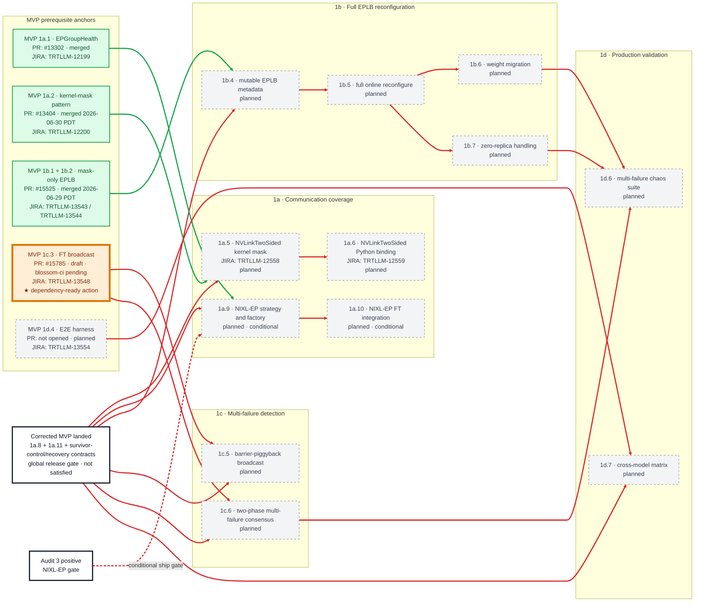
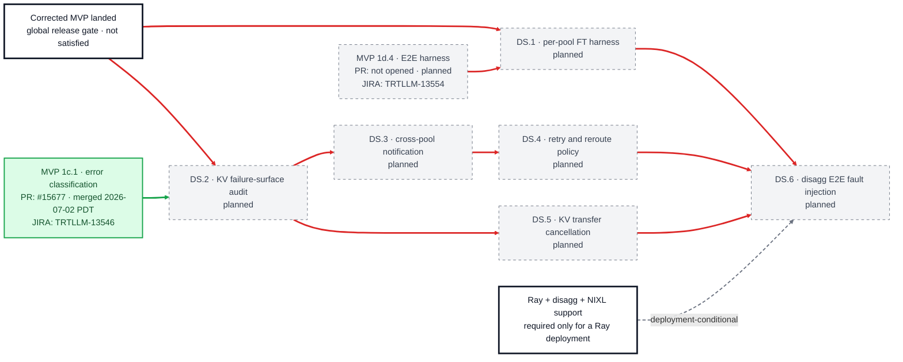
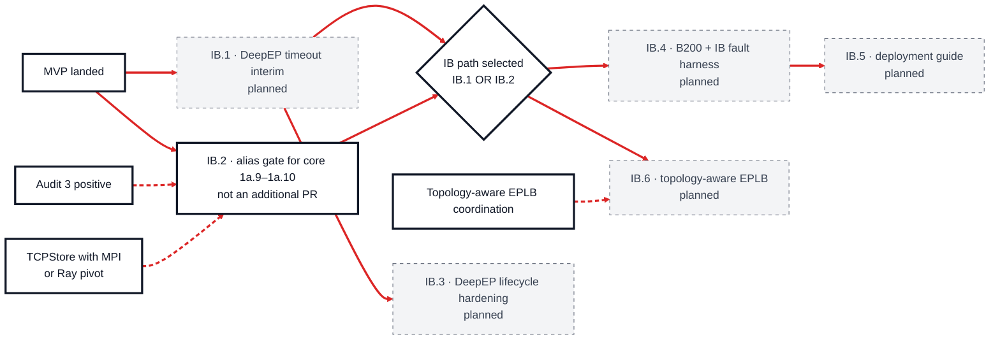

# V1 PR Dependency Graph

[< Back to WideEP Fault Tolerance](../README.md) · [Implementation plan](08-implementation-plan.md)

**Status snapshot:** 2026-07-02 16:34 PDT

**Scope:** Phase 1 v1 plus the two post-MVP parallel tracks, Phase 1-DS and conditional Phase 1-IB.

**JIRA mapping snapshot:** user-provided 2026-06-29. Ticket keys appear on mapped nodes; workflow and assignee are tracked in the canonical [JIRA work-item ledger](jira-work-item-ledger.md), not in PR-status colors or dependency readiness.

All V1 implementation units are **planned** at this snapshot; no upstream PR has been opened for a V1 plan ID. MVP prerequisite anchors carry their live PR/planned colors so blocked edges can be read correctly. See the [MVP graph](mvp-dependency-graph.md) for full context.

## Status colors

| Color | Status |
|:---|:---|
| Green (`#dcfce7`) | Merged |
| Orange (`#ffedd5`) | Draft / not officially opened for review |
| Blue (`#dbeafe`) | Inflight — review and approvals required |
| Purple (`#ede9fe`) | Inflight — approved / merge-ready or CI-blocked |
| Gray (`#f3f4f6`) | Planned |

White, heavy-border nodes are milestone, audit, or external prerequisite gates rather than PR-status nodes.

## Dependency-state colors

| Edge or marker | Meaning |
|:---|:---|
| Green solid edge (`#16a34a`) | The prerequisite path is satisfied and does not block the target. |
| Red solid edge (`#dc2626`) | The prerequisite path is unsatisfied and blocks the target. |
| Red dashed edge | Conditional-path prerequisite that is currently unsatisfied. |
| Gray dashed edge (`#6b7280`) | Informational or deployment context outside the current committed path. |
| Gold outline + `★` | Dependency-ready action. No V1 implementation node qualifies; reused MVP prerequisite anchors may still be gold. |

## Core V1 graph

The global prerequisite for every node is the **corrected MVP**: it includes the
promoted 1a.8 in-flight-kernel escape, promoted 1a.11 graph-safe recovery,
survivor control-plane rebuild, the atomic recovery coordinator,
poisoned-MPI shutdown, and real-model E2E acceptance. The graph expands only
the more specific MVP merge unit each V1 PR consumes. The 1a.7 and 1a.8
delivery PRs [#15789](https://github.com/NVIDIA/TensorRT-LLM/pull/15789) and
[#15895](https://github.com/NVIDIA/TensorRT-LLM/pull/15895) remain draft with
`blossom-ci` pending; those states are folded into the unsatisfied global gate
rather than represented as otherwise-unconnected V1 anchors.

## Parallel Phase 1-DS graph

This track starts after MVP and can run in parallel with core V1. It is not part of the core V1 release gate unless scope is explicitly changed.

## Conditional Phase 1-IB graph

The two incoming edges to `IB path selected` are alternatives: choose the DeepEP timeout interim **or** the NIXL-EP path. They are not cumulative requirements.

## Candidate actions now

None of the V1, Phase 1-DS, or Phase 1-IB implementation nodes qualify yet. Every implementation path has an unsatisfied corrected-MVP release/component dependency, shown by at least one red ancestral edge. The merged #13404 component edge into 1a.5, #15525 edge into 1b.4, and #15677 edge into DS.2 are green, but the global corrected-MVP release edges still block those nodes. Gold prerequisite anchors are dependency-ready **MVP** actions reused here, not V1 candidates. Audit and external-integration gates may proceed as preparatory work, but they are not PR action-frontier nodes.

## JIRA work-item mapping

See the [canonical JIRA work-item ledger](jira-work-item-ledger.md) for the supplied tickets and newly identified `TBD` mappings. The V1 nodes shown here retain 1a.5 / TRTLLM-12558 and 1a.6 / TRTLLM-12559. Item 1a.8 / TRTLLM-12561 is now a corrected-MVP item and is intentionally absent from this graph.

## Tracking decisions

- Core V1 contains **10 unconditional plan IDs plus 2 Audit-3-conditional NIXL-EP IDs**. Promoted items 1a.8 and 1a.11 belong to corrected MVP and must not be counted or rendered as V1 work.
- Reused MVP anchors reflect the live delivery state: #13404, #15525, and #15677 are merged, while #15785 is draft. The corrected-MVP gate also includes #15789 and #15895 (both draft with `blossom-ci` pending), 1a.11, and the new survivor/recovery contracts. Only merged anchors turn their outgoing component edge green.
- `1d.6` requires multi-failure consensus and the completed full-EPLB branch. The graph shows terminal dependencies 1c.6, 1b.6, and 1b.7; 1b.4 and 1b.5 are satisfied transitively.
- Phase 1-DS and Phase 1-IB are visible here because both are scheduled after MVP and parallel to V1, but neither silently expands the core V1 ship gate.
- IB.2 is an umbrella alias for core PR units 1a.9 and 1a.10, not an additional implementation PR.
