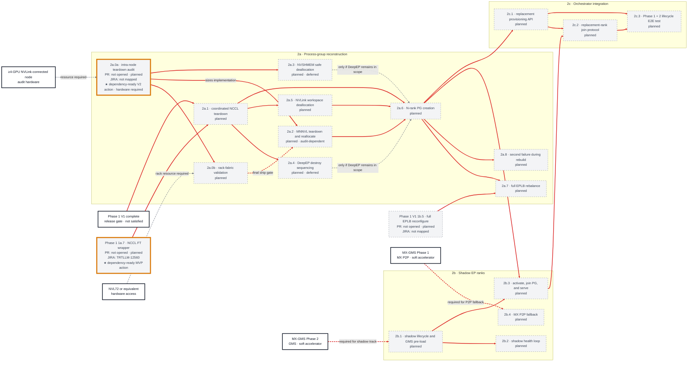

# V2 PR Dependency Graph — Phase 2 Restoration

[< Back to WideEP Fault Tolerance](../README.md) · [Implementation plan](08-implementation-plan.md)

**Status snapshot:** 2026-06-29 13:21 PDT

**Scope mapping:** The roadmap does not define a product milestone named “V2.” In this graph, **V2 means §8.2 Phase 2 Restoration**: replacing the dead rank, rebuilding process groups, and restoring full N-rank capacity. It does not mean the “Draft v2” revision of the design document itself.

**JIRA coverage:** no V2 ticket mapping was included in the supplied snapshot; see the [JIRA ledger coverage gaps](jira-work-item-ledger.md#coverage-gaps).

All V2 implementation units are **planned** at this snapshot. Sizes and several edges remain provisional until the teardown audits complete.

## Status colors

| Color | Status |
|:---|:---|
| Green (`#dcfce7`) | Merged |
| Orange (`#ffedd5`) | Draft / not officially opened for review |
| Blue (`#dbeafe`) | Inflight — review and approvals required |
| Purple (`#ede9fe`) | Inflight — approved / merge-ready or CI-blocked |
| Gray (`#f3f4f6`) | Planned |

White, heavy-border nodes are milestone, hardware, or external-project gates rather than PR-status nodes.

## Dependency-state colors

| Edge or marker | Meaning |
|:---|:---|
| Green solid edge (`#16a34a`) | The prerequisite is satisfied and does not block the target. |
| Red solid edge (`#dc2626`) | The prerequisite is unsatisfied and blocks the target. |
| Red dashed edge | Conditional, final-ship, or optional-track prerequisite that is currently unsatisfied. |
| Gray dashed edge (`#6b7280`) | Resource or out-of-scope context; reported separately from PR dependency readiness. |
| Gold outline + `★` | Dependency-ready implementation node. Resource availability may still be required. |

## Restoration dependency graph

## Candidate actions now

**2a.0a — intra-node teardown audit** is the only V2 action-frontier node. It has no parent implementation PR and the roadmap explicitly allows it to start before V1 completes. A suitable ≥4-GPU NVLink-connected node is still a resource requirement, shown by the gray dashed edge; the gold marker means dependency-ready, not resource-booked.

The gold 1a.7 prerequisite anchor is a dependency-ready **MVP** action reused in this view; it is not a V2 candidate.

The MX-GMS-specific 2b.1 and 2b.4 nodes are not candidates: their external MX-GMS interfaces are unsatisfied optional-track prerequisites, shown as red dashed edges.

## Critical sequencing

1. **Audit in parallel with Phase 1:** 2a.0a can start before V1 completes. It sizes the rebuild work; 2a.0b requires rack hardware and gates the final 2a.2 ship decision.
2. **Baseline rebuild:** V1 completion plus 1a.7 unlocks 2a.1. The baseline path then converges through 2a.2 and 2a.5 into 2a.6.
3. **Conditional DeepEP work:** 2a.3 and 2a.4 are deferred. Their edges into 2a.6 are dashed so they do not accidentally block the MNNVL baseline when DeepEP is out of scope.
4. **Capacity restoration:** 2a.6 unlocks EPLB rebalance, second-failure handling, shadow activation, and replacement provisioning.
5. **Acceleration is soft:** MX-GMS shortens weight-load latency but must not gate a correct minutes-class disk-reload path.

## Open dependency clarification

The current table makes 2c.2 depend on 2b.3, while the architecture says Phase 2 must work without MX-GMS. Before implementation, split the join contract from the GMS-specific pre-load mechanism or document how the same 2b.3 activation API supports a disk-loaded replacement. The graph preserves the table's edge and keeps the MX-GMS edge dashed to expose this distinction rather than hide it.

## Updating this graph

When a V2 PR opens, replace its `planned` suffix with the PR number and apply the same five-state rules used by the [MVP graph](mvp-dependency-graph.md). Recompute red/green edges and the gold action frontier after every merge or external-gate decision. Do not promote provisional audit-dependent work to inflight solely because an audit prototype branch exists.
