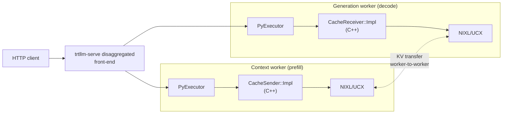
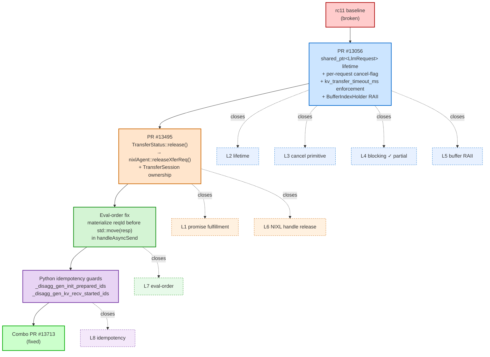
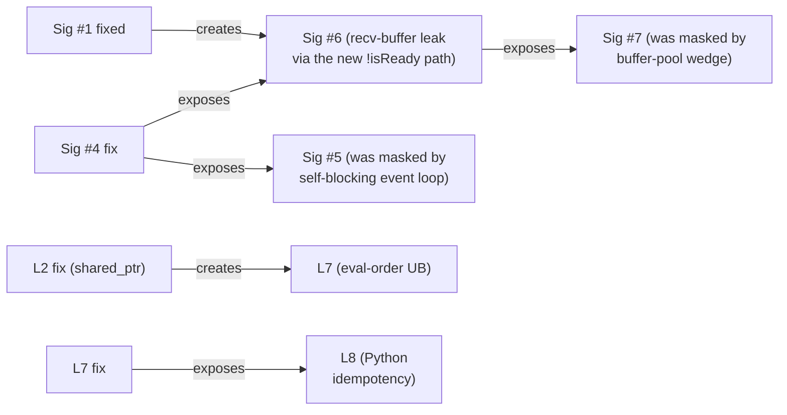

# 00 — TL;DR (10-minute read)

Skim this first. If you want depth on any one part, every section ends
with a pointer to the file that has the full story.

---

## What is broken

A TensorRT-LLM disaggregated `trtllm-serve` deployment running rc11
**permanently wedges** after a single burst of long-prompt traffic with
client-side cancellations. The pod stays `1/1 Running`, the HTTP
server keeps accepting connections, but every request after the burst
times out indefinitely.

From a customer's perspective it looks like one bug. From the C++ KV
cache transceiver it is **a stack of eight independent defects** in the
request cleanup path. Any one of them is sufficient to wedge the
deployment.

The minimal trigger is:

- long prompts (~8K tokens),
- high concurrency (CONC ≥ 16),
- aggressive client-side timeouts that cause cancellations and retries,
- overlap scheduling enabled (the default).

That combination drives every request through the cleanup paths in
volume. The cleanup paths are where the bugs live.

> Full reproducer: [`04-reproduction.md`](04-reproduction.md).

---

## Where the bugs live: the disagg KV transfer flow

Disaggregated serving splits one request across two workers — a
**context worker** that runs prefill and publishes the KV cache, and a
**generation worker** that receives that KV cache and decodes tokens.
KV transfer happens worker-to-worker over NIXL/UCX, not through the
front-end router.



The wedge surface is **inside the cancellation flow**: when a request
in flight gets cancelled (client disconnects, KV transfer times out,
retries fire), at least one of seven distinct things can go wrong in
the C++ cleanup path. Two of the seven were known from the field at
T0. Five more emerged from investigation, each exposed by fixing the
previous one.

| Sig | Where it lives | One-line symptom |
|---|---|---|
| **#1** | `CacheSender::Impl::sendResponse` (cancel-after-ready erase path) | `Broken promise` raised by the consumer's `future.get()` on the sender side |
| **#2** | `templatedTrie.h::clearNode` / `kvCacheManager.cpp` cascade-prune walk | `cascade prune: parent did not find this node as a child` C++ assertion under sustained eviction |
| **#3** | C++ `std::optional::value()` in the disagg gen path, surfaced via pybind | `RuntimeError: bad optional access` raised in the decode-side Python event loop *(field-only)* |
| **#4** | `CacheTransceiver::checkGenTransferStatus(atLeastNum=1)` unconditional `future.get()` | gen worker's main event loop blocks indefinitely on a not-yet-ready future |
| **#5** | `CacheReceiver::Impl::cancelRequest` (queued-cancel erase) | `Broken promise` raised by the consumer's `future.get()` on the receiver side |
| **#6** | `CacheReceiver::Impl::requestSync` `!isReady` early-return + `BaseTransBufferManager::assignBufferIndex` `cv.wait` | one cancelled-after-ready transfer leaks a recv-buffer slot; the next request wedges the receiver pool forever |
| **#7** | `CacheSender::Impl::*` (bug class with 4 manifestations) | mutex deadlock in `response()`; ctx mpi4py worker exits; Python `getattr` SIGSEGV; first-request SIGSEGV in `handleAsyncSend` |

Sig `#2` is independent of the cleanup-path bug class — it's an
eviction-driven trie invariant violation that just happens to fire
under the same high-concurrency load.

> Full per-signature root causes, fixes, regression tests, and code
> sites: [`02-failure-signatures.md`](02-failure-signatures.md).

---

## Root cause: eight invariant gaps

The seven signatures are the visible faces of **eight underlying
invariant gaps** that the rc11 transceiver doesn't enforce. We call
them L1 through L8. Each is independently sufficient to wedge the
deployment under the customer load shape.

| Layer | What's missing | Customer-visible failure |
|---|---|---|
| **L1** | Promises must be fulfilled before destruction | `Broken promise` thrown by consumer's `future.get()` |
| **L2** | Request lifetime must outlive C++ async workers | UAF on `LlmRequest*` after Python `_terminate_request` |
| **L3** | `cancelRequest` must interrupt in-flight workers | `Cannot cancel request` log accumulates; transfers pile up |
| **L4** | `future.get()` must be non-blocking when polled | Gen event loop self-blocks on first stuck transfer |
| **L5** | Acquired buffer slots must release on every exit | One leaked recv-buffer slot wedges all subsequent receives |
| **L6** | NIXL/UCX backend must release transfer handles on cancel | Stranded transfer handles → contention → mutex deadlock |
| **L7** | C++ argument evaluation order must be safe with `shared_ptr` | First-request SIGSEGV in `handleAsyncSend` after L2 fix |
| **L8** | Python scheduler must be idempotent by `py_request_id` | `KVCacheManager::addSequence` `emplaceDone` assertion |

L1–L6 are C++ defects in the transceiver. L7 is a *regression*
introduced by L2's fix — closing the UAF requires `shared_ptr<LlmRequest>`,
which makes a previously-safe argument-evaluation pattern undefined
behaviour. L8 is a Python-side scheduler defect that only becomes
observable once L7 is removed and the system progresses far enough to
exercise the repeated init scheduling path.

> Code-level evidence for each layer plus the cascade map:
> [`03-defect-class-stack.md`](03-defect-class-stack.md).

---

## The fix

The fix is a single bundled stack — submitted as PR
[#13713](https://github.com/NVIDIA/TensorRT-LLM/pull/13713) — that
closes all eight layers. It composes four pieces:



The four fix components are color-coded. Each layer node (`L1`–`L8`) is
tinted with the lighter shade of whichever fix closes it, so the
`closes` arrows are reinforced by colour: blue for `#13056`, orange for
`#13495`, green for the eval-order fix, purple for the Python
idempotency guards.

Each layer needs at least one piece to close it; some pieces close
multiple layers. The minimum closure is exactly these four pieces.
Removing any one re-opens at least one layer, and re-opening any one
layer is empirically sufficient to wedge the deployment.

The contributions break down as:

- **PR #13056** (Yifan's architectural refactor) closes L2, L3, partial
  L4, L5. Largest single behavioural change: introduces
  `std::shared_ptr<LlmRequest>` end-to-end through the C++ transceiver
  and a per-request cancel-flag registry.
- **PR #13495** (codex-assisted; stacked on PR #13439) closes L6 (the
  unique contribution: `TransferStatus::release()` →
  `nixlAgent::releaseXferReq()`) plus reinforces L1 with the
  cancel-after-ready `set_exception` ordering.
- **Eval-order fix** closes L7. One-line patch in
  `CacheSender::Impl::handleAsyncSend`:
  ```cpp
  TLLM_CHECK(resp.mRequest != nullptr);
  auto const reqId = resp.mRequest->mRequestId;
  sendAndRemoveResponse(reqId, std::move(resp));
  ```
  Required because PR #13056's `shared_ptr` change makes the previous
  one-liner undefined behaviour under the C++ argument-evaluation rules.
- **Python idempotency guards** close L8. ~30 lines in
  `tensorrt_llm/_torch/pyexecutor/py_executor.py` that prevent
  `_prepare_disagg_gen_init` and `_recv_disagg_gen_cache` from running
  side effects twice on the same `py_request_id` when the scheduler
  re-presents an in-progress request.

The combo also retains your chained regression tests as the
load-bearing test scaffolding — neither PR #13056 nor PR #13495 has
focused unit tests for these signatures.

> The full per-piece breakdown and the L1-L8 → fix mapping:
> [`06-fix-approaches/D-combo.md`](06-fix-approaches/D-combo.md).

---

## Does it work?

Yes, on the customer's transport. The combo recovers cleanly under the
local 1P1D `trtllm-serve` long-prompt burst harness on a single host:

| Transport | `CONC=16` | `CONC=24` | `CONC=32` | `CONC=64` |
|---|---|---|---|---|
| **NIXL + UCX plugin** *(customer transport)* | n/a | n/a | **5/5 recovered, zero burst-time errors** | **5/5 recovered, zero burst-time errors** |
| Direct UCX | 5/5 recovered | 5/5 recovered | 5/5 recovered | wedged on iter 1 |

The customer-reported failure shape is **fixed on NIXL+UCX-plugin
through `CONC=64`**. NIXL is the customer's transport, so the
reporter's deployment shape is covered by the combo. Direct UCX still
wedges at `CONC=64`; that is a separate, narrower follow-up that needs
a `ucxx::Request::cancel()` analog to PR #13495's `releaseXferReq()`
(see [`08-next-steps-and-pr-map.md`](08-next-steps-and-pr-map.md)).

A few honest caveats:

- **Multi-node and Dynamo orchestration are not yet validated.** All
  results above are single-host. The customer runs on K8s with the
  Dynamo Operator; the combo needs validation in that shape before
  being declared production-ready.
- **The combo's empirical recovery is "no permanent wedge", not "no
  errors."** The burst phase still produces `400 Bad Request`
  responses and KV-transfer-timeout logs under stress. Those are
  expected when L4 / L6 are doing their job (clean per-request errors
  rather than silent stalls), but they are a serving-quality
  degradation worth tracking separately as a capacity ceiling.
- **The sig `#7` mutex deadlock variant's exact mutex address** still
  needs a runtime `gdb` register capture to confirm it is `mCondMutex`
  (the source-code inference from Phase 12). The combo prevents the
  variant from manifesting under our test load, but a surgical
  in-`CacheSender::Impl` lock-ordering fix is still the right
  defence-in-depth follow-up.

> Per-test reproducer details, marker accounting, and run archives:
> [`04-reproduction.md`](04-reproduction.md) and
> [`08-next-steps-and-pr-map.md`](08-next-steps-and-pr-map.md).

---

## Why this took eight days to find

The eight layers weren't visible at T0. Three were known from the
field (sigs `#1`, `#2`, `#3`); the other four signatures (and their
underlying L4–L7 layers) **emerged from investigation itself**, each
exposed by fixing the previous one. The cascade pattern is:



In retrospect, the meta-process bottleneck was **observability**, not
fix complexity (every fix is small — `#1` is ~5 lines, `#4` is ~17
lines, the eval-order fix is ~3 lines). What ate calendar time was
figuring out which request was wedged, why, and which fix to write
next. The retrospective in
[`07-architectural-reflections.md`](07-architectural-reflections.md)
argues that adding `kv_transfer_timeout_ms` enforcement as PR #0
(converting silent wedges into per-request errors) plus a
cancel-during-transfer integration test would have collapsed Phase 5
through Phase 10 from ~4 days to ~2 days.

This pattern also explains why no single fix bundle on its own was
sufficient. Approaches that close some layers but not others still
wedge under the customer load shape, in the layer they leave open. The
combo is the smallest stack that closes every layer, and the
emergence pattern means the smallest stack was not knowable at T0.

> The full chronological story:
> [`05-investigation-timeline.md`](05-investigation-timeline.md).

---

## What is left to do

In rough priority order:

1. **Land PR #13713 (combo)** on `main`. The strongest current
   candidate.
2. **Pin down sig `#7` Variant A's mutex address** with a live `gdb`
   capture under NIXL backend. Estimated 30–60 min of diagnostic
   work, then ~1–2 days for a surgical lock-ordering fix.
3. **Add a direct-UCX `TransferStatus::release()` analog** using
   `ucxx::Request::cancel()` to close the residual `CONC=64`
   direct-UCX wedge.
4. **Multi-node and Dynamo orchestration validation.**
5. **Backport [#13119](https://github.com/NVIDIA/TensorRT-LLM/pull/13119)**
   (request-level error propagation) to `rc11` for clean failure
   attribution on any future field hit.
6. **Add a cancel-during-transfer integration test** to CI. The single
   biggest reason this bug class went undetected until production.
7. **Document the seven invariants** in the disaggregated-serving
   developer guide so the next contributor adding a transfer mode
   doesn't reintroduce this bug class.

> The full PR map, deadline-enforcement effort estimate, and run
> archive index: [`08-next-steps-and-pr-map.md`](08-next-steps-and-pr-map.md).

---

## Where to go from here

If you have 30 more minutes after this, the highest-leverage reads are:

- [`01-background.md`](01-background.md) — architecture diagrams and a
  full happy-path / cancellation walkthrough. Required reading if you
  haven't worked in this code path before.
- [`03-defect-class-stack.md`](03-defect-class-stack.md) — the L1–L8
  framework with code-level evidence and the cascade map. Required
  reading if you're reviewing PR #13713.
- [`06-fix-approaches/D-combo.md`](06-fix-approaches/D-combo.md) — the
  detailed per-layer breakdown of what each piece of the combo
  contributes.

If you're investigating a *future* field hit on this code path:

- [`02-failure-signatures.md`](02-failure-signatures.md) — match the
  observed log lines / stack traces to a known signature.
- [`08-next-steps-and-pr-map.md`](08-next-steps-and-pr-map.md) — see
  whether the failing build includes the relevant fix from the combo.
- The trace-marker glossary at the end of
  [`01-background.md`](01-background.md) — read run logs against the
  known marker patterns.

If you're building intuition about the broader architectural debt:

- [`07-architectural-reflections.md`](07-architectural-reflections.md) —
  the seven invariants the transceiver doesn't enforce, why review
  didn't catch any of this, and what we would do differently.

If you want the *story* of how this was investigated:

- [`05-investigation-timeline.md`](05-investigation-timeline.md) —
  Phases 0 through 14, eight days of "find bug → fix bug → find next
  bug" in chronological order.
