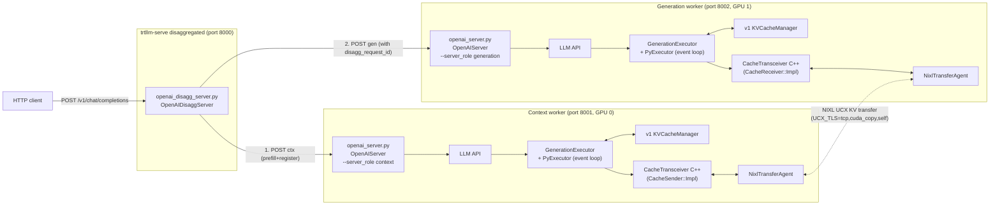
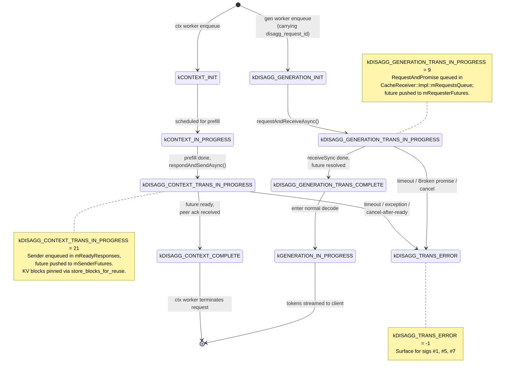
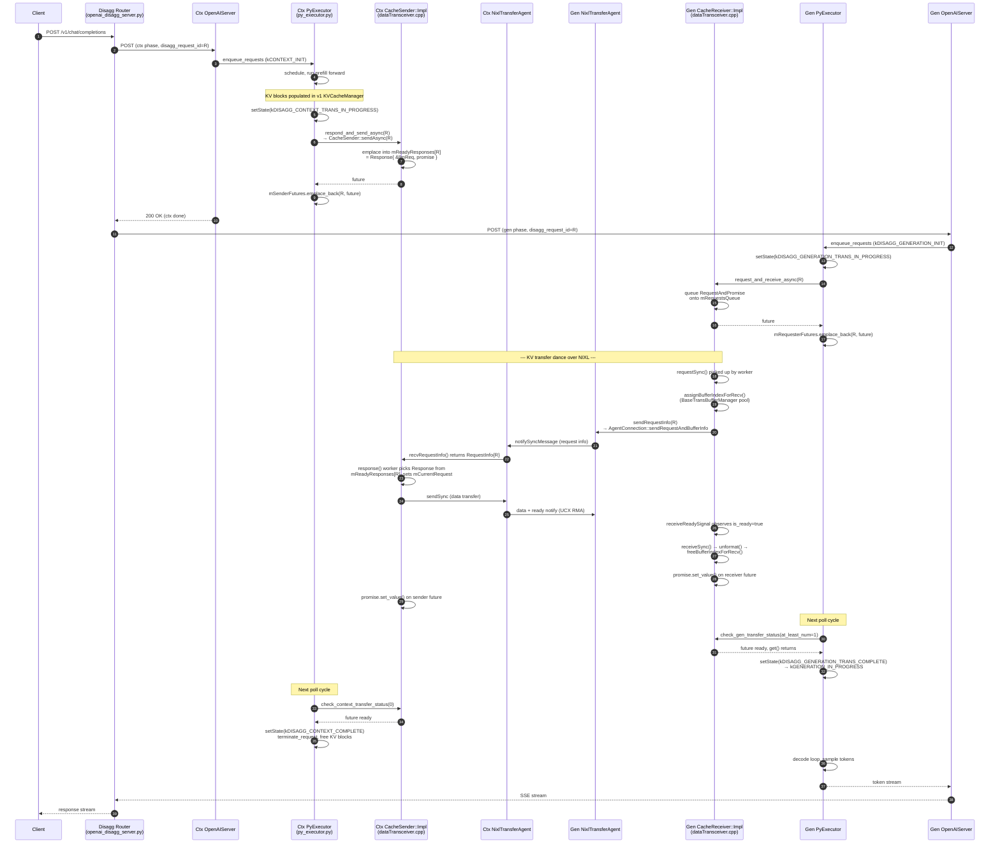
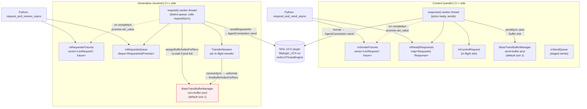
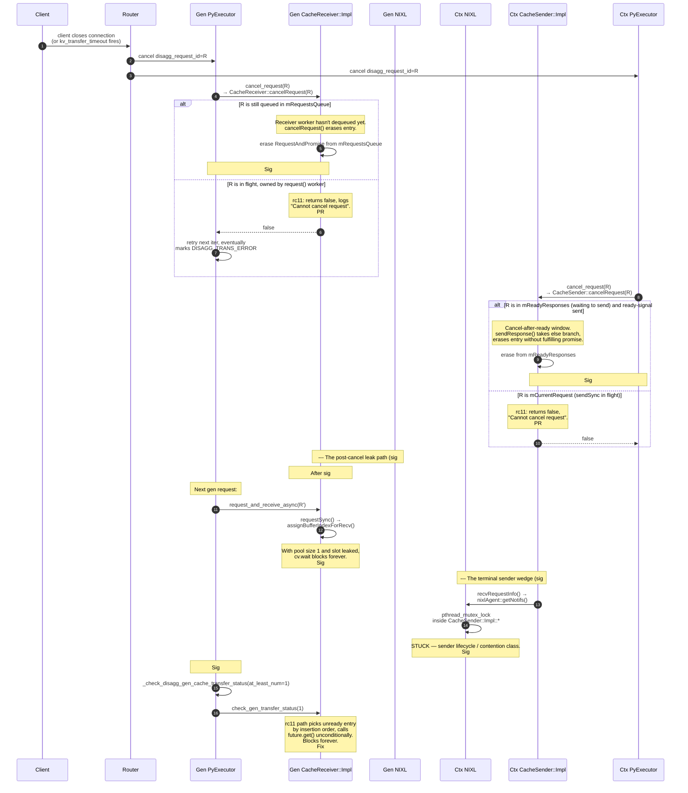

# 01 — Background and Architecture

This file is the orientation read for anyone new to the disaggregated KV
cache transfer code path. It walks through:

1. The deployment topology
2. The `LlmRequestState` lifecycle (the disagg-relevant subset)
3. The end-to-end happy path
4. The C++ transceiver internals
5. The cancellation flow and where it can break
6. The Python ↔ C++ ↔ NIXL/UCX boundary
7. A quick reference of files / classes / state holders

Defaults assumed throughout: PyTorch backend, v1 KV cache manager, C++
transceiver (NIXL/UCX backend). All file paths are relative to the
TensorRT-LLM repo root.

---

## 1. Deployment topology

The router holds the request; the **context worker** runs the prefill and
publishes its KV cache; the **generation worker** receives that KV cache and
generates tokens. KV transfer happens *worker-to-worker via NIXL/UCX*, not
through the router. The request ID linking the two is `disagg_request_id`.

---

## 2. `LlmRequestState` lifecycle (the disagg-relevant subset)

State enum lives in `cpp/include/tensorrt_llm/batch_manager/llmRequest.h`.
Numeric values shown for the values that appear in trace logs.

The `kDISAGG_CONTEXT_TRANS_IN_PROGRESS` and
`kDISAGG_GENERATION_TRANS_IN_PROGRESS` states are exactly the windows in
which signatures `#1`, `#5`, and `#6` fire. Both end in either
`kDISAGG_*_TRANS_COMPLETE` or `kDISAGG_TRANS_ERROR`.

---

## 3. End-to-end happy path

This is the full request flow with no errors and no cancellation. Steps
are numbered to make the cross-references in section 5 easier to follow.

Key participants by responsibility:

- **`PyExecutor`** owns the per-iteration loop. Calls
  `respond_and_send_async()` on ctx side and `request_and_receive_async()`
  on gen side, then polls `check_*_transfer_status()` until done.
- **`CacheTransceiver`** is the C++ object the Python side talks to via
  nanobind. It holds `mSenderFutures` (ctx) or `mRequesterFutures` (gen)
  — the per-request `(LlmRequest*, future)` pairs that drive the polls.
- **`CacheSender::Impl` / `CacheReceiver::Impl`** own the actual worker
  threads, queues (`mReadyResponses`, `mRequestsQueue`), and per-transfer
  bookkeeping (`mCurrentRequest`).
- **`NixlTransferAgent`** wraps the NIXL agent and is the boundary into
  the UCX/TCP transport.

---

## 4. C++ transceiver internals

This zooms into the dotted "KV transfer dance" of the previous diagram.
It shows the worker threads, the queues they consume, and the
buffer-pool manager.

Important things that are easy to miss but matter for the bug class:

- **Both buffer pools default to size 1** when
  `TRTLLM_KVCACHE_SEND_MAX_CONCURRENCY_NUM=1` (the customer config). Only
  one transfer can be in flight at a time. A single leaked slot wedges
  every subsequent call to `assignBufferIndex*` on the unbounded
  `cv.wait`. That is signature `#6`.
- **`mReadyResponses` and `mRequestsQueue` carry raw `LlmRequest*`** in
  `rc11`. PR `#13056` changes these to `shared_ptr<LlmRequest>`; PR
  `#13495` inherits the same change from `#13439`. This is the load-bearing
  UAF closure for the cleanup paths.
- **The receiver's request thread calls `requestSync()` which internally
  calls `assignBufferIndexForRecv()` *first*** (to reserve the slot for
  the eventual incoming data), then `sendRequestInfo()` over NIXL, then
  `receiveReadySignal()`, then `receiveSync()` which calls `unformat()`
  which calls `freeBufferIndexForRecv()`. Any early-return between those
  leaks the slot — that's the sig `#6` mechanism.
- **The sender's worker calls `recvRequestInfo()` to receive the gen-side
  request info**, which in turn calls `nixlAgent::getNotifs()`. The
  `pthread_mutex_lock` deadlock variants of sig `#7` surface in this
  call chain.

---

## 5. Cancellation flow + where it can break

This is the single most useful diagram for understanding NVBug 6104831,
because every signature except `#2` fires somewhere on this path.

---

## 6. The Python ↔ C++ ↔ NIXL/UCX boundary

Three layers, each with its own thread / queue / future model:

| Layer | Lives in | Concurrency model | Ownership of `LlmRequest` |
|---|---|---|---|
| Python | `tensorrt_llm/_torch/pyexecutor/py_executor.py` and `tensorrt_llm/_torch/disaggregation/transceiver.py` | One main event-loop thread per worker; cooperative async tasks for HTTP. | `shared_ptr` exposed via nanobind; `_terminate_request` decides when the underlying `LlmRequest` is freed. |
| TRT-LLM C++ transceiver | `cpp/tensorrt_llm/batch_manager/cacheTransceiver.cpp`, `dataTransceiver.cpp`, `baseTransBuffer.cpp` | One sender worker thread (`response()`), one receiver worker thread (`request()`), per-async-send drain worker (`handleAsyncSend`), buffer-pool `cv.wait`. | Pre-`#13056`/`#13439`: raw `LlmRequest*` in queues and futures. Post-fix: `shared_ptr<LlmRequest>`. |
| NIXL UCX plugin | `libplugin_UCX.so`, `nixlUcxThreadEngine`, `nixlAgent` | Internal worker threads: `nixl-comm-worker`, `nixl-ucx-shared`. Notification waits, transfer-state polls. | Doesn't know about `LlmRequest`; tracks `nixlXferReqHandle` opaque handles. |

The cleanup-path bugs span all three layers, which is why the fix
strategies disagree on where the right cancellation primitive lives:

- **PR `#13056`'s answer:** in TRT-LLM C++, via a per-request cancel-flag
  registry plumbed through `sendRequestInfo` / `receiveReadySignal` /
  `AgentConnection::send`'s polling loop.
- **PR `#13495`'s answer:** at the NIXL boundary, via a
  `TransferStatus::release()` hook that calls `nixlAgent::releaseXferReq()`
  to drop the backend handle.
- **The combo answer (Approach D):** both. They address different parts of
  the cancellation lifecycle and are not redundant — see
  [`06-fix-approaches/D-combo.md`](06-fix-approaches/D-combo.md).

---

## 7. Quick-reference table

### Files

| Path | Role |
|---|---|
| `tensorrt_llm/serve/openai_disagg_server.py` | Disagg router HTTP layer. |
| `tensorrt_llm/serve/openai_server.py` | Per-role server (`--server_role context` or `--server_role generation`). |
| `tensorrt_llm/_torch/pyexecutor/py_executor.py` | The PyTorch backend's per-worker event loop (`PyExecutor`). |
| `tensorrt_llm/_torch/pyexecutor/kv_cache_transceiver.py` | Python wrapper over the C++ `CacheTransceiver`. |
| `tensorrt_llm/_torch/disaggregation/transceiver.py` | The disagg-specific Python transceiver shim. |
| `cpp/tensorrt_llm/batch_manager/cacheTransceiver.cpp` | Top-level C++ transceiver: `mSenderFutures`, `mRequesterFutures`, `checkContextTransferStatus`, `checkGenTransferStatus`. |
| `cpp/tensorrt_llm/batch_manager/dataTransceiver.cpp` | `CacheSender::Impl` and `CacheReceiver::Impl`: worker threads, queues, async-send. |
| `cpp/tensorrt_llm/batch_manager/baseTransBuffer.cpp` | `BaseTransBufferManager` (the buffer-index pool). |
| `cpp/tensorrt_llm/batch_manager/cacheFormatter.cpp`, `mlaCacheFormatter.cpp`, `rnnCacheFormatter.cpp` | Format / unformat KV blocks for transfer. |
| `cpp/tensorrt_llm/executor/cache_transmission/agent_utils/connection.cpp` | `AgentConnection` (NIXL-level send / recv). |
| `cpp/tensorrt_llm/executor/cache_transmission/nixl_utils/transferAgent.cpp` | `NixlTransferAgent`, `NixlTransferStatus`. |

### State holders that matter for the bug class

| Holder | Owner | Lifetime contract (rc11 baseline) |
|---|---|---|
| `mSenderFutures` | `CacheTransceiver` (ctx) | `vector<pair<LlmRequest*, future<void>>>`; entry erased on completion / timeout / exception. Raw pointer makes UAF possible until shared_ptr lands. |
| `mRequesterFutures` | `CacheTransceiver` (gen) | Symmetric to `mSenderFutures` on the gen side. |
| `mReadyResponses` | `CacheSender::Impl` | `map<RequestId, Response{LlmRequest*, promise<void>}>`; populated by `sendAsync`, drained by `response()` worker. Sig `#1` erase site. |
| `mRequestsQueue` | `CacheReceiver::Impl` | `deque<RequestAndPromise>`; populated by `request_and_receive_async`, drained by `request()` worker. Sig `#5` erase site. |
| `mCurrentRequest` | `CacheSender::Impl` | Single in-flight slot. `cancelRequest` returns false on this; sig `#1` / `#7` escape window. |
| `mAsyncSendResource.mSendQueue` | `CacheSender::Impl` | `deque<Response>` consumed by `handleAsyncSend`; this is where the eval-order regression lives once `Response::mRequest` becomes `shared_ptr`. |
| `BaseTransBufferManager` recv pool | gen-side | Default size 1. `assignBufferIndex` / `freeBufferIndex` pairing must hold on every exit path. Sig `#6` leak surface. |
| `BaseTransBufferManager` send pool | ctx-side | Symmetric on ctx side. Both `#13056` and `#13495` add RAII coverage. |

### Trace markers for cross-reference

When reading the run logs in the investigation archives, these are the
markers gated by `TRTLLM_DISAGG_TRACE_PROMISE=1` /
`TRTLLM_DISAGG_TRACE_BLOCK=1` and what they mean:

- `gen_request_enqueue` / `gen_request_dequeue` — queue movement on
  receiver side (`mRequestsQueue`).
- `gen_request_sync_begin` / `gen_request_sync_end` — `requestSync()`
  entry/exit on the receiver worker.
- `gen_send_assign_buffer_begin` / `_step` / `_end` — receiver-side
  `assignBufferIndexForRecv` lifecycle. Stalls here = sig `#6`.
- `gen_send_request_info_begin` / `_end` — `sendRequestInfo()` over NIXL
  on the receiver side.
- `gen_wait_ready_signal_begin` / `_end` — receiver waiting for ctx's
  ready notification.
- `gen_receive_sync_begin` / `_end` — `receiveSync()` (the actual data
  receive) on the receiver.
- `gen_request_promise_set_value` / `_set_exception` — receiver-side
  promise fulfillment.
- `gen_request_sync_not_ready_buffers_freed` — sig `#6` fix path firing
  on the `!isReady` early-return; `count=N` shows how many slots got
  released.
- `gen_future_skip_unready` — sig `#4` fix firing in `checkGenTransferStatus`.
- `gen_future_get_ok` / `gen_future_get_exception` — final outcome of the
  receiver-side future.

The corresponding ctx-side markers are `create`, `send_response_ready`,
`send_sync_begin`, `promise_set_value`, `future_get_ok`,
`mark_cancelled`, `cancel_rejected`, `promise_set_exception`,
`future_get_exception`. The async-send instrumentation added in Phase 14
adds: `enter_sendAsync`, `enqueue_ready`, `enter_sendResponse`,
`producer_move`, `enqueue_send`, `consumer_wake`, `consumer_dequeue`,
`preDeref`, `sendAndRemove_*`, `sendSync_*`.

---

## What to read next

- For a list of the seven discrete bugs that fire on this code path, see
  [`02-failure-signatures.md`](02-failure-signatures.md).
- For the *defect-class layering* that explains why the four candidate
  fixes have different coverage, see
  [`03-defect-class-stack.md`](03-defect-class-stack.md).
- For the actual reproducer, see [`04-reproduction.md`](04-reproduction.md).
