# 03 — Defect Class Stack (`L1`–`L8`)

The seven failure signatures (`#1`–`#7`) in
[`02-failure-signatures.md`](02-failure-signatures.md) are the customer-
visible faces of the wedge. This file describes the *deeper* structure
underneath them: **eight invariant gaps that the rc11 disaggregated KV
transceiver doesn't actually enforce**, each of which is independently
sufficient to wedge the deployment under the customer load shape.

The `L1`–`L8` framing is what makes the four-approach comparison
unambiguous — each candidate fix stack closes some of these layers and
leaves others open, and every uncovered layer corresponds to a
load-bearing failure mode that prevents recovery. The actual approach
comparison lives in [`06-fix-approaches/README.md`](06-fix-approaches/README.md);
this file establishes the framework that comparison uses.

---

## Why a defect-class layer is more useful than a signature list

The seven signatures are descriptive but they don't compose well:

- They are entangled — fixing `#1` exposes `#6`; fixing `#4` exposes `#5`
  and `#6`; fixing `#6` exposes the full `#7` bug class.
- Some of them (e.g. `#7`) are *bug classes* with multiple manifestations
  rather than single bugs.
- Some are caused by code defects (`#1`, `#2`, `#5`, `#6`, `#7`); some are
  caused by missing infrastructure (`#4` is a defensive primitive that
  catches any unresolved future).
- Coverage is not commutative across the seven of them. "PR X fixes `#1`
  and `#5`" does not imply PR X gets you closer to recovery if the
  underlying invariant gap that *produces* `#1` and `#5` is still
  present in some other code path.

The eight defect classes below are *what the seven signatures are
violations of*. Every chained PR, every #13056 commit, and every #13495
commit can be unambiguously placed into one or more of these layers.
"Coverage of layer L_n" is a binary property: either the fix stack
includes a mechanism that closes the invariant in L_n, or it doesn't.

---

## The eight layers

| # | Defect class | Code site | Why it bites in production |
|---|---|---|---|
| **L1** | **Cancellation bookkeeping** — promise erased without `set_value` / `set_exception` | `dataTransceiver.cpp::CacheSender::Impl::sendResponse` (sig `#1`); `CacheReceiver::Impl::cancelRequest` (sig `#5`) | Cancel-after-ready and queued-cancel paths both leak unfulfilled promises → consumer's `future.get()` throws `Broken promise` → no attribution at the Python layer |
| **L2** | **Request lifetime** — raw `LlmRequest*` outliving Python termination | `mReadyResponses::Response::mRequest`, `mRequestsQueue::RequestAndPromise::mRequest`, `mSenderFutures`, `mRequesterFutures` (all in `dataTransceiver.cpp` and `cacheTransceiver.cpp`) | Python `_terminate_request` can free `LlmRequest` while async send/receive worker holds the raw pointer → UAF; observed as `mRequestId == 0x5555555555555555` in field traces |
| **L3** | **In-process cancellation primitive** — `cancelRequest` returns false on in-flight | `dataTransceiver.cpp::CacheSender::Impl::cancelRequest`, `CacheReceiver::Impl::cancelRequest` | Once `mCurrentRequest` is set or the worker has dequeued, cancel can't unblock the worker; `Cannot cancel request` log accumulates and wedged transfers pile up under contention |
| **L4** | **Receiver-future blocking** — unconditional `future.get()` on unready future | `cacheTransceiver.cpp::CacheTransceiver::checkGenTransferStatus(atLeastNum=1)` (sig `#4`) | Gen event-loop self-blocks for the entire lifetime of any unresolved upstream future → permanent wedge before any other defense activates |
| **L5** | **Recv-buffer slot leak** — `assignBufferIndexForRecv` paired with `freeBufferIndexForRecv` only on the happy path | `dataTransceiver.cpp::CacheReceiver::Impl::sendRequestInfo` + `requestSync` `!isReady` early return (sig `#6`); pool size 1 by default | One leaked slot permanently wedges the receiver on the unbounded `cv.wait` in `BaseTransBufferManager::assignBufferIndex` |
| **L6** | **Backend transfer-handle stranding** — NIXL/UCX transfer stays registered after TRT-LLM-side cancel | NIXL `TransferStatus` lifetime; no `releaseXferReq()` call on cancel | Stranded handles accumulate; backend lock-ordering wedge (sig `#7`'s deadlock variant) becomes more likely under contention |
| **L7** | **Eval-order UB introduced by shared_ptr** (only after L2 is fixed) | `dataTransceiver.cpp::handleAsyncSend` line 514: `sendAndRemoveResponse(resp.mRequest->mRequestId, std::move(resp));` | Once `Response::mRequest` is `shared_ptr`, compilers may evaluate `std::move(resp)` first → reads `mRequestId` from a moved-from `shared_ptr` → SIGSEGV on first request |
| **L8** | **Python scheduler idempotency** — `_prepare_disagg_gen_init` and `_recv_disagg_gen_cache` re-run side effects when the same `py_request_id` is rescheduled while in `DISAGG_GENERATION_INIT` | `py_executor.py::_prepare_disagg_gen_init`, `_recv_disagg_gen_cache` | `KVCacheManager::addSequence` fires `emplaceDone` assertion at `kvCacheManager.cpp:2992`; `request_and_receive_async` is started twice for the same request |

`L1` through `L6` are C++ defects in the transceiver. `L7` is a
*regression* introduced by `L2`'s fix (any approach that adds
`shared_ptr<LlmRequest>` must also add the eval-order fix). `L8` is a
Python-side scheduler defect that becomes observable only once `L7` is
removed and the system progresses far enough to exercise the repeated
init scheduling path.

---

## How the layers map to the seven signatures

```mermaid
graph TB
    L1[L1: Cancellation<br/>bookkeeping] --> SIG1
    L1 --> SIG5
    SIG1[Sig #1: sender<br/>Broken promise]
    SIG5[Sig #5: receiver<br/>Broken promise]

    L2[L2: Request<br/>lifetime / UAF] --> SIG3
    SIG3[Sig #3: bad<br/>optional access]

    L3[L3: In-process<br/>cancel primitive] --> SIG7A
    SIG7A[Sig #7 variants A/B:<br/>deadlock + mpi exit]

    L4[L4: future.get<br/>unconditional block] --> SIG4
    SIG4[Sig #4:<br/>checkGenTransferStatus<br/>self-block]

    L5[L5: recv-buffer<br/>slot leak] --> SIG6
    SIG6[Sig #6:<br/>assignBufferIndex wedge]

    L6[L6: NIXL handle<br/>stranding] --> SIG7A

    L7[L7: shared_ptr<br/>eval-order] --> SIG7D
    SIG7D[Sig #7 variant D:<br/>handleAsyncSend SIGSEGV]

    L8[L8: Python scheduler<br/>idempotency] --> EMPLACE[emplaceDone<br/>assertion]

    SIG2[Sig #2:<br/>trie cascade prune]
    INDEPENDENT[Independent —<br/>eviction-driven, not<br/>cleanup-path]
    SIG2 -.-> INDEPENDENT

    classDef sig fill:#ffe,stroke:#b80
    class SIG1,SIG2,SIG3,SIG4,SIG5,SIG6,SIG7A,SIG7D sig
```



Some additional observations from the mapping:

- **L1, L4, L5 each map 1:1 to a single signature.** Closing them is
  equivalent to fixing that signature.
- **L2 maps to L7 as a downstream regression**, not just to a signature.
  Any fix that closes L2 (`shared_ptr<LlmRequest>`) creates L7 if the
  callsite isn't audited for argument-evaluation order.
- **L3 and L6 both map to sig `#7` but address different variants.** L3
  closes the deadlock variant (in-process cancel can release a
  cv-blocked worker); L6 closes the handle-stranding variant (the NIXL
  side knows to drop the transfer when cancel observes). Either alone
  reduces sig `#7`'s frequency but neither alone retires the bug class.
- **L8 maps to a Python-side assertion** (`emplaceDone` in
  `kvCacheManager.cpp:2992`) that is *only observable* once L7 is
  removed. Prior to fixing L7, the worker crashed before it could ever
  hit L8.
- **Sig `#2` (trie cascade prune) does not map to any of L1–L8.** It is
  an independent eviction-driven bug, fixed entirely by changing
  `templatedTrie.h::clearNode` to reset the child's `mPrevNode` before
  erasing.

---

## Code-level evidence for the four most important layers

This section grounds the claims in the actual diffs of the relevant PRs.
You only need to read this if you want to verify the layering is
correct rather than take it on the table.

### L1 — cancellation bookkeeping (sig `#1` and `#5`)

Both bugs are the same shape on opposite sides of the transceiver. The
broken-promise occurs because `std::promise<void>` is destroyed without
`set_value` / `set_exception` being called.

`#13640`'s pre-erase fulfillment pattern:

```cpp
// dataTransceiver.cpp::CacheSender::Impl::sendResponse (cancel-after-ready):
auto cancelledException = TLLM_REQUEST_EXCEPTION(reqId,
    tensorrt_llm::common::RequestErrorCode::kNETWORK_ERROR,
    "Context KV cache transfer cancelled after ready-signal for request %zu",
    reqId);
it->second.mPromise.set_exception(std::make_exception_ptr(cancelledException));
mReadyResponses.erase(it);
```

`#13495` does the equivalent with a slightly different ordering ("move
out, erase, finish bookkeeping, then fulfill"); the empirical record
(see [`06-fix-approaches/C-pr13495.md`](06-fix-approaches/C-pr13495.md))
suggests the post-erase ordering avoids a race.

### L2 — `shared_ptr<LlmRequest>` lifetime closure

Diff hunk from PR `#13056` (commit `649d1466bb7a`):

```cpp
// dataTransceiver.cpp:
 struct Response
 {
-    LlmRequest* mRequest;
+    // Store shared_ptr rather than raw pointer so the async-send worker's
+    // dereferences stay safe past Python-side _terminate_request. Same
+    // UAF mitigation as RequestAndPromise on the receiver side.
+    std::shared_ptr<LlmRequest> mRequest;
     std::promise<void> mPromise;
 };
```

PR `#13495` inherits the same change from its base PR `#13439`. Either
way, the moment this lands, L2 is closed and L7 is opened.

### L4 — `checkGenTransferStatus(atLeastNum=1)` blocking

Current `cacheTransceiver.cpp` has an unconditional `it->second.get()`
on selected entries. `#13671` adds a `wait_for(0)` skip:

```cpp
auto status = it->second.wait_for(std::chrono::milliseconds(0));
if (!blockAll && status != std::future_status::ready) {
    if (tracePromiseLifecycle()) {
        TLLM_LOG_WARNING("[promise-trace] gen_future_skip_unready request=%zu status=%d",
            it->first->mRequestId, static_cast<int>(status));
    }
    ++it;
    continue;
}
it->second.get();
```

PR `#13056`'s deadline-hoist pattern is different: it doesn't skip, it
lets the wait happen and evicts after `kv_transfer_timeout_ms`. The
two are complementary — see the approach comparison.

`gh pr diff 13495` confirms PR `#13495`'s `cacheTransceiver.cpp` hunks
are all in `respondAndSendAsync`, `respondAndSendLayerWise`,
`requestAndReceiveAsync`, and `checkContextTransferStatus`. **None are
in `checkGenTransferStatus`.** L4 is a real gap in `#13495`.

### L7 — eval-order UB

Current `main` `dataTransceiver.cpp:514`:

```cpp
sendAndRemoveResponse(resp.mRequest->mRequestId, std::move(resp));
```

In `main`, `Response::mRequest` is `LlmRequest*` (raw). `std::move(resp)`
move-constructs a `Response` whose `mRequest` field is *copied* (raw
pointers are trivially copyable). Either evaluation order is safe.

Once L2 is fixed (`Response::mRequest` becomes `shared_ptr`), `std::move(resp)`
actually empties the source `shared_ptr`. C++ leaves function-argument
evaluation order unspecified. If the compiler evaluates `std::move(resp)`
before `resp.mRequest->mRequestId`, the latter dereferences a moved-from
null `shared_ptr` → SIGSEGV.

Phase 14's `run14` instrumentation directly confirmed this:

```text
[asyncSend-trace] enter_sendAsync reqId=876742104559616 llmReq=0xe037801ca08 useCount=1
[asyncSend-trace] enqueue_ready ... useCount=2
[asyncSend-trace] enter_sendResponse ... it_mReq=0xe037801ca08 remain_count_before=1
[asyncSend-trace] producer_move ... mReq=0xe037801ca08 useCount=2
[asyncSend-trace] enqueue_send ... mReq=0xe037801ca08 useCount=2
[asyncSend-trace] post_enqueue_send queue_size_after=1 back_mReq=0xe037801ca08
[asyncSend-trace] consumer_wake queue_size=1 front_mReq=0xe037801ca08 front_nonnull=1
[asyncSend-trace] consumer_dequeue mReq=0xe037801ca08 useCount=2 queue_size_after=0
[asyncSend-trace] preDeref reqId=876742104559616 mReq=0xe037801ca08
!!!!!!! Segfault encountered !!!!!!!
```

The `shared_ptr` is alive (`useCount=2`), the `preDeref` log printed
the request ID successfully, and the next `[asyncSend-trace]` marker
inside the callee body never fired. The crash is in argument
construction, not in the callee. The minimal fix:

```cpp
TLLM_CHECK(resp.mRequest != nullptr);
auto const reqId = resp.mRequest->mRequestId;
sendAndRemoveResponse(reqId, std::move(resp));
```

Approach D includes this fix as a local patch on top of `#13056` and
`#13495`. Approach A doesn't need it (no L2 fix). Approaches B and C
both need it.

---

## How the layers compose into the customer wedge

The customer's wedge isn't one bug; it's a stack where *any single
uncovered layer is sufficient to reproduce a permanent wedge or
crash under the load shape*:

- L4 alone wedges the gen event loop indefinitely (sig `#4`) → no
  recovery regardless of any other fix
- L5 alone wedges the recv-buffer pool (sig `#6`) → no recovery
- L6 alone strands NIXL handles → contention-driven sig `#7` deadlock
- L7 alone crashes the first request on `#13056` / `#13439` stacks →
  deterministic SIGSEGV
- L8 alone fires `emplaceDone` once the system progresses far enough →
  assertion crash
- L1 alone produces silent `Broken promise` errors with no attribution
  → opaque field failures
- L2 alone produces UAFs that surface unpredictably depending on
  Python-side termination timing
- L3 alone produces accumulated wedged transfers under contention

This is the structural reason "fix the bugs we know about" hasn't been
enough: the bugs we initially knew about (`#1`, `#2`, `#3` from the
field) didn't form a sufficient set. Each of L1–L8 is an independently
necessary defense.

---

## What happens if you don't close some layer

| Uncovered layer | What you'll see |
|---|---|
| L1 | Cancellations produce `std::future_error: Broken promise` with no per-request attribution. Looks like a generic disagg failure. |
| L2 | Sporadic UAFs / crashes correlated with cancellation+termination races. May look like memory corruption. Field signature: `mRequestId == 0x5555555555555555`. |
| L3 | `Cannot cancel request <id>` log lines accumulate. Wedged in-flight transfers pile up under contention; eventually triggers L6 or sig `#7` variants. |
| L4 | Single stuck transfer permanently blocks the gen event loop. Pod looks alive (HTTP server accepts connections), no responses. Hang detector traces show `_check_disagg_gen_cache_transfer_status` → `check_gen_transfer_status`. |
| L5 | First cancel-after-ready leaks a buffer slot; next request blocks on `BaseTransBufferManager::assignBufferIndex` `cv.wait` forever. Permanent wedge from one cancellation. |
| L6 | NIXL `XferReq` handles accumulate as cancelled transfers leave them registered. Eventually triggers the deadlock variant of sig `#7`. |
| L7 | First request after `Response::mRequest` becomes `shared_ptr` SIGSEGVs deterministically in `handleAsyncSend`. Cannot serve any traffic. |
| L8 | After the system progresses past the burst once, `KVCacheManager::addSequence` fires `emplaceDone` assertion at `kvCacheManager.cpp:2992`. Subsequent requests crash. |

The last column in this table is exactly the residual failure mode that
characterises each of the four candidate fix approaches A/B/C
respectively. Approach D is the first stack that closes every layer.

---

## What to read next

- For the side-by-side approach comparison using this framework, read
  [`06-fix-approaches/README.md`](06-fix-approaches/README.md). That is
  the most actionable file in the report.
- For the broader architectural reading of *why* these eight invariants
  weren't enforced in the first place, read
  [`07-architectural-reflections.md`](07-architectural-reflections.md).
  It re-frames L1–L8 as a smaller list of seven design contracts that
  the transceiver's growth pattern didn't formalise.
