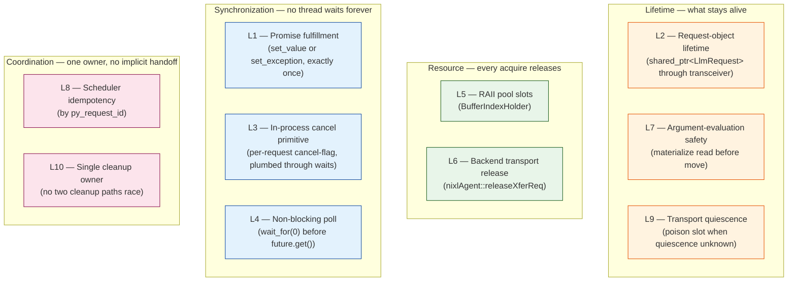
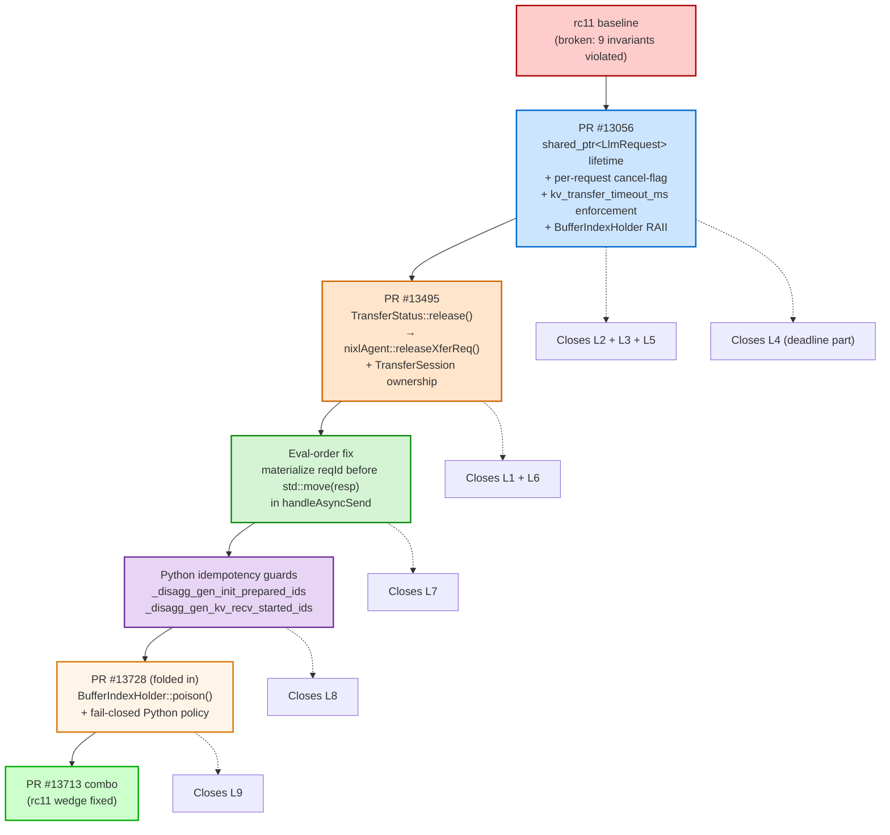
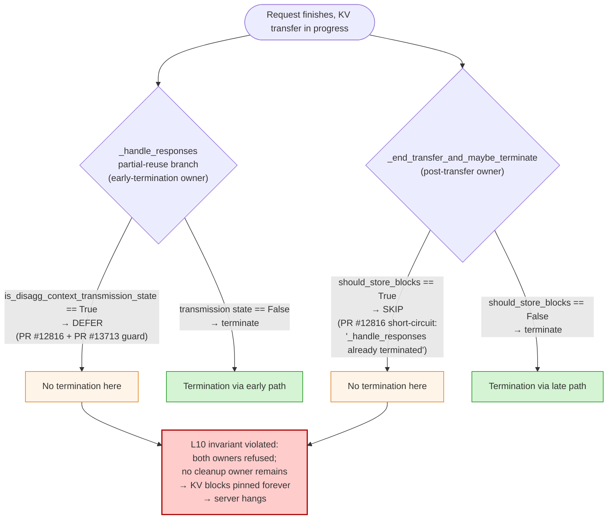
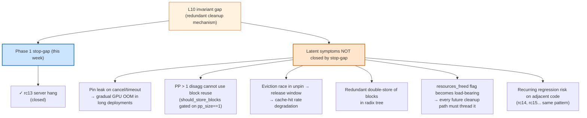
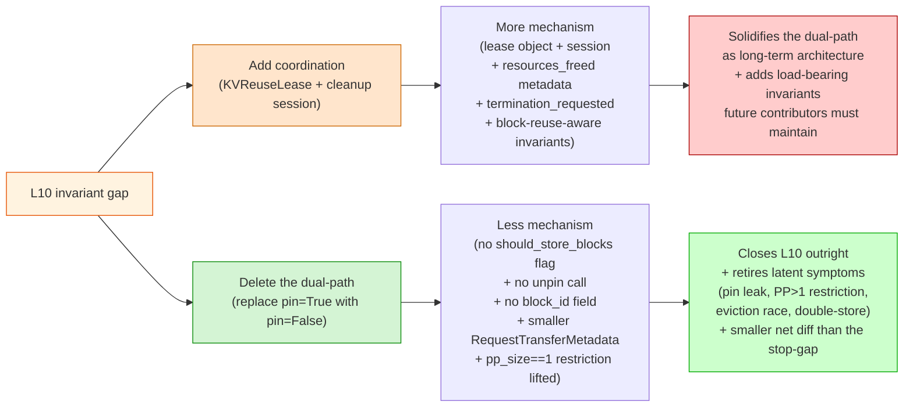

# 09 — NVBug 6104831 Executive Summary

Executive summary of NVBug 6104831 and the proposed fix in PR
[#13713](https://github.com/NVIDIA/TensorRT-LLM/pull/13713). The fix
solves the bug on `rc11` but regresses when applied on top of `rc13`.

---

## 1. The original rc11 wedge

### Customer-visible symptom

A `trtllm-serve` disaggregated 1P1D deployment running rc11 served the
first burst of long-prompt requests, then **stopped responding
indefinitely**. K8s pods stayed `1/1 Running`, the HTTP server kept
accepting connections, but every request after the burst timed out at
the client deadline. The wedge required a process restart.

The trigger was specific:

```text
long prompts (~8K tokens)
  + concurrency >= 16
  + aggressive client-side timeouts (cancellations + retries)
  + overlap scheduling enabled (default)
  + disaggregation enabled
```

Drop any one and the wedge typically does not reproduce. Most
production workloads were missing one or more of these and never hit
it; the customer's deployment hit all of them simultaneously.

### What was actually broken

From the outside, one bug. Inside the C++ KV-cache transceiver, **a
stack of nine independent defects** in the request cancellation /
cleanup path. The investigation uncovered seven concrete failure
signatures in rc11:

| Sig | Where it lives | Customer-visible symptom |
|---|---|---|
| `#1` | `CacheSender::Impl::sendResponse` (cancel-after-ready erase) | `std::future_error: Broken promise` on consumer's `future.get()` |
| `#2` | `templatedTrie.h::clearNode` cascade-prune walk | `cascade prune: parent did not find this node as a child` C++ assertion under sustained eviction |
| `#3` | `std::optional::value()` in disagg gen path | `RuntimeError: bad optional access` raised in decode-side Python event loop *(field-only)* |
| `#4` | `cacheTransceiver.cpp::checkGenTransferStatus(atLeastNum=1)` | gen worker's main event loop blocks indefinitely on a not-yet-ready future |
| `#5` | `CacheReceiver::Impl::cancelRequest` (queued-cancel erase) | `Broken promise` raised on the receiver side |
| `#6` | `CacheReceiver::Impl::requestSync` `!isReady` early-return + `BaseTransBufferManager::assignBufferIndex` `cv.wait` | one cancelled-after-ready transfer leaks a recv-buffer slot; the next request wedges the receiver pool forever |
| `#7` | `CacheSender::Impl::*` (bug class with 4 manifestations) | mutex deadlock; ctx mpi4py worker exits; Python `getattr` SIGSEGV; first-request SIGSEGV in `handleAsyncSend` |

These seven signatures were the visible faces of nine underlying
**invariant gaps** the rc11 transceiver did not enforce. The full set
of invariants is enumerated in section 2; for now the load-bearing
property is:

> **Any uncovered invariant is independently sufficient to wedge the
> deployment under the customer load shape.** Closing eight of nine
> still leaves the wedge.

That is why "land one PR that closes one bug" doesn't work for this
class — a candidate fix has to cover the whole invariant set.

---

## 2. The invariants for correct request cancellation and cleanup

A request that gets cancelled or times out mid-flight in the
disaggregated KV-cache transfer path passes through a set of cleanup
paths. Each cleanup path must respect the following ten invariants for
the system to remain correct, recover-able, and memory-safe. The
NVBug 6104831 bug class is the cumulative result of every one of
these being unenforced or partially enforced in rc11.

The invariants group into four categories:

### 2.1 Lifetime invariants — what stays alive while transfers are in flight

| # | Invariant | Why it matters |
|---|---|---|
| **L2** | **Request-object lifetime.** A `LlmRequest` object must remain alive across all C++ async operations that hold a reference to it. Python termination must not free the request out from under C++ async workers. | rc11 stored raw `LlmRequest*` in `mSenderFutures`, `mRequesterFutures`, `mReadyResponses`, `mRequestsQueue`. Python's `_terminate_request` could free the underlying object while C++ async paths still dereferenced it. Forensically observed as `mRequestId == 0x5555555555555555` (glibc free-fill pattern). |
| **L7** | **Argument-evaluation safety.** Code combining read-and-move on a moved-from-able type (`f(x->field, std::move(x))`) must materialize the read before the move. | A regression introduced *only* once L2 is fixed. Once `Response::mRequest` becomes `shared_ptr<LlmRequest>`, `sendAndRemoveResponse(resp.mRequest->mRequestId, std::move(resp))` becomes argument-evaluation-order unsafe. Causes a deterministic first-request SIGSEGV. |
| **L9** | **Transport quiescence on unsafe exit.** A buffer slot may not be returned to the pool while the transport may still be writing to it. Cancel/exception paths cannot prove peer quiescence; they must *poison* the slot rather than release it. | NIXL/UCX one-sided RMA can land a peer write after TRT-LLM has issued a cancel and the slot has been reassigned. Latent corruption hazard, not a wedge symptom. Closed by `BufferIndexHolder::poison()` and a fail-closed Python policy when quiescence is unknown. |

### 2.2 Resource invariants — every acquired resource must release on every exit

| # | Invariant | Why it matters |
|---|---|---|
| **L5** | **RAII pool slots.** Every `assignBufferIndex` must pair with `freeBufferIndex` on every exit path, including exception paths. Manual acquire/release pairing is forbidden in cleanup-sensitive code. | rc11's `requestSync` had at least three exit paths (success, `!isReady` early return, exception); only the success path released. One leaked recv-buffer slot wedged the next receive forever on the unbounded `cv.wait` (the customer-visible sig #6 wedge). |
| **L6** | **Backend transport release on cancel.** A cancellation reaching the transport boundary must release the backend transfer handle, not just unset TRT-LLM-side bookkeeping. | NIXL `nixlXferReqH` handles stay registered after TRT-LLM-side cancel unless `nixlAgent::releaseXferReq()` is called explicitly. Stranded handles accumulate under contention and contribute to sig #7 deadlocks. |

### 2.3 Synchronization invariants — what no thread waits forever on

| # | Invariant | Why it matters |
|---|---|---|
| **L1** | **Promise fulfillment.** Every `std::promise` associated with a request's transfer must be fulfilled exactly once before destruction — `set_value` on success, `set_exception` on cancel/error/timeout. No promise may be destroyed unfulfilled. | rc11's `CacheSender::Impl::sendResponse` cancel-after-ready erase path and `CacheReceiver::Impl::cancelRequest` queued-cancel erase path both destroyed promises without fulfilling them. The consumer's `future.get()` then threw raw `std::future_error: Broken promise` with no per-request attribution. |
| **L3** | **In-process cancellation primitive.** A cancellation request issued from any layer must be observable by every in-flight worker that holds the request. Workers blocked on `cv.wait`, polling on transport recv, or waiting on `future.get()` must all be interruptible. | rc11's `cancelRequest` returned `false` and logged "Cannot cancel request" on the in-flight path. Cancelled requests piled up in worker queues; `Cannot cancel request` log noise accumulated; sig #7 deadlock variants became more likely under contention. |
| **L4** | **Non-blocking poll.** Status-check entry points called from the executor's main event loop must be non-blocking. They may not call `future.get()` on a future that has not been observed ready; they must `wait_for(0)` and skip unready entries. | rc11's `checkGenTransferStatus(atLeastNum=1)` selected entries from `mRequesterFutures` by insertion order and called `future.get()` unconditionally. A single stuck transfer self-blocked the gen event loop indefinitely (the customer-visible sig #4 wedge). |

### 2.4 Coordination invariants — exactly one owner, no implicit handoffs

| # | Invariant | Why it matters |
|---|---|---|
| **L8** | **Scheduler idempotency.** Operations triggered by request scheduling (resource preparation, async receive start) must be idempotent by `py_request_id`. The scheduler may re-present the same logical request across iterations; non-idempotent side effects on those visits are bugs. | The Python scheduler can revisit the same `DISAGG_GENERATION_INIT` request across iterations while it waits for KV transfer to complete. rc11 ran `KVCacheManager::addSequence` and `request_and_receive_async` on every visit, producing the `emplaceDone` assertion at `kvCacheManager.cpp:2992` and double-queuing receive futures. |
| **L10** | **Single cleanup owner.** Each request must have exactly one cleanup owner across its lifecycle. No two code paths may concurrently attempt termination + `free_resources` for the same request, and no request may be left without a designated cleanup owner. Implicit boolean state machines that coordinate handoff between cleanup owners are forbidden. | The rc13 regression. Block reuse on the disagg path uses a "partial-reuse early termination" optimisation in `_handle_responses`; regular termination happens in `_end_transfer_and_maybe_terminate`. The two owners coordinate via the implicit `should_store_blocks` boolean, with refusal conditions that can both fire at once (in-flight + block-reuse-on), leaving the request with no cleanup owner. Server hangs. |

### Visualising the invariant set



The four categories form an architectural hierarchy: lifetime
invariants govern who is alive, resource invariants govern what is
held, synchronization invariants govern who is waiting, and
coordination invariants govern who is responsible. A complete
cancellation/cleanup contract requires all four enforced
simultaneously.

---

## 3. How PR #13713 solved the rc11 wedge

PR [#13713](https://github.com/NVIDIA/TensorRT-LLM/pull/13713) is the
first stack that closes nine of the ten invariants (L1–L9). It
composes four pieces:



Each invariant has at least one mechanism enforcing it. Removing any
piece re-violates at least one invariant.

**Empirical recovery on rc11** (local 1P1D `trtllm-serve` long-prompt
burst harness, single 8-GPU B300 host):

| Transport | `CONC=16` | `CONC=24` | `CONC=32` | `CONC=64` | `CONC=128` (3-pair) | `CONC=256` (3-pair) |
|---|---|---|---|---|---|---|
| **NIXL + UCX plugin** *(customer transport)* | n/a | n/a | **5/5 recovered** | **5/5 recovered** | **5/5 recovered** | **5/5 recovered** |
| Direct UCX | 5/5 recovered | 5/5 recovered | 5/5 recovered | wedged at saturation | wedged at saturation | n/a |

The customer-reported failure mode is **fully fixed** on the
customer's NIXL transport through `CONC=256` with three ctx/gen pairs.
The remaining direct-UCX wedge above `CONC=32` is throughput
saturation (a separate scope: `ucxx::Request::cancel()` + rendezvous
tuning), not a cancellation defect.

**L10 was never enforced in rc11** — but on rc11 the dual-path it
would govern was rarely exercised because disagg block reuse defaulted
off. PR #13713 inherited L10's gap; the regression below is what
forces it onto the agenda.

---

## 4. The rc13 regression: block reuse breaks the fix

### What changed between rc11 and rc13

`rc13` enabled **disagg block reuse by default**. Block reuse (prefix
caching) stores blocks in a radix tree so they can be reused across
requests with shared prefixes. In rc11 this was opt-in for
disaggregated serving; in rc13 it is on by default.

### The same combo regresses on rc13

The combo (PR #13713, including #13728 fold and MLA port) was
validated on rc11 through `CONC=256`. Applied on top of rc13, it
**regresses** to a server hang on workloads that previously succeeded:

| rc13 configuration (PR #13713 applied) | `CONC=128` outcome |
|---|---|
| block reuse disabled, overlap enabled | 5/5 recovered |
| block reuse enabled, overlap disabled | wedged |
| block reuse enabled, overlap enabled | wedged |

**Block reuse is the trigger.** Overlap is incidental.

### Why block reuse exposes L10

Block reuse on the disagg path uses a separate cleanup mechanism on
top of the regular termination flow, creating two cleanup owners:



The contradiction: PR #12816's `should_store_blocks` short-circuit on
the late path was justified by *"_handle_responses already terminated
this request via the early-termination path."* But PR #12816 *also*
added the `is_disagg_context_transmission_state` guard at the early
path, which prevents early termination from running for in-flight
requests. So when block reuse is enabled AND the request is in-flight
when `_handle_responses` runs, both owners refuse, termination never
happens, KV blocks stay pinned, and the server hangs.

This violates **L10** — the single-cleanup-owner invariant. Two
cleanup owners coordinate via implicit boolean state, and the
cross-product has a cell where neither accepts ownership.

PR #13713 did not introduce L10; the dual-path pre-existed rc11 and
was latent because rc11's disagg block reuse defaulted off. PR
#13713's `is_disagg_context_transmission_state` guard *interacts*
with the dual-path in the failure-producing way; rc13's default-on
block reuse makes the failure-producing cell the routine case.

---

## 5. Short-term plan: the L10 stop-gap unblocks rc13

### The fix

Two parts in `_end_transfer_and_maybe_terminate`:

1. **Remove the `if not should_store_blocks:` guard.** Always call
   `_terminate_request` after `end_transfer()` returns true.
2. **Make `_do_terminate_request` idempotent** via a `resources_freed`
   flag on the request's transfer metadata. Set it inside
   `_do_terminate_request` after `free_resources` runs; check on entry
   to dedupe against the rare case where `_handle_responses` did take
   the early-termination path.

Plus an integration test driving disagg + block reuse + slow-transfer
so `_handle_responses` runs while the request is in transmission.

### What it covers

Closes the **specific cell** of the L10 cross-product that rc13
exercises by default (in-flight cancel + block reuse on). Termination
always runs once. The customer's hang is gone. PR #13713 lands cleanly
on rc13.

### What it does NOT cover

The Phase 1 stop-gap leaves several latent L10 symptoms open:



The stop-gap is **load-bearing for unblocking the customer** but is
**not** the architectural fix to L10. Mark every new field with a
`# STOP-GAP: remove with Phase 2 pin-elimination work` comment so
future contributors do not solidify it as the long-term contract.

---

## 6. Mid-term: delete the dual-path entirely (the L10 architectural fix)

### The architectural answer

The medium-term fix replaces `store_blocks_for_reuse(request,
pin=True)` with `pin=False` on the disagg path, deletes the
`should_store_blocks` flag and the conditional in
`_end_transfer_and_maybe_terminate`, deletes `block_id` from
`RequestTransferMetadata`, deletes `unpin_blocks_by_id` in
`end_transfer`, and drops the `pp_size == 1` restriction.

The safety argument is that *reference counting already provides
equivalent protection* for in-transfer blocks: the sequence stays
alive during transfer → ref count > 0 → blocks not evictable.
Pinning is redundant.

### Add coordination vs delete redundancy

Two competing fix proposals existed for L10:



Deletion is the strictly cleaner direction:

| Aspect | Add coordination | Delete redundancy |
|---|---|---|
| **Lines net change** | + several hundred (lease class, session coordinator, invariant assertions) | net **negative** (deletes flag, deletes unpin, simplifies metadata) |
| **L10 closure** | Patches symptoms; dual-path remains | Closes outright; dual-path is gone |
| **Latent symptoms** | All remain (pin leak, PP > 1, eviction race) | All retired |
| **PP > 1 enablement** | No | Yes |
| **Future regression risk** | High — every PR touching cleanup paths must consider the dual-path cross-product | Low — single owner, single contract |
| **Maintenance cost** | Recurring (`resources_freed` must be threaded through every new path) | One-time deletion, then zero |

### Risks of the deletion path

Three things to verify before landing:

1. **The "sequence alive → ref count > 0" invariant must hold under
   the fail-closed paths.** If `_fail_closed_for_unquiesced_disagg_transfer`
   can free a sequence with an outstanding transfer, the ref-count
   protection that replaces pinning evaporates. Audit before landing.
2. **Scheduler's free-block accounting under memory pressure.** With
   `pin=False`, the scheduler must keep treating in-transfer blocks as
   "allocated" so memory pressure does not force eviction of blocks
   the transfer is reading.
3. **PP > 1 disagg end-to-end.** Lifting the `pp_size == 1`
   restriction is asserted-safe in the design; verify with the
   long-prompt burst harness across PP > 1 before declaring it.

### The staged plan


Each step has a falsifiable success criterion:

1. **Step 1**: rc13 hang no longer reproduces.
2. **Step 2**: new integration test passes; the test stays green when
   step 3 is later applied.
3. **Step 3**: existing test from step 2 still passes (same observable
   behaviour, simpler implementation).
4. **Step 4**: deletes ~10 lines from step 1; `grep -r 'resources_freed'`
   returns zero hits.

The customer is unblocked at every step.

---

## One-paragraph recap

The rc11 wedge was **nine independent invariant gaps** in the disagg
KV-transfer cancellation/cleanup path, surfacing as seven distinct
customer-visible symptoms. The invariants group into four categories:
**lifetime** (object/eval-order/transport-quiescence), **resource**
(RAII pool slots, backend-handle release on cancel),
**synchronization** (promise fulfillment, cancellation primitive,
non-blocking poll), and **coordination** (scheduler idempotency,
single cleanup owner). PR #13713 — combining PR #13056's lifetime +
cancellation refactor, PR #13495's NIXL release hook, an eval-order
fix, Python idempotency guards, and PR #13728's fail-closed
memory-safety policy — closes nine of the ten invariants and recovers
cleanly on rc11 through `CONC=256` on the customer's NIXL transport.
Applying the same combo to rc13 regresses because rc13 enables block
reuse by default, which surfaces the tenth invariant gap (single
cleanup owner): a redundant cleanup mechanism whose dual-path can
leave a request with no termination owner. The Phase 1 stop-gap
(~10 lines) closes the specific rc13 hang and lets PR #13713 land;
deleting the dual-path (replacing `store_blocks_for_reuse(pin=True)`
with `pin=False`, plus removing the supporting flag and call sites)
is the architectural fix and retires the latent symptoms the stop-gap
leaves open.
