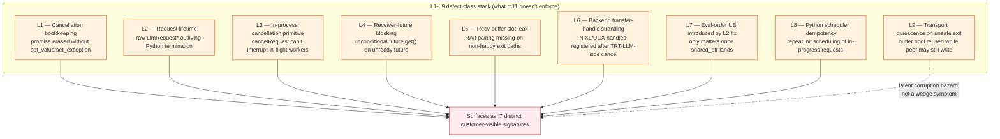
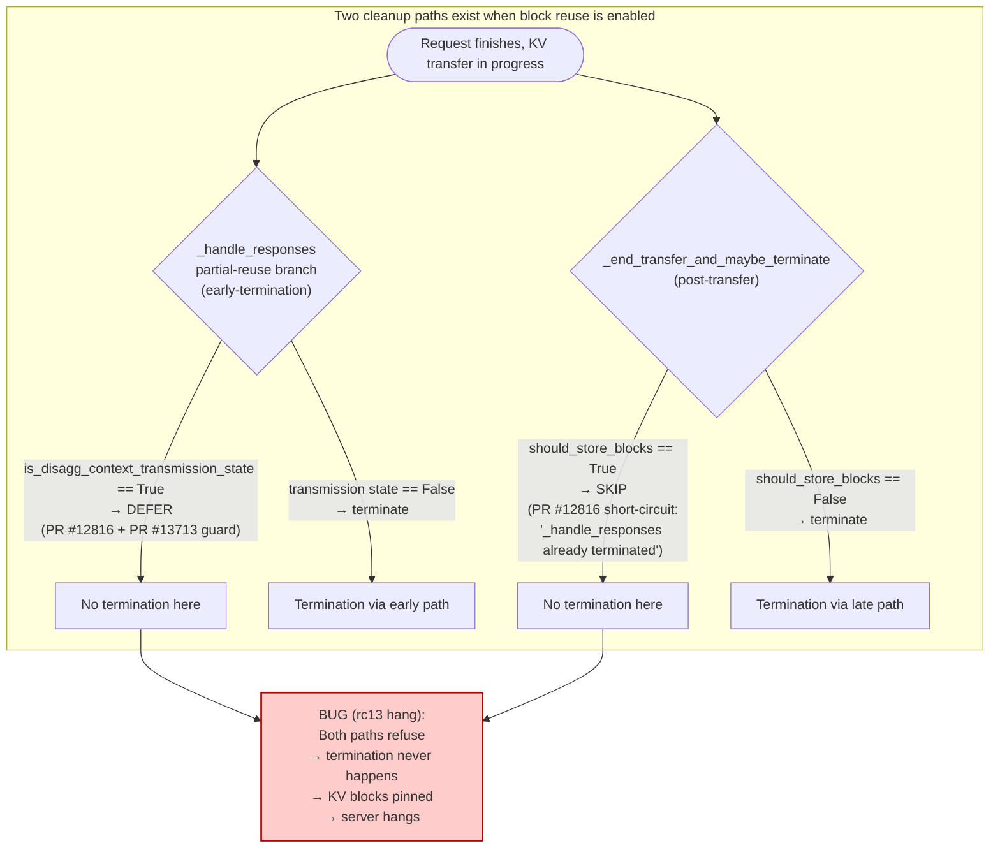
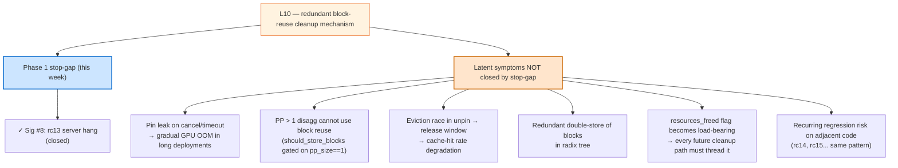
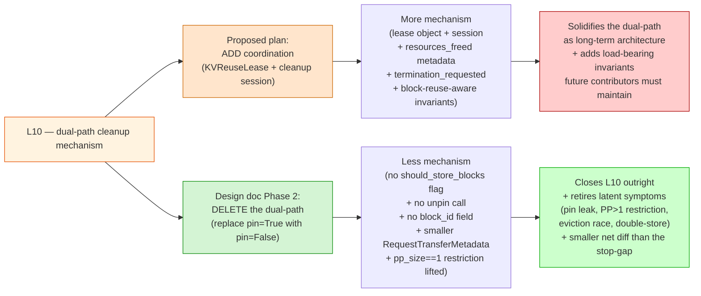

# 09 — Executive Summary: rc11 → rc13 Journey

**Target audience:** an engineer or technical lead who needs to understand
what was wrong in rc11, how PR #13713 fixed it, why it regressed on rc13,
and what the short-term and long-term plans are. **Reading time:** 15 minutes.

For deeper depth on any one part, every section ends with a pointer to the
relevant detail file. The 10-minute version is in
[`00-tldr.md`](00-tldr.md); this file extends it with the rc13 chapter.

---

## (1) The original rc11 wedge

### What the customer saw

A `trtllm-serve` disaggregated 1P1D deployment running rc11 served the
first burst of long-prompt requests, then **stopped responding
indefinitely**. K8s pods stayed `1/1 Running`, the HTTP server kept
accepting connections, but every request after the burst timed out at
the client deadline. The wedge required a process restart.

The trigger was specific:

```text
long prompts (~8K tokens)
  + concurrency >= 16
  + aggressive client-side timeouts (cancellations + retries)
  + overlap scheduling enabled (default)
  + disaggregation enabled
```

Drop any one and the wedge typically does not reproduce. Most
production workloads were missing one or more of these and never hit
it. The customer's deployment hit all of them.

### What was actually broken

From the outside, one bug. Inside the C++ KV-cache transceiver, **a
stack of nine independent defects** in the request cleanup path. Any
one of them was sufficient to wedge the deployment under the load
shape; closing eight of nine still leaves the deployment exposed to
silent corruption under cancel-heavy load.

The investigation uncovered seven concrete failure signatures:

| Sig | Where it lives | Customer-visible symptom |
|---|---|---|
| `#1` | `CacheSender::Impl::sendResponse` (cancel-after-ready erase) | `std::future_error: Broken promise` on consumer's `future.get()` |
| `#2` | `templatedTrie.h::clearNode` cascade-prune walk | `cascade prune: parent did not find this node as a child` C++ assertion under sustained eviction |
| `#3` | `std::optional::value()` in disagg gen path | `RuntimeError: bad optional access` raised in decode-side Python event loop *(field-only)* |
| `#4` | `cacheTransceiver.cpp::checkGenTransferStatus(atLeastNum=1)` | gen worker's main event loop blocks indefinitely on a not-yet-ready future |
| `#5` | `CacheReceiver::Impl::cancelRequest` (queued-cancel erase) | `Broken promise` raised by the consumer's `future.get()` on the receiver side |
| `#6` | `CacheReceiver::Impl::requestSync` `!isReady` early-return + `BaseTransBufferManager::assignBufferIndex` `cv.wait` | one cancelled-after-ready transfer leaks a recv-buffer slot; the next request wedges the receiver pool forever |
| `#7` | `CacheSender::Impl::*` (bug class with 4 manifestations) | mutex deadlock; ctx mpi4py worker exits; Python `getattr` SIGSEGV; first-request SIGSEGV in `handleAsyncSend` |

These seven signatures were the visible faces of nine underlying
**invariant gaps** the rc11 transceiver didn't enforce — labelled L1
through L9 in the defect-class stack:



The crucial property: **any uncovered layer in L1–L8 is independently
sufficient to wedge the deployment.** Fixing six of eight still leaves
the wedge. That's why "land one PR that closes one bug" doesn't work
for this class — a candidate fix has to cover the whole layer set.

> Detail: [`02-failure-signatures.md`](02-failure-signatures.md),
> [`03-defect-class-stack.md`](03-defect-class-stack.md).

---

## (2) How PR #13713 solved it on rc11

### The fix is a combo

PR [#13713](https://github.com/NVIDIA/TensorRT-LLM/pull/13713) is the
first stack that closes every load-bearing layer (L1–L8) plus the
residual memory-safety invariant (L9). It composes four pieces:


Each layer has at least one mechanism closing it. Removing any piece
re-opens at least one layer.

### Empirical recovery on rc11

Local 1P1D `trtllm-serve` long-prompt burst harness, single 8-GPU B300 host:

| Transport | `CONC=16` | `CONC=24` | `CONC=32` | `CONC=64` | `CONC=128` (3-pair) | `CONC=256` (3-pair) |
|---|---|---|---|---|---|---|
| **NIXL + UCX plugin** *(customer transport)* | n/a | n/a | **5/5 recovered** | **5/5 recovered** | **5/5 recovered** | **5/5 recovered** |
| Direct UCX | 5/5 recovered | 5/5 recovered | 5/5 recovered | wedged at saturation | wedged at saturation | n/a |

The customer-reported failure mode is **fully fixed** on the customer's
transport (NIXL+UCX-plugin) through `CONC=256` with three ctx/gen
pairs. The only remaining failure is on the direct-UCX path above
`CONC=32`, and that is throughput saturation rather than a
cancellation defect (it's a separate scope: `ucxx::Request::cancel()`
+ rendezvous tuning).

> Detail:
> [`06-fix-approaches/D-combo.md`](06-fix-approaches/D-combo.md),
> [`00-tldr.md`](00-tldr.md).

---

## (3) The rc13 regression: block reuse breaks the fix

### What changed between rc11 and rc13

`rc13` enabled **disagg block reuse by default**. Block reuse (prefix
caching) is a performance feature that stores blocks in a radix tree so
they can be reused across requests with shared prefixes. In rc11 it
was opt-in for disaggregated serving; in rc13 it's on by default.

### The same combo regresses on rc13

The combo (PR #13713, including #13728 fold and MLA port) was
validated on rc11 through `CONC=256`. Applied on top of rc13, it
**regresses** to a server hang on workloads that previously succeeded:

| rc13 configuration (PR #13713 applied) | `CONC=128` outcome |
|---|---|
| block reuse disabled, overlap enabled | 5/5 recovered |
| block reuse enabled, overlap disabled | wedged |
| block reuse enabled, overlap enabled | wedged |

**Block reuse is the trigger.** Overlap is incidental.

### Why block reuse makes it regress: L10

Block reuse on the disagg path uses a separate cleanup mechanism on
top of the regular termination flow:



The contradiction: PR #12816's `should_store_blocks` short-circuit was
justified by *"_handle_responses already terminated this request via
the early-termination path."* But PR #12816 *also* added the
`is_disagg_context_transmission_state` guard at the early site, which
prevents the early-termination path from running for in-flight
requests. So when block reuse is enabled AND the request is in-flight
when `_handle_responses` runs:

- Early path skips because the request is in transmission.
- Late path skips because `should_store_blocks` says "already done."

Termination never happens. The request stays in `active_requests`, KV
blocks stay pinned, the server eventually hangs.

This is **layer L10 — redundant block-reuse cleanup mechanism on the
disagg path** in the defect-class stack. It surfaces as **sig #8**
(rc13 server hang under disagg + block reuse + in-flight cancel).

PR #13713 didn't introduce L10. The dual-path pre-existed rc11. It was
*latent* on rc11 because:

1. Block reuse defaulted to off on disagg; the dual-path was rarely exercised.
2. PR #12816 fixed the visible double-termination case it was tested for.
3. The specific failure-producing cell (in-flight + block reuse on) was not in the test matrix.

PR #13713's `is_disagg_context_transmission_state` guard *interacts*
with the dual-path in the failure-producing way; rc13's default-on
block reuse makes the cell routinely hit. Result: regression.

> Detail:
> [`05-investigation-timeline.md`](05-investigation-timeline.md) Phase 15,
> [`02-failure-signatures.md`](02-failure-signatures.md) sig #8,
> [`03-defect-class-stack.md`](03-defect-class-stack.md) L10.

---

## (4) Short-term plan: the L10 stop-gap unblocks rc13

### The fix

Two parts in `_end_transfer_and_maybe_terminate`:

1. **Remove the `if not should_store_blocks:` guard.** Always call
   `_terminate_request` after `end_transfer()` returns true.
2. **Make `_do_terminate_request` idempotent** via a `resources_freed`
   flag on the request's transfer metadata. Set it inside
   `_do_terminate_request` after `free_resources` runs; check on entry
   to dedupe against the (rare) case where `_handle_responses` did
   take the early-termination path.

Plus an integration test driving disagg + block_reuse + slow-transfer
so `_handle_responses` runs while the request is in transmission. Tag
the test as covering the dual-path that Phase 2 will simplify.

### What it covers

Closes the **specific cell** of the L10 cross-product that rc13
exercises by default (in-flight cancel + block reuse on). Termination
always runs once. The customer's hang is gone. PR #13713 lands cleanly
on rc13.

### What it does NOT cover

The Phase 1 stop-gap leaves several latent L10 symptoms open:



The stop-gap is **load-bearing for unblocking the customer this week**.
It is **not** the architectural fix. Mark every new field with a
`# STOP-GAP: remove with Phase 2 pin-elimination work` comment so
future contributors don't solidify it as the long-term contract.

> Detail:
> [`08-next-steps-and-pr-map.md`](08-next-steps-and-pr-map.md) item 2.

---

## (5) Mid-term: design doc Phase 2 deletes the dual-path

### The architectural answer

Phase 2 of the existing
[block-reuse-overlap-scheduler design doc](../../design/block-reuse-overlap-scheduler/phase2-unify-reuse-mechanisms.md)
proposes deleting the dual-path entirely:

- Replace `store_blocks_for_reuse(request, pin=True)` with `pin=False`
  in the disagg path.
- Delete the `should_store_blocks` flag and the conditional in
  `_end_transfer_and_maybe_terminate`.
- Delete `block_id` from `RequestTransferMetadata`; simplify to a
  bare counter.
- Delete `unpin_blocks_by_id` in `end_transfer`.
- Drop the `pp_size == 1` restriction on disagg block reuse.

The safety argument is that *reference counting already provides
equivalent protection*: the sequence stays alive during transfer →
ref count > 0 → blocks not evictable. Pinning is redundant.

### Add coordination vs delete redundancy

There were two competing fix proposals for L10:



Phase 2 is the strictly cleaner direction:

| Aspect | Add coordination | Delete redundancy (Phase 2) |
|---|---|---|
| **Lines net change** | + several hundred (lease class, session coordinator, invariant assertions) | net **negative** (deletes flag, deletes unpin, simplifies metadata) |
| **L10 closure** | Patches symptoms; dual-path remains | Closes outright; dual-path is gone |
| **Latent symptoms** | All remain (pin leak, PP > 1, eviction race) | All retired |
| **PP > 1 enablement** | No | Yes — restriction can be dropped |
| **Future regression risk** | High — every PR touching cleanup paths must consider the dual-path cross-product | Low — single owner, single contract |
| **Maintenance cost** | Recurring (`resources_freed` must be threaded through every new path) | One-time deletion, then zero |

### Risks of Phase 2

Phase 2 is medium-risk, high-payoff. Three things to verify:

1. **The "sequence alive → ref count > 0" invariant must hold under
   PR #13728's fail-closed paths.** If `_fail_closed_for_unquiesced_disagg_transfer`
   can free a sequence with an outstanding transfer, ref-count protection
   evaporates. Audit before landing.
2. **Scheduler's free-block accounting under memory pressure.** With
   `pin=False`, the scheduler must keep treating in-transfer blocks as
   "allocated" so memory pressure doesn't force eviction of blocks the
   transfer is reading.
3. **PP > 1 disagg end-to-end.** The doc says lifting the restriction is
   safe; verify with the long-prompt burst harness across PP > 1 before
   declaring it.

### The staged plan


Each step has a falsifiable success criterion:

1. **Step 1**: rc13 hang no longer reproduces.
2. **Step 2**: new integration test passes; the test stays green when
   step 3 is later applied.
3. **Step 3**: existing test from step 2 still passes (same observable
   behaviour, simpler implementation).
4. **Step 4**: deletes ~10 lines from step 1; `grep -r 'resources_freed'`
   returns zero hits.

The customer is unblocked at every step.

> Detail:
> [`docs/design/block-reuse-overlap-scheduler/phase2-unify-reuse-mechanisms.md`](../../design/block-reuse-overlap-scheduler/phase2-unify-reuse-mechanisms.md),
> [`08-next-steps-and-pr-map.md`](08-next-steps-and-pr-map.md) item 2a.

---

## One-paragraph recap

The original rc11 wedge was nine independent invariant gaps in the
disagg KV transceiver, surfacing as seven distinct customer-visible
symptoms. PR #13713 closes all nine — combining PR #13056's
architectural lifetime/cancellation refactor, PR #13495's NIXL backend
release hook, an eval-order fix, Python idempotency guards, and PR
#13728's fail-closed memory-safety policy — and recovers cleanly on
rc11 through `CONC=256` on the customer's NIXL transport. Applying the
same combo to rc13 regresses because rc13 enables block reuse by
default, which surfaces a tenth latent layer (L10): a redundant
cleanup mechanism whose dual-path can leave a request with no
termination owner. The Phase 1 stop-gap (~10 lines) closes the
specific rc13 hang and lets PR #13713 land; the design doc's Phase 2
(~negative net lines) deletes the dual-path entirely as the long-term
architectural fix and retires the latent symptoms the stop-gap leaves
open.

---

## Pointers for deeper reading

| Topic | File |
|---|---|
| 10-minute version of (1) and (2) | [`00-tldr.md`](00-tldr.md) |
| Architecture and request walkthrough | [`01-background.md`](01-background.md) |
| The seven (now eight) signatures in detail | [`02-failure-signatures.md`](02-failure-signatures.md) |
| The L1–L10 defect-class framework | [`03-defect-class-stack.md`](03-defect-class-stack.md) |
| Reproducer | [`04-reproduction.md`](04-reproduction.md) |
| Chronological investigation, including Phase 15 (rc13 regression) | [`05-investigation-timeline.md`](05-investigation-timeline.md) |
| Approach D (combo) detail and empirical results | [`06-fix-approaches/D-combo.md`](06-fix-approaches/D-combo.md) |
| Why so many bugs were latent; retrospective | [`07-architectural-reflections.md`](07-architectural-reflections.md) |
| PR map, outstanding work, staged landing plan | [`08-next-steps-and-pr-map.md`](08-next-steps-and-pr-map.md) |
| The architectural answer (Phase 2 delete-the-dual-path design) | [`docs/design/block-reuse-overlap-scheduler/phase2-unify-reuse-mechanisms.md`](../../design/block-reuse-overlap-scheduler/phase2-unify-reuse-mechanisms.md) |
