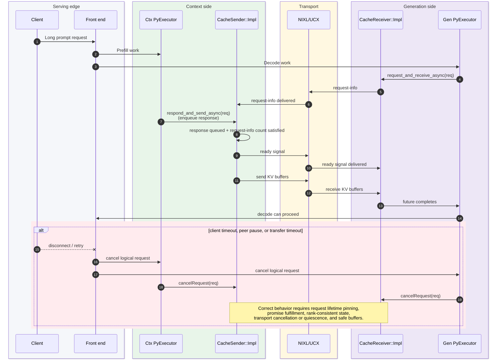
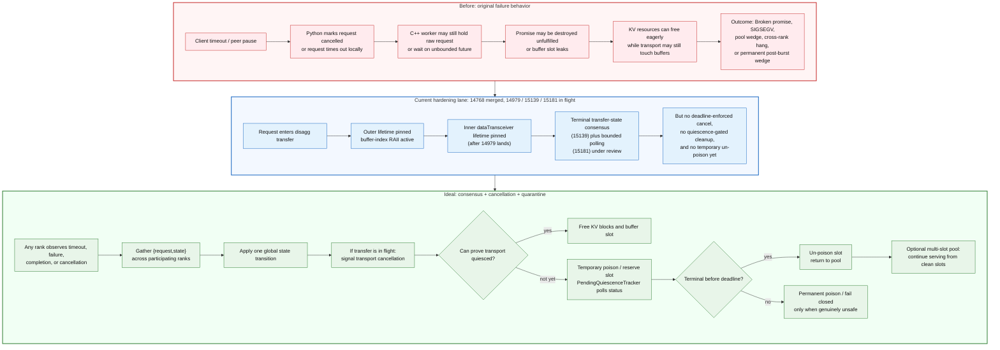

# 20 - Executive summary: disaggregated KV transfer wedge

**Audience:** leadership, stakeholders, incident commanders, and reviewers who need a self-contained
mental model for the failure, the fixes, and the remaining design work.

**Status as of 2026-06-09:** pull-request states were verified on GitHub; see the appendix for the compact
PR map.

## Executive takeaway

**Failure symptom:** a disaggregated `trtllm-serve` deployment can remain alive while permanently making no
forward progress after a burst of long-prompt traffic with cancellations. Pods and ports can look healthy,
but post-burst requests time out until the worker restarts.

**Root cause:** the disaggregated KV transfer path is missing a complete cancellation and cleanup contract.
Fixing only the trivial use-after-free class prevents crashes, but does not recover the permanent NIXL wedge.
The load-bearing recovery work requires:

- safe request and promise lifetime;
- bounded transfer-status polling so the executor loop stays alive;
- in-flight transport cancellation or quiescence tracking;
- no buffer reuse until the transport is known terminal;
- rank-consistent request-state transitions before collectives;
- a less disruptive temporary poison and un-poison model.

**Landing strategy:** the original broad fix attempt in
[NVIDIA/TensorRT-LLM 13713](https://github.com/NVIDIA/TensorRT-LLM/pull/13713)
addressed many known issues in one change set, which made it useful as an end-to-end proof of direction.
It also had a large blast radius: it conflicted with current TRT-LLM behavior in multiple scheduler,
parallelism, block-reuse, and cleanup paths, and it broke many tests. That is why the landing strategy is
now phased risk containment rather than one broad merge: merge low-risk lifetime and RAII fixes first, add
cross-rank state consensus next, then reintroduce in-flight cancellation and temporary buffer quarantine on
top of a stronger consensus contract.

## Request lifecycle mental model

A single disaggregated request crosses Python scheduling, the C++ transceiver, formatter buffer ownership,
and NIXL/UCX transport progress. The ready signal depends on two sender-side facts: gen request-info has
arrived at `CacheSender::Impl`, and the ctx-side response has been queued through
`respond_and_send_async`.

## Consolidated issue and fix matrix

This table is the executive map. It consolidates symptom, root cause, mitigation, long-term target, and
pull-request status into one place.

| Area | Failure symptom | Root cause | Current or immediate mitigation | Ideal / long-term behavior | Pull request status |
|---|---|---|---|---|---|
| Outer request lifetime | UAF, SIGSEGV, invalid request fields after Python termination | Outer `CacheTransceiver` futures could keep raw request references after Python-side cleanup | Store `shared_ptr<LlmRequest>` in outer sender/requester futures | Request lifetime is owned by a transfer session until all async work is terminal | [NVIDIA/TensorRT-LLM 14768](https://github.com/NVIDIA/TensorRT-LLM/pull/14768): merged |
| Inner transceiver lifetime | `std::future_error: Broken promise`, UAF, worker-side cleanup storms | Inner `dataTransceiver` `Response` / `RequestAndPromise` still held raw pointers and async workers captured by reference | Port inner structures and async worker capture sites to `shared_ptr<LlmRequest>` | Single RAII transfer-session object owns request, promise, cancel token, and buffers | [NVIDIA/TensorRT-LLM 14979](https://github.com/NVIDIA/TensorRT-LLM/pull/14979): open, in flight |
| Promise lifecycle | Sender-side or receiver-side `Broken promise` instead of attributable request error | Cancel paths erased or destroyed promises without exactly-one fulfillment | Move cancelled sender response out before erase and set a structured exception; set a structured exception before erasing queued receiver requests | Promise fulfillment becomes part of a unified transfer-session terminal transition, including future in-flight cancellation races | [NVIDIA/TensorRT-LLM 14979](https://github.com/NVIDIA/TensorRT-LLM/pull/14979): open, in flight for straightforward sender/receiver cases; broader in-flight-cancel promise races remain follow-up |
| Eval-order crash | First-request SIGSEGV after moving to `shared_ptr` | Code read `resp.mRequest->mRequestId` and moved `resp` in the same function call; argument evaluation order made the read unsafe | Materialize request id before moving the response object | Code pattern banned or linted for move-sensitive request holders | [NVIDIA/TensorRT-LLM 14979](https://github.com/NVIDIA/TensorRT-LLM/pull/14979): open, in flight |
| Event-loop freeze | `PyExecutor` hang detector fires; no new scheduling or cancellation processing | Engine loop called unbounded `future.get()` on a not-yet-ready transfer future | Replace unbounded `get()` with bounded/non-blocking `wait_for` polling | Transfer polling never blocks the scheduler; stuck transfers are handled by cancel/quiescence state | [NVIDIA/TensorRT-LLM 15181](https://github.com/NVIDIA/TensorRT-LLM/pull/15181): open draft, stacked on 15139; liveness-only bounded polling, no timeout/cancel/cleanup semantics |
| Buffer-slot leak | Receiver pool waits forever, especially with default size-1 recv pool | Manual buffer-index acquire/release missed early-return and exception paths | `BufferIndexHolder` RAII releases slots on normal and exception exits | Buffer ownership is part of transfer-session RAII with explicit quarantine states | [NVIDIA/TensorRT-LLM 14768](https://github.com/NVIDIA/TensorRT-LLM/pull/14768): merged |
| In-flight transport cancellation | Timeout changes Python state but C++ worker remains stuck in transport wait | Python timeout could not interrupt an in-flight NIXL transfer | Add per-request cancel flag and NIXL `releaseXferReq` path before freeing resources | Cancellation is global, rank-consistent, and transport-aware before cleanup runs | Covered in closed [NVIDIA/TensorRT-LLM 13713](https://github.com/NVIDIA/TensorRT-LLM/pull/13713); future redesign needed |
| Unsafe eager free | Permanent post-burst wedge or silent corruption risk after cancellation | KV blocks or transfer buffers can return to the pool while UCX/NIXL may still touch them | Fail closed by poisoning when quiescence is unknown | Temporary poison: reserve slot, poll terminal status, un-poison on success/failure, permanently poison only on deadline | Covered as fail-closed in closed [NVIDIA/TensorRT-LLM 13713](https://github.com/NVIDIA/TensorRT-LLM/pull/13713); temporary un-poison is scoped to be created |
| Cross-rank state divergence | Helix / ADP / PP hangs; one rank enters a collective while another skips | Per-rank gates and local status decisions changed request state without global agreement | Gather terminal request states and apply transitions from consensus | All cancellation, failure, completion, and deferred-cleanup decisions satisfy a global consensus contract | [NVIDIA/TensorRT-LLM 15139](https://github.com/NVIDIA/TensorRT-LLM/pull/15139): open draft |
| rc13 block-reuse cleanup | Request has no cleanup owner; blocks remain pinned; server hangs | Early and late cleanup paths coordinate through implicit booleans and can both decline ownership | Stop-gap: single owner after `end_transfer`, dedupe actual resource free | Delete redundant disagg block-reuse cleanup path and make cleanup ownership explicit | Covered in closed [NVIDIA/TensorRT-LLM 13713](https://github.com/NVIDIA/TensorRT-LLM/pull/13713); follow-up scope required |
| Stress-test coverage | Bugs reached production before this load shape was continuously tested | No maintained cancellation-heavy disagg stress lane for the V1/C++ and V2/Python paths | Register and grow disagg cancellation stress tests | Permanent stress suite for cancellation, worker-loss, canary, and resource-leak regressions | [NVIDIA/TensorRT-LLM 15174](https://github.com/NVIDIA/TensorRT-LLM/pull/15174): open draft; starts QA stress-list registration |
| Direct UCX saturation | High-concurrency direct-UCX runs time out even after NIXL path recovers | Direct UCX path hits throughput/backpressure limits, distinct from NIXL cancellation correctness | Document boundary; tune UCX rendezvous and send-worker concurrency | Direct UCX grows a transfer-status/cancel abstraction or moves to a NIXL-like one-sided shape | Scoped, to be created |

## Before, current, and ideal workflow

The key distinction is not just "more checks." The desired end state changes the ownership and timing of
cleanup so that cancellation is both globally consistent and memory safe.

## Phased plan

The phased plan is risk containment, not hesitation. The closed broad stack in
[NVIDIA/TensorRT-LLM 13713](https://github.com/NVIDIA/TensorRT-LLM/pull/13713) remains the architecture
map, but each landing step below should be independently reviewable, testable, and revertible.

1. **Crash-class fire mitigation:** finish
   [NVIDIA/TensorRT-LLM 14979](https://github.com/NVIDIA/TensorRT-LLM/pull/14979) on top of the merged
   [NVIDIA/TensorRT-LLM 14768](https://github.com/NVIDIA/TensorRT-LLM/pull/14768). Scope: UAF,
   `handleAsyncSend` eval-order, and straightforward broken-promise paths.
2. **Stress-test coverage:** continue the stress-test PR chain, starting with
   [NVIDIA/TensorRT-LLM 15174](https://github.com/NVIDIA/TensorRT-LLM/pull/15174). Scope: register and grow
   cancellation-heavy disagg stress tests so later behavioral changes have a standing regression gate.
3. **Consensus foundation:** finish
   [NVIDIA/TensorRT-LLM 15139](https://github.com/NVIDIA/TensorRT-LLM/pull/15139). Scope: terminal
   request-state consensus only, not full cancellation.
4. **Bounded polling liveness:** finish
   [NVIDIA/TensorRT-LLM 15181](https://github.com/NVIDIA/TensorRT-LLM/pull/15181). Scope: finite
   `checkContextTransferStatus` / `checkGenTransferStatus` calls yield after bounded slices; poll-slice timeout
   is non-terminal and leaves the request in the same state/queue. It is intentionally stacked on 15139 and does
   not implement deadline enforcement, request cancellation, deferred cleanup, or buffer poison handling.
5. **Safe in-flight cancellation:** add cancellation intent, deadline enforcement, and transport cancel on top of
   consensus plus bounded polling; do not free resources until the transfer is terminal or quarantined.
6. **Temporary quarantine:** add `PendingQuiescenceTracker`, deferred un-poison, per-slot lifecycle, deadline
   fallback, and multi-slot pool configuration.
7. **Separate transport work:** track direct-UCX throughput/cancel parity independently from the NIXL wedge
   recovery path.

Keep two boundaries visible: 14768 + 14979 reduce crash risk but do not solve the permanent wedge; permanent
fail-closed poison is a safety net, while temporary quarantine and un-poison is the operational target.

## Pull request appendix

| Link | State on 2026-06-09 | Scope |
|---|---|---|
| [NVIDIA/TensorRT-LLM 13713](https://github.com/NVIDIA/TensorRT-LLM/pull/13713) | Closed, not merged | Broad proof of direction; too much blast radius for direct landing. |
| [NVIDIA/TensorRT-LLM 14768](https://github.com/NVIDIA/TensorRT-LLM/pull/14768) | Merged | Outer request lifetime, buffer-index RAII, NIXL agent keep-alive, observe-only timeout warnings. |
| [NVIDIA/TensorRT-LLM 14979](https://github.com/NVIDIA/TensorRT-LLM/pull/14979) | Open, in flight | Inner `dataTransceiver` lifetime, eval-order crash, straightforward promise fulfillment. |
| [NVIDIA/TensorRT-LLM 15139](https://github.com/NVIDIA/TensorRT-LLM/pull/15139) | Open draft | V1 terminal request-state consensus. |
| [NVIDIA/TensorRT-LLM 15181](https://github.com/NVIDIA/TensorRT-LLM/pull/15181) | Open draft | Bounded finite transfer-status polling; poll timeout is non-terminal and does not cancel, fail, or free requests. |
| [NVIDIA/TensorRT-LLM 15174](https://github.com/NVIDIA/TensorRT-LLM/pull/15174) | Open draft | Stress-test PR chain; QA stress-list registration for disagg cancellation marathon. |
| Future cancellation/quarantine work | Scoped, to be created | Deadline enforcement, in-flight cancellation, temporary poison, deferred un-poison, multi-slot pools. |
