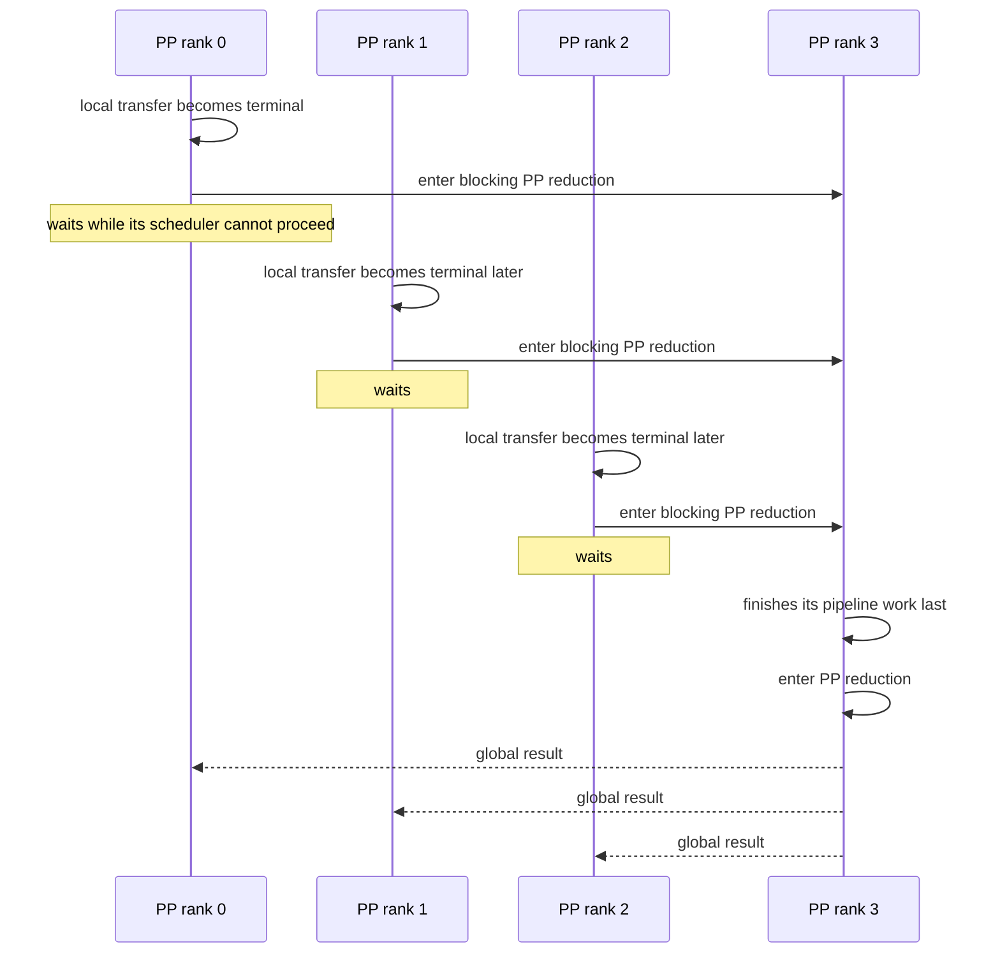
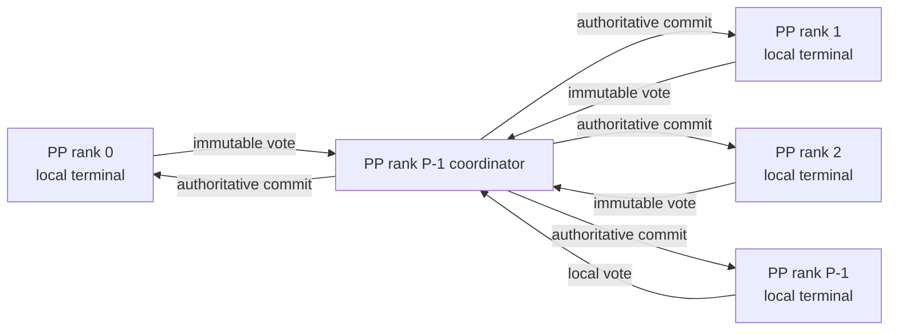

<!--
SPDX-FileCopyrightText: Copyright (c) 2026 NVIDIA CORPORATION & AFFILIATES. All rights reserved.
SPDX-License-Identifier: Apache-2.0
-->

# NVBug 6448152: Disaggregated PP Consensus Throughput Regression

- **Status:** Root cause isolated on a controlled historical tree; asynchronous-consensus design validated; latest-main
  production port and qualification pending
- **Updated:** 2026-07-20
- **Affected component:** PyExecutor disaggregated serving, C++ cache transceiver, context-side pipeline parallelism
- **Reported transport:** NIXL with the UCX backend
- **Reported topology:** one four-GPU PP4 context worker and one eight-GPU DEP8 generation worker on three GB300 nodes
- **Primary regression:** output-token throughput fell from approximately 1573 to 817 tokens/s
- **Correctness origin:** pull request 15139, which made terminal KV-transfer state transitions consistent across ranks
- **Related safety fixes:** pull request 15238 and
  pull request 15737
- **Validated design experiments:** pull request 16580 and
  pull request 16581
- **Official latest-main production PR:**
  pull request 16634

> [!IMPORTANT]
> The decisive experiments in pull requests 16565, 16566, 16567, 16572, 16580, and 16581 use a **controlled historical
> tree around pull request 15139**, with the same minimal pull request 15737 sender-race fix on both control and
> treatment. They prove what caused the adjacent before/after-pull-request-15139 regression and which mechanism repairs
> it. They are **not** a substitute
> for validating a production port on current `main`. In particular, pull request 15238 merged later and changed timeout,
> cancellation, request-retention, and cleanup semantics. The official implementation must be reconstructed from the
> latest `main` and rerun the exact GB300 workload before it is ready to merge.

## 1. Executive summary

Pull request 15139 fixed a real distributed-correctness problem. Before it, one rank could observe a local transfer future as
complete or failed and mutate its request state while another rank still considered the same request in progress.
That can make scheduling, response publication, cancellation, and resource cleanup diverge across ranks. Pull request 15139
therefore retained each locally terminal request, reduced packed terminal votes across the relevant rank groups, and
applied the state transition only after a common result existed.

The correctness rule was right; the synchronous execution shape was not. For the reported PP4 context worker, each PP
stage reaches the transfer-status check at a different time because pipeline stages are doing different work. Pull
request 15139 put a blocking PP collective at that staggered scheduler point. Early PP stages repeatedly waited for the last
stage to arrive. The collective payload was tiny, but the *rendezvous* exposed pipeline entry skew as idle scheduler
time. NVBug 6448152 reported the resulting output-token-throughput drop from **1573.57 to 817.33 tokens/s**.

The controlled evidence is now strong:

1. With the pull request 15737 lost-wakeup fix applied identically to both sides, the control before pull request 15139
   passed 512/512 requests at **1557.83 tokens/s**, while the treatment after pull request 15139 missed the 5400-second
   harness deadline and completed only
   481/512 requests. Its printed 598.42 tokens/s is censored and is not a valid throughput measurement.
2. Transition-only instrumentation reproduced the pre-teardown rate at approximately **818 tokens/s** and measured
   negligible TP consensus time (at most 5 microseconds), but enormous asymmetric PP wait: approximately 4240, 3204,
   and 2126 accumulated seconds on PP ranks 0, 1, and 2, versus 0.082 seconds on rank 3.
3. An unsafe diagnostic that removed only context-side global consensus recovered 512/512 at **1564.71 tokens/s**.
   This established that the context consensus path, not generation cleanup, was the causal phase, but could not be a
   production fix because it permitted rank-divergent terminal decisions.
4. Pull request 16580 replaced the scheduler-hot-path PP terminal-outcome collective with asynchronous point-to-point
   agreement: immutable votes flow to the last PP rank, that coordinator reduces them, and one authoritative commit
   flows back. Ranks poll without waiting; request state and resource release still wait for the global commit. It
   passed 512/512 at
   **1548.84 tokens/s**, 99.42% of the matched control.
5. Pull request 16581 kept exactly the same agreement protocol and additionally reclaimed locally quiesced successful
   KV before global commit. It passed 512/512 at **1575.23 tokens/s**. The small difference from pull request 16580 is
   within normal run variation; because pull request 16580 already recovered throughput while retaining resources
   globally, deferred reclamation was
   not a material limiter for this workload.

The recommended first production pull request is therefore the smallest safe result: adapt pull request 16580's
asynchronous ordered PP
commit to the latest `main`, keep KV and request resources retained until global commit, remove diagnostic-only gates
and logging, and qualify it comprehensively. The adaptation must preserve pull request 15238's two-phase cancellation contract:
a timeout/cancel observation is a repeatable nonterminal proposal, all ranks coordinate cancellation, and only local
quiescence produces an immutable terminal acknowledgement for the authoritative commit. Treat pull request 16581's early
reclamation as a separate capacity optimization that needs an explicit request/epoch credit contract before broad
enablement.

The central design lesson is:

> Global agreement requires waiting for information, but it does not require blocking every scheduler at the same
> instant. Publish local facts asynchronously, compute one ordered decision, and gate only irreversible external
> effects on that decision.

## 2. The exact incident

The reported NVBug workload is:

```text
Test:
e2e-gb300_deepseek-r1-fp4_128k8k_con256_ctx1_pp4_gen1_dep8_eplb0_mtp1_ccb-NIXL-con256_iter2_isl131072_osl8192

Stage:
GB300-12_GPUs-3_Nodes-PyTorch-Disagg-PerfSanity-CTX1-NODE1-GPU4-GEN1-NODE2-GPU8-Post-Merge-1

Pytest selector:
disagg_upload-e2e-gb300_deepseek-r1-fp4_128k8k_con256_ctx1_pp4_gen1_dep8_eplb0_mtp1_ccb-NIXL

Metric:
output token throughput
```

| Reported point | Commit | Output tokens/s |
| --- | --- | ---: |
| Good | `b03b78f300ad6decdbcacf8a92650470f8f961b4` | 1573.57 (reported as 1573) |
| Bad | `a51931ad2f62dfcf98d51e2eae2e80c84e42dded` | 817.33 (reported as 817) |

The workload has the topology that most strongly exposes the defect:

- CTX is PP4, so four independent scheduler loops reach the status point at pipeline-dependent times.
- Each request is extremely large (`ISL=131072`), so context work and transfer completion are expensive and skew is
  amplified.
- Concurrency is 256, so a per-request synchronization bubble becomes a sustained throughput limiter.
- GEN is DEP8/PP1 for this test. The instrumentation later confirmed that generation completed every request that the
  context service successfully handed off; the initiating steady-state loss was on CTX.

The incident dashboard supplied with the NVBug is
[here](https://tensorrt-llm.tensorrt-llm-perf-ci-report.sc2-paas.nvidia.com/?selectedGpus=b200%2Cgb200%2Cgb300&selectedBranches=main&selectedCurve=perf_instability&selectedNvbug=**all**&pinnedSection=e2e-gb300_deepseek-r1-fp4_128k8k_con256_ctx1_pp4_gen1_dep8_eplb0_mtp1_ccb-NIXL-con256_iter2_isl131072_osl8192%7Cmain%7Cgb300&in_time-from=2026-06-29).

## 3. What pull request 15139 was trying to fix

### 3.1 The pre-consensus correctness gap

A disaggregated request has per-rank local transfer work, but its externally visible lifecycle is replicated. The
following effects must not disagree among ranks that jointly execute the request:

- whether the transfer is still in progress, completed, cancelled, or failed;
- whether the request may enter the next scheduler state;
- whether an error or success response may be published;
- whether the request may be removed from transfer bookkeeping; and
- whether KV pages or transfer buffers may be returned for reuse.

Local transfer completion is not a valid distributed decision. Future readiness, transport errors, cancellation races,
and callback timing can differ by rank. Earlier validation caught real divergences in C++ asymmetric-executor, Helix,
and TinyLlama configurations. In one TinyLlama run, the same rank observed one request as locally complete for three
consecutive iterations while peers had not yet caught up. See the earlier
[cross-rank consistency investigation](../nvbug-6104831-disagg-permanent-wedge/14-cross-rank-consistency-enforcement.md)
for those correctness experiments.

The required reduction semantics are:

- `COMPLETED` only after every participant reports success;
- `FAILED` (and, where distinct, `CANCELLED`) wins when any participant reports it, subject to the protocol's local
  quiescence rule; and
- no rank performs an irreversible terminal transition from a merely local observation.

### 3.2 What merged pull request 15139 implemented

Pull request 15139 added the V1 C++ equivalent of that rule. The merged implementation:

1. records a local immutable `{request_id, completed|failed}` outcome;
2. retains the `LlmRequest` in an awaiting-consensus map after consuming its future;
3. gathers packed outcome entries and reduces them deterministically;
4. runs context reduction first over the TP/CP synchronization group and then over the PP group; and
5. mutates request state and erases retained bookkeeping only from the global result.

The packed-state reducer is visible in the merged
[`cacheTransceiver.cpp`](https://github.com/NVIDIA/TensorRT-LLM/blob/57bb6ee57acf2f1d51212ea35b872d090a7515bd/cpp/tensorrt_llm/batch_manager/cacheTransceiver.cpp#L71-L188).
The context path retains local results and calls the two-level reduction before state mutation in the same
[`cacheTransceiver.cpp`](https://github.com/NVIDIA/TensorRT-LLM/blob/57bb6ee57acf2f1d51212ea35b872d090a7515bd/cpp/tensorrt_llm/batch_manager/cacheTransceiver.cpp#L700-L864).

This is the safety property that the final solution must preserve.

### 3.3 Did pull request 15139 consolidate the collectives into one?

Only partially. It consolidated `completed` and `failed` into one packed logical state payload, but it did **not** turn
the context hot path into one nonblocking operation:

- A variable-size packed reduction uses an `allgather` for per-rank sizes followed by `allgatherv` for the payload.
- CTX applies that reduction hierarchically: once for the TP/CP group, then again for the PP group.
- The pre-existing ready-request-ID gather was deliberately retained in pull request 15139.

Therefore, “one packed state representation” is not the same as “one physical collective” or “one rendezvous.” The
payload optimization reduces bytes and duplicated outcome lists; it does not eliminate scheduler synchronization.

Pull request 16386 later explored worker-published votes so the qualified PP path would not enter the rolling PP terminal-
outcome collective. The final successful experiment, pull request 16580, goes further in architectural clarity: one coordinator
receives point-to-point immutable terminal votes and broadcasts an authoritative decision, with **no terminal-outcome
collective on the changed PP scheduler path**. The separate ready-request-ID consensus remains; pull request 16580 did not claim
to remove every PP collective in the transceiver.

## 4. Why a tiny collective became a large throughput loss

A collective's data-transfer cost was not the dominant cost. Its semantic requirement was: every rank must enter the
same operation in compatible order before any caller can return.

The PP scheduler entry times naturally look like this:



The important quantity is entry skew, not the time MPI needs to move a few integers after the last rank arrives.
Repeated over hundreds of large requests, the early stages spend a substantial fraction of wall time waiting for the
last stage. This also explains why a “ring” collective algorithm would not solve the observed problem: a ring may
optimize the bytes after participation starts, but it still has an all-participant rendezvous contract.

## 5. Investigation method and evidence boundary

### 5.1 Why the early latest-main diagnostics were ambiguous

Several useful experiments were first run on then-current `main`:

- pull request 16386 combined/streamlined status handling and tried worker-published PP votes.
- pull request 16449 allowed successful local CTX release before the global decision.
- pull request 16487 removed runtime/per-request PP consensus traffic entirely for the qualified path.
- pull request 16518 doubled the logical transfer-admission budget and verified that the expanded window was exercised.

Those points all remained near 800 tokens/s. They ruled out simple explanations on those exact trees, but they did not
form an adjacent comparison before and after pull request 15139. By then, `main` included later changes, including pull request 15238's timeout,
cancellation, retention, and cleanup behavior. A no-consensus switch on such a tree does not reconstruct the complete
lifecycle before pull request 15139, and a result near 800 cannot distinguish a failed consensus optimization from another later-tree
limiter.

This is why the earlier results appeared to contradict the final conclusion. They answered “does this switch recover
this later tree?” The controlled experiment answered the narrower causal question: “with every other tree difference
held fixed, what does pull request 15139 itself do?”

### 5.2 The matched historical-tree construction

pull requests 16565 and 16566 were deliberately constructed so that:

- both include the same minimal CacheSender readiness synchronization from merged pull request 15737;
- both include the CI-only `--no-container-mount-home` compatibility fix;
- both use tree-identical no-op merge parents solely to pass the CI mergeability gate; and
- the only inter-arm tree difference is the original two-file pull request 15139 patch, with matching stable patch ID.

That removes the known sender lost-wakeup race as a confound without importing unrelated current-main behavior.

### 5.3 Validity rules

For performance attribution, a run is valid only when:

- it executes the exact selector and stage;
- the expected experiment marker is present on every relevant rank;
- all 512 requests succeed;
- the run does not suffer a Slurm, model-loading, container, or test-harness infrastructure failure; and
- the reported metric is the official output-token-throughput value.

If any request fails, the printed throughput is censored: slow or stranded requests are missing from the denominator and
the number must not be compared as a normal performance point.

## 6. Experiment timeline and results

| Experiment | Controlled question | Result | Interpretation |
| --- | --- | --- | --- |
| NVBug good/bad samples | Is there a large main-branch regression? | 1573.57 -> 817.33 tok/s | Establishes the incident, not causality by itself. |
| pull request 16386 | Do packed/worker-published status changes recover then-current main? | ~796.69 tok/s | No recovery on that later tree; ambiguous mechanism attribution. |
| pull request 16449 | Does early local CTX completion recover then-current main? | 798.40 tok/s | No recovery on that later tree; did not recreate the historical baseline. |
| pull request 16487 | Does removing runtime PP consensus traffic recover then-current main? | 798.58 tok/s | No; shows another later-tree factor remained, not that pull request 15139 was innocent. |
| pull request 16518 | Does a genuinely exercised 2x logical admission budget recover? | 799.32 tok/s | No meaningful movement; conservative admission was not an independent explanation. |
| pull request 16565 | Control before pull request 15139 plus common pull request 15737 fix | **512/512, 1557.83 tok/s** | Valid high control. |
| pull request 16566 | Treatment after pull request 15139 plus same pull request 15737 fix | 481/512; 598.42 raw, censored | The stall specific to pull request 15139 remains after fixing the sender race. |
| pull request 16567 | Where does the treatment wait? | 480/512; ~818 pre-teardown | Localizes the steady loss to CTX PP consensus entry skew. |
| pull request 16572 | What if CTX uses local terminal decisions? | **512/512, 1564.71 tok/s** | Causal upper bound; unsafe because global consistency is removed. |
| pull request 16580 | Can asynchronous agreement preserve consistency and recover performance while retaining resources globally? | **512/512, 1548.84 tok/s** | Yes; 99.42% of matched control. |
| pull request 16581 | Does locally quiesced early KV reclamation add material recovery? | **512/512, 1575.23 tok/s** | Safe in narrow experiment; no evidence it is needed for this workload's throughput. |
| pull request 16589 targeted coverage | Does the exact pull request 16580 tree survive broader functional tests? | 3430 passed, 0 failed, 1447 skipped | NIXL and UCX 8-rank coordinator tests and flag-off compatibility passed. Full CI was still in progress when this document was updated. |

### 6.1 Pull request 15737: a real race, but not this regression's dominant cause

Pull request 15737 fixed a lost-wakeup/data race in `CacheSender`. The response queue and readiness predicate had been protected
by different mutexes. A remover could observe the last response, another thread could insert and notify, and the remover
could then overwrite the readiness flag to false. The queue would be nonempty while the response worker slept.

That bug can produce a generation stall and had to be removed from the experiment. It was therefore backported
identically to pull requests 16565 and 16566. The control remained high while treatment still stalled, proving that the sleep/wake
race was not sufficient to explain the treatment-specific regression. The conclusion is not that pull request 15737 was
unnecessary; it is that it fixed an independent liveness defect.

### 6.2 Admission-control diagnostics

The two-times diagnostic changed the logical admission window from 2049 to 4098 blocks while preserving the physical
transfer buffer. A 131072-token request costs 2048 blocks, so the expanded window admitted two full transfers. The
one-shot marker proved usage exceeded the original window. Throughput nevertheless remained approximately 799
tokens/s.

That substantially lowers the probability that pull request 15238's admission budget was the direct source of the original
two-times throughput loss. It does **not** remove the need to validate the official latest-main port with current pull
request 15238 semantics; admission can interact with different request sizes, buffer capacities, or early reclamation.

### 6.3 Instrumentation result: the decisive localization

Pull request 16567 added transition-only logging, not per-poll logging and not another collective. It recorded:

- local future terminal events;
- first wait timeout;
- TP and PP consensus entry, exit, sequence, and duration;
- global commit;
- Python observation and termination dispatch; and
- final resource release.

The measured shape was:

| CTX PP rank | Accumulated PP consensus wait |
| ---: | ---: |
| 0 | ~4240 s |
| 1 | ~3204 s |
| 2 | ~2126 s |
| 3 (last/coordinator candidate) | ~0.082 s |

TP consensus was at most 5 microseconds. For successful requests, all four CTX ranks eventually reached local terminal,
global commit, Python observation, termination, and resource free. GEN completed all 480 requests that reached it.
Admission pressure appeared only after teardown began. The stranded futures and 32 failed requests were therefore
mostly shutdown fallout, not the initiating steady-state mechanism.

This is direct evidence of **PP collective entry skew**. Rank 3 was not slow inside the collective; it arrived last. The
other three ranks paid for that lateness as exposed scheduler wait.

## 7. The final consensus design

### 7.1 Pull request 16580: asynchronous ordered commit

Pull request 16580 changes the execution shape without weakening the decision rule:



Each participant publishes at most one immutable terminal vote per request. The coordinator records one vote per rank
and waits until the participant set is complete. If any vote is failed, failure wins; otherwise the request completes.
The coordinator then sends the same commit to every participant. Duplicate identical votes are idempotent; a changed
vote is a protocol error.

The protocol interface is visible in
[`contextTransferCoordinator.h`](https://github.com/NVIDIA/TensorRT-LLM/blob/dc06e82a182671a0d9626243d660a44a3b73bd1d/cpp/include/tensorrt_llm/batch_manager/contextTransferCoordinator.h#L32-L97).
The reducer and nonblocking point-to-point progress implementation are in
[`contextTransferCoordinator.cpp`](https://github.com/NVIDIA/TensorRT-LLM/blob/dc06e82a182671a0d9626243d660a44a3b73bd1d/cpp/tensorrt_llm/batch_manager/contextTransferCoordinator.cpp#L35-L403).

The crucial differences from the replaced terminal-outcome collective are:

- publishing a vote does not wait for peers;
- polling the coordinator/mailbox does not wait for a peer scheduler to enter the same call;
- a late PP stage delays the *decision* but does not park early-stage schedulers;
- final state remains globally determined; and
- resources remain retained until the commit, so a delayed decision cannot cause unsafe reuse.

Agreement still has end-to-end latency. The optimization hides that latency behind useful scheduler/model work rather
than exposing it as a barrier. In distributed-systems terms, the design replaces simultaneous participation with an
asynchronous replicated decision.

### 7.2 Why PP rank `P-1` was selected

The trace showed the last PP rank naturally reached this particular CTX terminal-status point last and accumulated
almost no collective wait. Choosing it as coordinator therefore minimizes an unnecessary hop after the last required
fact becomes available. This is an optimization, not a correctness dependency: any stable member could coordinate if
membership and failure handling were defined.

### 7.3 Complexity and progress

The coordinator design uses fan-in plus fan-out, approximately `2 * (P - 1)` tiny messages per request. Pull request 16386's
all-peer mailbox shape used `P * (P - 1)` messages. Neither is data-bandwidth-heavy at PP4, but coordinator fan-in/out
has lower message growth and a single place to order decisions.

Progress must not depend on a thread that the scheduler has blocked. The production port therefore needs a dedicated
or otherwise guaranteed progress path, correct MPI thread-support qualification, bounded bookkeeping, and ordered
shutdown. Pull request 16580's diagnostic implementation uses nonblocking sends, probing, and bounded teardown as the prototype.

### 7.4 Latest-main cancellation needs two protocol phases

Pull request 16580 was intentionally evaluated on the controlled historical tree. On current `main`, merged pull request 15238 makes a
deadline timeout fundamentally different from a completed or failed transfer: observing a timeout does **not** prove
that the local transport future is quiescent. It is unsafe to publish the first timeout observation as an immutable
terminal vote and immediately reclaim buffers.

The production state machine must distinguish:

1. **Proposal phase.** A rank may repeatedly publish timeout/cancel intent while the request remains nonterminal. The
   coordinator reduces those proposals to a common cancellation action, and every participant invokes or observes the
   required cancellation primitive consistently. Proposal retransmission/refresh is permitted because this phase is
   about driving progress, not declaring final ownership.
2. **Terminal-acknowledgement phase.** After cancellation handling and the local transfer future becomes terminal, each
   participant publishes one immutable, request/epoch-qualified terminal acknowledgement. Only after all required
   acknowledgements are present does the coordinator issue the authoritative final commit.

Success and failure paths that are already locally quiescent may enter the terminal-acknowledgement phase directly.
The globally selected failure/cancellation result may be known earlier, but state mutation, response publication, and
resource reuse remain gated by the authoritative commit and the applicable local-quiescence condition. This retains
pull request 15238's safety semantics without reintroducing a blocking PP rendezvous.

### 7.5 Global consistency does not mean wall-clock simultaneity

Participants may receive the commit at slightly different times. That is safe if all of these remain true:

1. the decision value is identical and associated with a unique request epoch;
2. a rank does not apply success before its own local transfer is quiescent;
3. no externally visible response or reusable resource escapes before the applicable commit/quiescence gate; and
4. every later operation that depends on the transition is ordered after that rank's commit application.

The invariant is a common ordered decision, not simultaneous CPU instructions on every rank.

## 8. Pull request 16581: locally quiesced reclamation

Pull request 16581 asks a separate question: after a rank's local NIXL sender future is terminal and its sender session is
released, may that rank return its successful request's primary KV allocation before the PP-wide commit?

Its diagnostic path:

- surfaces a separate local-success notification without changing the normal two-value status API;
- frees only locally quiesced **successful** KV;
- keeps the request in `DISAGG_CONTEXT_TRANS_IN_PROGRESS` and in global bookkeeping;
- still gates response publication, errors, request removal, and final state on the coordinator commit;
- never early-reclaims a local failure; and
- rejects configurations with pinned reuse blocks, multiple transfer producers, connectors, separate draft KV, TP/CP,
  attention DP, Mamba/VSWA, or other ownership ambiguity.

The early-release implementation and guards are visible in pull request 16581's
[`py_executor.py`](https://github.com/NVIDIA/TensorRT-LLM/blob/c108fde7a37094430256c2f449ee453e3e519210/tensorrt_llm/_torch/pyexecutor/py_executor.py#L288-L333)
and its
[status integration](https://github.com/NVIDIA/TensorRT-LLM/blob/c108fde7a37094430256c2f449ee453e3e519210/tensorrt_llm/_torch/pyexecutor/py_executor.py#L4550-L4588).

The test was successful and exercised substantial pre-commit release on PP ranks 0, 1, and 2, with near-zero on the
last rank as expected. There was no double free, retry exhaustion, coordinator timeout, cleanup error, or failed
request.

However, pull request 16580 already achieved 1548.84 tokens/s while retaining all KV until global commit. Pull request
16581's 1575.23 tokens/s
does not establish a material throughput gain over that result. For this workload, early reclamation is a capacity and
tail-risk optimization, not the regression fix.

### 8.1 Why early reclamation should remain a follow-up

Releasing capacity at different times creates a new distributed fact: one PP rank may have space that another rank
does not. Rank 0 can propagate only one schedule, so locally available capacity must not let the pipeline accept a
request whose follower stages cannot execute.

The production form should use explicit **request/epoch reclaim credits**:

- identify the request and lifecycle generation unambiguously;
- distinguish “locally quiesced” from “globally finalized”;
- make scheduler admission depend on the required participant credits, not merely on an aggregate free-block count;
- retire credits on commit, cancellation, worker replacement, or request-ID reuse; and
- remain conservative when evidence is missing.

Until that contract exists and is tested under pressure, the official first PR should keep global retention.

## 9. Production recommendation for the C++ transceiver

### 9.1 First official PR

Reconstruct the pull request 16580 design from the latest `upstream/main` rather than rebasing its historical experiment merge.
The official production port is
pull request 16634: make C++ context-transfer consensus asynchronous.
Its scope is:

1. a reusable asynchronous PP vote reducer and coordinator;
2. a repeatable nonterminal timeout/cancel proposal phase that preserves pull request 15238 behavior;
3. one immutable terminal acknowledgement per request epoch/rank only after local quiescence;
4. one authoritative, ordered commit with failure/cancellation precedence;
5. nonblocking scheduler polling and a guaranteed progress mechanism;
6. global request/KV retention until commit;
7. startup capability/version/effective-mode agreement;
8. bounded metadata and safe request-ID/epoch reuse;
9. orderly, bounded shutdown with no MPI request outliving its buffers;
10. local and distributed unit/integration coverage; and
11. config-scoped activation with a synchronous fallback for unsupported shapes.

Remove all `NVBUG6448152_*` diagnostic environment variables, exact-test YAML edits, and experiment-only logs from the
product patch. Keep useful bounded debug counters behind normal logging levels.

### 9.2 Separate follow-up

Port pull request 16581 only after the coordinator PR is stable. Add explicit reclaim-credit semantics and validate capacity
pressure, partial failures, cancellation, block reuse, speculative/draft KV, Mamba/VSWA, connectors, and request-ID
reuse. Do not make the coordinator PR depend on early reclamation.

### 9.3 Latest-main readiness gate

The official PR must rerun the exact NVBug stage and selector on its latest-main head. Require:

- 512/512 successful requests;
- active asynchronous-coordinator markers on all four CTX PP ranks;
- no blocking terminal-outcome PP collective in the changed CTX status path; the separate readiness path must be
  measured and reported explicitly;
- output-token throughput within 5% of 1573.57 (at least 1494.89 tokens/s), preferably compared with a same-container
  main control;
- no material TTFT, inter-token latency, or tail-latency regression;
- no cancellation, timeout, cleanup, double-free, or teardown error; and
- no regression with the feature inactive or on PP1.

Because pull request 15238 is now present, add explicit latest-main tests for:

- cancellation disabled, the NVBug performance case;
- cancellation enabled with success, failure, user cancellation, and deadline timeout;
- a global failure arriving before a follower's local transfer quiesces;
- late success after a timeout decision;
- buffer poison/fail-closed escalation; and
- CTX/GEN effective-mode mismatch rejection or negotiated fallback.

### 9.4 Broader CI and stress coverage

At minimum:

- reducer tests: all success, one failure, repeated timeout/cancel proposals, cancellation action before local
  quiescence, immutable terminal acknowledgement, duplicate/conflicting acknowledgement, incomplete participant set,
  independent requests, and request-ID/epoch reuse;
- coordinator tests: PP2, PP4, PP8; NIXL/UCX and MPI control-plane coverage; staggered participants; scheduler-stalled
  rank; high-rate small requests; large batched requests; teardown with pending sends;
- topology tests: PP1 fallback, PP2/PP4 active, TP/CP/attention-DP rejection or explicit fallback;
- lifecycle tests: cancellation, timeout, local quiescence, global commit, response publication, resource release;
- fault tests: coordinator exit, peer exit, delayed/lost message where injectable, bounded shutdown; and
- full non-fail-fast CI, with failures classified rather than hidden by waivers.

Pull request 16589 already provided useful historical-tree coverage: 3430 passed, zero failed, and both 8-rank NIXL and UCX
`ContextTransferCoordinatorTest` paths completed without MPI/shutdown hangs. That evidence reduces implementation risk
but does not replace the latest-main run.

## 10. Is the approach PP-only or generally multi-rank?

The **implemented and measured optimization is PP-specific**. Pull request 16580 activates only for the C++ transceiver with an
MPI control plane, NIXL/UCX, TP1, CP1, PP greater than one, attention DP disabled, and the exact compatible lifecycle
mode. It chooses the last PP stage as coordinator because the trace identified PP-stage entry skew.

The **protocol pattern is general** to any group of ranks that jointly owns one request lifecycle:

```text
local terminal fact -> asynchronous group vote -> one ordered group decision -> gated irreversible effects
```

It is not correct to enable one global coordinator indiscriminately for every distributed strategy. Membership and
ownership differ:

| Parallel strategy | Does the current pull request 16580 implementation apply? | Generalization assessment |
| --- | --- | --- |
| PP > 1, TP1/CP1 | **Yes, experimental path** | Direct target. Stage skew makes synchronous scheduler collectives especially expensive. |
| PP1 | No coordinator needed | Reduce locally; adding messages would be pure overhead. |
| TP > 1 | No | Same request is replicated, so agreement can be relevant, but TP ranks usually enter many model collectives in lockstep. Instrument first; use a TP-group coordinator or existing ordered channel only if terminal-entry skew is measurable. |
| CP > 1 | No | Same lifecycle may span CP ranks, but Helix/Ulysses communication and ownership differ. Define the participant group and interaction with CP collectives before reusing the protocol. |
| TP x PP or CP x PP | No | Needs hierarchical or flattened membership with one request epoch. Avoid independent coordinators committing contradictory partial decisions. A local TP/CP aggregation followed by asynchronous PP commit is a plausible shape. |
| Attention DP | No | Requests may be assigned to only part of the world. Absence of a vote can mean “not owner,” not “still pending.” Membership/routing metadata must be explicit. |
| Conventional DP | Usually no | Independent DP replicas normally own different requests; cross-replica consensus would be wrong and expensive. Apply only when a request is intentionally replicated. |
| EP | Usually no at this layer | EP partitions model execution but does not by itself replicate the scheduler's transfer lifecycle. Do not add lifecycle consensus unless ownership analysis proves it is shared. |
| MTP/speculative or draft KV | Not in current path | These add resource owners and terminal dependencies; include them in the request epoch and cleanup contract before enabling early reclamation. |

The reusable production abstraction should therefore take an explicit participant set, participant identity, request
epoch, reducer policy, and commit callback. Topology-specific code selects that abstraction only where ranks truly share
the state machine.

## 11. Assessment for the Python transceiver

### 11.1 Current behavior on latest main

The Python transceiver already enforces the right outcome semantics: cancelled/failed is a union, completed is an
intersection, and state mutation occurs after the global sets are computed. Current `main` also batches cancelled,
failed, and completed lists into **one object allgather per synchronization level**, rather than three separate outcome
collectives. See
[`_consensus_outcome`](https://github.com/NVIDIA/TensorRT-LLM/blob/4e38fb823c115f96186493acd22650ec466f98fe/tensorrt_llm/_torch/disaggregation/transceiver.py#L364-L407).

It still has two distinct kinds of synchronous rendezvous points:

- `_ctx_consensus` gathers **readiness** over TP and then PP;
- `_ctx_consensus_outcome` separately reduces **terminal outcomes** over TP and then PP; and
- `_gen_consensus_outcome` uses the generation synchronization group.

The latest source itself notes that PP allgather impacts PP-loop performance and proposes a rank-0 decision alternative
in
[`_ctx_consensus`](https://github.com/NVIDIA/TensorRT-LLM/blob/4e38fb823c115f96186493acd22650ec466f98fe/tensorrt_llm/_torch/disaggregation/transceiver.py#L316-L345).
The status methods invoke those reductions before mutating request state in
[`check_context_transfer_status`](https://github.com/NVIDIA/TensorRT-LLM/blob/4e38fb823c115f96186493acd22650ec466f98fe/tensorrt_llm/_torch/disaggregation/transceiver.py#L543-L606)
and
[`check_gen_transfer_status`](https://github.com/NVIDIA/TensorRT-LLM/blob/4e38fb823c115f96186493acd22650ec466f98fe/tensorrt_llm/_torch/disaggregation/transceiver.py#L608-L667).

Therefore the finding is relevant: Python has already optimized the number of outcome payload collectives, but it has
not removed the blocking PP rendezvous semantic. The qualified C++ pull request 16580 experiment replaced only the terminal-outcome
PP rendezvous; it did not remove the separate readiness consensus. Python must not conflate those two protocol stages.

### 11.2 What can be reused

Reuse the protocol principles, not the C++ implementation verbatim:

- immutable local terminal events;
- explicit participant membership;
- asynchronous coordinator fan-in and ordered commit fan-out;
- cancellation/failure precedence and completion unanimity;
- local-quiescence gating before applying a remote failure/commit;
- request/epoch identity and bounded tombstones; and
- a config/version handshake with a safe common fallback.

The native Python `TransferWorker` already has background sender/receiver machinery and task terminal events. A clean
design would enqueue one terminal event from that progress path into a coordinator/progress component, not call a
blocking process-group collective from the PyExecutor scheduler loop.

### 11.3 What cannot be assumed

The C++ result does not prove that Python currently suffers the same two-times regression:

- Python's transfer sessions, GIL behavior, object serialization, and process-group backend differ.
- The current implementation may use MPI or Torch distributed; point-to-point progress and thread-safety guarantees
  differ between them.
- Python now batches three outcomes into one allgather, so its collective count differs from the original pull request 15139 path.
- Generation-first readiness consensus and partial request ownership add semantics absent from the PP4 CTX experiment.
- Cancellation is a distinct outcome in Python and must remain so.

The Python effort should start with measurement, not an unconditional port.

### 11.4 Recommended Python experiment sequence

1. **Instrument without changing semantics.** Record transition-only local terminal, TP/PP consensus enter/exit,
   coordinator-candidate arrival, global outcome, session close, and KV release. Use monotonic durations local to each
   process; do not compare unsynchronized absolute clocks.
2. **Establish a same-tree baseline.** Run a Python-transceiver version of the exact PP4 workload if supported, plus a
   smaller PP4 functional workload. Require all requests to succeed.
3. **Split TP and PP, then split readiness and outcome.** Keep TP/CP behavior and Python readiness consensus unchanged;
   replace only the context PP terminal-outcome rendezvous with an asynchronous coordinator. This is the safest
   one-factor translation of pull request 16580.
4. **Preserve global retention first.** Do not combine the first async-agreement experiment with early KV release.
5. **Compare against a local-only upper bound only under an exact diagnostic gate.** Never ship the local-only path.
6. **Measure the remaining readiness rendezvous.** If outcome-only replacement is correct but does not recover the
   expected throughput, instrument and optimize PP readiness in a separate PR with its own safety invariant. Do not
   silently expand the outcome PR to change both decisions.
7. **Add reclamation as a later arm.** If global retention is measurably limiting, introduce explicit request/epoch
   credits rather than free-block inference.
8. **Validate both distributed backends.** MPI and TorchDist may need different progress implementations or a
   dedicated native control-plane helper.

### 11.5 Python-specific risks

- **GIL/progress coupling:** a Python callback is not asynchronous if it needs a GIL held by the stalled scheduler.
- **Process-group concurrency:** issuing p2p traffic from a background thread alongside model collectives may be
  unsupported or may require a separate group.
- **Object serialization:** `all_gather_object`/object p2p can erase the benefit for high request rates; use a compact
  fixed-layout representation.
- **Ordering and tags:** request IDs can be reused and messages can overtake across independent operations; include an
  epoch and protocol version.
- **Partial ownership:** attention DP and generation-first routing need explicit participant masks.
- **Cancellation races:** a failure commit may arrive while a follower is still writing. Buffer the decision until
  local quiescence; do not free merely because the coordinator decided failure.
- **Coordinator failure:** define bounded fail/restart behavior; do not silently fall back mid-epoch to a collective.
- **Mixed mode:** all participants must select the same effective mode before accepting traffic.

### 11.6 Recommendation

Proceed with a separate Python investigation after the official C++ coordinator PR is stable. The expected opportunity
is real—the source already identifies PP allgather as a loop-performance problem—but readiness should be based on a
same-tree Python A/B with entry-skew evidence. The likely production architecture is a shared protocol abstraction with
backend-specific progress adapters, not one implementation forced across C++ MPI and Python/TorchDist.

## 12. Causal conclusions

### Established with controlled evidence

- pull request 15139 introduced the treatment-specific regression on the adjacent historical tree.
- The common pull request 15737 sender-race fix did not remove it.
- The initiating mechanism was synchronous CTX PP consensus entry skew.
- Admission relaxation did not independently recover throughput.
- Generation cleanup and deferred Python resource release were not the initiating steady-state mechanism.
- Asynchronous ordered PP commit can preserve the global decision and recover throughput.
- Global KV retention was not a material throughput limiter for the exact workload.

### Not yet established

- That a straightforward cherry-pick of pull request 16580 onto latest `main` is correct with merged pull request 15238 cancellation.
- That the same magnitude of regression exists for Python transceiver.
- That TP, CP, attention DP, or EP should use the PP-last coordinator without topology-specific design.
- That local early reclamation is broadly safe or beneficial outside the narrow pull request 16581 configuration.
- That one coordinator has acceptable failure and message-rate behavior at PP8+ or under sustained small-request load.

## 13. Decision record

| Decision | Rationale |
| --- | --- |
| Preserve cross-rank terminal consensus | It closes observed state divergence and is required for safe cancellation/cleanup. |
| Remove the blocking PP rendezvous from the scheduler hot path | Instrumentation measured entry skew as the dominant cost. |
| Use asynchronous fan-in/ordered commit | Pull request 16580 recovered 99.42% of control while preserving global retention and outcome. |
| Keep resources globally retained in the first production pull request | Pull request 16580 already recovered; this is the simplest safety envelope. |
| Put early reclamation in a follow-up | Pull request 16581 adds distributed-capacity semantics without a material measured gain here. |
| Scope initial enablement to qualified PP > 1 | That is the implemented and measured topology; other rank dimensions need explicit membership design. |
| Port from latest main, do not merge the historical experiment | Later merged timeout/cancellation behavior changes the integration contract. |
| Investigate Python separately | The protocol insight transfers, but its runtime, collectives, and ownership differ. |

## 14. Source and artifact index

- pull request 15139: add disaggregated transfer-state consensus
- pull request 15238: gated C++ NIXL cancellation and safe cleanup
- pull request 15737: sender lost-wakeup fix
- pull request 16386: worker-published PP transfer status
- pull request 16449: early local CTX completion diagnostic
- pull request 16487: no runtime PP consensus diagnostic
- pull request 16517: 2x admission, PP consensus disabled
- pull request 16518: 2x admission, PP consensus enabled
- pull request 16565: matched control before pull request 15139 with sender fix
- pull request 16566: matched treatment after pull request 15139 with sender fix
- pull request 16567: lifecycle/consensus instrumentation
- pull request 16572: unsafe local-only CTX upper bound
- pull request 16580: asynchronous coordinator with global retention
- pull request 16581: local-quiescence KV reclamation arm
- pull request 16589: unchanged-tree additional pull request 16580 coverage
- [Earlier cross-rank consistency investigation](../nvbug-6104831-disagg-permanent-wedge/14-cross-rank-consistency-enforcement.md)
