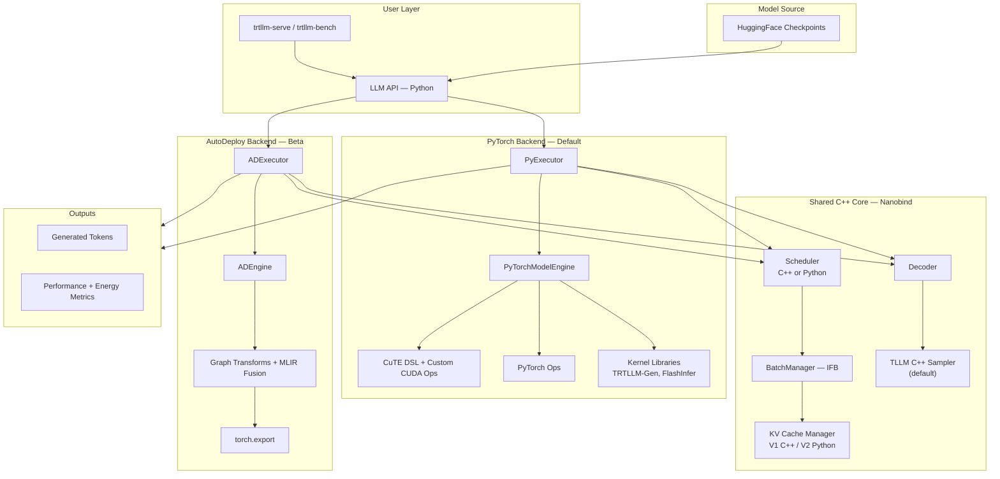
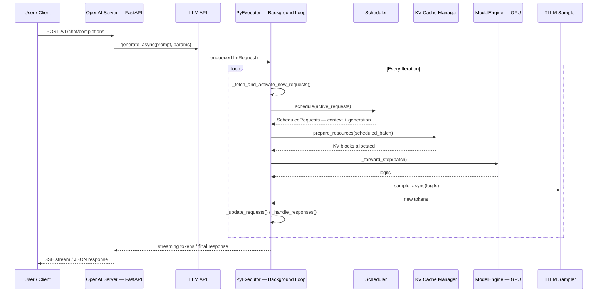

# 1. High-Level Architecture

[< Back to Overview](README.md)

TensorRT-LLM is NVIDIA's open-source library for optimized LLM inference on NVIDIA GPUs. It provides a Python + C++ stack bridging user-facing APIs with high-performance GPU execution, supporting three backends that share a common C++ core.

## 1.1 Backend Overview

| Backend | Status | Entry Point | Description |
|:--------|:-------|:------------|:------------|
| **PyTorch** | Default & active development | `TorchLlmArgs` -> `PyExecutor` | Native PyTorch with custom CUDA kernels via CuTE DSL |
| **AutoDeploy** | Beta (maturing rapidly) | `_torch/auto_deploy/` shim | `torch.export` + graph transforms + MLIR elementwise fusion |
| **TensorRT** | Legacy (maintenance mode) | `TrtLlmArgs` -> `trtllm.Executor` | TensorRT engine compilation |

**What's changed (v1.2-v1.3):**
- PyTorch backend is now stable and default since v1.0; actively developed with CuTE DSL-based custom kernels.
- AutoDeploy is maturing rapidly — now supports DeepSeek-R1 and Qwen3.5, with MLIR-based auto-generated elementwise fusion (e.g., `SiLU+Mul` transform) and custom attention mask support.
- C++ sampler (`TLLM Sampler`) is now default (breaking change in v1.1), replacing TorchSampler for most paths. TorchSampler still required for beam search.

## 1.2 Architecture Diagram

## 1.3 Request Flow

## 1.4 Key Files Reference

| File | Role |
|:-----|:-----|
| `tensorrt_llm/llmapi/llm.py` | Main API entry point (`LLM` class) |
| `tensorrt_llm/llmapi/llm_args.py` | Configuration schema (Pydantic): `BaseLlmArgs`, `TorchLlmArgs` |
| `tensorrt_llm/_torch/pyexecutor/py_executor.py` | Core execution loop (~3750 lines, the heart of the system) |
| `tensorrt_llm/_torch/pyexecutor/model_engine.py` | Model loading and forward pass |
| `tensorrt_llm/_torch/pyexecutor/resource_manager.py` | KV cache and resource management |
| `tensorrt_llm/_torch/pyexecutor/scheduler/` | Scheduler implementations (V1 bound C++, unified Python, V2) |
| `tensorrt_llm/executor/executor.py` | Execution abstraction (`GenerationExecutor`) |
| `tensorrt_llm/mapping.py` | Parallelism topology (`Mapping`, process groups) |
| `tensorrt_llm/serve/openai_server.py` | OpenAI-compatible HTTP server |
| `tensorrt_llm/_torch/speculative/` | All speculative decoding algorithms |
| `tensorrt_llm/_torch/auto_deploy/` | AutoDeploy backend with MLIR fusion |
| `docs/source/features/feature-combination-matrix.md` | Feature compatibility matrix |
