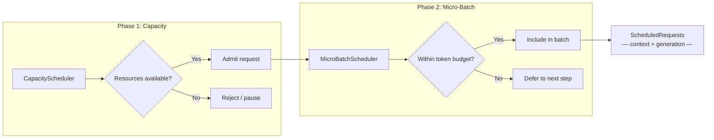

# 2.1 In-Flight Batching (IFB)

[< Back to Overview](README.md)

## What It Is

In-flight batching (also called *continuous batching* or *iteration-level batching*) allows the scheduler to insert new prefill requests into an already-running decode batch **on every iteration**, rather than waiting for the entire batch to complete.

## Why It Exists

Static batching forces all requests to finish before new work is admitted. Since sequences complete at different times, GPUs sit idle waiting for the longest sequence. IFB fills these gaps continuously, improving GPU utilization by 2-10x.

## Design

TRT-LLM's scheduler operates in **two phases** each iteration:

This two-phase design cleanly separates *resource availability* from *batch construction*. The C++ implementations (`BindCapacityScheduler`, `BindMicroBatchScheduler` in `scheduler/scheduler.py`) keep scheduling overhead minimal, while Python interfaces (`PyCapacityScheduler`, `PyMicroBatchScheduler`) allow custom policies.

**What's new (v1.2-v1.3):**
- The micro-batch scheduler now accounts for **reusable KV cache blocks** in capacity scheduling, improving admission decisions when prefix caching is active.
- A **Python scheduler** is now exposed via `use_python_scheduler` in `SchedulerConfig`, enabling custom scheduling policies without C++ changes.
- Request priority support in LLM API enables priority-based scheduling.

**Code path:** Every iteration, `_fetch_and_activate_new_requests()` polls the request queue, `_schedule()` calls `scheduler.schedule_request(active_requests, inflight_req_ids)`, and the result mixes continuing generation with new context work under `max_batch_size` and `max_num_tokens` constraints.

## Alternatives Considered

| Approach | Pros | Cons |
|:---------|:-----|:-----|
| **Static batching** | Simple implementation | Severe GPU underutilization |
| **Continuous batching (IFB)** | High GPU utilization | More complex scheduler; preemption logic needed |
| **Selective batching** | Priority-based scheduling | Higher scheduling overhead |

## Framework Comparison

| Framework | Approach | Differentiation |
|:----------|:---------|:----------------|
| **TensorRT-LLM** | Two-phase scheduler (capacity + micro-batch) | Configurable C++ or Python schedulers; chunked prefill; cache-aware capacity |
| **vLLM** | Continuous batching in V1 with unified scheduler | Token-uniform scheduling via `{request_id: num_tokens}` dict; zero-bubble async scheduling |
| **SGLang** | Continuous batching + cache-aware scheduling | Considers prefix cache hit rates for routing decisions |
