# 2.2 Overlap Scheduler

[< Back to Overview](README.md)

## What It Is

The overlap scheduler is a pipeline optimization that **hides CPU latency behind GPU computation**. Instead of serializing GPU forward passes and CPU bookkeeping, it launches the GPU forward for step N+1 while processing CPU-side results from step N in parallel.

## Why It Exists

Without overlap, the CPU must finish all result processing (stop-criteria checks, token appending, response updates, KV cache bookkeeping) before launching the next GPU forward. This creates GPU idle bubbles, especially at large batch sizes.

```mermaid
gantt
    title Non-Overlap — Sequential Execution
    dateFormat X
    axisFormat %s

    section GPU
    Forward N    :a1, 0, 3
    Idle         :crit, a2, 3, 5
    Forward N+1  :a3, 5, 8

    section CPU
    Idle         :crit, b1, 0, 3
    Process N    :b2, 3, 5
    Idle         :crit, b3, 5, 8
```

```mermaid
gantt
    title Overlap — Pipelined Execution
    dateFormat X
    axisFormat %s

    section GPU
    Forward N    :a1, 0, 3
    Forward N+1  :a3, 3, 6
    Forward N+2  :a4, 6, 9

    section CPU
    Idle         :crit, b1, 0, 3
    Process N    :b2, 3, 5
    Process N+1  :b3, 6, 8
```

## Design

The implementation uses a `previous_batch` staging pattern in `py_executor.py` (`_executor_loop_overlap`):

1. **Schedule batch N** (`_prepare_and_schedule_batch`)
2. **Launch GPU forward for batch N** (`_forward_step`)
3. **While GPU works on N**, process CPU results from batch N-1 (`_update_requests` on `previous_batch.sample_state`, then `_process_previous_batch`)
4. **Sample batch N async** (`_sample_async`)
5. **Store batch N as `previous_batch`** for next iteration

**What's new (v1.2-v1.3):**
- Overlap scheduler now supports **early exit** — removing redundant D2H synchronization for improved latency.
- Now compatible with **guided decoding** and **speculative decoding** combinations.
- PDL (Programmatic Dependent Launch) enabled by default for further kernel launch overhead reduction.

**Trade-off:** One extra decoding step is introduced (the last batch's results are processed one iteration late). This is a minor cost for the 10-22% measured throughput improvement.

**Inspiration:** Referenced from SGLang's "zero-overhead batch scheduler" and the [NanoFlow paper](https://arxiv.org/abs/2408.12757).

## Framework Comparison

| Framework | Overlap Strategy |
|:----------|:----------------|
| **TensorRT-LLM** | CPU/GPU overlap via `previous_batch` staging; default on; early-exit optimization |
| **SGLang** | Zero-overhead batch scheduler — similar overlap design (cited as inspiration) |
| **vLLM V1** | DBO (Dual-Batch Overlap) generalized for all models; `EngineCore` multiprocessing isolates API server from scheduler+executor |
