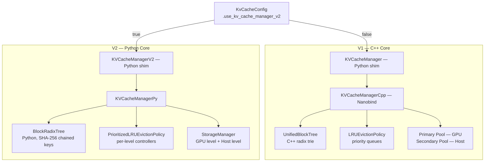
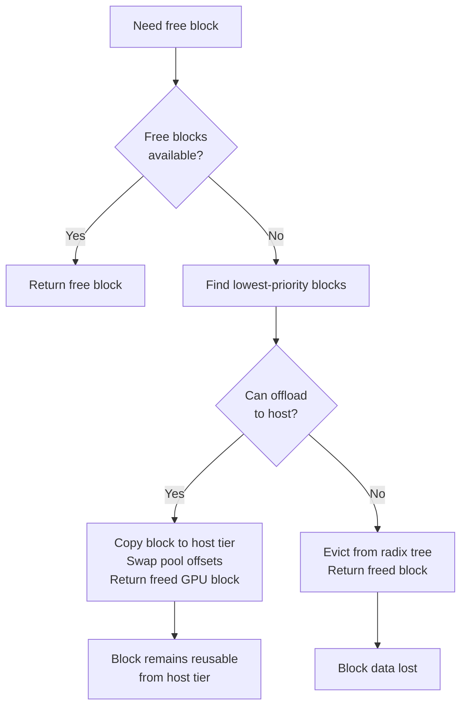

# 2.3 KV Cache Manager V1 & V2

[< Back to Overview](README.md)

## What It Is

The KV cache stores previously computed key-value attention pairs to avoid redundant computation during autoregressive generation. The KV Cache Manager handles block allocation, eviction, cross-request reuse (prefix caching), and multi-tier storage (GPU to host offloading).

## Why Two Versions Exist

| Dimension | V1 (C++) | V2 (Python) |
|:----------|:---------|:------------|
| **Core language** | C++ with nanobind | Python |
| **Block lookup** | `UnifiedBlockTree` — radix trie keyed by block hashes | `BlockRadixTree` — radix tree with SHA-256 chained block keys |
| **Memory tiers** | Primary (GPU) + Secondary (host) as a pool-pair | Explicit multi-tier with constraint-based memory partitioning |
| **Eviction** | Priority-tiered LRU free-lists per retention priority | `PrioritizedLRUEvictionPolicy` with per-level eviction controllers |
| **Unique features (V1)** | Beam search, KV events, KV connector, star attention | — |
| **Unique features (V2)** | — | Scheduler-driven suspend/resume, SSM cache reuse, batched migration, heterogeneous `tokens_per_block` |
| **Selection** | Default | `kv_cache_config.use_kv_cache_manager_v2 = True` |

**What's new in V2 (v1.2-v1.3):**
- **Constraint-based memory partitioning** — smarter allocation policies.
- **SSM (State Space Model) cache support** — prefix caching for Mamba hybrid models (Qwen3.5, Nemotron Super V3).
- **`max_gpu_total_bytes` control** — explicit memory budget capping.
- **Heterogeneous `tokens_per_block`** — different block sizes for different use cases.
- **KV cache statistics monitoring** for observability.

**Design rationale for V2:** The C++ V1 is performant but difficult to prototype on. V2's Python-first approach enables:

- **Scheduler-driven suspend/resume**: The scheduler can offload GPU KV pages while preserving the radix tree, so prefix matches survive GPU memory pressure
- **Clean multi-tier storage**: Host memory is a first-class cache level with batched migration, not bolted onto a primary/secondary pool
- **Rapid experimentation**: New eviction policies, block structures, and caching strategies can be prototyped without C++ recompilation

## How Eviction Works

Both V1 and V2 use **prioritized LRU** eviction:

- Blocks have priorities 0-100 (higher = more important)
- Lowest-priority blocks are evicted first; within the same priority, LRU ordering applies
- Users control priorities via `KvCacheRetentionConfig` with optional time-based expiration

**Key files:** `resource_manager.py` (V1 shim + V2 shim), `cpp/tensorrt_llm/batch_manager/kvCacheManager.cpp`, `tensorrt_llm/runtime/kv_cache_manager_v2/`.

## Framework Comparison

| Framework | KV Cache Design | Distinctive Capability |
|:----------|:---------------|:-----------------------|
| **TensorRT-LLM** | Block-based, radix tree, prioritized LRU, GPU-to-host offloading | Priority-based retention with time expiry; V2 suspend/resume; SSM cache reuse |
| **vLLM** | PagedAttention — virtual memory metaphor with fixed-size pages | General CPU KV cache offloading with pluggable CachePolicy; zero-overhead prefix caching |
| **SGLang** | RadixAttention — radix tree for automatic prefix discovery | Cache-aware scheduling; hierarchical caching (GPU L1 + host L2) |
| **LMCache** | External KV cache layer with multi-tier storage (GPU/CPU/disk/S3/Redis/NIXL) | Cross-engine, cross-instance KV cache sharing; GDS integration; k8s operator |
