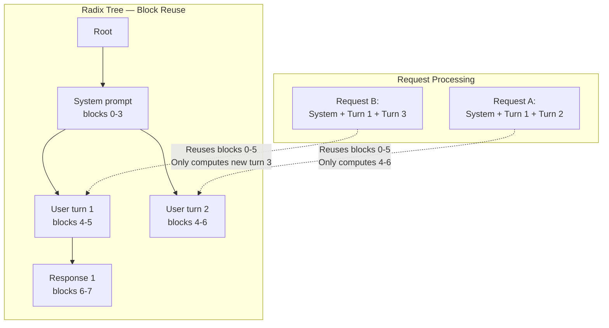

# 2.4 Block Reuse (Prefix Caching)

[< Back to Overview](README.md)

## What It Is

Block reuse enables multiple requests sharing the same prompt prefix to **reuse pre-computed KV cache blocks** instead of recomputing them. This saves both GPU compute and memory.

## Why It Exists

Many production workloads share common prefixes: system prompts, few-shot examples, multi-turn conversation history, RAG retrieved contexts. Without prefix caching, identical attention computation is repeated for every request.

## How It Works

**V1 (C++):** Blocks are stored in `UnifiedBlockTree` as they are filled. When a new request arrives, the tree is searched for matching block keys. Matched blocks are shared via reference counting. Partial reuse is supported: if some but not all tokens in a block match, the matched portion can be copied to a new block (`copy_on_partial_reuse`).

**V2 (Python):** The `BlockRadixTree` uses chained SHA-256 hashing: `SHA256(previous_block_key || token_ids)`. The `match()` method walks the tree for exact prefix matches. `find_best_partial_match_in_next_nodes` handles partial matches among sibling branches.

**What's new (v1.2-v1.3):**
- **Prefix caching for hybrid models** — Mamba + attention hybrids (Qwen3.5, Nemotron Super V3) can now reuse SSM state cache.
- **KV cache-aware ADP router** with prefix-affinity request routing — routes requests to the GPU that already has their prefix cached.
- **Multimodal KV cache block reuse** improvements (bugfix in #12472).
- **Reusable KV cache blocks** now accounted in micro-batch scheduler capacity decisions.

**Security — cache salting:** `cache_salt` ensures only requests with matching salt values share cached blocks, preventing prompt theft in multi-tenant deployments.

## Framework Comparison

| Framework | Prefix Caching | Key Differentiator |
|:----------|:--------------|:-------------------|
| **TensorRT-LLM** | Radix tree with prioritized eviction, partial reuse, salting, host offloading | Priority-based retention; cache-aware ADP routing; SSM cache reuse |
| **vLLM V1** | Hash-based prefix caching; zero-overhead (enabled by default) | Simple, automatic, minimal overhead |
| **SGLang** | RadixAttention — automatic prefix discovery via radix tree with cache-aware scheduling | Scheduling considers cache hits; most seamless UX |
| **LMCache** | External KV cache layer with cross-instance sharing | Shared cache across multiple serving instances via NIXL/Redis/S3 |
