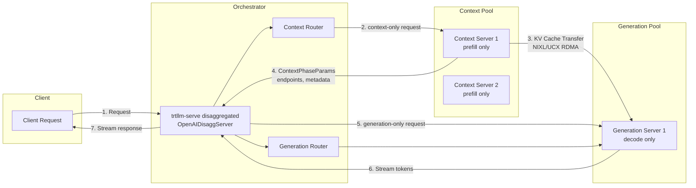
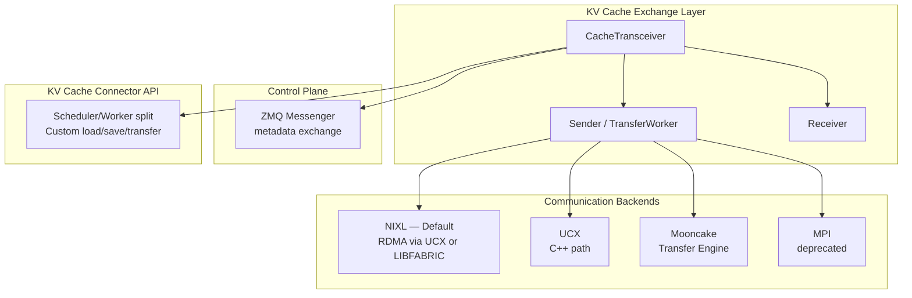

# 2.5 Disaggregated Serving

[< Back to Overview](README.md)

## What It Is

Disaggregated serving separates the **prefill (context)** and **decode (generation)** phases of LLM inference onto **different GPU pools**, with KV cache transferred between them via high-speed interconnects.

## Why It Exists

The two LLM inference phases have fundamentally different compute profiles — a consequence of the **Roofline Model** and the **Von Neumann Bottleneck**:

| Dimension | Prefill (Context) | Decode (Generation) |
|:----------|:------------------|:--------------------|
| **Bound by** | Compute (large GEMM over many tokens) | Memory bandwidth (weight loads per token) |
| **Key metric** | TTFT (time-to-first-token) | TPOT (time-per-output-token) |
| **Optimal batch** | Fewer, larger batches | Many concurrent sequences |
| **GPU preference** | High FLOPS | High memory bandwidth |

In aggregated serving, both phases share the same GPU, causing **interference**: a long prefill delays token generation for other requests, increasing TPOT and reducing interactivity. No single GPU configuration can simultaneously optimize for both compute-bound prefill and bandwidth-bound decode.

## Architecture

## KV Cache Transfer

**What's new (v1.2-v1.3):**
- **KV Cache Connector API** (`docs/source/features/kv-cache-connector.md`): Plugin architecture for custom KV cache load/save/transfer logic with Scheduler/Worker split. Enables custom disaggregation implementations.
- **Mooncake transfer engine** as a cache transceiver backend.
- **NIXL-LibFabric support** — broader RDMA fabric compatibility.
- **Service discovery** for dynamic scaling (nodes joining/leaving).
- **Request cancellation** in disaggregated mode.
- **Python cache transceiver** for gen-first workflow, extended to Nemotron models.
- **Default KV cache transfer timeout** set to 60 seconds (breaking change in v1.3rc9).
- **Dynamo integration** for orchestration.
- **Unique global request ID** for end-to-end tracking.
- Fix for disagg gen-only hang where 10s sleep blocked KV transfers and overflowed CTX memory.

**Overlap optimization:** While one request's KV cache is being transferred, other requests continue forward passes. This is default (`TRTLLM_DISABLE_KV_CACHE_TRANSFER_OVERLAP=0`).

**Heterogeneous parallelism:** Context and generation instances can use different TP/PP configurations (e.g., context with TP2, generation with PP2). TRT-LLM handles KV cache layout transformation between configurations automatically.

**Key files:** `serve/openai_disagg_server.py`, `serve/openai_disagg_service.py`, `_torch/pyexecutor/kv_cache_transceiver.py`, `_torch/disaggregation/native/transfer.py`, `docs/source/features/kv-cache-connector.md`.

## Design Rationale and Alternatives

| Approach | Pros | Cons |
|:---------|:-----|:-----|
| **Aggregated (IFB only)** | Simpler deployment; no KV transfer overhead | Phase interference; single GPU type constraint |
| **Disaggregated (P/D split)** | Independent optimization; no interference; heterogeneous HW | KV transfer latency; more deployment complexity |
| **Cache-aware disaggregated (CPD)** | Cold/warm request separation; up to 40% faster for long context | Even more routing complexity |

## Framework Comparison

| Framework | Disaggregated Serving | Distinctive Capability |
|:----------|:---------------------|:-----------------------|
| **TensorRT-LLM** | Full: NIXL/UCX/Mooncake backends, KV Connector API, heterogeneous parallelism, Dynamo integration | KV cache layout transformation for different TP/PP configs; plugin architecture |
| **vLLM** | Disaggregated P/D in V1; elastic EP with NIXL | Growing feature; elastic expert parallelism for dynamic scaling |
| **SGLang** | PD disaggregation with mooncake/NIXL/InfiniBand; EPD for VLMs | GPU staging buffer (1000x fewer RDMA requests, 5x TPS/GPU); EPD disagg for vision-language models |
| **LMCache** | External KV cache sharing across instances via NIXL/Redis/S3/GDS | Cross-engine P2P cache sharing; MP mode with auto-discovery |
