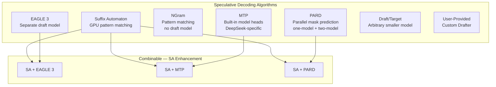
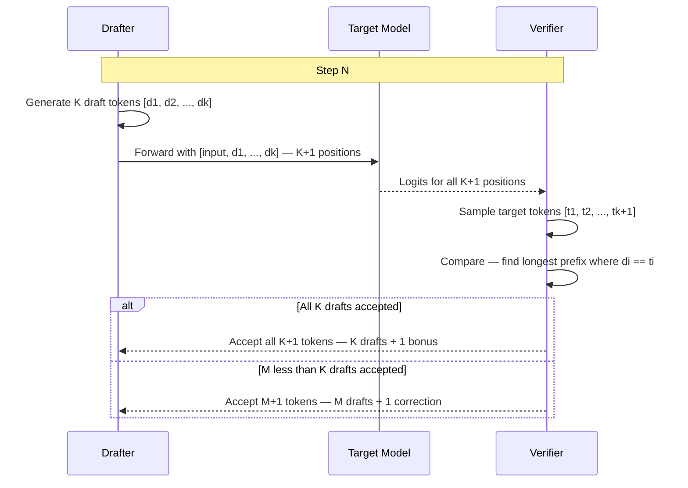

# 2.6 Speculative Decoding

[< Back to Overview](README.md)

## What It Is

Speculative decoding accelerates autoregressive generation by proposing multiple candidate tokens via a lightweight draft mechanism, then verifying them in parallel via a single target model forward pass. Matched tokens are accepted, reducing sequential forward passes.

## Why It Exists

Autoregressive decoding is inherently sequential — each token depends on the previous one. At low batch sizes, GPU utilization is poor because each forward pass processes only one token per sequence. Speculative decoding proposes K draft tokens and verifies them in one forward of K+1 positions, potentially generating K+1 tokens in ~2 forward passes.

## Supported Algorithms

| Algorithm | Draft Source | Draft Model Required? | Key Characteristics |
|:----------|:-----------|:---------------------|:--------------------|
| **EAGLE 3** | Lightweight trained model | Yes | Two-model or one-model; best with SA combination; MLA target + GQA draft support |
| **MTP** | Built-in prediction heads | No (embedded) | DeepSeek-specific; relaxed acceptance for reasoning; MTP>1 for DeepSeek v3.2 |
| **NGram** | Prompt/generation history | No | Prompt lookup decoding; zero extra model overhead |
| **PARD** | Parallel mask-token prediction | Yes | All K drafts in one forward; one-model + two-model paths; target-independent |
| **SA** | GPU suffix automaton | No | Model-free; very accurate on repetitive content; on-device processing |
| **Draft/Target** | Arbitrary smaller model | Yes | Simplest form; requires same tokenizer |

## Draft-Verify Loop

**What's new (v1.2-v1.3):**
- **PARD one-model path** — single-model speculative decoding without a separate draft model.
- **Dynamic draft length** across all spec decode algorithms (expanding from one-model path).
- **MTP>1** for DeepSeek v3.2 — multiple prediction heads for higher acceptance.
- **Guided decoding + speculative decoding** combination now works.
- **Suffix automaton on device** — GPU-side SA processing for lower latency.
- **Eagle MLA target with GQA draft** support for mixed-architecture speculation.

**GPU-side acceptance** (`py_executor.py`): Uses `torch.cumprod` of equality comparisons to find the longest matching prefix, then gathers the final accepted next token.

**Speculation gate** (`speculation_gate.py`): Dynamically disables speculation when acceptance rates drop below threshold, preventing throughput regression at high batch sizes.

**Key files:** `_torch/speculative/` directory — `model_drafter.py` (two-model loop), `eagle3.py`, `mtp.py`, `ngram.py`, `pard.py`, `suffix_automaton.py`, `speculation_gate.py`.

## Framework Comparison

| Framework | Support | Distinctive Feature |
|:----------|:--------|:-------------------|
| **TensorRT-LLM** | EAGLE3, MTP, NGram, PARD, SA, Draft/Target, user-provided; SA+neural combos | Richest algorithm set; dynamic draft length; SA hybrid approach; guided decoding combo |
| **vLLM** | EAGLE, draft models, NGram (GPU), rejection sampler with greedy/logprobs | Zero-bubble async scheduling + spec decode; multimodal embeddings for spec decode |
| **SGLang** | EAGLE, spec-dec with FlashAttention 4 | FA4 integration for spec decode verification |
