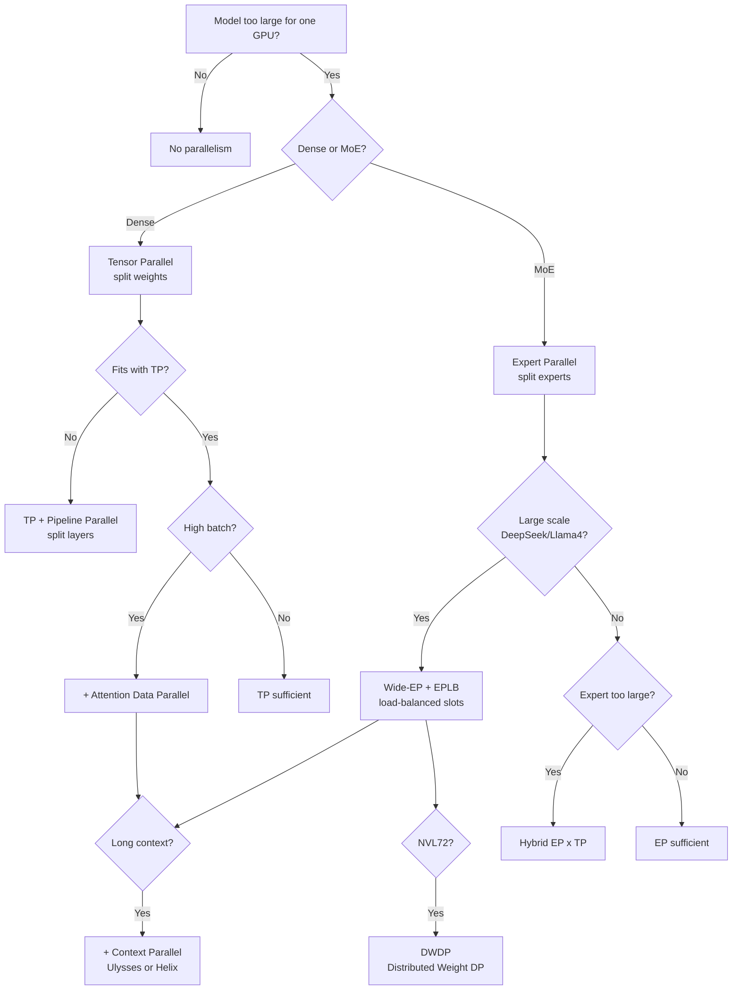
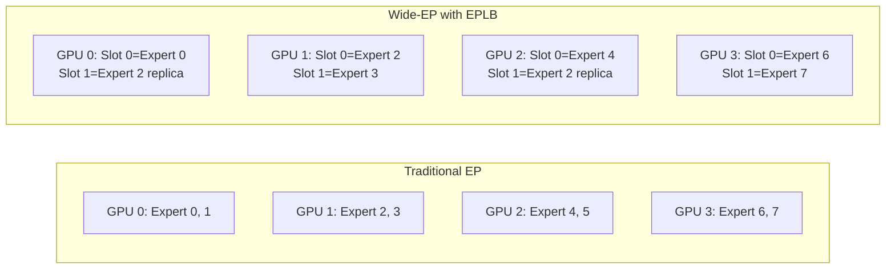

# 2.7 Parallelism Strategies

[< Back to Overview](README.md)

## Overview and Decision Tree

## Strategy Details

| Strategy | Abbrev | What It Splits | Communication | Best For |
|:---------|:-------|:--------------|:--------------|:---------|
| **Tensor Parallel** | TP | Weight matrices across GPUs | AllReduce / AllGather | Small batch; memory-constrained |
| **Pipeline Parallel** | PP | Layers across GPUs | P2P send/recv of activations | Very large models; limited bandwidth |
| **Data Parallel** | DP / ADP | Requests across replicas | None (independent); KV cache partitioned | Large batch; high throughput |
| **Expert Parallel** | EP | MoE experts across GPUs | All-to-all token dispatch/combine | MoE with many experts |
| **Context Parallel** | CP | Long sequences across GPUs | All-to-all (Ulysses) or AllGather/ReduceScatter (Helix) | 100K+ token contexts |
| **Wide-EP** | Wide-EP | Experts with load-balanced replication | Custom NVLink all-to-all; one-sided AlltoAll | Large MoE (DeepSeek-V3/R1, Llama4) |
| **Distributed Weight DP** | DWDP | Weights + data across NVL72 | NVLink all-reduce + custom scheduling | NVL72 rack-scale deployments |

## Tensor Parallelism (TP)

Splits weight matrices across GPUs within the same layer. Implemented in `_torch/modules/linear.py`:

- **Column-parallel:** Output features split; optional AllGather when `gather_output=True`
- **Row-parallel:** Input features split; AllReduce to combine partial GEMMs

For attention, `num_heads` is divided across TP ranks. Communication uses `torch.ops.trtllm.allreduce*` with automatic strategy selection (NCCL, Unified Buffer, MNNVL).

## Pipeline Parallelism (PP)

Distributes consecutive layers across GPUs. Implemented in `_torch/models/modeling_utils.py`:

- `DecoderModel.__pp_init__` assigns layer ranges via `mapping.pp_layers(num_layers)`
- First local layer wrapped with `forward_after_recv` (P2P receive)
- Last local layer wrapped with `forward_before_send` (P2P send)

The executor uses `_executor_loop_pp` with micro-batching and async P2P via `PPCommTorch`/`PPCommNCCL`.

## Wide Expert Parallelism (Wide-EP)

Decouples **logical experts** from **physical slots**, enabling:

- Multiple replicas of "hot" experts across GPUs
- **Offline EPLB**: Pre-computed placement from historical workload statistics
- **Online EPLB**: Dynamic placement adapting to real-time traffic
- Custom all-to-all kernels optimized for NVLink/MNNVL

**Key file:** `_torch/modules/fused_moe/fused_moe_wide_ep.py` (`WideEPMoE`)

## Distributed Weight Data Parallelism (DWDP)

**New in v1.3.** Designed for NVL72 rack-scale deployments. Distributes both model weights and data across all 72 GPUs for maximum throughput. Documented in blog19 (April 2026).

## What's New (v1.2-v1.3)

- **DWDP** for NVL72 rack-scale deployments.
- **One-sided AlltoAll over NVLink** for MoE expert dispatch — eliminates synchronization overhead in EP communication (blog18).
- **KV cache-aware ADP router** with prefix-affinity request routing.
- **Helix CP for DeepSeek v3.2 with GQA**.
- **EPLB for TRTLLM-Gen** — expert load balancing integrated with the TRTLLM-Gen attention backend.
- **CUDA graph support for DeepEP**.
- **Dynamic SMEM block routing in MoE**.
- **LM Head Sharding** — distributes the language model head across GPUs.

## Framework Comparison

| Framework | Parallelism Support |
|:----------|:-------------------|
| **TensorRT-LLM** | TP, PP, EP, ADP, CP (Ulysses/Helix), Wide-EP + EPLB, DWDP — most comprehensive |
| **vLLM** | TP, PP, EP; elastic EP with NIXL for dynamic scaling |
| **SGLang** | TP, PP, EP, DP; elastic EP for partial failure tolerance |

TRT-LLM's **DWDP**, **Wide-EP with EPLB**, **Helix CP**, and **one-sided AlltoAll** are distinctive capabilities not matched by other frameworks.
