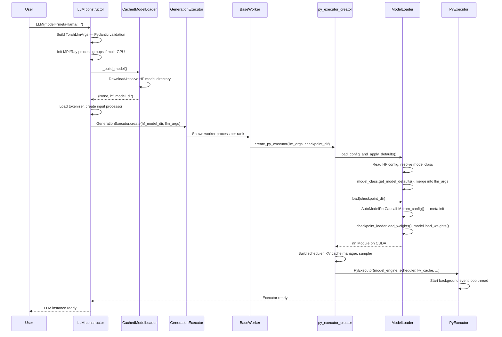
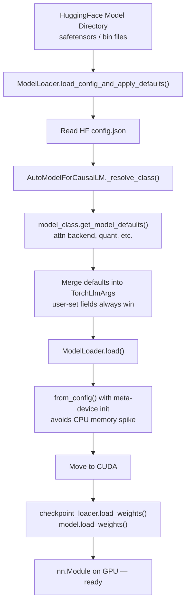
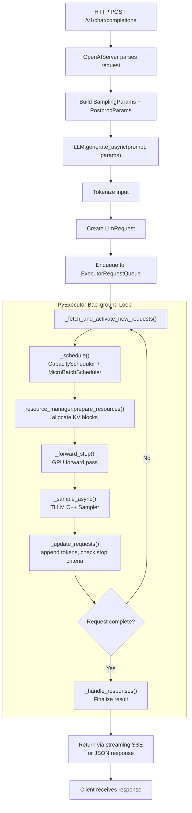

# 3. End-to-End User Journey (PyTorch Backend)

[< Back to Overview](README.md)

## 3.1 Launch & Initialization

**Key files:**

- `llm.py`: `_TorchLLM.__init__`, `_build_model`
- `llm_utils.py`: `CachedModelLoader.__call__`
- `executor.py`: `GenerationExecutor.create`
- `py_executor_creator.py`: `create_py_executor`
- `model_loader.py`: `ModelLoader.load`

For **`trtllm-serve`**, the CLI (`tensorrt_llm/commands/serve.py`) builds `llm_args` from CLI + YAML, constructs the same `LLM` instance, then wraps it in `OpenAIServer` (FastAPI).

## 3.2 Model Loading & Weight Loading

The PyTorch backend has a **distinct** weight loading path from the TRT engine build pipeline:

The `get_model_defaults()` pattern is important: each model class (e.g., `modeling_llama.py`, `modeling_qwen3_next.py`) defines its own preferred defaults for attention kernel, quantization, speculative decoding, etc. These are merged into `TorchLlmArgs` but **never override user-explicit settings**.

## 3.3 Request Handling & Response

## 3.4 Failover & Fault Tolerance

**Current state: Limited.** The system relies on external orchestration for production resilience.

| Mechanism | What It Does | Limitation |
|:----------|:------------|:-----------|
| `LLM._check_health()` | Verifies executor not shutdown | No automatic recovery |
| Disagg router health check | Pings `/health`, prunes dead backends | Reactive, not preventive |
| `DisaggClusterWorker` heartbeat | Registration + heartbeat for membership | Re-registration only, no request retry |
| `CppExecutorError` handler | Logs error, raises `SIGINT` | Clean shutdown, not failover |
| Service discovery (new) | Dynamic node join/leave for disagg | Membership only, no fault recovery |

**What's missing:** Automatic request retry, hot-standby replicas, checkpoint/restore for in-flight requests, graceful degradation under partial failures, circuit breakers, elastic expert redistribution on GPU failure.

**Contrast:** SGLang now has **elastic EP for partial failure tolerance** — when a GPU fails, experts are redistributed to surviving GPUs without restart. TRT-LLM has no equivalent.

## 3.5 Auto-Scaling

**Current state: Elastic membership + Dynamo integration.**

The `DisaggClusterManager` (`serve/disagg_auto_scaling.py`) supports:

- **Dynamic worker join/leave**: Workers can register and deregister
- **Role switching**: Workers can transition between context and generation roles
- **Readiness tracking**: Manager exposes `is_ready` based on minimum instance counts
- **Dynamo integration**: External orchestration for production scaling

**What's missing:** HPA-style automatic replica scaling based on QPS/latency/GPU metrics, automatic GPU provisioning, queue-depth-based scaling policies. Production scaling is delegated to **Dynamo** or **Kubernetes operators**.
