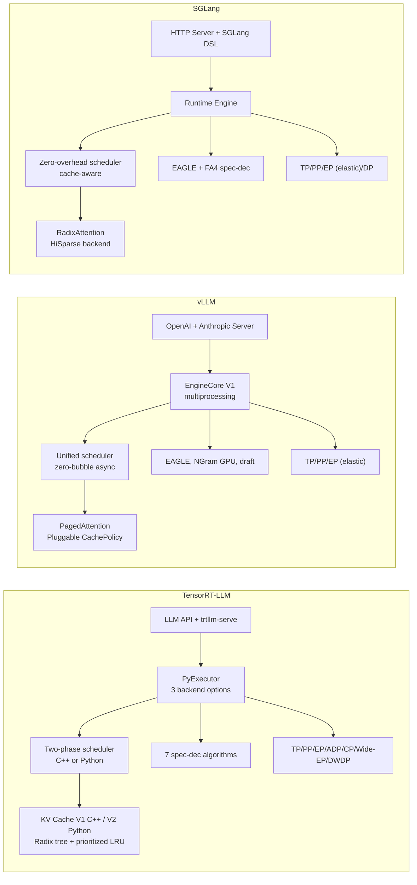

# 4. Framework Comparison

[< Back to Overview](README.md)

## 4.1 Architecture Comparison

## 4.2 Feature Matrix

| Feature | TensorRT-LLM | vLLM | SGLang | LMCache |
|:--------|:------------:|:----:|:------:|:-------:|
| **Continuous batching** | Yes | Yes | Yes | N/A |
| **Prefix caching** | Yes (prioritized) | Yes (zero-overhead) | Yes (RadixAttention) | Yes (cross-instance) |
| **Disaggregated P/D** | Full (NIXL/UCX/Mooncake) | V1 feature | Yes (GPU staging buffer) | P2P via NIXL |
| **Speculative decoding** | 7 algorithms + SA hybrid | EAGLE, NGram GPU, draft | EAGLE + FA4 | N/A |
| **TP / PP** | Yes / Yes | Yes / Yes | Yes / Yes | N/A |
| **EP / Wide-EP** | Yes / Yes | Yes (elastic) / No | Yes (elastic) / No | N/A |
| **Context Parallel** | Ulysses + Helix | No | Prefill CP (MHA) | N/A |
| **Attention DP** | Yes (cache-aware) | No | No | N/A |
| **DWDP (NVL72)** | Yes | No | No | N/A |
| **CUDA Graphs** | Yes (PDL) | Yes (piecewise, torch.compile) | Yes (piecewise, default) | N/A |
| **CPU/GPU overlap** | Yes (default, early exit) | DBO (generalized) | Yes (zero-overhead) | N/A |
| **LoRA** | Yes | Yes (quantized LoRA) | Yes (MoE layers) | N/A |
| **Guided decoding** | Yes (+spec-dec combo) | Yes | Yes (optimized) | N/A |
| **Multi-vendor GPU** | NVIDIA only | CUDA, ROCm, TPU | CUDA, ROCm, TPU, MLX | Vendor-neutral |
| **Multi-model serving** | Limited | Native V1 | Limited | N/A |
| **Visual generation** | LTX-2, WAN, FLUX | No | LTX-2, Hunyuan3D-2, Helios+ | N/A |
| **Agentic / Tool Use** | GLM-4 parser, thinking | Responses API, tool calls | DSL-based | N/A |
| **Elastic fault tolerance** | No | No | Elastic EP (GPU fail-over) | N/A |
| **External KV cache** | KV Connector API | LMCache integration | LMCache integration | Core product |
| **Model catalog** | ~50+ | ~100+ | Growing | N/A |

## 4.3 Performance Positioning

| Metric | TensorRT-LLM | vLLM | SGLang |
|:-------|:------------:|:----:|:------:|
| **Peak throughput (NVIDIA H100)** | Highest | ~70% of TRT-LLM | ~85% of TRT-LLM |
| **TTFT (single GPU)** | ~194ms | ~123ms (best) | ~340ms |
| **TPOT** | Best at high batch | Good | Good |
| **MoE throughput (Wide-EP)** | Highest | Good | Good |
| **NVL72 scaling** | DWDP optimized | Not specialized | Not specialized |

*Performance gaps have narrowed significantly since 2024. The advantage is workload-dependent and diminishes as frameworks adopt similar optimizations.*

## 4.4 Competitive Gap Analysis

| Gap Area | vs. vLLM | vs. SGLang | Severity |
|:---------|:---------|:-----------|:---------|
| **Hardware portability** | vLLM: CUDA, ROCm, TPU | SGLang: CUDA, ROCm, TPU, MLX | High |
| **Model catalog** | vLLM: 2x more architectures | SGLang: faster community adoption | High |
| **Ease of onboarding** | vLLM: `pip install vllm && vllm serve` | SGLang: equally simple | Medium |
| **Multi-model serving** | vLLM V1: native | SGLang: limited | Medium |
| **TTFT (single GPU)** | vLLM: ~35% lower | — | High |
| **Community ecosystem** | vLLM: larger contributor base | SGLang: active research community | Medium-High |
| **Structured generation** | vLLM: supported | SGLang: 5x faster via DSL | Medium |
| **Elastic fault tolerance** | — | SGLang: elastic EP | High |
| **API compatibility** | vLLM: OpenAI + Anthropic | SGLang: Anthropic compat | Medium |

## 4.5 Areas Where TRT-LLM Leads

| Advantage | vs. vLLM | vs. SGLang |
|:----------|:---------|:-----------|
| **Peak throughput (NVIDIA HW)** | ~40% higher on H100 | ~15% higher |
| **Parallelism breadth** | Wide-EP, ADP, Helix CP, DWDP not available | CP, ADP, DWDP not available |
| **Speculative decoding** | 7 algorithms vs. ~3 | 7 algorithms vs. ~2 |
| **Disaggregated maturity** | Heterogeneous parallelism, layout transform, KV Connector API | Less advanced |
| **MoE optimization** | Wide-EP + EPLB + MNNVL + one-sided AlltoAll | Less optimized |
| **Enterprise features** | KV cache salting, priority retention | Not available |
| **Visual generation** | LTX-2, WAN, FLUX with fused kernels | Broader diffusion model set |
| **NVL72 optimization** | DWDP | Not available |
