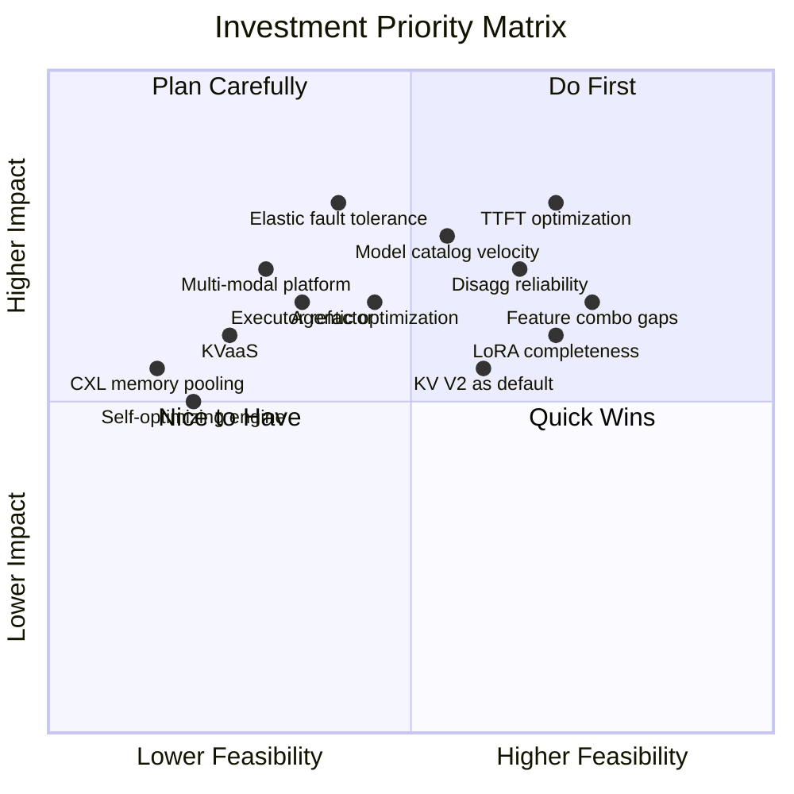

# 6. Strategic Prioritization

[< Back to Overview](README.md)

## 6.1 Investment Priority Matrix

## 6.2 Prioritized Roadmap

### Tier 1: Critical — Do Now (0-3 months)

| Priority | Item | Category | Rationale |
|:---------|:-----|:---------|:----------|
| P0 | TTFT optimization | Gap | 35% deficit on the most user-visible metric for the highest-value workload |
| P0 | Disaggregated serving reliability | Bug | Systemic timing/hang bugs in a critical differentiating feature |
| P1 | Model catalog velocity via AutoDeploy | Gap | Every unsupported model = lost users; 2x gap vs. vLLM |
| P1 | Feature combination testing campaign | Bug | Many "Untested" entries may work; low effort to validate |
| P1 | Wide-EP + EPLB hardening | Gap | MoE models are the defining workload; TRT-LLM's competitive moat |

### Tier 2: Strategic — Plan and Execute (3-9 months)

| Priority | Item | Category | Rationale |
|:---------|:-----|:---------|:----------|
| P2 | Elastic fault tolerance | Gap | SGLang's elastic EP sets a new bar; critical for production at scale |
| P2 | LoRA + EP/disagg completeness | Gap | Blocks enterprise multi-tenant MoE deployments |
| P2 | KV Cache V2 as default | Bug/Gap | Eliminates dual-manager confusion; enables faster innovation |
| P2 | Executor refactor | Bug | Reduces complexity; accelerates all other development |
| P2 | Agentic workflow optimization | Innovation | Persistent sessions, spec tool calling, KV cache forking |

### Tier 3: Strategic Bets — Invest Steadily (6-18 months)

| Priority | Item | Category | Rationale |
|:---------|:-----|:---------|:----------|
| P3 | Multi-modal unified platform | Innovation | Unified executor for text+vision+audio+video generation |
| P3 | KVaaS (distributed KV fabric) | Innovation | Extends disagg to cluster-wide cache sharing |
| P3 | Cache-aware disagg scheduling | Gap | Together.ai CPD shows 40% improvement for long context |
| P3 | Structured generation performance | Gap | SGLang 5x lead; growing importance for agents |
| P3 | Inference-time compute scaling | Innovation | Tree-of-thought, adaptive compute, reward-guided generation |

### Tier 4: Long-Term Vision (12+ months)

| Priority | Item | Category | Rationale |
|:---------|:-----|:---------|:----------|
| P4 | CXL memory pooling | Innovation | Next-gen memory architecture; transforms KV cache economics |
| P4 | GPU + LPU hybrid inference | Innovation | Heterogeneous compute for optimal P/D resource allocation |
| P4 | Self-optimizing engine | Innovation | RL-learned scheduling, predictive allocation, dynamic quant |
| P4 | Federated/privacy-preserving inference | Innovation | Split inference, encrypted KV, GPU TEEs |
| P4 | Vera Rubin HW-SW co-design | Innovation | Hardware-native disaggregation; next-gen NVLink |

## 6.3 Where TRT-LLM Should Win

**Core identity:** Maximum inference performance on NVIDIA GPUs.

**Strengths to protect and extend:**
- Peak throughput leadership on NVIDIA hardware
- Wide-EP + EPLB + DWDP for MoE models at scale (strategic moat)
- Comprehensive parallelism strategies (TP/PP/EP/ADP/CP/Wide-EP/DWDP)
- Rich speculative decoding algorithm set (7 algorithms + SA hybrids)
- Disaggregated serving with heterogeneous parallelism and KV Connector API
- Visual generation support (unique among inference engines)

**Gaps to close urgently:**
- TTFT competitiveness (35% gap)
- Model catalog breadth (2x gap vs. vLLM)
- Elastic fault tolerance (SGLang leads)
- Developer experience (codebase complexity)

**Capabilities to build for differentiation:**
- Production resilience (fault tolerance, observability, auto-scaling)
- Agentic workflow optimization (persistent sessions, spec tool calling)
- Next-gen hardware co-design (CXL, Vera Rubin, NVL72+)
- Distributed KV cache fabric (cluster-wide cache sharing)

The frameworks are converging on core features (continuous batching, prefix caching, basic parallelism). **The next phase of differentiation will be won on three fronts: (1) production reliability at scale, (2) workload-specific optimization for agents and multi-modal, and (3) hardware co-design that exploits NVIDIA's roadmap advantages.**

---

*This document reflects the TensorRT-LLM codebase as of April 2026 (v1.3.0 main branch). The project is under active development; features and architecture evolve rapidly.*
