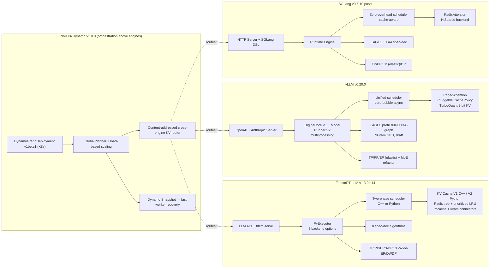

# 4. Framework Comparison

[< Back to Overview](README.md)

## 4.1 Architecture Comparison

*[Updated 2026-04-29: added Dynamo orchestration overlay; bumped versions; added vLLM Model Runner V2 + TurboQuant; updated TRT-LLM spec-dec count to 8.]*

## 4.2 Feature Matrix *[Updated 2026-04-29]*

| Feature | TensorRT-LLM v1.3.0rc14 | vLLM v0.20.0 | SGLang v0.5.10.post1 | LMCache v0.4.4 | NVIDIA Dynamo v1.0.0 |
|:--------|:-----------------------:|:------------:|:--------------------:|:--------------:|:--------------------:|
| **Continuous batching** | Yes (batched addSequence) | Yes | Yes | N/A | Engine-agnostic |
| **Prefix caching** | Yes (prioritized) + ADP hit-rate gate | Yes (zero-overhead) + TurboQuant 2-bit KV | Yes (RadixAttention) | Yes (cross-instance) | Content-addressed cross-engine reuse |
| **Disaggregated P/D** | Full (NIXL/UCX/Mooncake) + conversation affinity | V1 feature; bidirectional KV transfer in flight (RFC #32733) | Yes (GPU staging buffer) | P2P via NIXL | Encoder + P + D disagg across engines |
| **Speculative decoding** | **8 algorithms** + SA hybrid + LoRA combo | EAGLE prefill full-CUDA-graph, NGram GPU, draft | EAGLE + FA4 | N/A | Spec dec is engine-owned |
| **TP / PP** | Yes / Yes | Yes / Yes | Yes / Yes | N/A | N/A |
| **EP / Wide-EP** | Yes / Yes (+ EPLB, one-sided AlltoAll) | Yes (elastic) / No (consolidated MoE refactor in v0.20) | Yes (elastic) / No | N/A | N/A |
| **Context Parallel** | Ulysses + Helix | No | Prefill CP (MHA) | N/A | N/A |
| **Attention DP** | Yes (cache-aware, hit-rate-gated) | No | No | N/A | N/A |
| **DWDP (NVL72)** | Yes (DwdpConfig) | No | No | N/A | N/A |
| **CUDA Graphs** | Yes (PDL, +64 batch padding) | Yes (piecewise, torch.compile, Eagle prefill full-graph) | Yes (piecewise, default) | N/A | N/A |
| **CPU/GPU overlap** | Yes (default, early exit, **now with prefix reuse**) | DBO (generalized) | Yes (zero-overhead) | N/A | N/A |
| **LoRA** | Yes (+ EAGLE3 / spec-dec combo) | Yes (quantized LoRA) | Yes (MoE layers) | N/A | N/A |
| **Guided decoding** | Yes (+spec-dec combo) | Yes | Yes (optimized) | N/A | N/A |
| **Multi-vendor GPU** | NVIDIA only | CUDA, ROCm, TPU (incl. v6e/v7) | CUDA, ROCm, TPU, MLX | Vendor-neutral | NVIDIA-first; engine-dependent for AMD/TPU |
| **Multi-model serving** | Limited | Native V1 | Limited | N/A | Native (DynamoGraphDeployment) |
| **Visual generation** | LTX-2 (CUDA graph), WAN, FLUX, Cache-DiT | No | LTX-2, Hunyuan3D-2, Helios+ | N/A | Encoder disagg for multimodal |
| **Agentic / Tool Use** | qwen3, qwen3_coder, glm4, glm47, deepseekv31, deepseekv32, minimax_m2 parsers + Harmony + thinking | Responses API, tool calls | DSL-based | N/A | Agent hints + KV retention for long sessions |
| **Elastic fault tolerance** | No (Dynamo Snapshot is restart, not in-place) | No | Elastic EP (GPU fail-over) | N/A | Snapshot-based fast restart |
| **External KV cache** | KV Connector API + first-class `lmcache`/`kvbm` shorthand (#12626) | LMCache integration | LMCache integration | Core product | Pluggable across engines |
| **Production observability** | Prometheus iter stats + token counters + phase histograms (#12545); modular logger (#13202); NvTelemetry/GXT (#12384) | OpenTelemetry, Prometheus | Prometheus | Heartbeat + L0 Subscriber | DynamoGraph K8s metrics |
| **Model catalog** | ~50+ | ~100+ (incl. DeepSeek V4, Hunyuan v3, Granite 4.1 Vision in v0.20) | Growing | N/A | Inherited from underlying engine |
| **PyTorch / CUDA target** | PyTorch 2.x, CUDA 12.x | **PyTorch 2.11, CUDA 13.0.2** (default in v0.20) | PyTorch 2.x | N/A | N/A |

## 4.3 Performance Positioning

| Metric | TensorRT-LLM | vLLM | SGLang |
|:-------|:------------:|:----:|:------:|
| **Peak throughput (NVIDIA H100)** | Highest | ~70% of TRT-LLM | ~85% of TRT-LLM |
| **TTFT (single GPU)** | ~194ms | ~123ms (best) | ~340ms |
| **TPOT** | Best at high batch | Good | Good |
| **MoE throughput (Wide-EP)** | Highest | Good | Good |
| **NVL72 scaling** | DWDP optimized | Not specialized | Not specialized |

*Performance gaps have narrowed significantly since 2024. The advantage is workload-dependent and diminishes as frameworks adopt similar optimizations.*

## 4.4 Competitive Gap Analysis *[Updated 2026-04-29]*

| Gap Area | vs. vLLM v0.20 | vs. SGLang v0.5.10 | Severity | Direction since 2026-04-06 |
|:---------|:----------------|:--------------------|:---------|:----------------------------|
| **Hardware portability** | vLLM: CUDA, ROCm (MI355X production-grade), TPU v6e/v7 | SGLang: CUDA, ROCm, TPU, MLX | High | Widening — TPU v7 GA + MI355X MLPerf 6.0 results |
| **Model catalog** | vLLM: ~2× more architectures (DeepSeek V4, Hunyuan v3, Granite 4.1 Vision in v0.20) | SGLang: faster community adoption | High | Widening |
| **Ease of onboarding** | vLLM: `pip install vllm && vllm serve` | SGLang: equally simple | Medium | Stable |
| **Multi-model serving** | vLLM V1: native | SGLang: limited | Medium | Stable; Dynamo helps but introduces a new layer |
| **TTFT (single GPU)** | vLLM: ~35% lower (legacy gap) | — | High | Unverified for v0.20; needs re-benchmarking |
| **Community ecosystem** | vLLM v0.20: 752 commits / 320 contributors / 123 new in one release | SGLang: active research community | Medium-High | Widening on raw activity |
| **Structured generation** | vLLM: supported | SGLang: 5× faster via DSL | Medium | Stable |
| **Elastic fault tolerance** | — | SGLang: elastic EP | High | Partially offset by Dynamo Snapshot, but in-place failover gap remains |
| **API compatibility** | vLLM: OpenAI + Anthropic | SGLang: Anthropic compat | Medium | Stable |
| **Low-bit KV cache** *[New 2026-04]* | vLLM v0.20: TurboQuant 2-bit KV (4× capacity) | — | Medium-High | New gap — TRT-LLM has FP8/INT4 paths but no 2-bit KV-cache path |
| **End-to-end IR** *[New 2026-04]* | vLLM v0.20: vLLM IR foundation + Model Runner V2 | — | Medium | New direction worth tracking |
| **MLA prefill kernel** *[New 2026-04]* | vLLM v0.20: FA4 default for MLA prefill (head-dim 512, paged-KV, SM90+) | — | Medium | New |
| **Cross-datacenter KV** *[Academic]* | PrfaaS (arXiv 2604.15039) | — | Low (research) | Watch — could collapse a data-center boundary assumption |

## 4.5 Areas Where TRT-LLM Leads *[Updated 2026-04-29]*

| Advantage | vs. vLLM v0.20 | vs. SGLang v0.5.10 |
|:----------|:----------------|:--------------------|
| **Peak throughput (NVIDIA HW)** | ~40% higher on H100 (legacy benchmark; needs re-validation against v0.20) | ~15% higher |
| **Parallelism breadth** | Wide-EP, ADP, Helix CP, DWDP not available | CP, ADP, DWDP not available |
| **Speculative decoding** | **8 algorithms vs. ~3** (added DFlash, EAGLE3 dynamic tree, LoRA combo) | **8 algorithms vs. ~2** |
| **Disaggregated maturity** | Heterogeneous parallelism, layout transform, KV Connector API, lmcache/kvbm shorthand, conversation-affinity router, round-robin CP transfer | Less advanced |
| **MoE optimization** | Wide-EP + EPLB + MNNVL + one-sided AlltoAll | Less optimized |
| **Enterprise features** | KV cache salting (HMAC enforced), priority retention, GLM-4.7/5/Qwen3/DeepSeek v3.1/v3.2/MiniMax M2 tool parsers | Not available |
| **Visual generation** | LTX-2 (CUDA graph), WAN, FLUX with fused kernels + Cache-DiT + multi-node diffusion workers | Broader diffusion model set |
| **NVL72 optimization** | DWDP (DwdpConfig) | Not available |
| **Production observability** *[New row 2026-04]* | Prometheus iter stats + token counters + phase histograms; modular logger; NvTelemetry | OpenTelemetry coverage variable |

**Caveat (Updated 2026-04-29):** Several of the throughput/TTFT numbers in this section come from earlier benchmarks. They predate vLLM v0.20's Model Runner V2 and FA4 MLA prefill default, AMD's MLPerf Inference 6.0 1M tok/s on MI355X, and TPU v7 GA. Re-benchmarking on a current matrix is the single highest-leverage thing the perf team can do this quarter.
