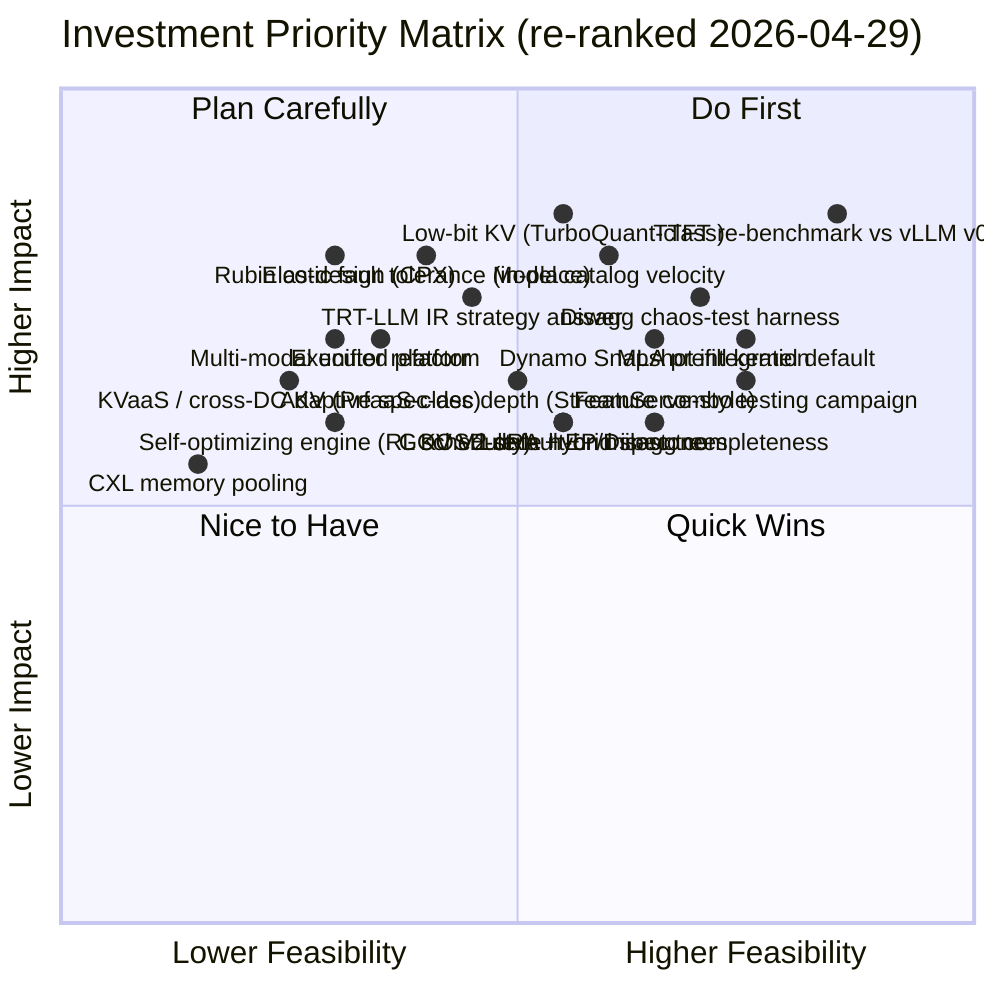

# 6. Strategic Prioritization

[< Back to Overview](README.md)

*[Updated 2026-04-29: re-ranked quadrant + tier list reflecting 2026-04-06 → 2026-04-29 deltas. See [`CHANGELOG.md`](CHANGELOG.md) for the priority-shift table.]*

## 6.1 Investment Priority Matrix *[Updated 2026-04-29]*

## 6.2 Prioritized Roadmap *[Updated 2026-04-29]*

### Items closed in this window (no longer on the list)

| Item | How it closed |
|:-----|:--------------|
| Block reuse + overlap scheduler combo | Shipped #12816 (`[TRTLLM-10939]`) |
| First-class LMCache integration | Shipped #12626 (`lmcache`/`kvbm` shorthand connectors) |
| Production Prometheus observability | Shipped #12545 |
| Mamba/hybrid prefix caching | Shipped #12185 (Qwen3.5, Nemotron Super V3) |
| LoRA + speculative decoding | Shipped #12661 (generic) + #13005 (EAGLE3) |
| Modular logging | Shipped #13202 |
| Disagg fail-fast / error propagation | Shipped #13119 + #13408 + #12718 |

### Tier 1: Critical — Do Now (0-3 months)

| Priority | Item | Category | Rationale |
|:---------|:-----|:---------|:----------|
| P0 | **TTFT re-benchmark + targeted optimization** vs. vLLM v0.20 + Model Runner V2 + FA4 MLA prefill | Gap | Earlier 35% gap is now stale; the answer might be worse — need verified numbers before any roadmap claim |
| P0 | **Low-bit KV cache (TurboQuant-class 2-bit)** | New gap | vLLM v0.20 ships 4× capacity; long-context + agentic workloads are the primary users — same workloads where TRT-LLM's prefix caching shines |
| P0 | **Disagg chaos-test harness** | Bug | Recent fail-fast wave (#13119, #13408, #12718) only matters if exercised under fault injection; codify the design under `docs/design/wide-ep-fault-tolerance/` |
| P1 | **MLA prefill kernel default audit + benchmark** | New gap | vLLM default is now FA4 for MLA — audit/document/benchmark TRT-LLM's MLA prefill choice |
| P1 | Model catalog velocity via AutoDeploy (now standalone-package-ready) | Gap | Gap widened: vLLM v0.20 added DeepSeek V4, Hunyuan v3, Granite 4.1 Vision, EXAONE-4.5, Phi-4-reasoning-vision-15B in one release |
| P1 | Feature combination testing campaign | Bug | Multiple "Untested" entries already shifted to "Yes" via #12816, #12661, #13005 — finish the audit |
| P1 | Wide-EP + EPLB hardening | Gap | Still TRT-LLM's defining moat; MI355X + vLLM is closing the throughput gap from below |

### Tier 2: Strategic — Plan and Execute (3-9 months)

| Priority | Item | Category | Rationale |
|:---------|:-----|:---------|:----------|
| P2 | **Dynamo Snapshot integration** | Gap (production reliability) | Make TRT-LLM's restart story Snapshot-compatible — closes part of the elastic-FT gap without waiting for in-place failover |
| P2 | Elastic fault tolerance (in-place) | Gap | SGLang's elastic EP still sets the bar; Dynamo Snapshot is restart-fast, not in-place |
| P2 | LoRA + EP/Helix/ADP/Disagg completeness | Gap | Spec-dec sub-row is now closed; remaining cells block enterprise multi-tenant MoE |
| P2 | KV Cache V2 default-on milestone (with explicit gating criteria) | Bug/Gap | Cadence is slowing without a milestone; convergence visible in #13104, #12306, #12968 |
| P2 | Executor refactor (composable stages) | Bug | Codebase complexity remains a velocity tax; vLLM v0.20 IR + Model Runner V2 widen the gap |
| P2 | **TRT-LLM IR strategy answer** | New gap | Decide and document: AutoDeploy as IR with CuTE DSL lowering vs. torch.compile/Inductor adoption |
| P2 | **Adaptive speculation-depth** (StreamServe-style) + **GOOSE-style hybrid trees** | Innovation | Direct upgrade path for `speculation_gate.py` — academically validated 1.9–18× gains |
| P2 | Agentic workflow optimization (persistent sessions, spec tool calling, KV cache forking) | Innovation | Anthropic prompt caching set the UX bar; Dynamo agent hints + KV retention demand TRT-LLM-side support |

### Tier 3: Strategic Bets — Invest Steadily (6-18 months)

| Priority | Item | Category | Rationale |
|:---------|:-----|:---------|:----------|
| P3 | Multi-modal unified platform | Innovation | Unified executor for text+vision+audio+video generation; Cache-DiT (#12548), LTX-2 CUDA graph (#12653), audio extraction (#12921) are component pieces |
| P3 | **KVaaS / cross-datacenter KV** (PrfaaS-class) | Innovation | arXiv 2604.15039 shows feasibility for hybrid-attention models; extends `lmcache`/`kvbm` connector path |
| P3 | Cache-aware disagg scheduling (CPD) | Gap | Together.ai CPD shows 40% improvement for long context; conversation-affinity router (#12526) is a first step |
| P3 | Structured generation performance | Gap | SGLang 5× lead; growing importance for agents |
| P3 | Inference-time compute scaling (tree-of-thought, adaptive compute, reward-guided) | Innovation | New verl async-RL hooks (#12272) are the first piece of plumbing |

### Tier 4: Long-Term Vision (12+ months)

| Priority | Item | Category | Rationale |
|:---------|:-----|:---------|:----------|
| P4 | **Vera Rubin HW-SW co-design** (CPX integration, NVLink 6, NVL144 CPX) | Innovation | Volume H2 2026 / sampling Q4 2026 — co-design window opens this year |
| P4 | CXL memory pooling | Innovation | Next-gen memory architecture; transforms KV cache economics |
| P4 | GPU + LPU/AMD/TPU hybrid inference | Innovation | Heterogeneous compute for optimal P/D — Dynamo orchestration makes this newly tractable |
| P4 | Self-optimizing engine (RL scheduler over Prometheus telemetry + AIConfigurator) | Innovation | Telemetry substrate now exists (#12545, #13199); open question is in-engine vs. Dynamo Planner |
| P4 | Federated/privacy-preserving inference (HMAC enforced #9850 is a building block) | Innovation | Split inference, encrypted KV, GPU TEEs |

## 6.3 Where TRT-LLM Should Win

**Core identity:** Maximum inference performance on NVIDIA GPUs.

**Strengths to protect and extend:**
- Peak throughput leadership on NVIDIA hardware
- Wide-EP + EPLB + DWDP for MoE models at scale (strategic moat)
- Comprehensive parallelism strategies (TP/PP/EP/ADP/CP/Wide-EP/DWDP)
- Rich speculative decoding algorithm set (7 algorithms + SA hybrids)
- Disaggregated serving with heterogeneous parallelism and KV Connector API
- Visual generation support (unique among inference engines)

**Gaps to close urgently:**
- TTFT competitiveness (35% gap)
- Model catalog breadth (2x gap vs. vLLM)
- Elastic fault tolerance (SGLang leads)
- Developer experience (codebase complexity)

**Capabilities to build for differentiation:**
- Production resilience (fault tolerance, observability, auto-scaling) — *[Updated 2026-04: observability substrate now in place via #12545; chaos-test harness next]*
- Agentic workflow optimization (persistent sessions, spec tool calling, KV cache forking, prompt caching UX)
- Next-gen hardware co-design (CXL, **Vera Rubin / NVL144 CPX**, NVL72+)
- Distributed KV cache fabric (cluster-wide cache sharing) — *[Updated 2026-04: lmcache/kvbm connector shorthand (#12626) lowers barrier to LMCache-based fabrics]*

The frameworks are converging on core features (continuous batching, prefix caching, basic parallelism). **The next phase of differentiation will be won on three fronts: (1) production reliability at scale, (2) workload-specific optimization for agents and multi-modal, and (3) hardware co-design that exploits NVIDIA's roadmap advantages.**

*[Updated 2026-04-29 — orchestration-layer reframing]* NVIDIA Dynamo v1.0 (March 2026) is now the de-facto orchestrator above TRT-LLM, vLLM, and SGLang. This reshapes the question from "should TRT-LLM own multi-engine routing / autoscaling / snapshotting?" to **"what are the per-engine primitives Dynamo needs from TRT-LLM, and how do we make them best-in-class?"** Key surfaces: (a) Snapshot-compatible deterministic state, (b) Prometheus metrics that drive Dynamo Planner, (c) cross-engine-interoperable KV hashing for content-addressed cache reuse, (d) AIConfigurator-friendly Pareto config catalog (we already have `examples/configs/database/`).

---

*This document reflects the TensorRT-LLM codebase as of April 2026 (v1.3.0 main branch). The project is under active development; features and architecture evolve rapidly.*
